## Sipeed 远程网络简介

Sipeed 远程网络由 Sipeed 提供控制服务器，设备之间点对点直连、不经过服务器中转，不需要注册 Tailscale 账号；访问端使用 Tailscale 客户端接入。

> 提醒：该方式使用 Sipeed 的服务器（`control.tailnet.sipeed.com`，位于中国大陆）完成设备注册、身份验证和连接协调，设备标识、设备名称、虚拟网络 IP 地址等连接信息会上传至该服务器；不希望使用 Sipeed 的服务器时，请选择 [Tailscale](tailscale.html)。

## 使用前准备

开始配置前，请确认：

- NanoKVM Go 已连接互联网；
- 可以在局域网内正常访问 NanoKVM Go；
- NanoKVM Go 的系统和应用已更新至最新版本；
- 用于外网访问的电脑或手机可以安装 Tailscale 客户端。

| 平台 | 安装方式 |
| --- | --- |
| Android | 从 [Google Play](https://play.google.com/store/apps/details?id=com.tailscale.ipn) 或 [F-Droid](https://f-droid.org/en/packages/com.tailscale.ipn/) 安装 |
| iOS / iPadOS | 从 [App Store](https://apps.apple.com/app/tailscale/id1470499037) 安装 |
| macOS | 参考 [Tailscale macOS 安装指南](https://tailscale.com/docs/install/mac) 从官网或 App Store 安装 |

> 如果设置页面中没有 `Sipeed 远程网络` 选项，请先检查并更新 NanoKVM Go 的系统和应用版本。

## 与 Tailscale 的区别

两种方式的区别在控制服务器：`Sipeed 远程网络` 由 Sipeed 提供，不需要注册 Tailscale 账号；[Tailscale](tailscale.html) 由 Tailscale 提供，需要注册并登录 Tailscale 账号。

已经启用过其中一种方式、想改用另一种时，在 NanoKVM Go 页面点击 `退出` 并确认，设备会移出当前网络并返回 `选择连接网络` 页面，重新选择即可。

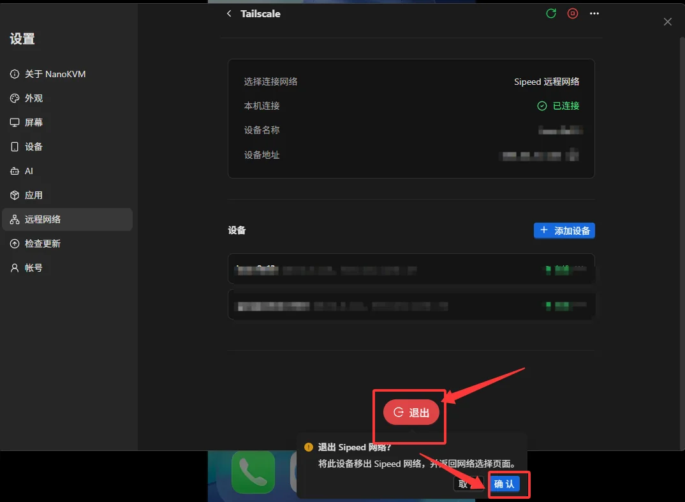

## 在 NanoKVM Go 上启用 Sipeed 远程网络

### 打开 Tailscale 设置

1. 登录 NanoKVM Go 网页控制端，点击顶部工具栏中的设置图标。

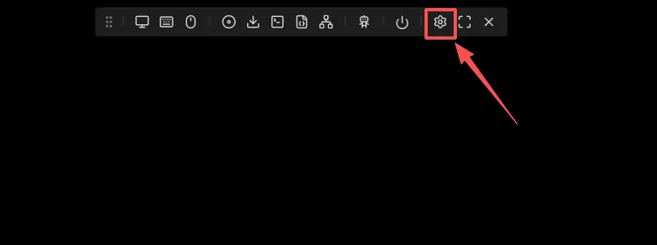

2. 在设置页面左侧选择 `远程网络`，然后点击 `Tailscale`。

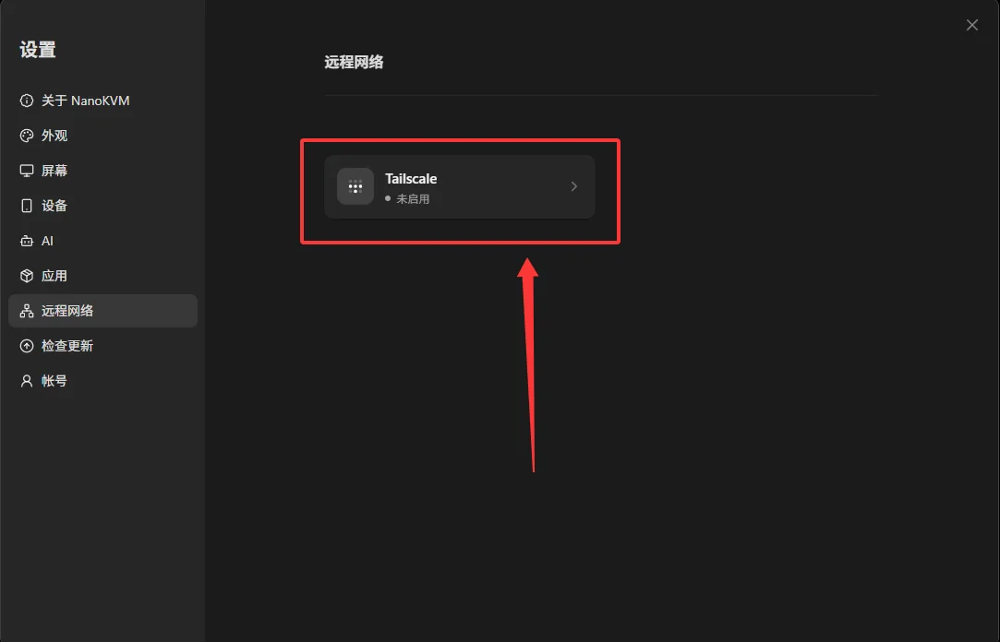

### 启动 Sipeed 远程网络

1. 在 `选择连接网络` 中选择 `Sipeed 远程网络`，然后点击 `启动`；

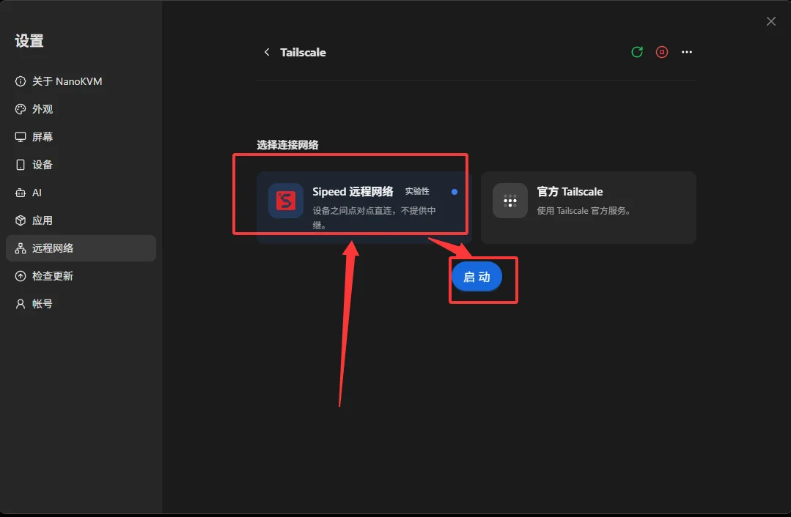

2. 首次启用会弹出 `免责声明`，阅读后点击 `同意并启动`；

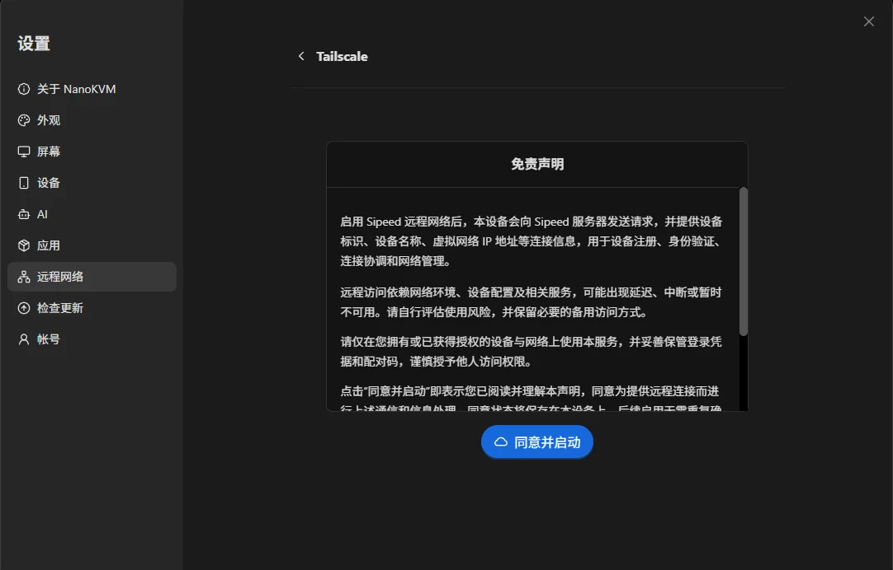

3. 启用成功后，页面会显示 `选择连接网络` 为 `Sipeed 远程网络`、`本机连接` 为 `已连接`，以及 `设备名称`（例如 `kvm-9e13`）和 `设备地址`（`100.x.x.x` 格式的虚拟 IP）。

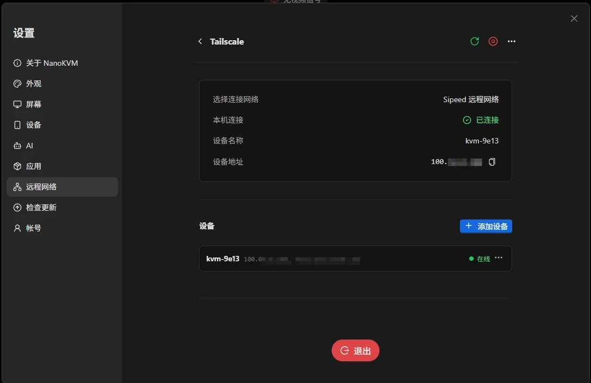

## 在访问端安装并接入 Sipeed 远程网络

访问端不注册账号，把控制服务器指向 Sipeed 的地址即可；各平台客户端的安装方式见[使用前准备](#使用前准备)，下面按平台说明接入步骤。

### Android

1. 打开 Tailscale 客户端，点击右上角的设置图标；

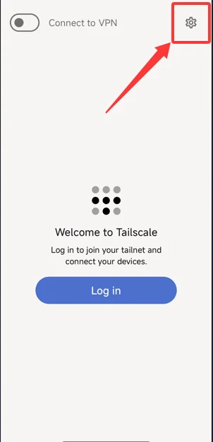

2. 打开 `Settings` > `Accounts`；

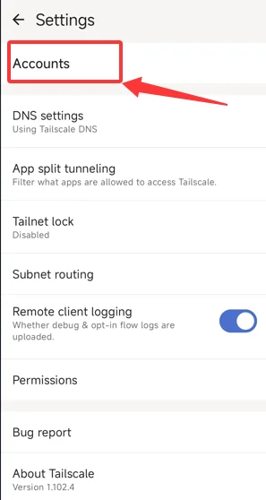

3. 点击右上角菜单，选择 `Use an alternate server`；

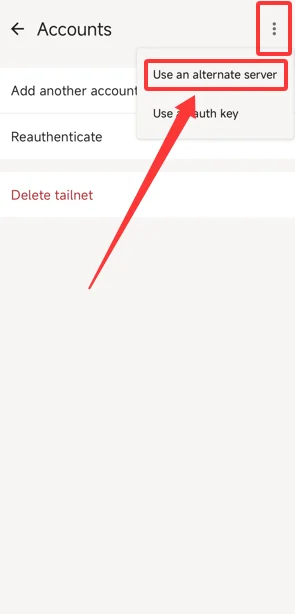

4. 在 `Custom control server URL` 中填入 `https://control.tailnet.sipeed.com`，点击 `Add account`；

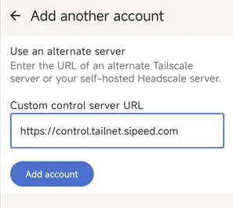

### iOS / iPadOS

> 国区 App Store 未上架 Tailscale，需要先用非中国大陆地区的 Apple ID 登录 App Store，再下载安装。

1. 打开 Tailscale 客户端，点击右上角的账户图标；

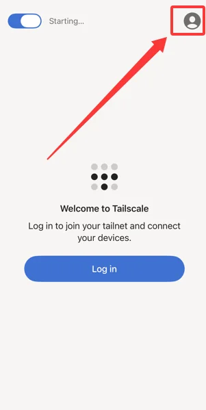

2. 点击 `Log In…`；

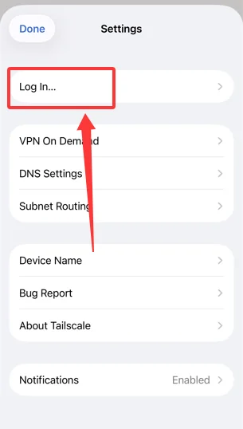

3. 在 `Accounts` 页面点击右上角的 `⋯`；

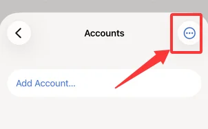

4. 选择 `Use a custom coordination server`；

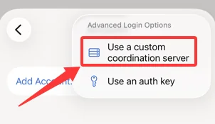

5. 在 `Server URL` 中填入 `https://control.tailnet.sipeed.com`，然后点击 `Log in`。

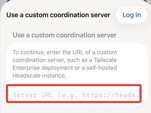

### macOS

1. 点击菜单栏中的 Tailscale 图标，在弹出窗口中点击右上角的设置图标；

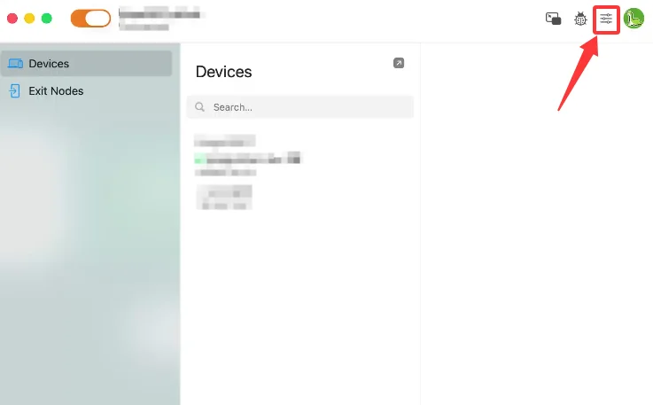

2. 在 `Tailscale Settings` 窗口中打开 `Accounts` 并点击 `Add Account…` 旁边的下拉框，在弹出的 `Add Account Using Alternate Server` 对话框中填入 `https://control.tailnet.sipeed.com`，然后点击黄色的 `Add Account…`；

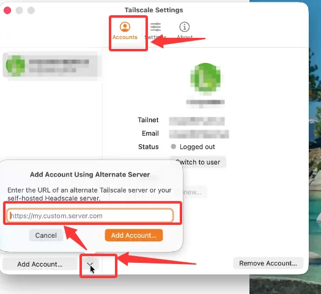

接入完成后，浏览器会自动打开「接入 NanoKVM」页面。该页面需要输入 6 位认领码，认领码的生成方法见下一节在 NanoKVM Go 上添加设备

> 手机和电脑都算访问端：每台需要远程访问 NanoKVM Go 的设备，都要安装 Tailscale 客户端并按对应平台的步骤接入一次。
>
> 如果浏览器没有自动打开接入页，可以手动访问该地址，或者回到 NanoKVM Go 页面点击 `重新获取` 生成新的认领码。

## 在 NanoKVM Go 上添加设备

1. 打开 NanoKVM Go 的 `远程网络` > `Tailscale` 页面，点击 `添加设备`；

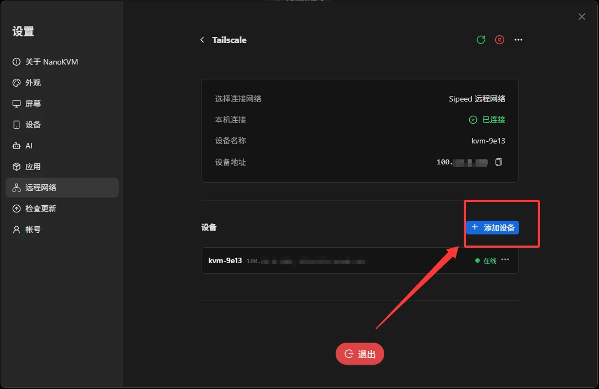

2. 页面显示一组 6 位认领码，例如 `524 833`，有效期 10 分钟、仅可使用一次，可点击 `复制` 或 `重新获取`；

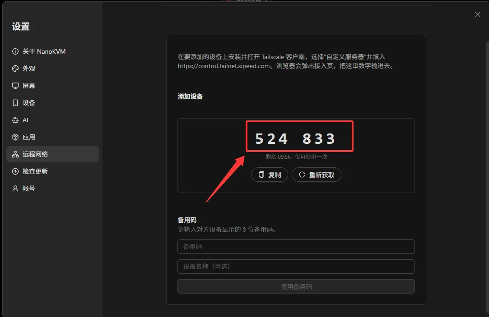

3. 在访问端的「接入 NanoKVM」页面输入该认领码，点击 `继续`；

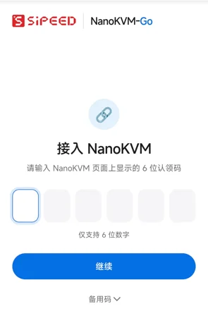

4. 访问端会显示 3 位数字，同时在 NanoKVM Go 页面弹出 `待批准设备` 窗口。核对两处数字一致后，在 NanoKVM Go 页面点击 `允许`；数字不一致说明有其他设备正在尝试接入，请点击 `拒绝`。

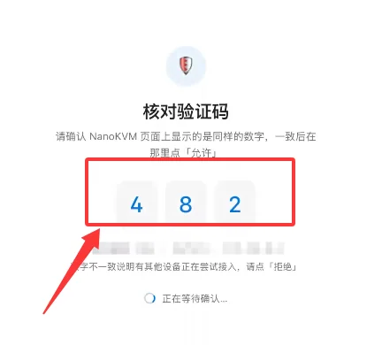

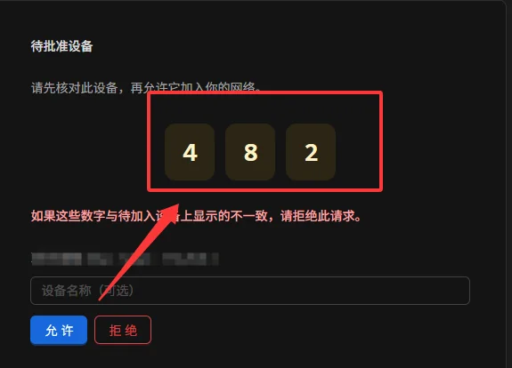

5. 点击 `允许` 后，访问端会显示 `接入成功` 页面，可以点击 `打开 NanoKVM 管理页面` 直接访问，或点击 `复制地址` 后在浏览器中打开；

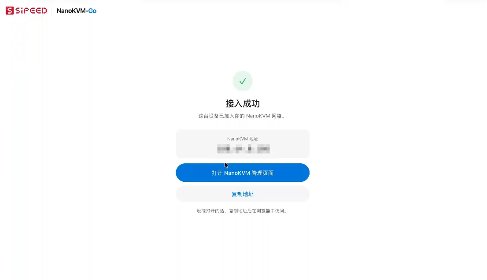

6. 回到 NanoKVM Go 页面，`设备` 列表中出现刚接入的设备，`设备名称`、`设备地址`（`100.x.x.x`）和 `在线` 状态均正常显示，表示该设备已加入 Sipeed 远程网络。

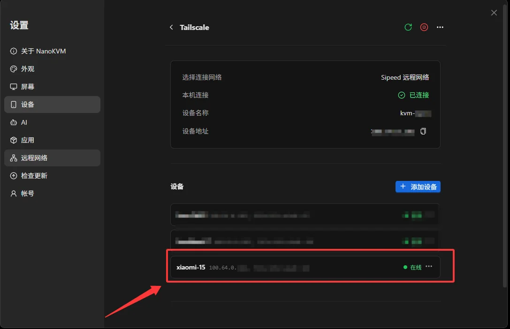

> 也可以反过来用 `备用码` 完成接入：在访问端的「接入 NanoKVM」页面展开 `备用码`，把显示的 8 位备用码填入 NanoKVM Go 的 `添加设备` 页面，点击 `使用备用码` 即可。

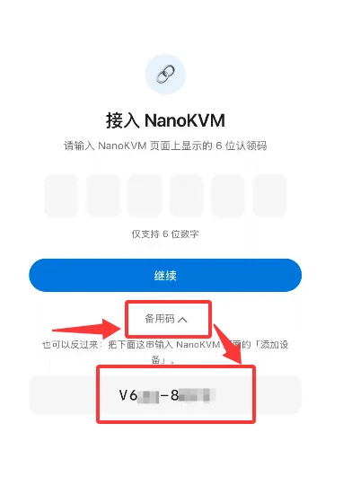

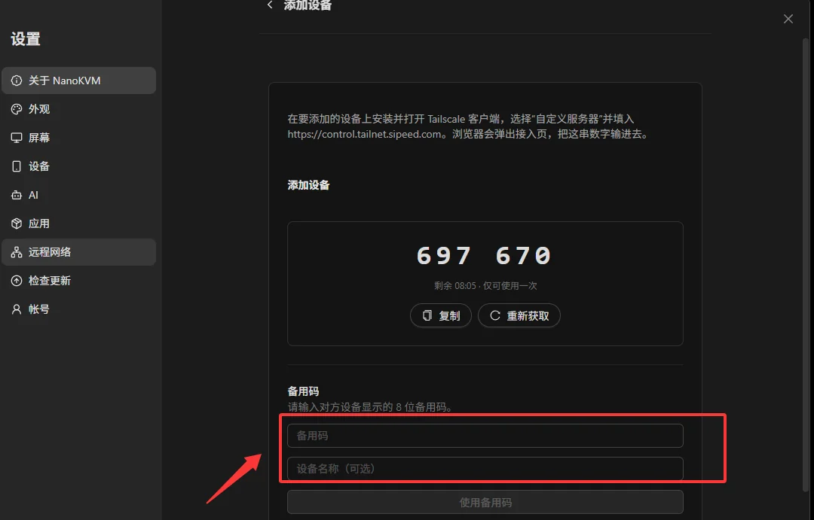

## 从外网访问 NanoKVM Go（设备地址）

NanoKVM Go 的 `设备地址` 是一个 `100.x.x.x` 格式的虚拟 IP，它就是 NanoKVM Go 的外网访问地址，在 `设备` 列表中也能看到它自己对应的那一行。访问前请先确认两端都在线：

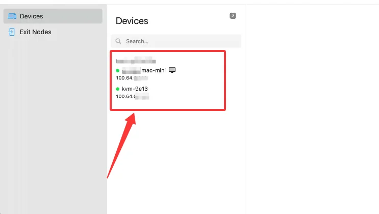

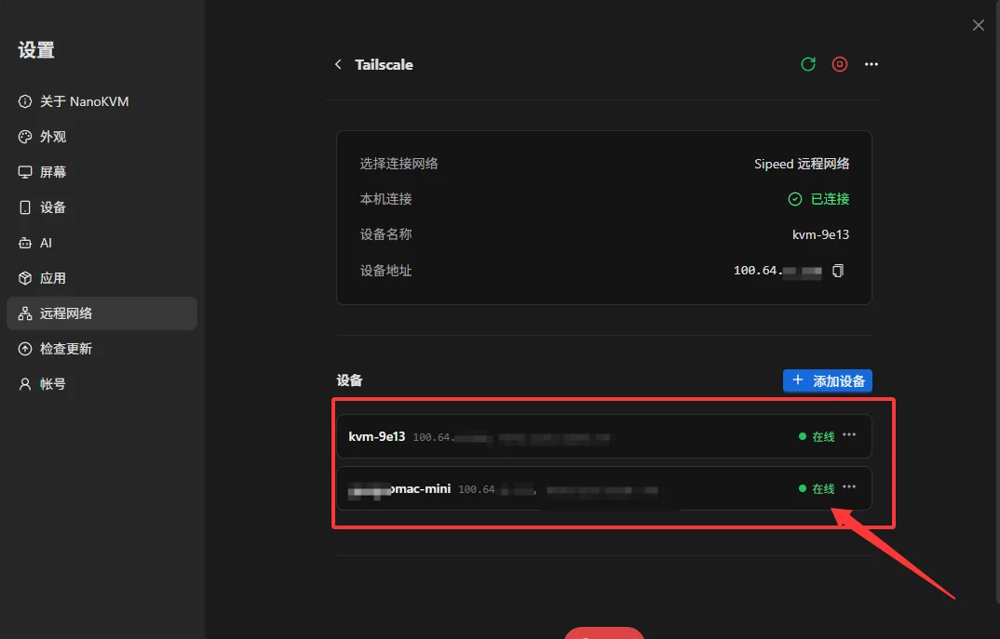

为确保测试的是外网连接，建议断开访问端当前的局域网，改用手机热点或移动网络，然后：

1. 确认访问端的 Tailscale 客户端处于已连接状态（客户端首页的开关为打开状态）；
2. 在浏览器地址栏中输入 NanoKVM Go 的 `设备地址`，例如 `http://100.x.x.x`；
3. 打开 NanoKVM Go 登录页面并完成登录；
4. 测试远程画面、键鼠控制和电源控制等功能。

> 如果无法打开页面，请先确认 NanoKVM Go 的 `本机连接` 仍为 `已连接`，且访问端的 Tailscale 客户端处于连接状态。
>
> 不再使用时，可以在 NanoKVM Go 页面点击 `退出` 断开 Sipeed 远程网络；访问端如需断开，可以在 Tailscale 客户端中关闭连接。

## 日常使用与安全建议

- 为 NanoKVM Go 设置强密码，并保留设备自身的登录认证；
- 不要在路由器上额外开放 NanoKVM Go 的访问端口；
- 妥善保管登录凭据和配对码，谨慎授予他人访问权限；
- 定期检查 NanoKVM Go 的 `设备` 列表，确认接入的设备都是自己信任的；
- 定期更新 NanoKVM Go 和访问端的 Tailscale 客户端，以获得最新的功能和安全修复。
