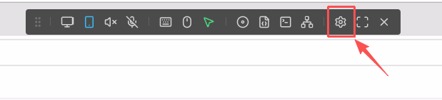
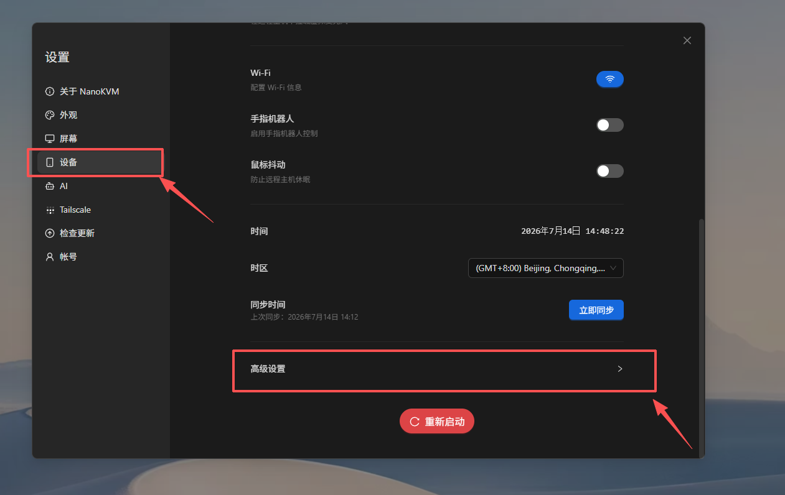
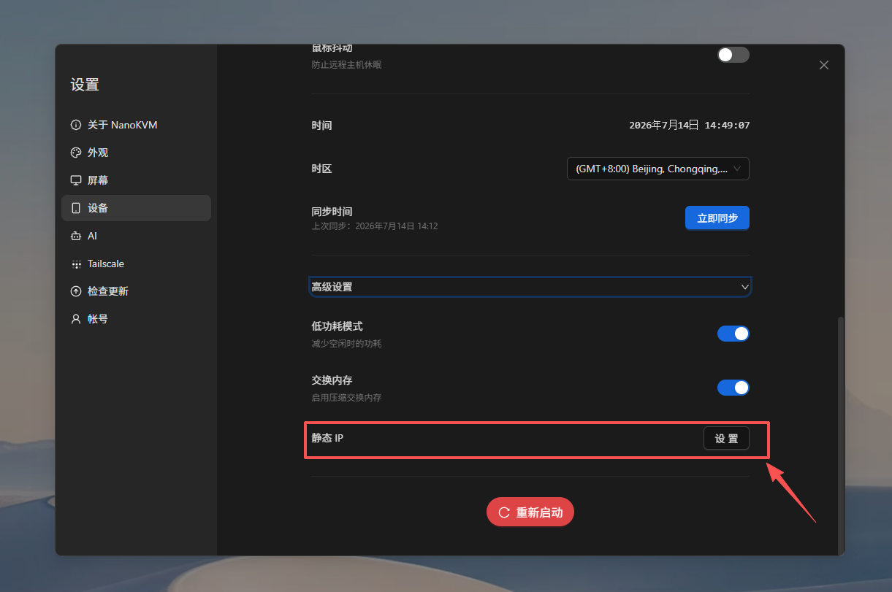
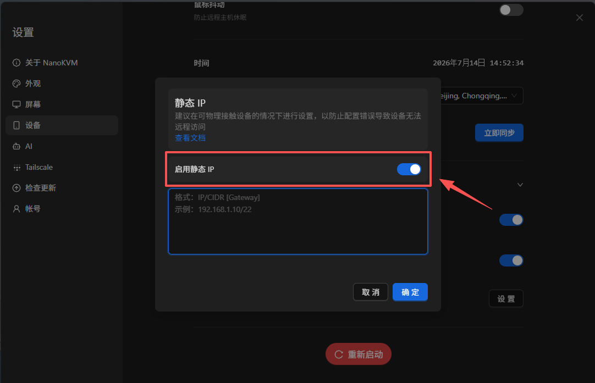
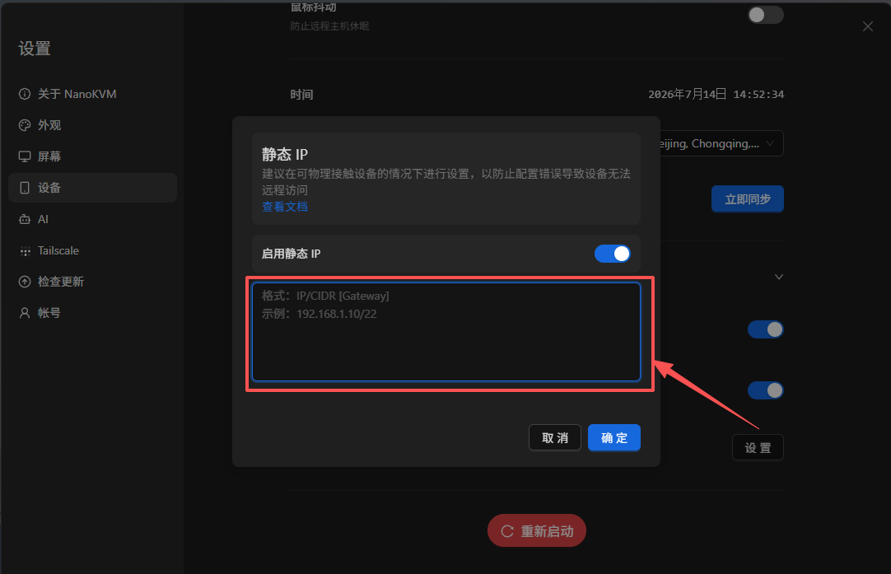

# 配置静态 IP

## 静态 IP 简介

NanoKVM Go 默认通过 DHCP 从路由器获取 IP 地址。DHCP 分配的地址可能会在设备重启、路由器重启或租约更新后发生变化，导致原来的访问地址失效。

在 NanoKVM Go 网页控制端启用静态 IP 后，可以为设备设置固定的局域网地址，方便通过同一个地址长期访问 NanoKVM Go。

> 静态 IP 只用于固定 NanoKVM Go 在当前局域网中的地址，不能代替公网 IP，也不能直接实现外网访问。如需从外网访问 NanoKVM Go，可以参考 [Tailscale](./Tailscale.md) 等远程访问方案。

## 使用前准备

配置前，请先确认：

- NanoKVM Go 已连接到需要使用静态 IP 的局域网；
- 可以通过当前 IP 正常打开 NanoKVM Go 网页控制端；
- 已了解当前局域网的网段、子网掩码和默认网关；
- 准备设置的 IP 地址与路由器位于同一网段；
- 该 IP 地址没有被路由器或其他设备占用；
- 记录 NanoKVM Go 当前的 IP 地址，以便配置异常时排查。

可以在路由器管理页面中查看局域网参数、DHCP 地址池和已连接设备。建议选择 DHCP 地址池之外、但仍位于当前局域网网段内的地址，并在路由器中为该地址做好保留或备注。

例如，当前网络参数为：

| 项目 | 示例值 |
| --- | --- |
| 路由器地址 | `192.168.1.1` |
| 子网掩码 | `255.255.255.0` |
| CIDR 前缀长度 | `/24` |
| DHCP 地址池 | `192.168.1.100` ～ `192.168.1.200` |
| NanoKVM Go 静态 IP | `192.168.1.50` |
| 完整配置 | `192.168.1.50/24 192.168.1.1` |

在这个示例中，`192.168.1.50` 与路由器位于同一网段，并且不在 DHCP 地址池内。子网掩码 `255.255.255.0` 对应的 CIDR 前缀长度是 `/24`，因此不能照抄界面示例中的 `/22`。实际配置时，请根据自己的网络环境填写 IP、CIDR 和网关。

## 了解 IP、CIDR 和网关

NanoKVM Go 静态 IP 输入框使用以下格式：

```text
IP/CIDR [Gateway]
```

各部分含义如下：

- `IP`：准备分配给 NanoKVM Go 的静态 IP 地址；
- `CIDR`：当前网络子网掩码对应的前缀长度，例如 `/24`；
- `Gateway`：默认网关，通常是路由器的局域网地址，可以省略。

`[Gateway]` 中的方括号表示这一项是可选的，实际填写时不要输入 `[` 和 `]`。IP/CIDR 与网关之间使用一个空格分隔。

不填写网关时：

```text
192.168.1.10/22
```

填写网关时：

```text
192.168.1.10/22 192.168.1.1
```

如果 NanoKVM Go 需要访问互联网或其他网段，建议填写正确的默认网关。网关通常需要与 NanoKVM Go 的静态 IP 位于同一子网。

> `/22` 只是界面中的格式示例，不适用于所有网络。必须先查询当前网络的子网掩码，再换算出自己的 CIDR 前缀长度。

### 查询当前网络的子网掩码和网关

优先登录路由器管理页面，在局域网设置或 DHCP 设置中查看子网掩码和网关。也可以在已经正常连接到同一路由器的电脑上查询：

- Windows：打开命令提示符，执行 `ipconfig`，查看当前网卡的“子网掩码”和“默认网关”；
- macOS：打开“系统设置” > “网络”，选择当前网络，进入“详细信息” > “TCP/IP”，查看子网掩码和路由器地址；
- Linux：执行 `ip -4 addr` 查看当前网卡地址后的 CIDR，例如 `192.168.1.20/24`；执行 `ip route` 查看 `default via` 后的默认网关。

请查看与 NanoKVM Go 连接到同一局域网的物理网卡，不要使用 Tailscale、VPN、虚拟机或容器创建的虚拟网卡参数。

### 将子网掩码换算为 CIDR

CIDR 中斜杠后的数字，表示子网掩码从左到右连续的二进制 `1` 的数量。一个 IPv4 子网掩码由 4 段组成，每一段可以按下表换算：

| 子网掩码中的数值 | 二进制 | `1` 的数量 |
| --- | --- | --- |
| `255` | `11111111` | 8 |
| `254` | `11111110` | 7 |
| `252` | `11111100` | 6 |
| `248` | `11111000` | 5 |
| `240` | `11110000` | 4 |
| `224` | `11100000` | 3 |
| `192` | `11000000` | 2 |
| `128` | `10000000` | 1 |
| `0` | `00000000` | 0 |

将四段中二进制 `1` 的数量相加，即可得到 CIDR 前缀长度。

例如，子网掩码为 `255.255.252.0`：

```text
255        255        252        0
  8    +     8    +     6    +   0    = 22
```

所以：

```text
255.255.252.0 = /22
```

如果选择的静态 IP 是 `192.168.1.10`，不填写网关时应输入：

```text
192.168.1.10/22
```

填写网关 `192.168.1.1` 时应输入：

```text
192.168.1.10/22 192.168.1.1
```

再例如，子网掩码 `255.255.255.0` 包含 24 个连续的二进制 `1`，所以对应 `/24`，应填写类似 `192.168.1.50/24`，而不是 `/22`。

常用子网掩码与 CIDR 的对应关系如下：

| 子网掩码 | CIDR |
| --- | --- |
| `255.0.0.0` | `/8` |
| `255.255.0.0` | `/16` |
| `255.255.240.0` | `/20` |
| `255.255.248.0` | `/21` |
| `255.255.252.0` | `/22` |
| `255.255.254.0` | `/23` |
| `255.255.255.0` | `/24` |
| `255.255.255.128` | `/25` |
| `255.255.255.192` | `/26` |
| `255.255.255.224` | `/27` |
| `255.255.255.240` | `/28` |

> 不要通过猜测选择 CIDR。CIDR 填写错误可能导致 NanoKVM Go 错误判断哪些地址位于本地网络，从而出现部分设备无法访问或网关不可达等问题。

## 在网页控制端配置静态 IP

### 打开高级设置

1. 使用 NanoKVM Go 当前的 IP 地址登录网页控制端；
2. 点击顶部工具栏中的 `设置`；



3. 在设置页面中选择 `设备`，然后打开 `高级设置`。




### 启用并填写静态 IP

1. 在 `高级设置` 中找到 `静态 IP`；



2. 启用 `静态 IP`；



3. 按照 `IP/CIDR [Gateway]` 格式填写静态 IP 配置；



4. 检查 IP、CIDR 和网关无误后，点击 `确定`。


> 保存配置后，NanoKVM Go 的网络连接可能会短暂中断，当前网页也可能断开。这是 IP 地址发生变化时的正常现象。

### 使用新地址访问 NanoKVM Go

设置生效后，在浏览器地址栏中只输入新的静态 IP，例如：

```text
http://192.168.1.50
```

浏览器地址中不需要填写 CIDR 和网关。请勿输入 `http://192.168.1.50/24`。

打开登录页面并完成登录，然后测试远程画面、键盘、鼠标和电源控制等功能。


## 确认配置是否成功

完成配置后，建议进行以下检查：

1. 使用新设置的静态 IP 打开 NanoKVM Go 网页控制端；
2. 确认视频、键鼠和电源控制功能正常；
3. 重启 NanoKVM Go，再次通过相同地址访问；
4. 如有条件，重启路由器后再次确认该地址仍然可用；
5. 在路由器管理页面中确认没有其他设备使用相同的 IP 地址。

如果重启 NanoKVM Go 后仍可通过同一个地址访问，说明静态 IP 已正常生效。

## 配置静态 IP 的注意事项

### IP 地址必须位于正确的网段

静态 IP 通常需要与路由器和访问端位于同一局域网网段。例如，路由器地址为 `192.168.1.1`、子网掩码为 `255.255.255.0` 时，CIDR 应填写 `/24`，NanoKVM Go 通常应使用 `192.168.1.x` 网段中的可用地址。

如果填写了其他网段的地址，例如 `192.168.2.50`，当前网络中的电脑可能无法直接访问 NanoKVM Go。

### 避免 IP 地址冲突

不要使用已经分配给电脑、手机、摄像头或其他网络设备的地址。IP 地址冲突可能导致 NanoKVM Go 和另一台设备间歇性离线或无法访问。

建议同时采取以下措施：

- 在路由器的设备列表中检查该地址是否已被占用；
- 优先选择 DHCP 地址池之外的地址；
- 如果路由器支持地址保留，为 NanoKVM Go 保留该地址；
- 记录该地址的用途，避免以后分配给其他设备。

> 仅使用 `ping` 命令不能完全确认某个 IP 地址未被占用，因为处于关机或休眠状态的设备不会响应。

### 不要使用特殊地址

不要将以下地址设置为 NanoKVM Go 的静态 IP：

- 路由器自身的地址，例如 `192.168.1.1`；
- 当前网段的网络地址和广播地址；具体地址由 CIDR 决定，例如 `192.168.1.0/24` 网络中的 `192.168.1.0` 和 `192.168.1.255`；
- `127.x.x.x` 等本地回环地址；
- `169.254.x.x` 等链路本地地址；
- Tailscale 使用的 `100.x.x.x` 虚拟地址。

### 修改后需要使用新地址访问

静态 IP 生效后，浏览器中原来的 DHCP 地址通常不再可用。请关闭旧页面，并使用新地址重新打开 NanoKVM Go 网页控制端。

建议在修改前将新地址记录下来。如果地址填写错误，可能需要将电脑临时配置到相同网段，才能重新访问并修改 NanoKVM Go 的网络设置。

### 更换局域网时需要重新配置

静态 IP 是根据当前局域网规划设置的。将 NanoKVM Go 移动到另一个网段后，原静态 IP 可能无法继续使用。

在更换路由器或使用环境前，建议先禁用静态 IP，让 NanoKVM Go 恢复通过 DHCP 获取地址；也可以根据新网络的网段提前修改静态 IP。

### 静态 IP 不会绕过网络访问限制

配置静态 IP 不会自动开放路由器端口，也不会绕过防火墙、访客网络隔离或 VLAN 访问规则。如果电脑与 NanoKVM Go 不在同一个可互通的网络中，即使 IP 地址填写正确，也可能无法访问。

## 禁用静态 IP

如果希望 NanoKVM Go 恢复自动获取 IP：

1. 使用当前静态 IP 登录 NanoKVM Go 网页控制端；
2. 进入 `设置` > `设备` > `高级设置` > `静态 IP`；
3. 关闭 `启用静态 IP`；
4. 按照页面提示保存或应用设置；
5. 等待 NanoKVM Go 重新从路由器获取 DHCP 地址；
6. 在路由器管理页面或设备显示界面中查找新的 IP 地址，并使用新地址重新访问。


## 常见问题

### 保存后无法打开 NanoKVM Go

依次检查：

- 浏览器中输入的是否为新设置的静态 IP；
- 静态 IP 是否按照 `IP/CIDR [Gateway]` 格式填写；
- CIDR 是否与当前网络的子网掩码一致；
- 网关是否为当前路由器的局域网地址；
- 电脑和 NanoKVM Go 是否连接到同一个局域网；
- 静态 IP 是否与路由器位于同一网段；
- 该地址是否与其他设备冲突；
- 路由器是否启用了访客网络隔离、VLAN 或其他访问限制；
- NanoKVM Go 是否已经完成网络重连。

如果静态 IP 所在网段填写错误，可以将电脑的有线网络临时设置为同一网段，再尝试访问 NanoKVM Go 并修改配置。操作前请记录电脑原来的网络设置，完成后恢复为自动获取地址。

### 静态 IP 可以访问，但 NanoKVM Go 无法连接互联网

检查静态 IP 配置中是否填写了正确的默认网关，并确认 CIDR 与当前网络的子网掩码一致。例如，IP/CIDR 为 `192.168.1.50/24`、路由器地址为 `192.168.1.1` 时，可以填写 `192.168.1.50/24 192.168.1.1`。同时检查路由器的 DNS 和互联网连接是否正常。

### 重启后静态 IP 无法访问

检查静态 IP 是否已经成功保存，并确认路由器没有将同一地址分配给其他设备。建议在路由器中为 NanoKVM Go 保留该地址，或将静态 IP 设置在 DHCP 地址池之外。
