# Tailscale

## Tailscale 简介

Tailscale 是一款基于 WireGuard 的异地组网工具。它可以将 NanoKVM Go 与电脑、手机等设备加入同一个虚拟局域网，使用户无需公网 IP，也无需在路由器上配置端口转发，即可从外网访问 NanoKVM Go。

加入 Tailscale 网络后，每台设备都会获得一个 `100.x.x.x` 格式的虚拟 IP 地址。只要访问端与 NanoKVM Go 位于同一个 Tailscale 网络（Tailnet），就可以通过该地址访问 NanoKVM Go。

```text
NanoKVM Go ── Tailscale 虚拟网络 ── 外网电脑或手机
```

> 本文将以网页配置方式为主，介绍如何使用 Tailscale 从外网访问 NanoKVM Go。

## 使用前准备

开始配置前，请确认：

- NanoKVM Go 已连接互联网；
- 可以在局域网内正常访问 NanoKVM Go；
- NanoKVM Go 的系统和应用已更新至最新版本；
- 用于外网访问的电脑或手机可以安装 Tailscale 客户端。

> 如果设置页面中没有 Tailscale 选项，请先检查并更新 NanoKVM Go 的系统和应用版本。

## 注册并登录 Tailscale

NanoKVM Go 和用于远程访问的电脑或手机需要加入同一个 Tailscale 网络（Tailnet）。首次使用时，请先注册并登录 Tailscale：

1. 访问 [Tailscale 官网](https://tailscale.com/)；
2. 点击 `Get started` 或 `Log in`；


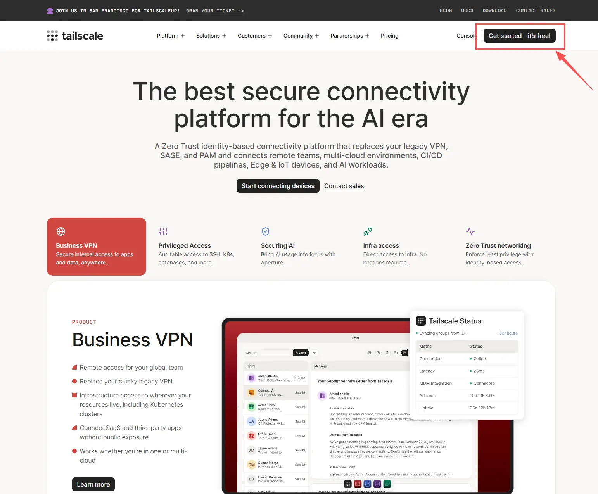

3. 使用页面支持的账号完成登录；
4. 按照页面提示完成首次授权；
5. 进入 Tailscale 管理后台，打开 `Machines` 设备列表。

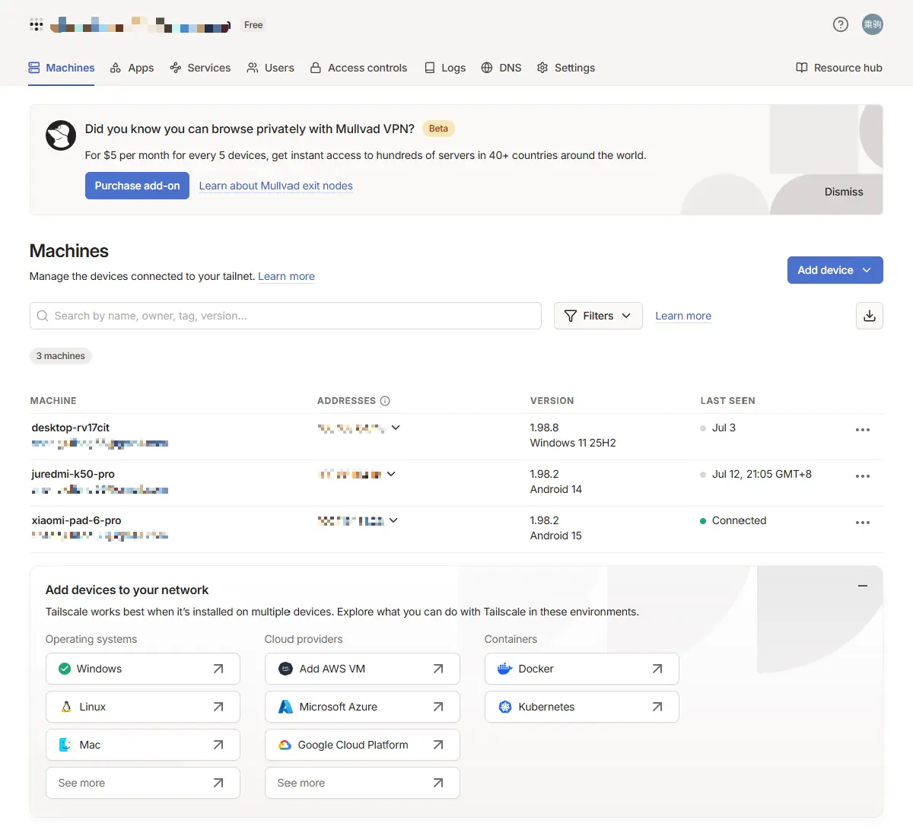

`Machines` 页面用于查看和管理已经加入当前 Tailnet 的设备。完成后续配置后，NanoKVM Go 和访问端都会出现在该页面中。

> Tailscale 的套餐、组织管理和高级网络设置并非基础远程访问的必需内容，本文不作展开。

## 在 NanoKVM Go 上启用 Tailscale

### 打开 Tailscale 设置

登录 NanoKVM Go 网页控制端，点击顶部工具栏中的设置图标。

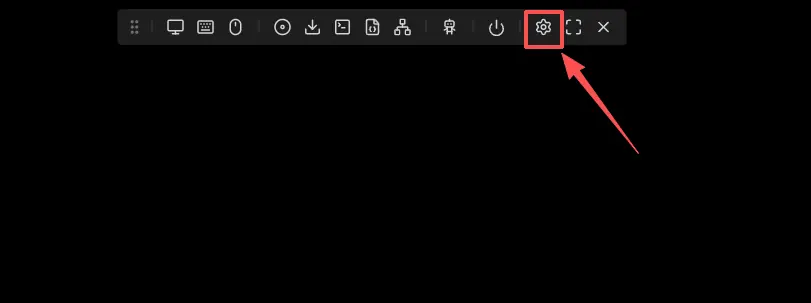

### 安装或启动 Tailscale

在设置页面左侧选择 `Tailscale`。如果页面提示 Tailscale 尚未运行，请点击 `启动`，等待服务启动完成。

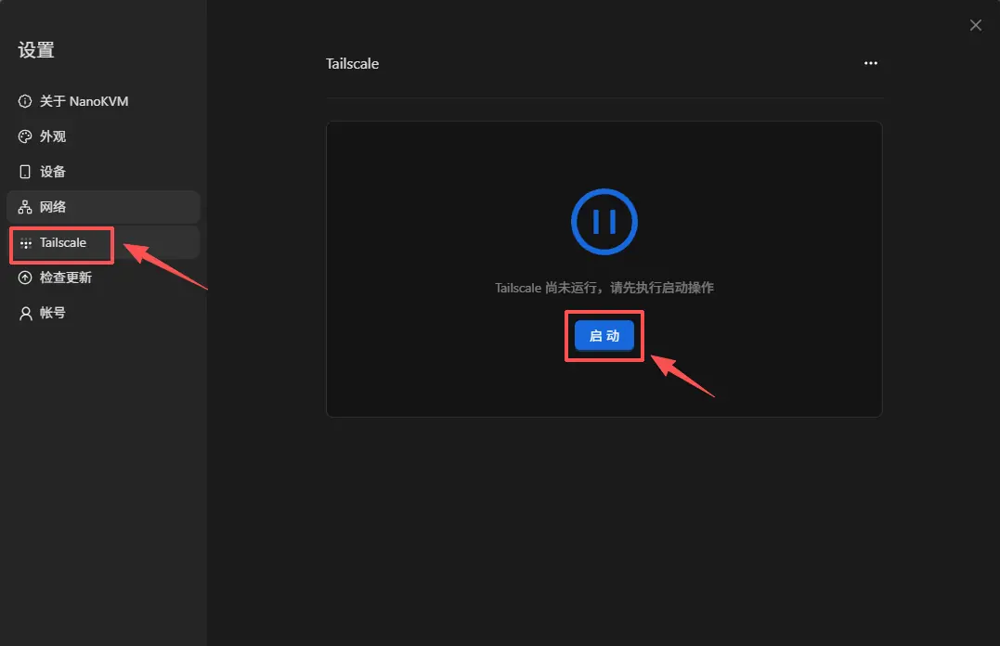

### 登录 Tailscale

1. Tailscale 启动后，点击 `登录`。页面会生成一个临时认证链接，并在浏览器中打开 Tailscale 登录页面。

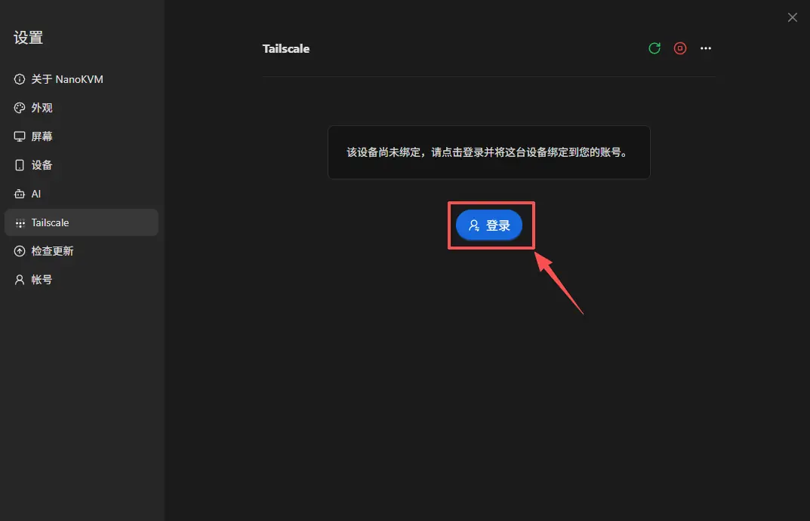

2. 选择与前文相同的账号或登录方式，完成身份验证。

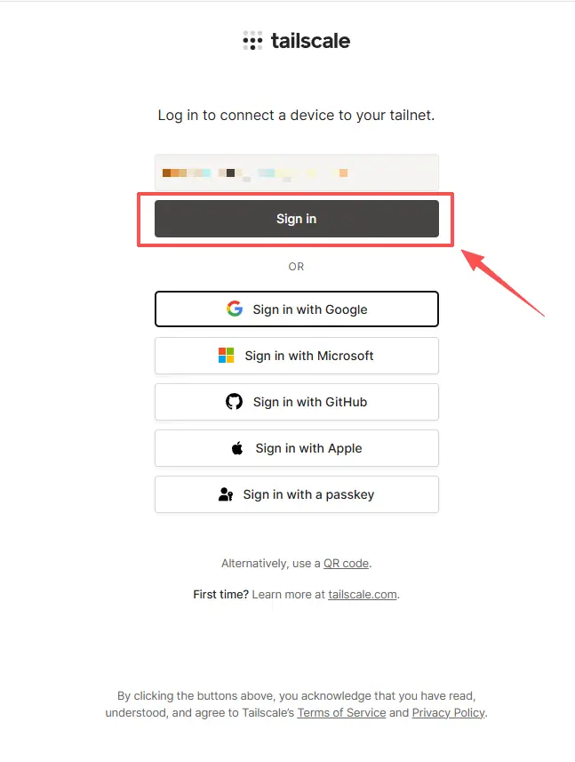

3. 确认页面显示的设备信息无误，然后点击 `Connect`，将 NanoKVM Go 加入当前 Tailnet。

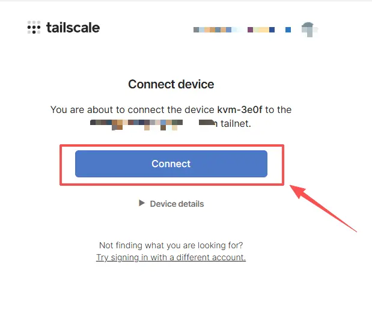

4. 页面显示 `Login successful` 后，表示 Tailscale 账号授权成功。

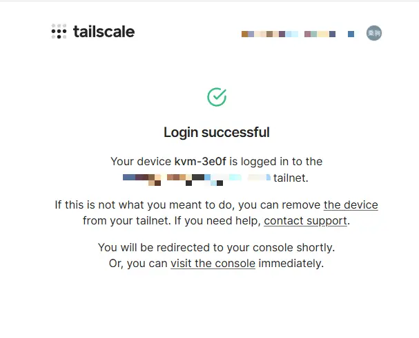

5. 返回 NanoKVM Go 网页控制端，点击 `登录完成`。

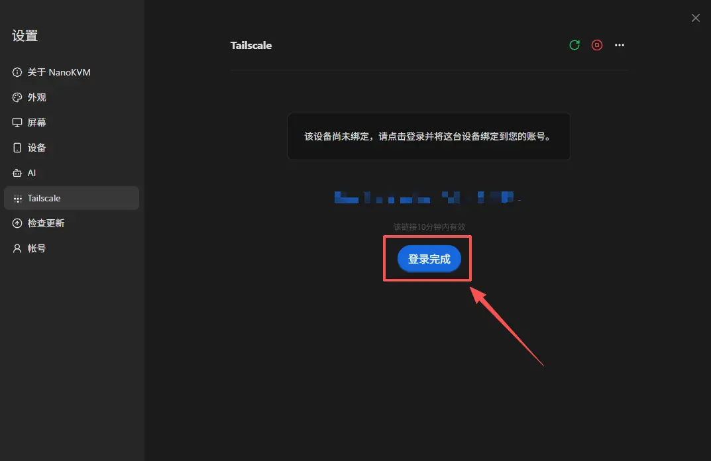

6. 页面显示设备名称、设备地址和账号后，表示 NanoKVM Go 已成功加入 Tailnet。

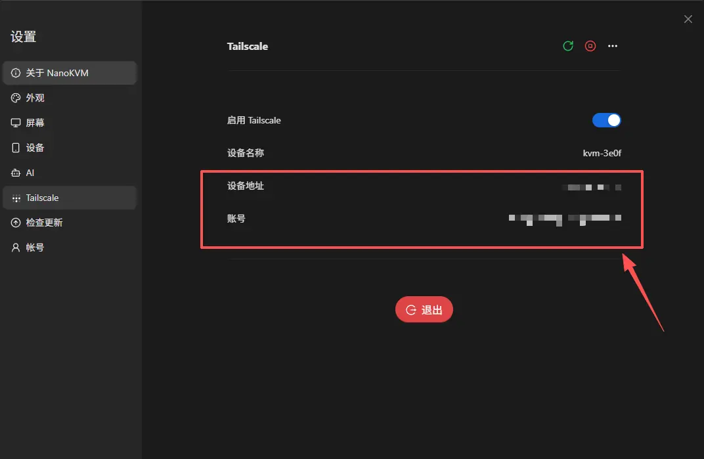

### 确认 NanoKVM Go 已上线

打开 Tailscale 管理后台的 `Machines` 页面，找到 NanoKVM Go。设备状态显示为 `Connected` 时，表示设备已经上线。

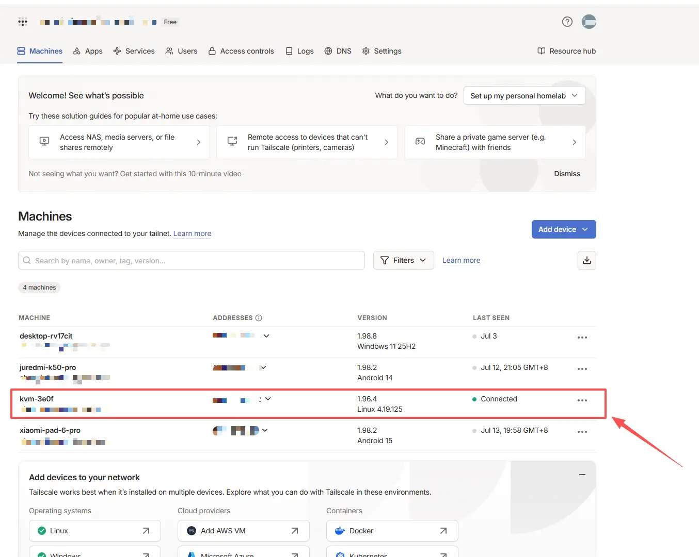

## 在访问端安装并登录 Tailscale

在需要远程访问 NanoKVM Go 的电脑或手机上安装 Tailscale。各平台的官方安装指南如下：

| 平台 | 安装方式 |
| --- | --- |
| Windows | 参考 [Tailscale Windows 安装指南](https://tailscale.com/docs/install/windows) 下载安装程序 |
| macOS | 参考 [Tailscale macOS 安装指南](https://tailscale.com/docs/install/mac) 从官网或 App Store 安装 |
| Linux | 参考 [Tailscale Linux 安装指南](https://tailscale.com/docs/install/linux) 使用官方安装脚本或软件源安装 |
| Android | 参考 [Tailscale Android 安装指南](https://tailscale.com/docs/install/android) 从官方渠道安装 |
| iOS / iPadOS | 参考 [Tailscale iOS 安装指南](https://tailscale.com/docs/install/ios) 从 App Store 安装 |

安装完成后，按照以下步骤连接到 Tailnet：

1. 启动 Tailscale 客户端，并点击 `Log in`；
2. 使用与 NanoKVM Go 相同的 Tailscale 账号登录；
3. 确认客户端状态显示为已连接；
4. 打开 `Machines` 页面，确认访问端和 NanoKVM Go 均已上线。

> 如果访问端使用其他账号，需要先将该账号邀请到 NanoKVM Go 所在的 Tailnet，并为其配置相应的访问权限。

## 查看 NanoKVM Go 的 Tailscale IP

NanoKVM Go 加入 Tailnet 后，会获得一个 `100.x.x.x` 格式的 Tailscale IP。可以通过以下两种方式查看该地址。

### 在 NanoKVM Go 设置中查看

打开 NanoKVM Go 的 `设置` > `Tailscale`，在 `设备地址` 一栏中查看 Tailscale IP。

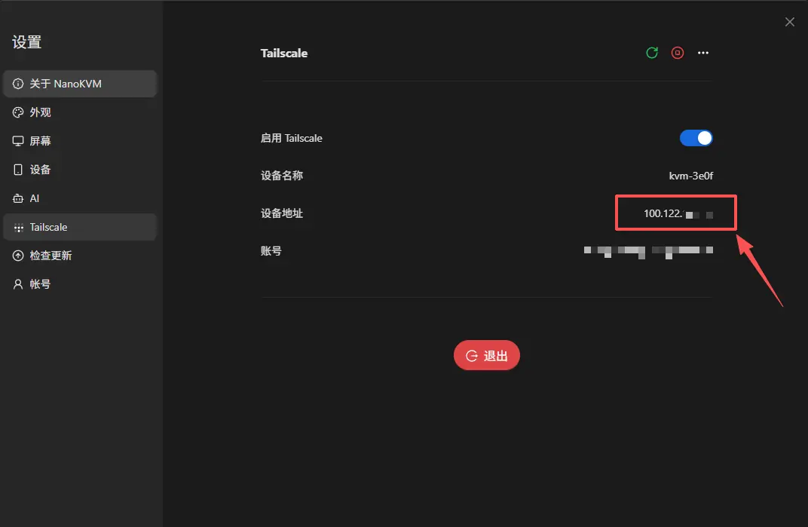

### 在 Tailscale 管理后台中查看

打开 Tailscale 管理后台的 `Machines` 页面，在 NanoKVM Go 对应行的 `ADDRESSES` 一栏中查看 Tailscale IP。

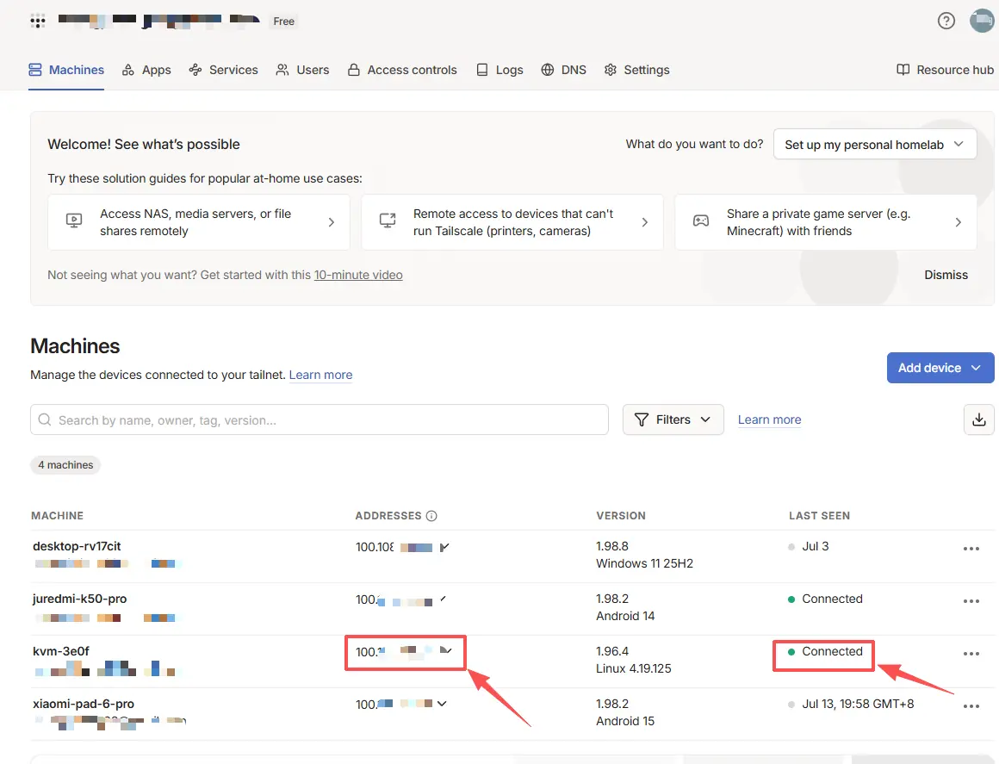


## 从外网访问 NanoKVM Go

开始访问前，请先确认 NanoKVM Go 和访问端在 `Machines` 页面中均显示为 `Connected`。

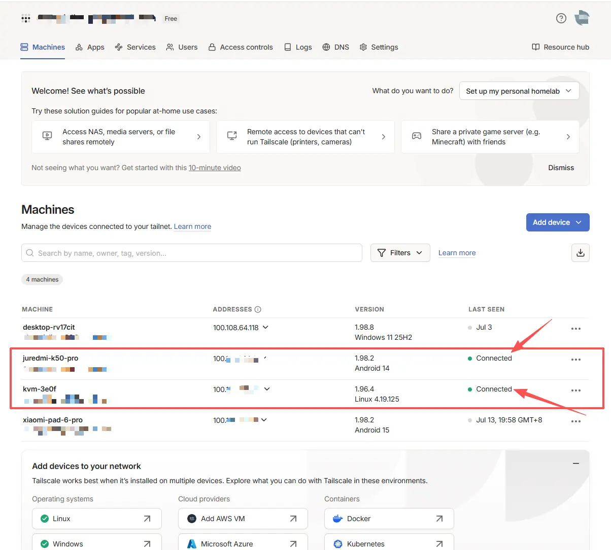

为确保测试使用的是外网连接，建议断开访问端当前的局域网，改用手机热点或移动网络。然后按照以下步骤访问：

1. 确认访问端的 Tailscale 客户端处于已连接状态；
2. 在浏览器地址栏中输入 NanoKVM Go 的 Tailscale IP，例如 `http://100.x.x.x`；
3. 打开 NanoKVM Go 登录页面并完成登录；
4. 测试远程画面、键鼠控制和电源控制等功能。

> 如果无法打开页面，请先确认两台设备使用同一个 Tailnet，并检查 NanoKVM Go 和访问端是否仍处于在线状态。

## 日常使用与安全建议

- 为 Tailscale 账号启用双重验证；
- 为 NanoKVM Go 设置强密码，并保留设备自身的登录认证；
- 不要在路由器上额外开放 NanoKVM Go 的访问端口；
- 不要将 Tailscale 设备认证链接分享给他人；
- 定期检查 Tailscale 管理后台，移除不再使用的设备；
- 多用户环境建议使用 ACL 或 Grants 限制设备访问权限；
- 定期更新 NanoKVM Go 和 Tailscale 客户端，以获得最新的功能和安全修复。
