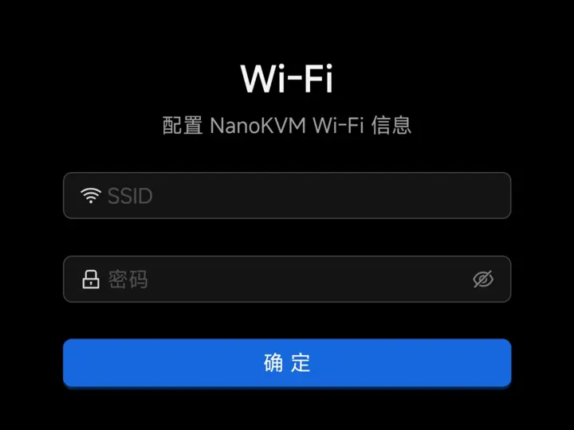
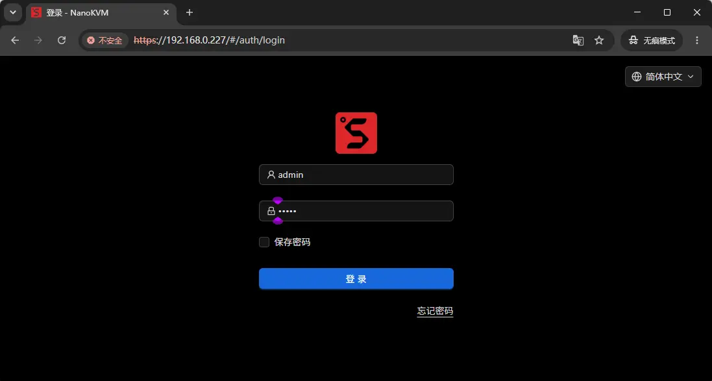
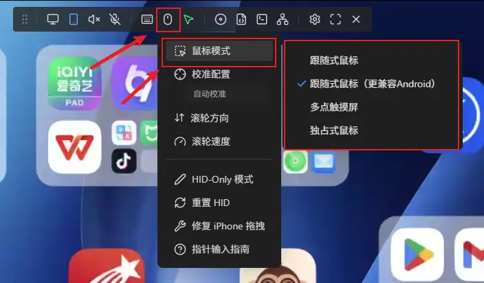

## 开箱

NanoKVM Go 包装内包含 NanoKVM Go 主机、全功能 USB-C 数据线和连接指引卡。具体配件请以实际购买版本为准。

## 接口介绍

NanoKVM Go 侧面设有两个 USB-C 接口和一个烧录模式按键孔，请根据机身丝印区分：

+ **主 USB-C 接口（屏幕图标，Data Port）**：连接被控设备，承载 DP Alt Mode 视频与音频、键盘和鼠标模拟、虚拟 U 盘及虚拟网卡。
+ **辅助 USB-C 接口（闪电图标，Power Port）**：用于 USB-PD 供电和向被控设备充电直通，同时提供手指机器人所需的扩展 IO。
+ **烧录模式按键孔**：使用取卡针按住孔内按键并连接主 USB-C 接口，可使 NanoKVM Go 进入系统烧录模式。该按键不用于复位或重启设备，具体步骤请参考[烧录系统](./system/flashing.html)。

## 使用前准备

使用 NanoKVM Go 前，请准备以下设备和配件：

+ 一台带 USB-C 接口的被控设备，并确认该接口支持 DP Alt Mode 视频输出；
+ 一根全功能 USB-C 数据线，用于连接 NanoKVM Go 与被控设备；
+ 一台可打开浏览器的控制设备，例如电脑、平板或手机；
+ 如被控设备无法为 NanoKVM Go 稳定供电，请额外准备 USB-C 电源适配器。

> 仅支持充电或普通数据传输的 USB-C 接口无法输出画面，不能用于 NanoKVM Go 的远程显示功能。

## 连接设备

连接步骤如下：

1. 使用全功能 USB-C 数据线，将 NanoKVM Go 的主 USB-C 接口（屏幕图标）连接到被控设备支持 DP Alt Mode 的 USB-C 接口。
2. 如果被控设备无法为 NanoKVM Go 供电，将 USB-C 电源适配器连接到辅助 USB-C 接口（闪电图标）。
3. 等待 NanoKVM Go 开机，屏幕显示当前状态和 IP 地址。

## 网络配置

NanoKVM Go 首次使用或更换 Wi-Fi 环境时，需要先完成配网。开始前请确认 NanoKVM Go 已开机，Wi-Fi 信号可覆盖到 NanoKVM Go 所在区域，并准备好要连接网络的 SSID 和密码。

> NanoKVM Go 的 Wi-Fi 支持 2.4G 和 5G 两种频段。为了获得更稳定的远程控制体验，建议优先连接 5G 频段 Wi-Fi。

在 NanoKVM Go 主界面向左滑动到 `Settings` 页面，点击 Wi-Fi 图标。进入 `WI-FI` 页面后，点击 `Connect Wi-Fi`。

<video src="./../../../assets/NanoKVM/go/quick_start/nanokvm-go-open-wifi.mp4" aria-label="NanoKVM Go 打开 Wi-Fi 配置页面" style="width: 100%; max-width: 360px;" playsinline controls autoplay loop muted preload="metadata"></video>

NanoKVM Go 提供 `PASSWD` 和 `QRCODE` 两种配网方式。`PASSWD` 方式适合直接在 NanoKVM Go 屏幕上选择 Wi-Fi 并输入密码；`QRCODE` 方式适合使用手机填写 Wi-Fi 信息。

### 使用 PASSWD 配置

1. 在 `Via` 页面选择 `PASSWD`，NanoKVM Go 会自动扫描附近的 Wi-Fi。
2. 在 Wi-Fi 列表中上下滑动，选中要连接的 SSID，然后点击右上角的 `>` 进入密码输入页面。如需手动输入 SSID，可选择 `Manual SSID`。

3. 使用屏幕键盘输入 Wi-Fi 密码，输入完成后点击 `OK`。

> 屏幕键盘使用类似九宫格的多击输入方式。同一个按键上有多个字母时，点击一次输入第一个字母，连续点击两次输入第二个字母，依此类推。

### 使用 QRCODE 配置

1. 在 `Via` 页面选择 `QRCODE`，NanoKVM Go 屏幕会显示 `Connect to AP` 二维码。

2. 使用手机扫描 `Connect to AP` 二维码，并按手机提示连接 NanoKVM Go 的临时热点。手机连接成功后，NanoKVM Go 屏幕上的二维码会切换为 `Configure WiFi`。

3. 再次使用手机扫描 `Configure WiFi` 二维码，浏览器会打开 Wi-Fi 配网页面。

4. 在页面中填写 Wi-Fi 的 SSID 和密码，点击 `确定` 提交。等待 NanoKVM Go 完成连接，过程中不要断开电源。

### 确认连接成功

配置完成后，`WI-FI` 页面会显示当前 SSID 和 IP 地址。控制设备与 NanoKVM Go 连接到同一网络后，在浏览器中输入该 IP 地址即可打开 Web 控制页面。

## 基本远程控制

完成网络配置后，请根据控制设备与 NanoKVM Go 所在网络选择访问方式。

### 同一局域网访问

如果控制设备和 NanoKVM Go 连接到同一个可互通的局域网，在浏览器地址栏输入 `WI-FI` 页面显示的 IP 地址，即可进入 NanoKVM Go 登录页面。初始账号为 `admin`，初始密码为 `admin`。

登录后即可查看被控设备画面并进行操控。

### 外网访问

如果控制设备和 NanoKVM Go 不在同一个局域网，需要先配置 Tailscale。将 NanoKVM Go 和控制设备加入同一个 Tailscale 网络后，在控制设备浏览器中输入 NanoKVM Go 的 Tailscale IP，即可从外网访问 NanoKVM Go。

完整配置步骤请参考 [Tailscale 远程访问](./network/tailscale.html)。

### 手机连接注意事项

连接手机作为被控设备时，请留意系统连接提示，并根据手机系统调整相关设置。

#### Android 手机

部分 Android 手机首次连接外接显示设备时，系统可能弹出有线投屏、外接显示或 USB 设备连接确认，请按照系统提示允许连接。如果未出现提示且画面和控制功能正常，则无需额外设置。NanoKVM Go 无需开启 USB 调试。

#### iPhone

连接 iPhone 时，需要先开启 iPhone 的辅助触控功能。请前往 `设置` > `辅助功能` > `触控` > `辅助触控`，然后打开 `辅助触控` 开关。

1. 打开“辅助功能”。

2. 打开“触控”。

3. 打开“辅助触控”。

4. 开启“辅助触控”。

连接 iPhone 时，每次连接成功后都需要在网页控制页面中点击 `修复 iPhone 拖拽`。如果没有点击该选项，可能会出现鼠标一直处于按下状态的问题。

#### 鼠标模式选择

在网页控制页面顶部悬浮栏中点击鼠标图标，进入 `鼠标模式` 菜单后选择合适的输入模式。

+ `跟随式鼠标`：适合电脑等普通桌面系统，鼠标位置会跟随网页端指针移动。被控设备为 Android 手机时请勿使用该模式，否则无法正常控制。
+ `跟随式鼠标（更兼容 Android）`：被控设备为 Android 手机时使用，适配 Android 的指针和触控输入，兼容性更好。
+ `多点触摸屏`：适合使用手机作为控制设备来操控另一台手机，可进行更接近触摸屏的操作，体验更顺滑。
+ `独占式鼠标`：适合游戏、远程桌面、BIOS/UEFI 等需要相对位移输入或锁定鼠标的场景。

## 安全建议

+ 首次登录后请及时修改默认密码，具体流程请参考 [用户指南 - 修改密码](./user_guide.html#%E4%BF%AE%E6%94%B9%E5%AF%86%E7%A0%81)；
+ 不要将 NanoKVM Go 直接暴露到不可信网络中；
+ 远程访问建议配合 Tailscale 等安全组网方式使用；
+ 使用符合认证标准的电源适配器和线缆，避免异常供电损坏设备。
