## 开箱

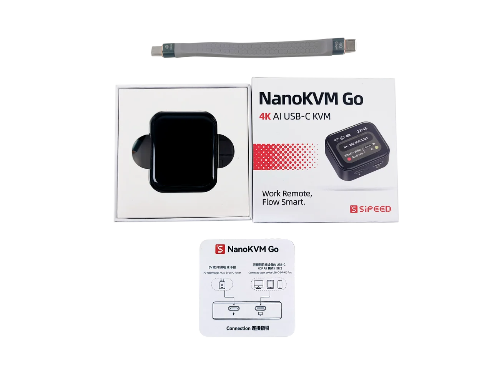

NanoKVM Go 包装内包含 NanoKVM Go 主机、全功能 USB-C 数据线和连接指引卡。具体配件请以实际购买版本为准。

## 接口介绍

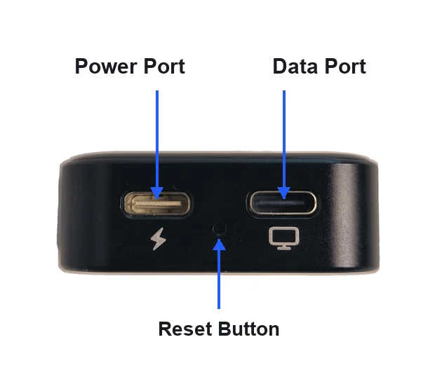

NanoKVM Go 侧面有两个 Type-C 接口和一个复位孔：

+ 带闪电标志的接口为 Power Port，用于外部供电；
+ 带屏幕标志的接口为 Data Port，用于连接被控设备；
+ 两个接口中间的小孔为 Reset Button，用于复位设备。

## 使用前准备

使用 NanoKVM Go 前，请准备以下设备和配件：

+ 一台带 Type-C 数据接口的被控设备，并确认该接口支持 DP Alt Mode 视频输出；
+ 一根全功能 Type-C 数据线，用于连接 NanoKVM Go 与被控设备；
+ 一台可打开浏览器的控制设备，例如电脑、平板或手机；
+ 如被控设备无法为 NanoKVM Go 稳定供电，请额外准备 USB-C 电源适配器。

> 仅支持充电或普通数据传输的 Type-C 接口无法输出画面，可能无法正常使用 NanoKVM Go 的远程显示功能。

## 连接设备

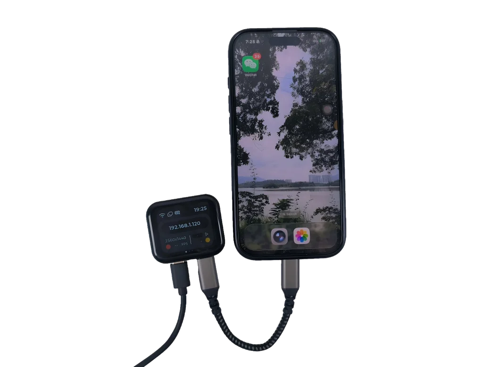

连接步骤如下：

1. 使用全功能 Type-C 数据线，将 NanoKVM Go 的数据接口连接到被控设备支持 DP Alt Mode 的 Type-C 接口。
2. 如果被控设备无法为 NanoKVM Go 供电，使用电源接口为 NanoKVM Go 单独供电。
3. 等待 NanoKVM Go 开机，屏幕显示当前状态和 IP 地址。

## 网络配置

NanoKVM Go 首次使用时，需要先完成网络连接。

1. 进入设备 Wi-Fi 页面，确认 Wi-Fi 开关已打开。
2. 进入配置方式选择页面，可选择 `PASSWD` 或 `QRCODE` 方式进行配网。
3. 按页面提示输入要连接的 Wi-Fi 名称和密码，并提交配置。
4. 配置完成后，返回主页面。若主页面显示设备的 IP 地址，即为连接成功。

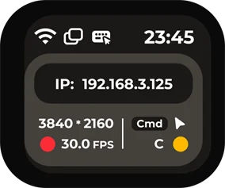

详细配置请参考 [用户指南的网络配置章节](./user_guide.html#%E7%BD%91%E7%BB%9C%E9%85%8D%E7%BD%AE)。

## 基本远程控制

完成网络配置后，在浏览器地址栏直接输入获取到的 IP，进入 NanoKVM Go 登录页面。初始账号为 `admin`，初始密码为 `admin`。

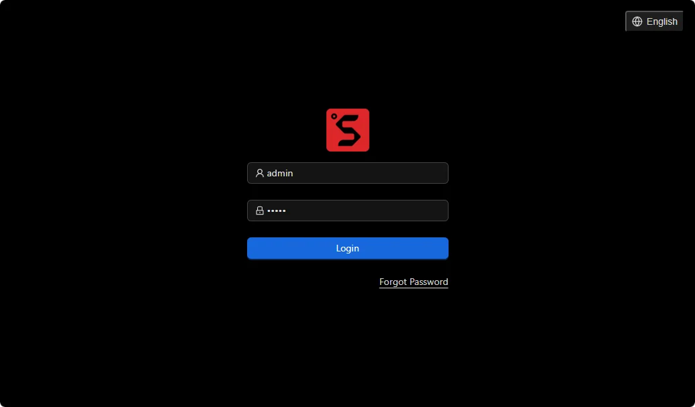

登录后即可查看被控设备画面并进行键盘、鼠标操作。网页控制页面通常由悬浮栏和显示区域组成：顶部悬浮栏用于进入图像设置、竖屏模式、音量设置、麦克风、屏幕键盘、鼠标样式、界面预览、镜像挂载、自定义脚本、KVM 网页终端、设置和全屏等功能，中间显示区域用于查看和操作被控设备画面。

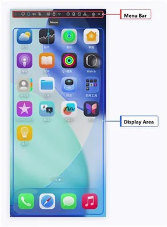

+ 显示区域用于查看被控设备画面；
+ 悬浮栏用于进入图像设置、竖屏模式、音量设置、麦克风、屏幕键盘、鼠标样式、界面预览、镜像挂载、自定义脚本、KVM 网页终端、设置和全屏等功能；
+ 如果画面没有显示，请确认被控设备的 Type-C 接口支持 DP Alt Mode，并检查线缆是否为全功能 Type-C 数据线。

### 手机连接注意事项

连接手机作为被控设备时，请留意系统连接提示，并根据手机系统调整相关设置：

+ 部分 Android 手机首次连接外接显示设备时，系统可能弹出有线投屏、外接显示或 USB 设备连接确认，请按照系统提示允许连接。如果未出现提示且画面和控制功能正常，则无需额外设置；NanoKVM Go 无需开启 USB 调试；

+ 连接 iPhone 时，需要开启 iPhone 的辅助触控功能。请前往 `设置` > `辅助功能` > `触控` > `辅助触控`，然后打开 `辅助触控` 开关；

1. 打开“辅助功能”。

   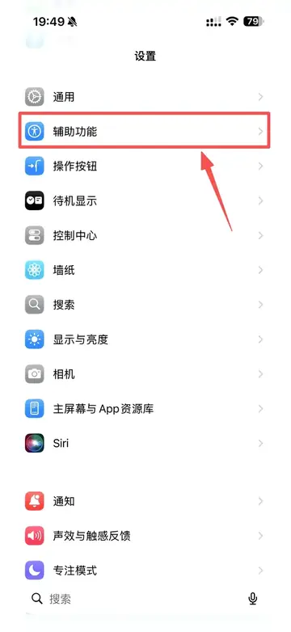

2. 打开“触控”。

   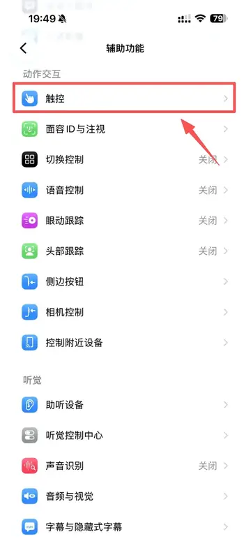

3. 打开“辅助触控”。

   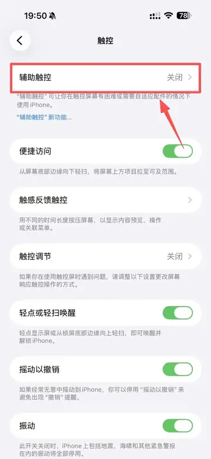

4. 开启“辅助触控”。

   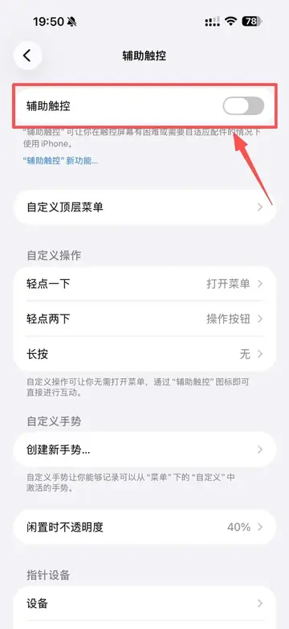

+ `相对模式` 适用于所有平台；

+ 连接 Android 手机时，如需使用绝对鼠标模式，请进入悬浮栏中的鼠标样式设置，并选择 `绝对模式（Android）`。普通的 `绝对模式` 无法在 Android 平台使用；

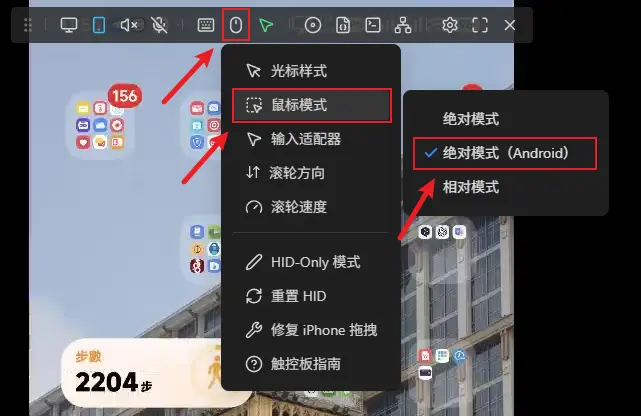

+ 连接 iPhone 时，每次连接成功后都需要在网页控制页面中点击 `修复 iPhone 拖拽`。如果没有点击该选项，可能会出现鼠标一直处于按下状态的问题。

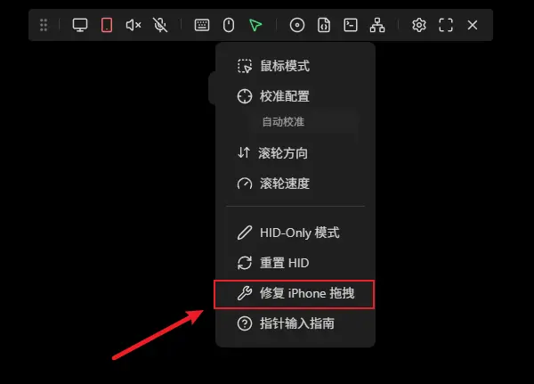

## 安全建议

+ 首次登录后请及时修改默认密码，具体流程请参考 [用户指南 - 修改密码](./user_guide.html#%E4%BF%AE%E6%94%B9%E5%AF%86%E7%A0%81)；
+ 不要将 NanoKVM Go 直接暴露到不可信网络中；
+ 远程访问建议配合 Tailscale 等安全组网方式使用；
+ 使用符合认证标准的电源适配器和线缆，避免异常供电损坏设备。
