# 实时语音对话快速体验

## Voice Bridge 简介

Voice Bridge 是运行在 NanoKVM Go 上的实时语音桥接 APP。它在被控主机的音频设备与云端实时语音模型之间转发双向音频，让拨号端用户可以通过通话直接与 AI 对话。

在本文的示例中，Voice Bridge 使用 Qwen Audio Realtime：通话中的用户语音经 NanoKVM Go 发送给模型，模型生成的语音再通过 NanoKVM Go 的 UAC2 虚拟麦克风送回被控主机。APP 同时会在设备屏幕上显示双方的语音转写文本。

```text
拨号手机 → 被控主机的通话音频 → NanoKVM Go → Qwen Audio Realtime
拨号手机 ← 被控主机的通话音频 ← NanoKVM Go ← Qwen Audio Realtime
```

## 可以用来做什么

通过 Voice Bridge，可以快速搭建和验证以下应用：

- AI 电话客服或语音应答演示；
- 实时语音助手和对话机器人；
- 带语音转写的通话测试环境；
- 实时语音模型、提示词和音色的效果验证。

本文只介绍如何安装并运行官方设备端 APP，适合希望先体验功能的用户，不要求了解 MCP、WebRTC、Opus 或音频重采样。如果你准备替换模型、加入知识库或 Agent，或者修改音频链路，请先按本文跑通示例，再阅读[实时语音二次开发](./realtime_voice_bridge_technical.html)。

## 最终效果

安装完成后，在 NanoKVM Go 的 `Apps` 页面打开 `Voice Bridge`，然后使用手机拨号即可开始实时语音对话。设备屏幕会显示运行状态和双方的 transcript：

<div style="display: grid; grid-template-columns: 1fr 1fr; gap: 12px; align-items: start;">
  
  <video src="./../../../assets/NanoKVM/go/realtime_voice_bridge/app-voice-bridge.mp4" aria-label="NanoKVM Go 设备端 Voice Bridge APP 运行演示" style="width: 100%;" playsinline controls autoplay loop muted preload="metadata"></video>
</div>

## 使用前准备

开始安装前，请确认：

- NanoKVM Go 已连接被控主机，并且可以正常访问网页控制端；
- NanoKVM Go 的系统和应用已更新至最新版本；
- NanoKVM Go 可以访问互联网，以便下载 APP 依赖并连接 Qwen；
- 手机已按设备要求接入 NanoKVM Go，并且可以正常拨打电话；
- 被控主机可以识别 NanoKVM Go 的 UAC2 虚拟麦克风和扬声器设备；
- 已准备阿里云账号，或准备按本文注册并开通阿里云百炼服务。

> 如果网页设置中没有 `Apps` 或 `MCP Service` 选项，请先检查并更新 NanoKVM Go 的系统和应用版本。

## 获取连接信息

安装 APP 前，需要准备 NanoKVM Go 的 MCP API key，以及 Qwen 的 Workspace ID 和 API key。

### 启用 MCP Service

进入 `设置 > AI > MCP 服务`，启用 MCP 服务并记录页面显示的 `API key`。该密钥用于允许 Voice Bridge 创建 NanoKVM Go 双向音频会话。

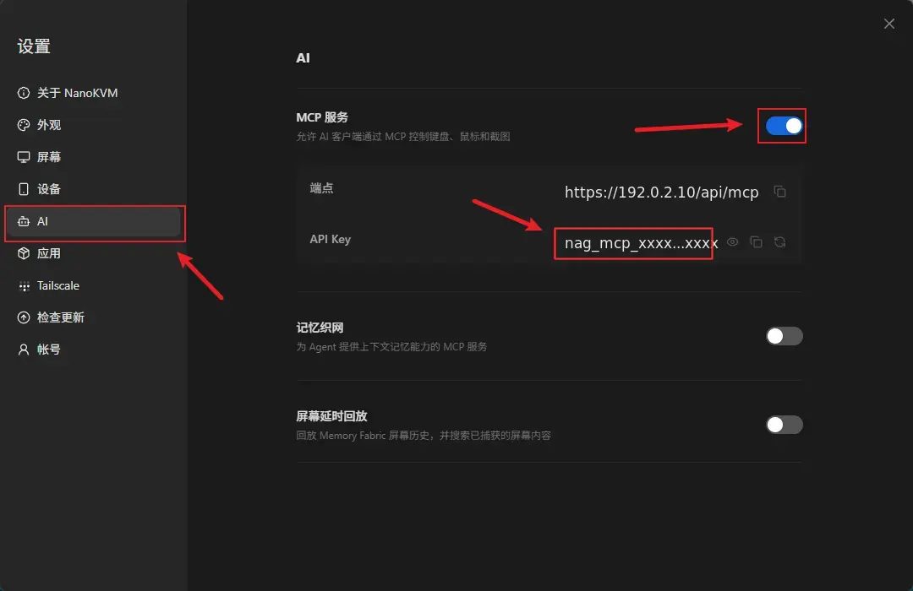

> 不要将 MCP API key 分享给他人，也不要把真实密钥写入源码或提交到公开仓库。

### 启用虚拟音频

进入 `设置 > 设备 > 虚拟音频`，启用虚拟音频。然后在被控主机的系统音频设置中，确认 NanoKVM Go 的 UAC2 虚拟麦克风和扬声器设备均已被识别。

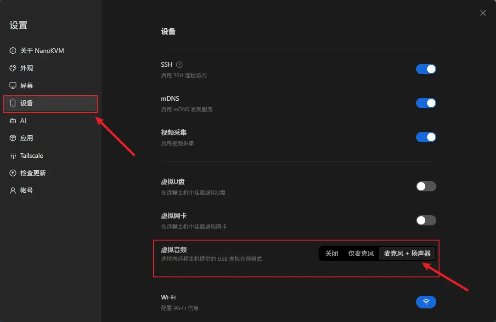

### 获取 Qwen 连接信息

1. 打开 [阿里云百炼控制台](https://bailian.console.aliyun.com/)，注册或登录阿里云账号，并按页面提示开通百炼模型服务；
2. 在控制台右上角选择 `华北2（北京）`。Voice Bridge 默认使用的 `qwen-audio-3.0-realtime-flash` 模型目前仅支持该地域；

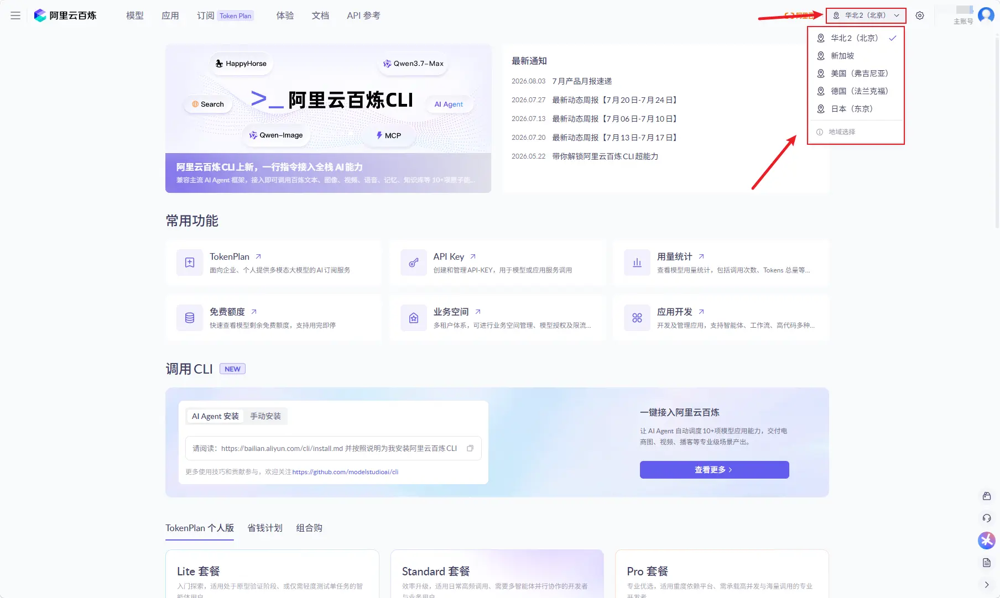

3. 进入 `API Key` 页面；

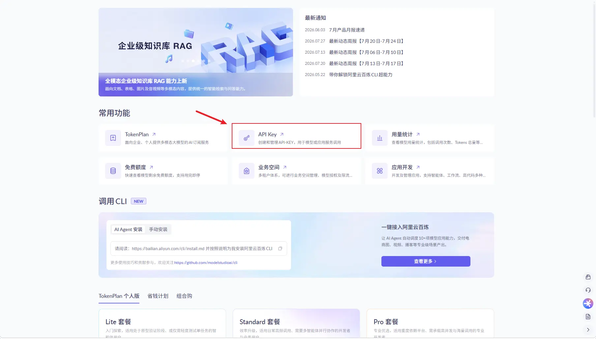

4. 创建用于 `Voice Bridge` 的 `API Key`。创建成功后请立即复制并妥善保存完整密钥；

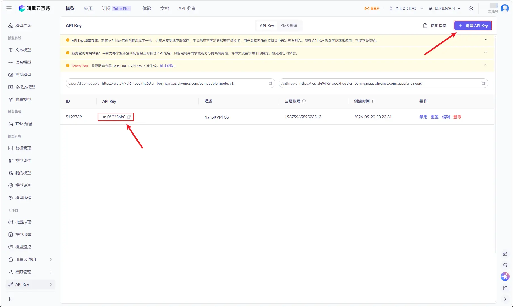

5. 创建完成后，页面会显示 `OpenAI compatible` 和 `Anthropic` 两类兼容接口地址。`QWEN_WORKSPACE_ID` 是接口地址域名最前面的 `ws-...`，紧随其后的地域代码则是 `QWEN_REGION`；

例如接口地址为：

```text
OpenAI compatible:
https://ws-xxxxxxxxxxxxxxxx.cn-beijing.maas.aliyuncs.com/compatible-mode/v1

Anthropic:
https://ws-xxxxxxxxxxxxxxxx.cn-beijing.maas.aliyuncs.com/apps/anthropic
```

则对应配置填写：

```text
Qwen Workspace ID: ws-xxxxxxxxxxxxxxxx
Qwen region: cn-beijing
```

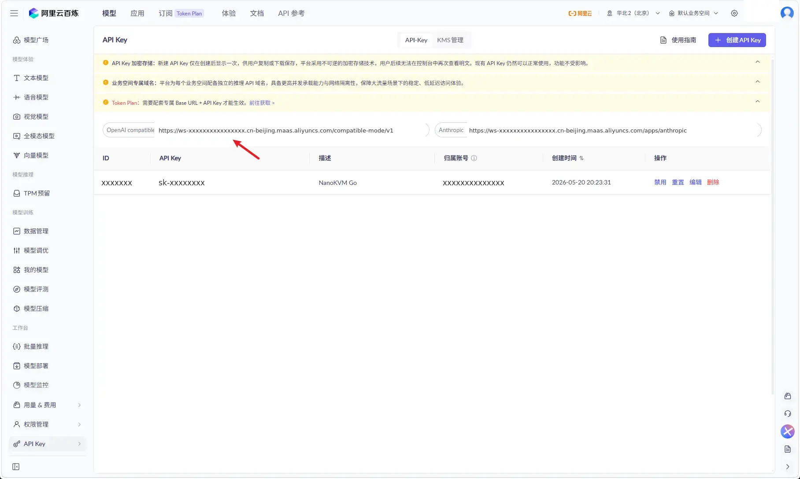

6. 在百炼控制台或 [Qwen Audio Realtime API 使用指南](https://help.aliyun.com/zh/model-studio/qwen-audio-realtime-user-guides)中确认账号当前可用的实时语音模型名称和支持地域。

后续配置 Voice Bridge 时，需要填写或确认以下 Qwen 字段：

- `Qwen Workspace ID`（对应 `QWEN_WORKSPACE_ID`）；
- `Qwen API key`（对应 `QWEN_API_KEY`）；
- `Qwen region`（对应 `QWEN_REGION`），必须与 API Host 中的地域代码完全一致。

按照上面的北京地域配置时，`Qwen region` 和 `Qwen realtime model` 均可保留 APP 默认值。安装前仍需确认 region 与 API Host 中的地域代码一致。

不同账号的可用模型、地域和免费额度可能不同，请以百炼控制台显示的信息为准。


## 安装并配置 Voice Bridge

Voice Bridge 可以直接从 NanoKVM Go 内置的 Sipeed 官方 App Server 安装，无需使用 SSH、SCP，也不需要手动执行 `apt install` 或 `pip install`。

1. 登录 NanoKVM Go 网页控制端，进入 `设置 > 应用 > 应用商店`；

2. 选择内置的 Sipeed 官方仓库；

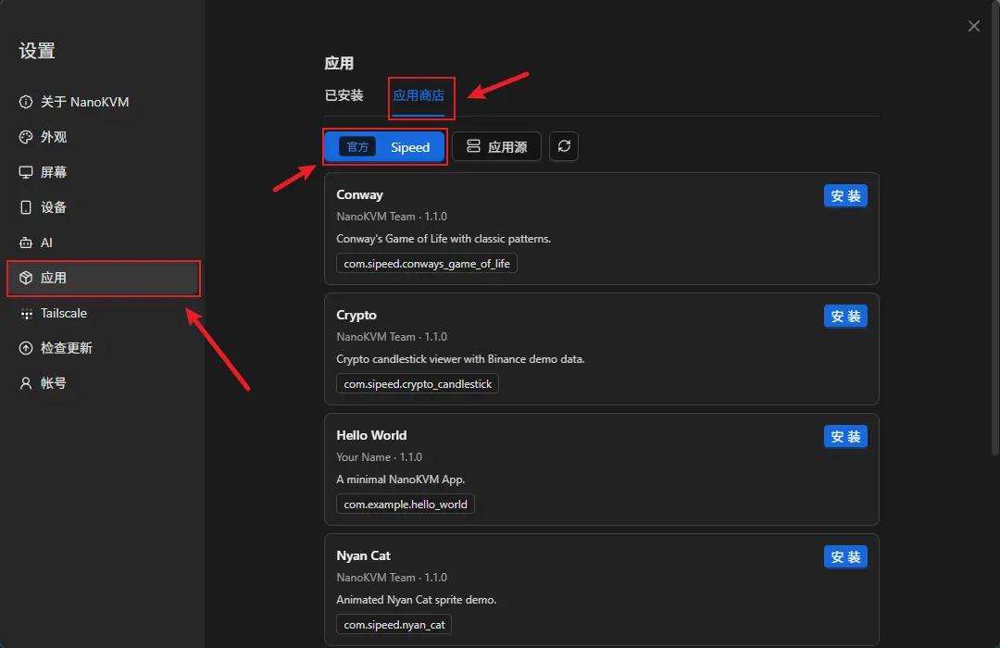

3. 找到 `Voice Bridge`，然后点击 `安装`；

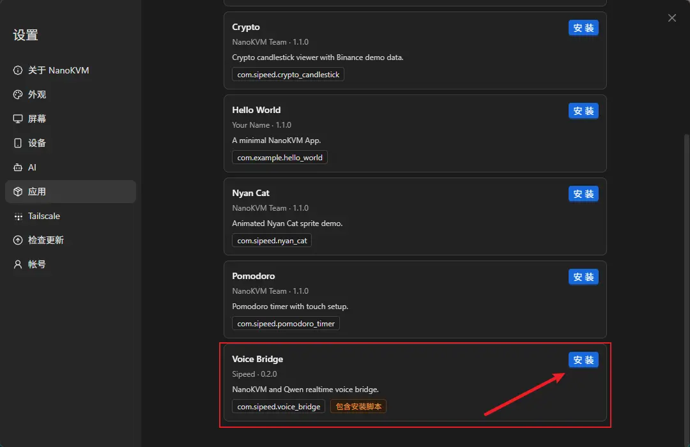

4. 等待安装配置窗口打开。

5. 在自动生成的环境变量表单中填写连接信息。网页表单显示的是配置项名称，APP 内部会把它们保存为对应的环境变量。首次体验时填写 `NanoKVM MCP API key`、`Qwen Workspace ID` 和 `Qwen API key`，确认 `Qwen region` 为与 API Host 一致的 `cn-beijing`，其他字段通常可以保留默认值。

| 网页显示项 | 对应环境变量 | 说明 |
| --- | --- | --- |
| `Turn detection` | `INTERACT_TYPE` | 有默认值；用于设置轮次检测模式，可选择 `server_vad` 或 `smart_turn` |
| `NanoKVM MCP API key` | `NANOKVM_MCP_KEY` | 在 NanoKVM Go 的 `MCP Service` 页面获取 |
| `Qwen API key` | `QWEN_API_KEY` | 在百炼控制台创建 API Key |
| `Assistant instructions` | `QWEN_INSTRUCTIONS` | 有默认值；用于设置模型的身份、回答方式和任务要求 |
| `Base64 instructions` | `QWEN_INSTRUCTIONS_B64` | 可选；填写后会覆盖普通 instructions，首次体验建议留空 |
| `Qwen realtime model` | `QWEN_MODEL` | 有默认值；如账号模型权限不同，再改为当前可用的实时语音模型 |
| `Qwen region` | `QWEN_REGION` | 有默认值；本文保留 `cn-beijing`，并确认它与 API Host 中的地域代码一致 |
| `Session rotation interval` | `QWEN_SESSION_ROTATE_SECONDS` | 有默认值；用于设置 Qwen 会话轮换间隔 |
| `Qwen voice` | `QWEN_VOICE` | 有默认值；用于设置模型回复使用的音色 |
| `Qwen Workspace ID` | `QWEN_WORKSPACE_ID` | 从百炼兼容接口地址的 `ws-...` 前缀获取 |

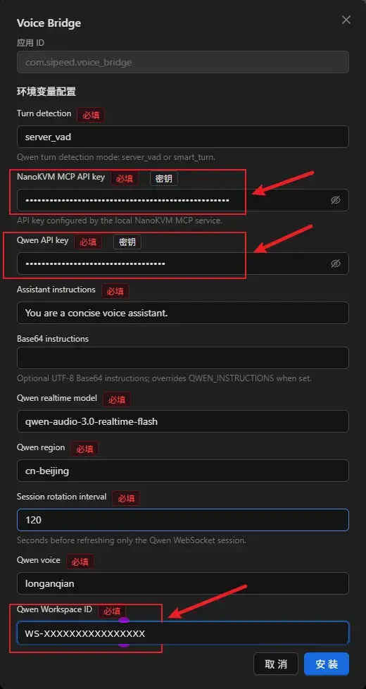

> 页面中的具体字段和默认值可能随 APP 版本更新，请以当前环境变量表单和 Qwen 官方文档为准。

6. 填写完成后，点击安装，并保持 `安装日志` 窗口打开，直到页面显示安装成功。

Voice Bridge 的安装脚本会自动安装编译依赖，并把固定版本的 Python 依赖安装到 APP 自己的 `python/` 目录。首次安装需要下载和构建 ARM 依赖，通常需要等待数分钟。日志窗口会实时显示软件包下载、构建和安装进度。

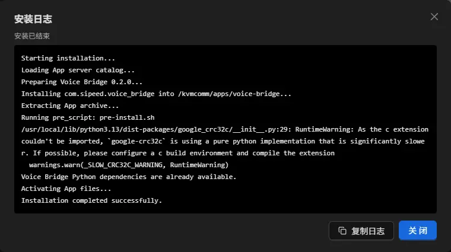

如果安装失败，请点击 `复制日志` 保存完整日志，并重点检查日志末尾是否出现网络、软件源、存储空间或 Python 包构建错误。

安装后可以随时在 `设置 > 应用 > 已安装` 中修改 Voice Bridge 的环境变量配置，新配置会在 APP 下次启动时生效。

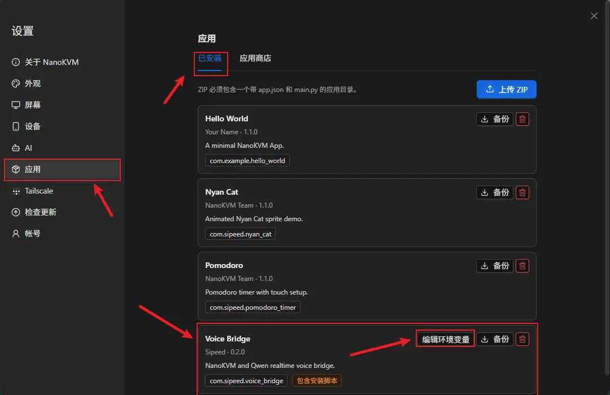

## 运行并测试

### 启动 APP

1. 在 NanoKVM Go 触摸屏上进入 `Apps` 页面；
2. 选择 `Voice Bridge` 并启动；
3. 等待 APP 显示模型和音频连接已就绪。

<video src="./../../../assets/NanoKVM/go/realtime_voice_bridge/app-voice-bridge.mp4" aria-label="NanoKVM Go 设备端 Voice Bridge APP 启动和运行演示" style="width: 60%; max-width: 480px; display: block; margin: 0 auto;" playsinline controls autoplay loop muted preload="metadata"></video>

### 发起语音对话

1. 使用手机拨号，并让被控主机接通；
2. 对着手机说一句话；
3. 确认 NanoKVM Go 屏幕出现 User transcript；
4. 等待 Qwen 回复，确认屏幕出现模型 transcript；
5. 确认模型回复的语音能够通过被控主机传回手机。

已在 Android 和 iPhone 手机上验证该流程可用。

## 常见问题

### 被控主机听不到模型回复

在被控主机的系统音频或通话软件中，确认输入设备已选择 NanoKVM Go 的 UAC2 虚拟麦克风，并检查该输入设备是否被静音。

### APP 没有收到手机声音

确认手机通话使用的是 USB 音频，并在被控主机的系统音频或通话软件中选择 NanoKVM Go 的 UAC2 虚拟扬声器。当前流程不能使用 DP 音频传输手机通话媒体。

### APP 无法连接 Qwen

检查 `Qwen API key`、`Qwen Workspace ID`、`Qwen region` 和 `Qwen realtime model` 是否匹配，并确认 NanoKVM Go 可以访问互联网。账号的模型权限、额度或限流状态也可能导致连接失败。

### 修改配置后没有生效

退出 Voice Bridge，在 `设置 > 应用 > 已安装` 中保存新配置后重新启动 APP。环境变量的新值在 APP 下次启动时生效。

### 如何退出 APP

退出 Voice Bridge 后，APP 会关闭模型、WebRTC 和媒体会话，不会继续在后台播放。APP 的通用退出手势和管理方法请参考[自定义 APP：退出 APP](./custom_app.html#exit-app)。

## 了解原理和二次开发

官方设备端示例源码位于 [NanoKVM-Go-Apps `main` 分支的 `voice-bridge/`](https://github.com/sipeed/NanoKVM-Go-Apps/tree/main/voice-bridge)，共享 App SDK 和开发文档位于该仓库的 [`base` 分支](https://github.com/sipeed/NanoKVM-Go-Apps/tree/base)。

如果你需要替换 Qwen、接入其他实时语音模型，或者加入知识库、Agent、业务工具和自定义音频处理，请继续阅读[实时语音二次开发](./realtime_voice_bridge_technical.html)。

参考：[NanoKVM-Go-Apps](https://github.com/sipeed/NanoKVM-Go-Apps) · [阿里云百炼控制台](https://bailian.console.aliyun.com/) · [获取 API Key](https://help.aliyun.com/zh/model-studio/get-api-key) · [获取 Workspace ID](https://help.aliyun.com/zh/model-studio/obtain-the-app-id-and-workspace-id) · [Qwen Audio Realtime 文档](https://help.aliyun.com/zh/model-studio/qwen-audio-realtime-user-guides)
