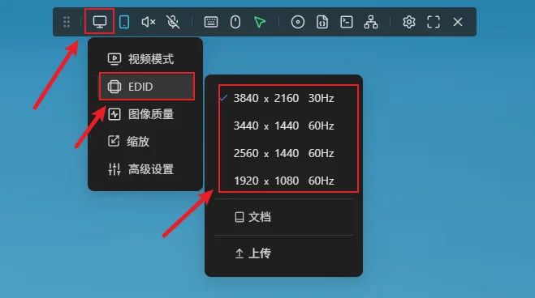
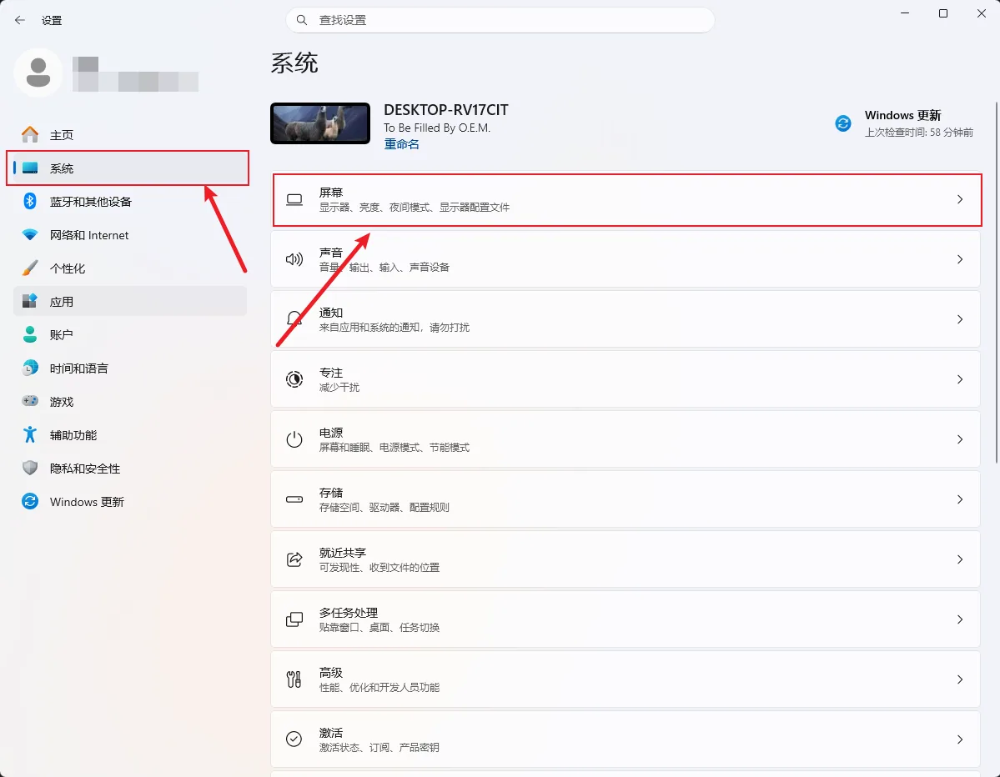
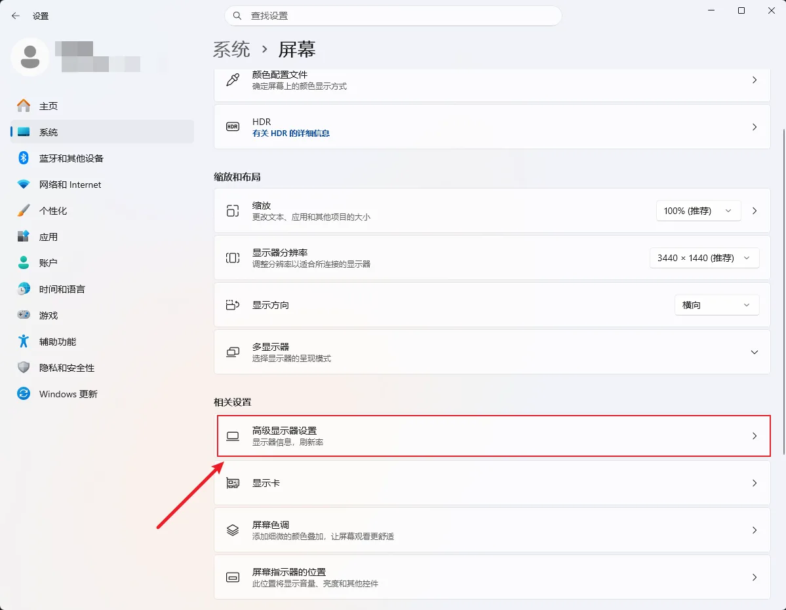
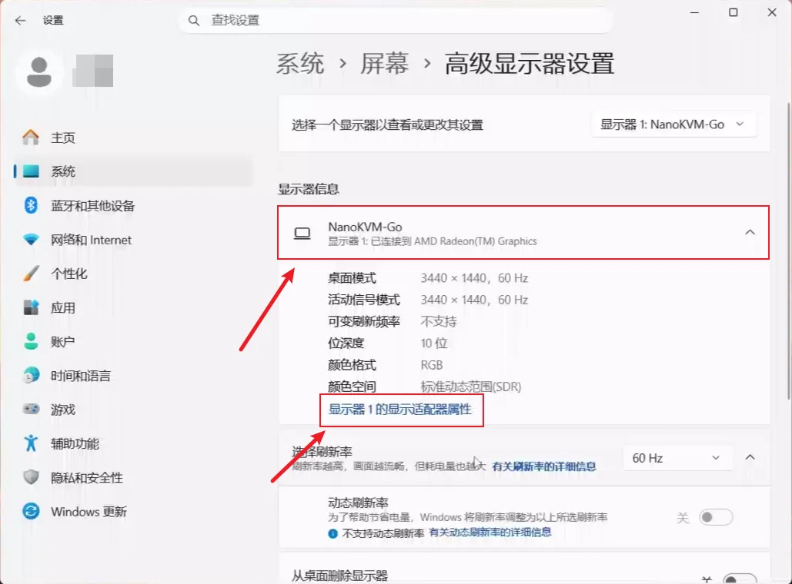
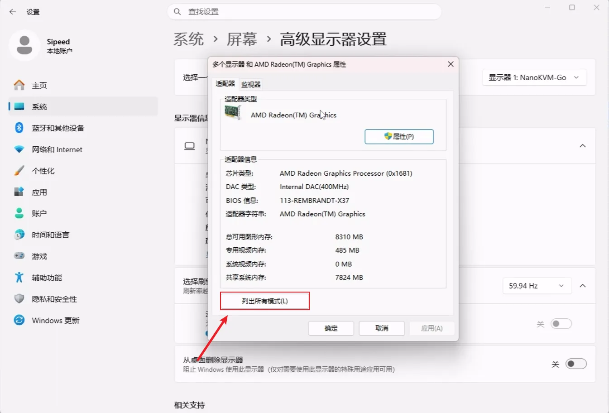
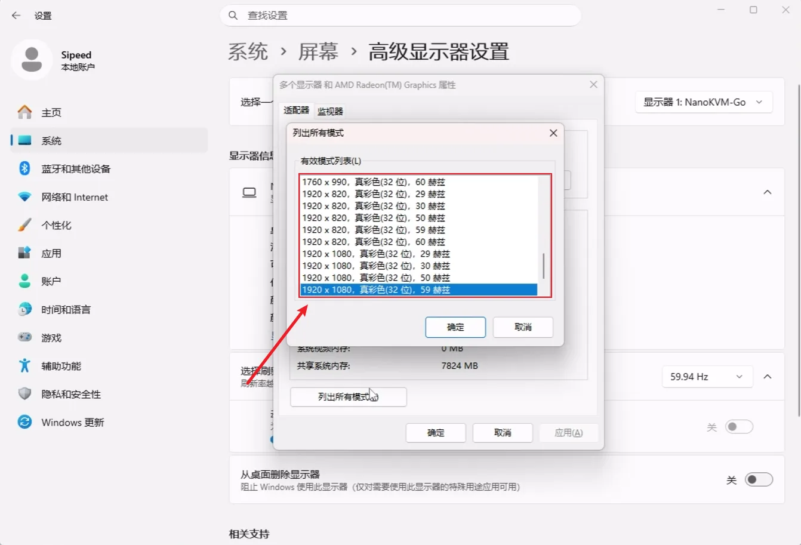
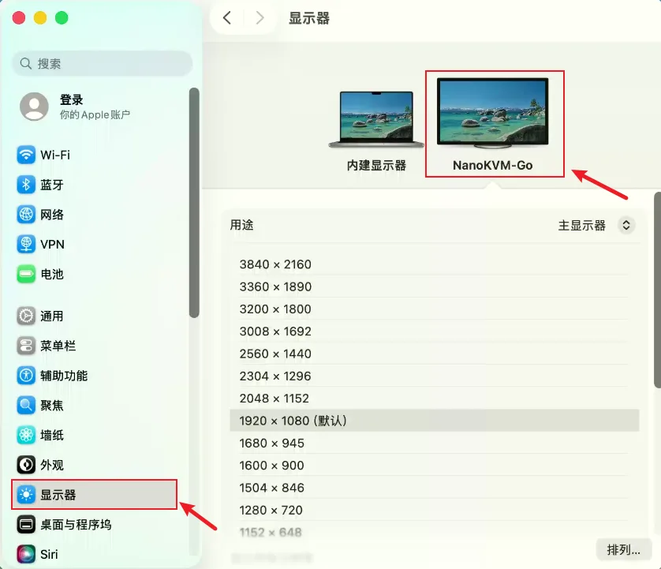
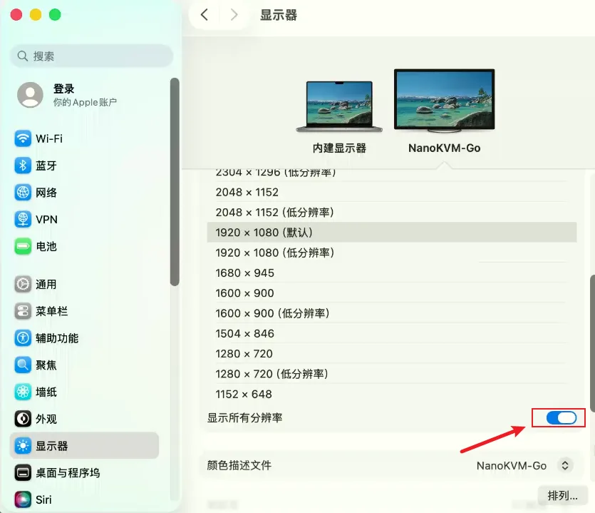

## 简介

NanoKVM Go 会向被控设备提供一组 EDID 信息。被控设备读取 EDID 后，会根据 EDID 中声明的显示模式输出画面。因此，被控设备可以选择的最大分辨率，通常取决于 NanoKVM Go 当前使用的 EDID 设置。

需要注意的是，操作系统设置页面中看到的分辨率，不一定都代表真实的视频输出分辨率。有些选项可能是系统缩放后的显示效果。若希望 NanoKVM Go 获取到指定的真实输出分辨率，需要同时选择 EDID 中存在的分辨率和刷新率组合，而不是只调整缩放显示效果。

## EDID 与分辨率的关系

EDID 用于告诉被控设备当前“显示器”支持哪些分辨率、刷新率和显示参数。NanoKVM Go 会被被控设备识别为一台显示器，被控设备会根据 NanoKVM Go 提供的 EDID 生成可选的显示模式。

例如，如果 NanoKVM Go 当前使用的是 `1920x1080 60Hz` EDID，被控设备通常不会输出超过该 EDID 声明范围的真实分辨率。如果切换到 `2560x1440 60Hz`、`3440x1440 60Hz`、`3840x2160 30Hz` 或 `3840x2160 50Hz` EDID，被控设备才可能显示对应的更高分辨率选项。

下表列出了不同 EDID 下建议选择的真实输出模式。只有表格中列出的分辨率和刷新率组合，才建议作为 NanoKVM Go 的目标真实输出模式。操作系统中出现但没有列在表格中的其他分辨率或刷新率，都应按系统缩放、兼容模式、超出设备规格或额外推导出的显示效果理解。

| 分辨率 | 宽高比 | 1920×1080@60Hz EDID | 2560×1440@60Hz EDID | 3440×1440@60Hz EDID | 3840×2160@30Hz EDID | 3840×2160@50Hz EDID（Beta） |
| --- | --- | --- | --- | --- | --- | --- |
| 3840×2160 | 16:9 | × | × | × | 30 Hz | 30 / 50 Hz |
| 3440×1440 | 43:18（约 21:9） | × | × | 30 / 60 Hz | 60 Hz | × |
| 2560×1440 | 16:9 | × | 30 / 60 Hz | 30 / 60 Hz | 30 / 60 Hz | 30 / 60 / 90 Hz |
| 1920×1200 | 16:10 | × | 60 Hz | 60 Hz | 60 Hz | 60 Hz |
| 1920×1080 | 16:9 | 30 / 50 / 60 Hz | 30 / 60 Hz | 30 / 60 Hz | 30 / 50 / 60 Hz | 30 / 50 / 60 Hz |
| 1600×900 | 16:9 | 60 Hz | 60 Hz | 60 Hz | 60 Hz | 60 Hz |
| 1280×1024 | 5:4 | 60 Hz | 60 Hz | 60 Hz | 60 Hz | 60 Hz |
| 1280×960 | 4:3 | 60 Hz | 60 Hz | 60 Hz | 60 Hz | 60 Hz |
| 1280×720 | 16:9 | 30 / 50 / 60 Hz | 60 Hz | 60 Hz | 30 / 50 / 60 Hz | 30 / 50 / 60 Hz |
| 1024×768 | 4:3 | 60 Hz | 60 Hz | 60 Hz | 60 Hz | 60 Hz |
| 800×600 | 4:3 | 60 Hz | 60 Hz | 60 Hz | 60 Hz | 60 Hz |
| 640×480 | 4:3 | 60 Hz | 60 Hz | 60 Hz | 60 Hz | 60 Hz |

> `3840×2160@50Hz EDID` 目前为 **Beta**。该模式已经可以使用，但在部分使用环境下可能出现画面不稳定；如果遇到异常，建议切换到 `3840×2160@30Hz` 或更低分辨率的 EDID。

> 修改 EDID 前请先插入 PD 电源。如果不接通 PD 电源，切换 EDID 后可能需要手动重启才能正常使用。
>
> 修改 EDID 后，被控设备可能会短暂黑屏、重新识别显示器或重新排列窗口。这是正常现象。

## 在 NanoKVM Go 中选择 EDID

1. 打开 NanoKVM Go Web 控制页面。
2. 点击顶部悬浮栏中的屏幕标志。
3. 在 EDID 选项中选择目标分辨率对应的 EDID。

4. 等待被控设备重新识别显示器。
5. 在被控设备系统中重新选择目标输出分辨率。

## Windows 设置真实输出分辨率

在 Windows 中，如果直接通过 `设置` > `系统` > `屏幕` 中的显示器分辨率修改分辨率，系统有时会使用缩放后的显示效果。此时 NanoKVM Go 获取到的画面，可能不是用户期望的真实输出分辨率。

如果需要设置真实输出分辨率，建议从有效模式列表中选择，并确认所选的分辨率和刷新率组合存在于上面的 EDID 表格中：

1. 打开 Windows `设置`。
2. 进入 `系统` > `屏幕`。

3. 点击 `高级显示器设置`。

4. 如果连接了多个显示器，请先在高级显示页面中选择 `NanoKVM-Go`。
5. 点击当前显示器的 `显示器适配器属性`。

6. 在弹出的窗口中点击 `列出所有模式`。

7. 在有效模式列表中选择表格中列出的目标分辨率和刷新率。

8. 点击确认并应用设置。

## macOS 设置真实输出分辨率

在 macOS 中，显示设置里可能同时出现普通分辨率和带有“低分辨率”标记的分辨率。

+ 不带“低分辨率”的选项通常是 HiDPI 或缩放显示效果；
+ 带有“低分辨率”的选项通常表示未经过 HiDPI 缩放的实际输出模式。

不过，选择“低分辨率”并不一定代表最终就是目标原生模式。还需要确认该分辨率对应的刷新率也存在于上面的 EDID 表格中。如果刷新率不匹配，macOS 仍然可能使用缩放模式或其他兼容输出模式。

1. 打开 macOS `系统设置`。
2. 进入 `显示器`。
3. 在显示器列表中选择 `NanoKVM-Go`。

4. 打开 `显示所有分辨率` 的开关。

5. 在分辨率列表中找到目标分辨率。
6. 选择带有“低分辨率”标记，并且分辨率和刷新率组合存在于上表中的目标模式。
7. 确认画面正常显示后，返回 NanoKVM Go 查看当前画面分辨率。

例如，如果希望被控 Mac 实际输出 `1920 x 1080 60Hz`，请优先选择 `1920 x 1080（低分辨率）`，并确认刷新率为 `60Hz`。如果只选择普通的 `1920 x 1080` 缩放显示选项，或者选择了 EDID 中没有列出的刷新率，就可能得到缩放后的画面。

## 常见问题

### 为什么设置了某个分辨率，但 NanoKVM Go 显示的画面像是缩放后的？

可能是操作系统选择了缩放显示效果，而不是实际输出模式。请根据当前系统进入有效模式列表，并选择表格中列出的分辨率和刷新率组合。

在 Windows 中，建议使用 `列出所有模式` 选择分辨率和刷新率。在 macOS 中，建议选择带有“低分辨率”标记的对应分辨率，并确认刷新率也在表格中。

### 为什么系统中看不到我想要的分辨率？

请检查 NanoKVM Go 当前使用的 EDID 是否支持该分辨率和刷新率组合。如果 EDID 中没有声明对应的显示模式，被控设备通常不会显示该选项，或者只提供缩放后的显示效果。

切换 EDID 后，请等待系统重新识别显示器。如果仍然看不到目标分辨率，可以尝试重新插拔 NanoKVM Go 的数据线，或重启被控设备。

### 修改 EDID 后为什么会短暂黑屏？

修改 EDID 后，被控设备会重新识别显示器，并重新协商输出模式。这个过程中可能会短暂黑屏，属于正常现象。

### 分辨率越高越好吗？

不一定。更高分辨率会增加画面编码、网络传输和浏览器显示压力。如果只是进行 BIOS 设置、系统安装或远程维护，建议优先选择稳定、清晰且延迟较低的分辨率。
