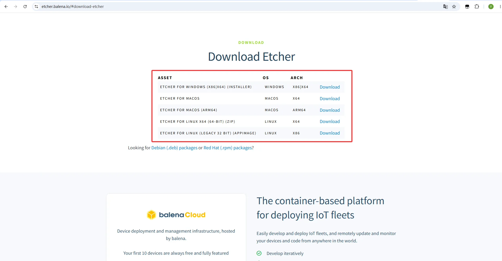
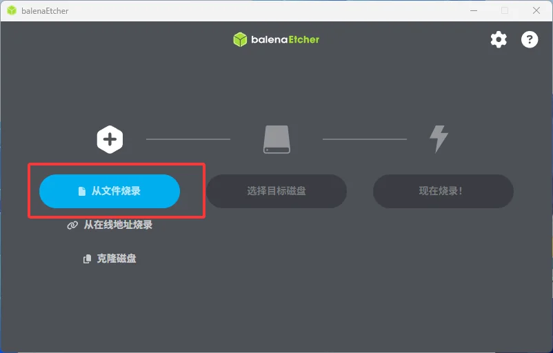
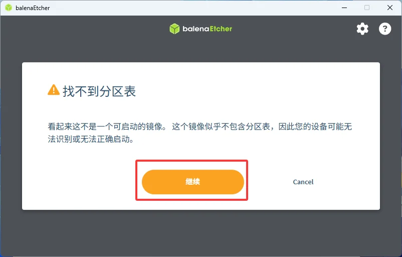
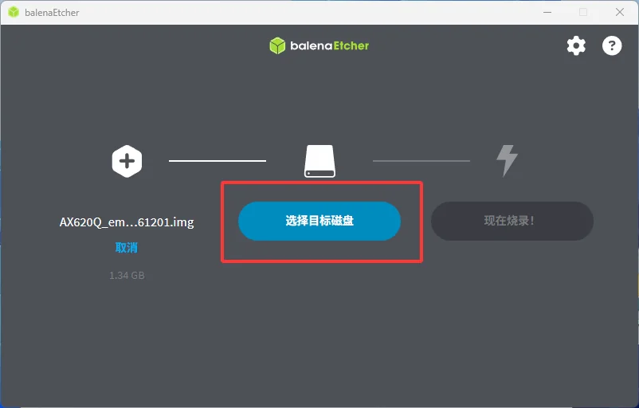
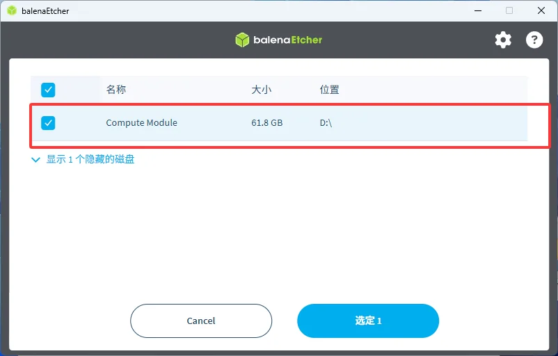
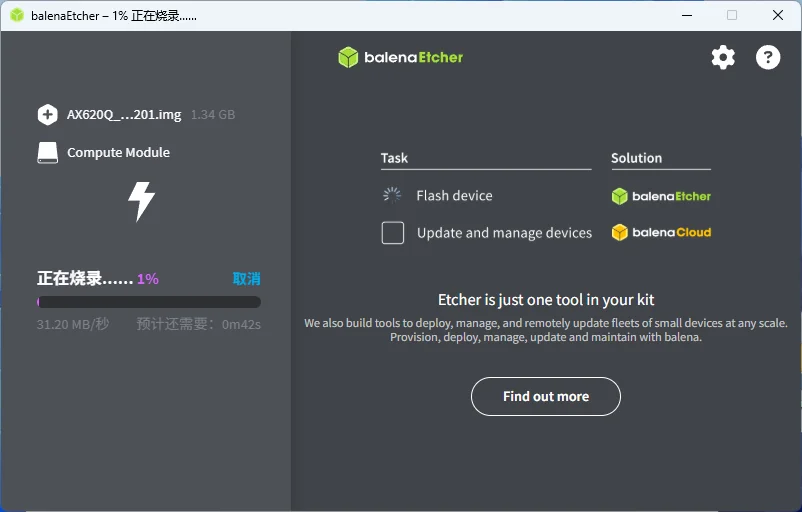
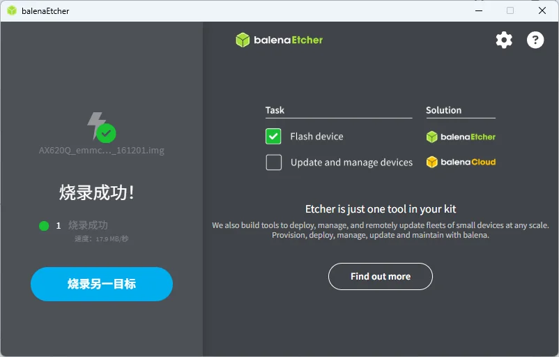

*NanoKVM Go 出厂时通常已经烧录了镜像，如设备可以正常启动，可以先跳过该步骤。*

## 准备工作

烧录前请先准备：

- NanoKVM Go；
- 取卡针或其他可以按住烧录模式按键的工具；
- USB 数据线；
- Linux / macOS / Windows系统；
- NanoKVM Go 镜像文件；
- balenaEtcher 烧录工具。

## 下载镜像

前往 GitHub 下载最新版 NanoKVM Go 镜像。

镜像下载链接：[NanoKVM-Go Releases](https://github.com/sipeed/NanoKVM-Go/releases)

## 下载烧录工具

下载并安装 [balenaEtcher](https://etcher.balena.io/#download-etcher)。

## 进入烧录模式

1. 断开 NanoKVM Go 的 USB 连接，使设备整体处于关机状态；

2. 电脑上打开 balenaEtcher；

3. 使用取卡针通过按键孔按住 NanoKVM Go 的烧录模式按键；

4. 保持按住烧录模式按键，将连接电脑的 USB 数据线插入 NanoKVM Go 的数据接口(Data Port)；

5. 确认电脑已识别到 NanoKVM Go 设备（可在「此电脑」或「磁盘管理」中查看）；

6. 识别成功后，松开烧录模式按键。

## 使用 balenaEtcher 烧录镜像

1. 打开 balenaEtcher，点击 `从文件烧录`，选择下载好的 NanoKVM Go 镜像文件；

2. 弹出 `找不到分区表` 提示时，点击 `继续`；

3. 点击 `选择目标磁盘`；

4. 在磁盘列表中勾选 NanoKVM Go 对应的磁盘（通常显示为 `Compute Module`），点击 `选定`；

5. 点击 `现在烧录!`，进入烧录界面，等待烧录完成；

6. 界面显示 `烧录成功！`，即烧录完成。

烧录完成后，安全弹出 USB 设备，断开 USB 数据线，然后重新连接 NanoKVM Go，等待系统启动。

> 烧录过程中不要断开 USB 连接，也不要关闭 balenaEtcher，否则可能导致镜像写入失败。
