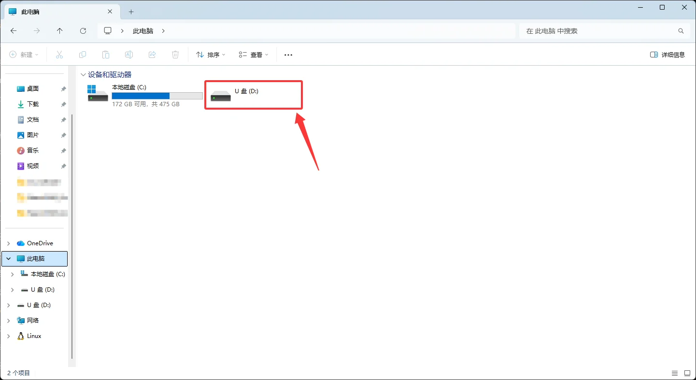

*NanoKVM Go 出厂时通常已经烧录了镜像，如设备可以正常启动，可以先跳过该步骤。*

## 准备工作

烧录前请先准备：

- NanoKVM Go；
- 取卡针或其他可以按住 Reset 按键的工具；
- USB 数据线；
- Windows 电脑；
- NanoKVM Go 镜像文件；
- ImageUSB 烧录工具。

## 下载镜像

前往 GitHub 下载最新版 NanoKVM Go 镜像。

镜像下载链接：TODO

## 下载烧录工具

下载并安装 [ImageUSB](https://www.osforensics.com/tools/write-usb-images.html)。

## 进入烧录模式

1. 断开 NanoKVM Go 的 USB 连接；

2. 使用取卡针按住 NanoKVM Go 的 Reset 按键；

3. 保持按住 Reset 按键，将 USB 数据线插入 NanoKVM Go 的数据接口(Data Port)，并连接到电脑；

4. 打开 ImageUSB，等待软件识别到 NanoKVM Go 对应的 USB 设备;

5. 识别成功后，松开 Reset 按键。

## 使用 ImageUSB 烧录镜像

1. 在 ImageUSB 中选择 NanoKVM Go 对应的 USB 设备；

2. 选择写入镜像的模式；

3. 选择下载好的 NanoKVM Go 镜像文件；

4. 点击写入按钮开始烧录；

5. 根据软件提示确认写入操作；

6. 等待烧录完成。

7. 烧录成功。

烧录完成后，安全弹出 USB 设备，断开 USB 数据线，然后重新连接 NanoKVM Go，等待系统启动。

> 烧录过程中不要断开 USB 连接，也不要关闭 ImageUSB，否则可能导致镜像写入失败。
