*NanoKVM Go 出厂时通常已经烧录了镜像，如设备可以正常启动，可以先跳过该步骤。*

## 准备工作

烧录前请先准备：

- NanoKVM Go；
- 取卡针或其他可以按住烧录模式按键的工具；
- USB 数据线；
- 电脑（Windows / macOS / Linux）；
- NanoKVM Go 镜像文件；
- 与电脑系统对应的烧录工具：
  - Windows：balenaEtcher 2.1.6 或 ImageUSB；
  - macOS：balenaEtcher 2.1.6；
  - Linux：balenaEtcher 2.1.6。

## 下载镜像

前往 GitHub 下载最新版 NanoKVM Go 镜像。

镜像下载链接：[NanoKVM-Go Releases](https://github.com/sipeed/NanoKVM-Go/releases)

> NanoKVM Go 和 NanoKVM Go+ 使用同一个烧录镜像，Go+ 没有单独的镜像，两款设备下载同一个文件即可。

## 下载烧录工具

balenaEtcher 支持 Windows、macOS 和 Linux，推荐优先使用；ImageUSB 仅支持 Windows，作为 Windows 上的备选。

### balenaEtcher 2.1.6（Windows / macOS / Linux）

请固定使用 balenaEtcher 2.1.6 版本：

下载链接：[balenaEtcher v2.1.6](https://github.com/balena-io/etcher/releases/tag/v2.1.6)

在 Release 页面的 `Assets` 中按系统选择安装包：

- Windows 选择 `balenaEtcher-2.1.6.Setup.exe`；
- macOS 选择 `balenaEtcher-2.1.6-arm64.dmg`（Apple 芯片）或 `balenaEtcher-2.1.6-x64.dmg`（Intel 芯片）；
- Linux 选择 `balena-etcher_2.1.6_amd64.deb`（Debian / Ubuntu）或 `balena-etcher-2.1.6-1.x86_64.rpm`（Fedora / RHEL）。

官网下载页按系统与架构列出安装包，但不能指定版本，所以请从上面的 Release 链接下载 2.1.6。

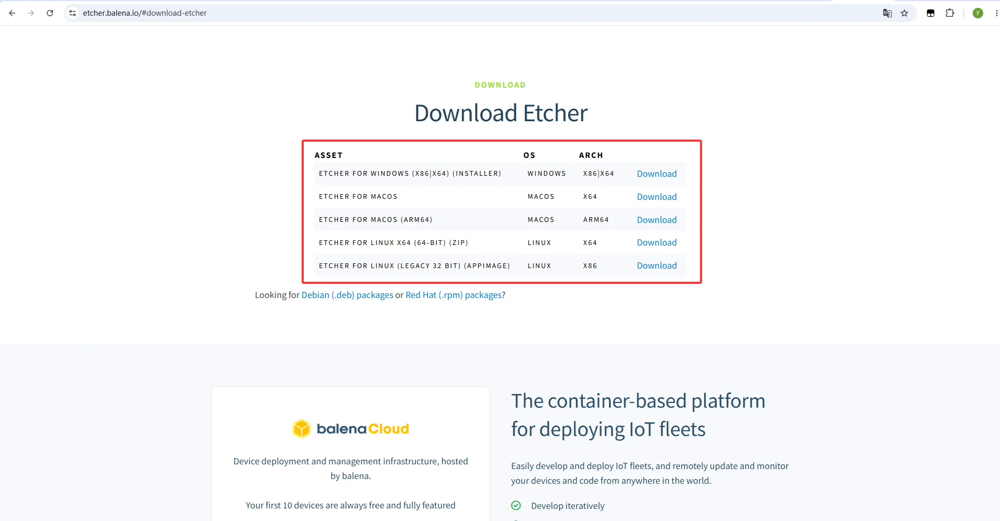

### ImageUSB（Windows）

ImageUSB 仅支持 Windows。前往官网下载压缩包，解压后直接运行其中的 `imageUSB.exe`，无需安装。

下载链接：[ImageUSB](https://www.osforensics.com/tools/write-usb-images.html)

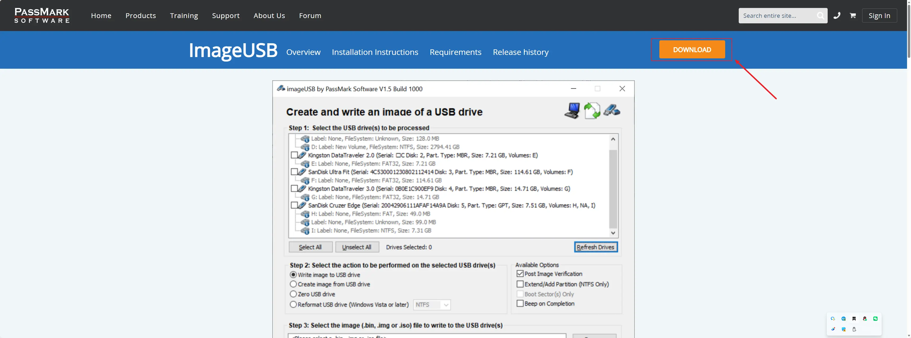

## 进入烧录模式

1. 断开 NanoKVM Go 的 USB 连接，使设备整体处于关机状态；

2. 使用取卡针通过按键孔按住 NanoKVM Go 的烧录模式按键；

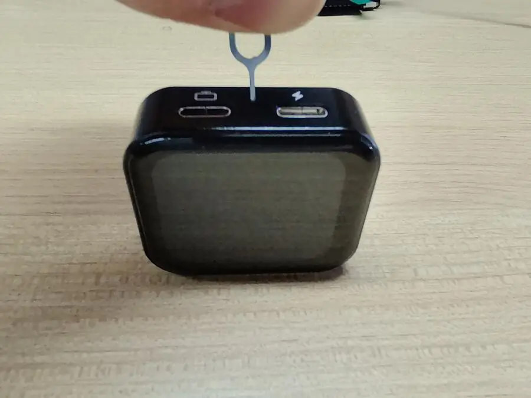

3. 保持按住烧录模式按键，将连接电脑的 USB 数据线插入 NanoKVM Go 的数据接口(Data Port)；

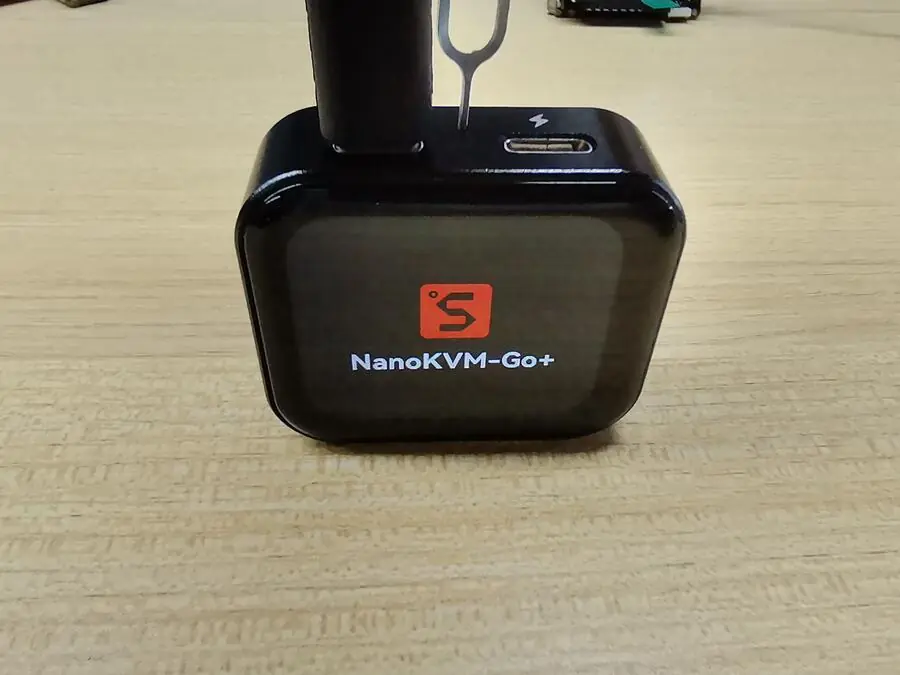

## 使用 balenaEtcher 烧录镜像（Windows / macOS / Linux）

1. 打开 balenaEtcher，点击 `从文件烧录`，选择下载好的 NanoKVM Go 镜像文件；

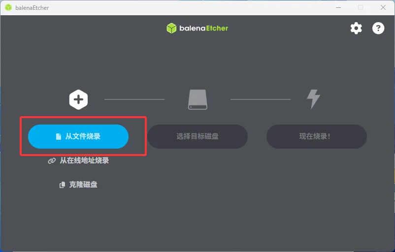

2. 弹出 `找不到分区表` 提示时，点击 `继续`；

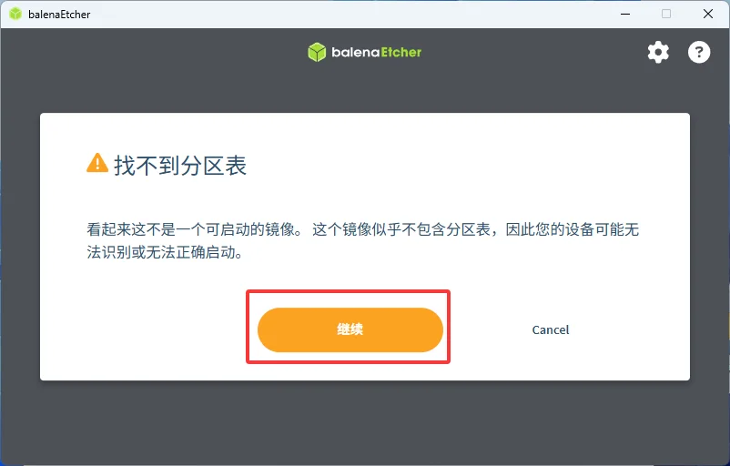

3. 点击 `选择目标磁盘`；

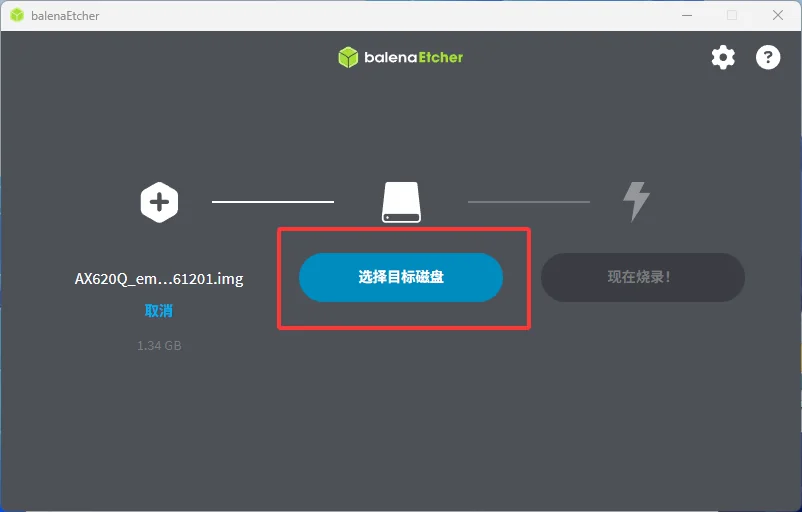

4. 在磁盘列表中勾选 NanoKVM Go 对应的磁盘（通常显示为 `Compute Module`），点击 `选定`；

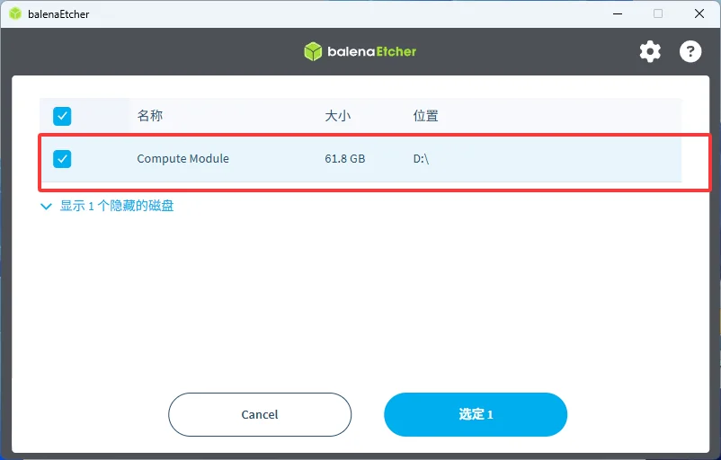

5. 点击 `现在烧录!`，进入烧录界面，等待烧录完成；

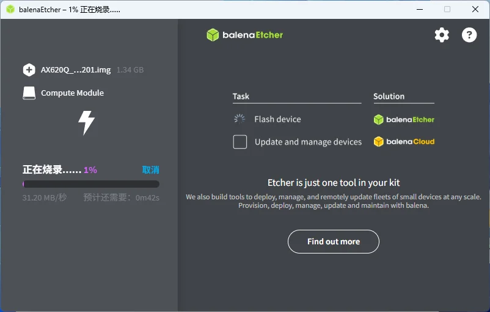

6. 界面显示 `烧录成功！`，即烧录完成。

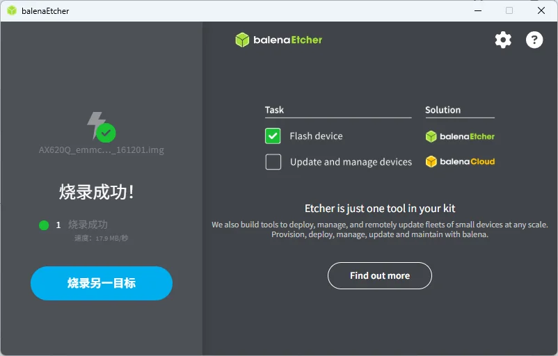

## 使用 ImageUSB 烧录镜像（Windows）

1. 打开 ImageUSB，点击 `Refresh Drives`，确认列表中已出现 NanoKVM Go 设备（显示为 `Linux File-Stor Gadget`）；

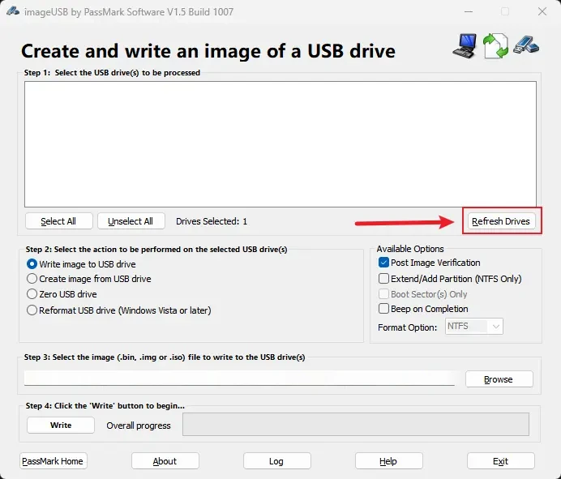

2. 在 `Step 1` 中勾选 NanoKVM Go 对应的 USB 设备；

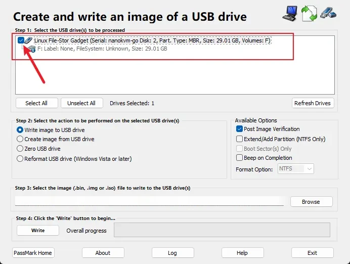

3. 在 `Step 2` 中选择 `Write image to USB drive`；

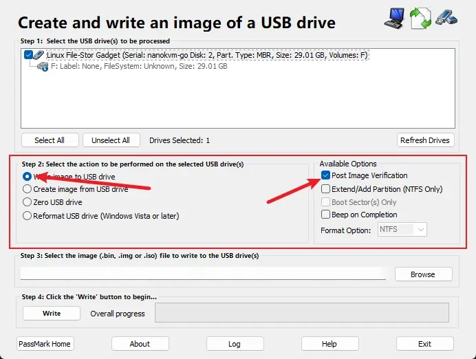

4. 在 `Step 3` 中点击 `Browse`，选择下载好的 NanoKVM Go 镜像文件；

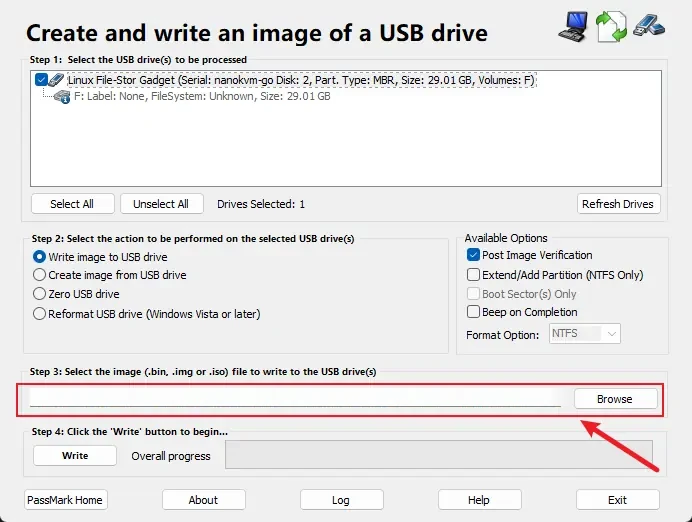

5. 在 `Step 4` 中点击 `Write` 开始烧录；

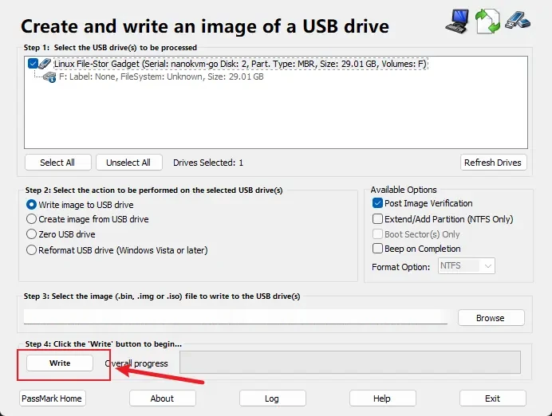

6. 弹出确认窗口时点击 `Yes` 确认写入；

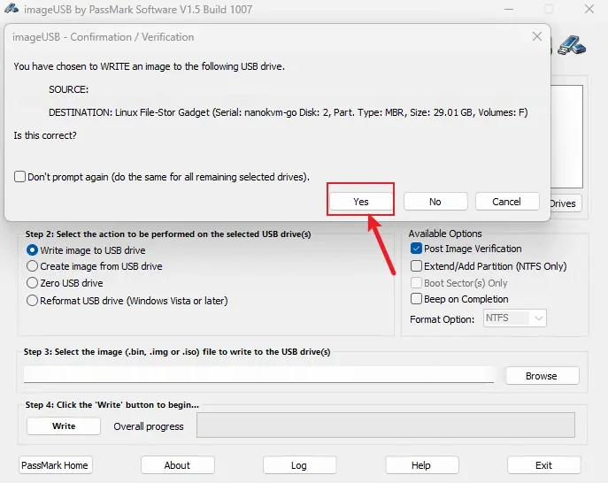

7. 等待烧录完成；

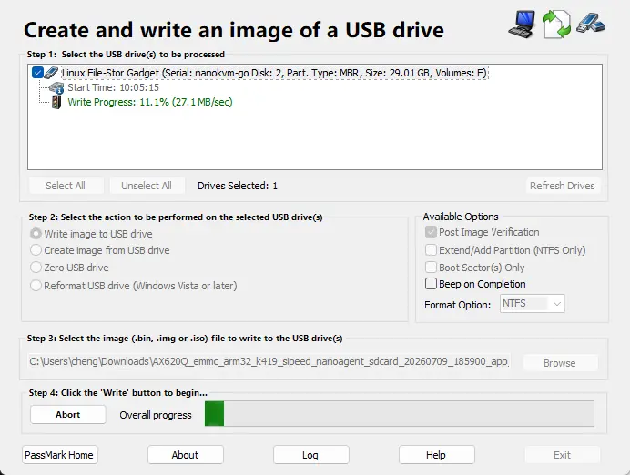

8. 出现 `Imaging Completed!` 提示，即烧录完成。

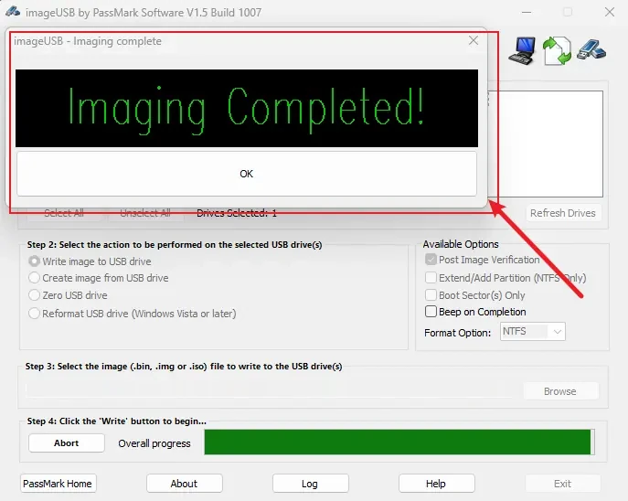

烧录完成后，安全弹出 USB 设备，断开 USB 数据线，然后重新连接 NanoKVM Go，等待系统启动。

> 烧录过程中不要断开 USB 连接，也不要关闭烧录工具，否则可能导致镜像写入失败。

## 烧录恢复镜像

### 下载恢复镜像

恢复镜像提供 MEGA 与百度网盘两个下载位置：

- [MEGA](https://mega.nz/folder/N5ZTGaAB#vWbMjiaVzgcOP8d0QP8pUg)
- [百度网盘](https://pan.baidu.com/e/verify?surl=pzOKFyb-xR2IckgExNdXvQ)，提取码 `w2hu`

打开 MEGA 链接后，先进入 `NanoKVM-Go` 文件夹：

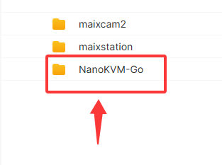

`NanoKVM-Go` 文件夹内有恢复镜像文件和一份说明文档：

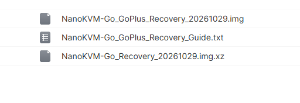

按设备型号选择对应的镜像文件：

- NanoKVM Go：选择 `NanoKVM-Go_Recovery_*.img.xz`
- NanoKVM Go+：选择 `NanoKVM-Go_GoPlus_Recovery_*.img`

### 烧录方法

烧录方法与普通镜像相同，按上文「使用 balenaEtcher 烧录镜像」或「使用 ImageUSB 烧录镜像」操作即可。

> 恢复镜像会覆盖系统分区和设置，烧录前请先备份重要数据。

### 在设备上完成恢复

烧录完成后，不要按住烧录模式按键，断开设备供电再重新上电。设备会自动进入恢复流程，屏幕上依次出现以下界面：

> 整个恢复过程需数分钟，请保持供电，不要断电，也不要拔出 USB 数据线。

1. 屏幕显示 `WARNING`，提示系统和设置将被覆盖。确认电源已连接后，点击 `START REPAIR` 开始恢复。

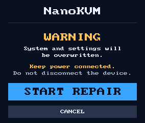

2. 屏幕显示 `Writing recovery`，正在写入 recovery 分区，约 10 秒。

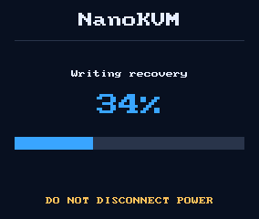

3. 屏幕显示 `Verifying recovery`，正在校验 recovery 分区，约 10 秒。

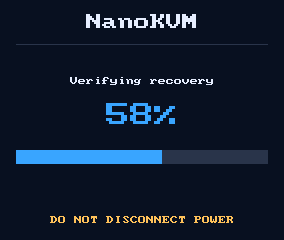

4. 屏幕显示 `Writing system`，正在写入 system 分区，约 100 秒。

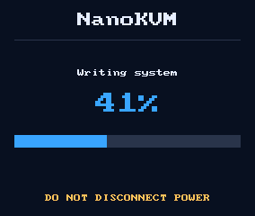

5. 屏幕显示 `Verifying system`，正在校验 system 分区，约 110 秒。

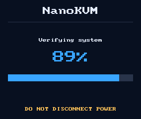

6. 屏幕显示 `REPAIR COMPLETE` 和 `100%`，并在 5 秒后自动重启，重启后恢复流程结束。

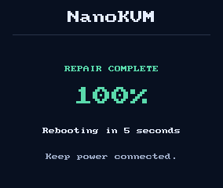

如果恢复过程中断电或写入失败，屏幕会显示 `REPAIR STOPPED`，提示重新进入 USB 烧录模式并再次烧录镜像，按上面的步骤重新烧录即可。

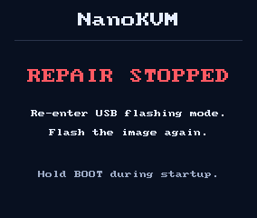

