## 双重验证配置

双重验证（2FA）会在账号密码之外增加一次性验证码。启用后，登录时除了密码，还需要输入认证器应用生成的验证码，可提高账号安全性。

1. 安装认证器应用

在手机上安装 Google Authenticator 或 Microsoft Authenticator。下文以 Google Authenticator 为例。

2. 登录 NanoKVM Go 网页，点击悬浮栏上的设置图标，进入设置页面。

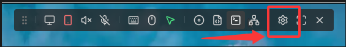

3. 在左侧选择 `账号`，然后在 `双重验证` 一栏点击 `启用`。

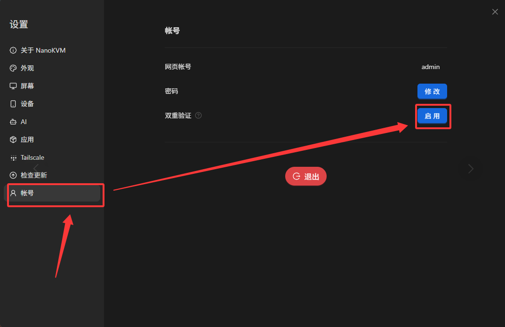

4. 输入当前登录密码，然后点击 `启用` 进入双重验证设置。

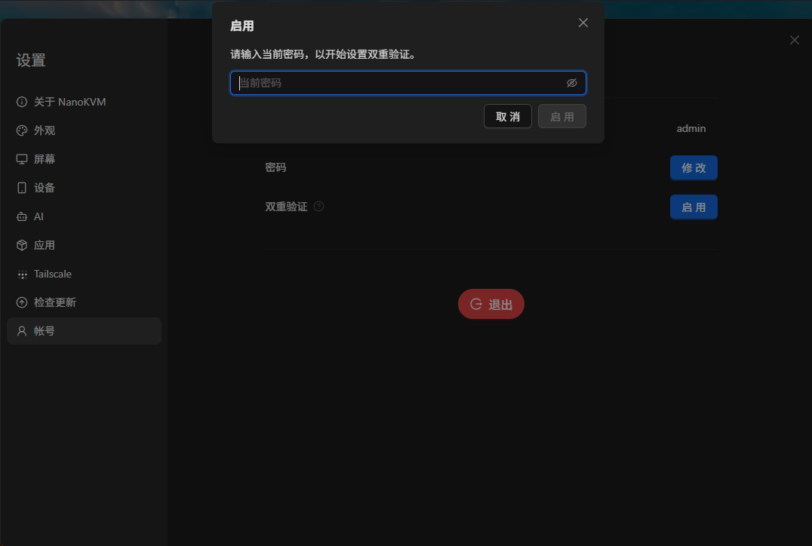

5. 打开认证器应用，扫描页面显示的二维码；也可以在认证器应用中手动输入页面提供的设置密钥。

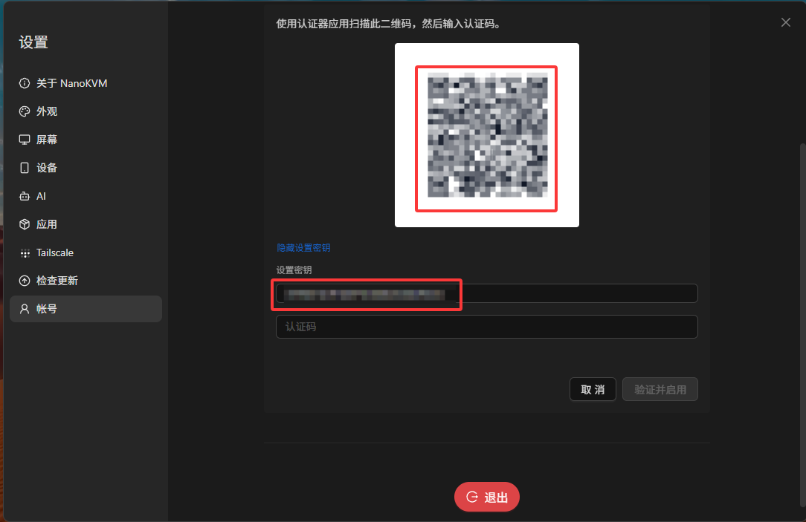

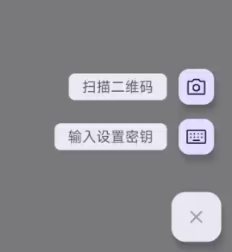

6. 在认证器应用中查看为 NanoKVM Go 生成的 6 位验证码，将其输入 `认证码` 输入框，然后点击 `验证并启用`。

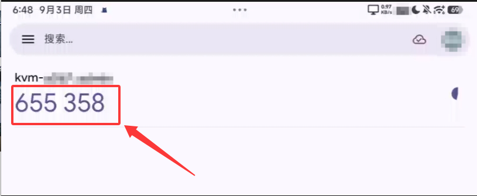

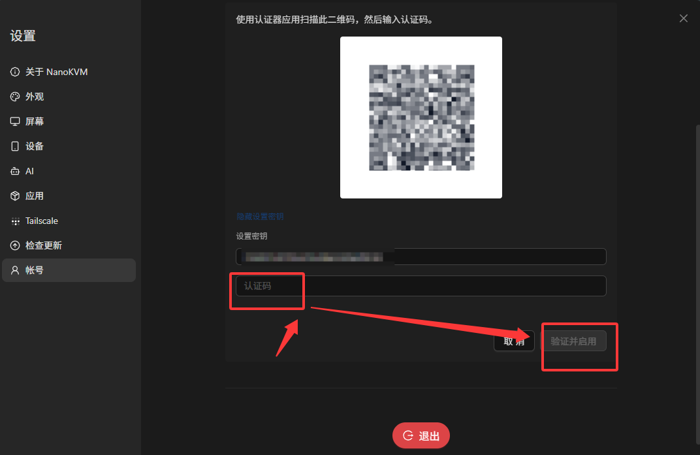

7. 启用成功后，网页会提示双重验证已启用，并退出当前会话。请重新登录。

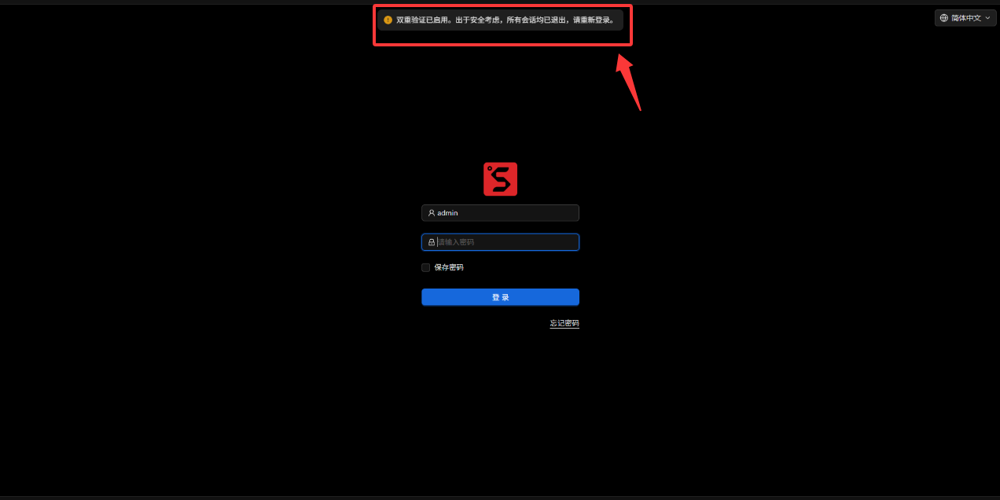

8. 重新登录时，在验证页面输入认证器应用中当前显示的 6 位验证码，然后点击 `验证` 即可进入网页。

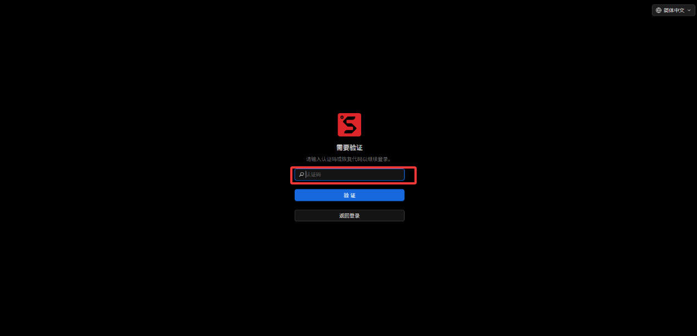

## 双重验证恢复代码配置

恢复代码是在无法使用认证器应用时，用于登录 NanoKVM Go 的一次性备用代码。恢复代码仅显示一次，请在生成或更新后立即将其保存到安全位置。

1. 进入设置页面，在左侧选择 `账号`，然后在 `恢复代码` 一栏点击 `启用`。

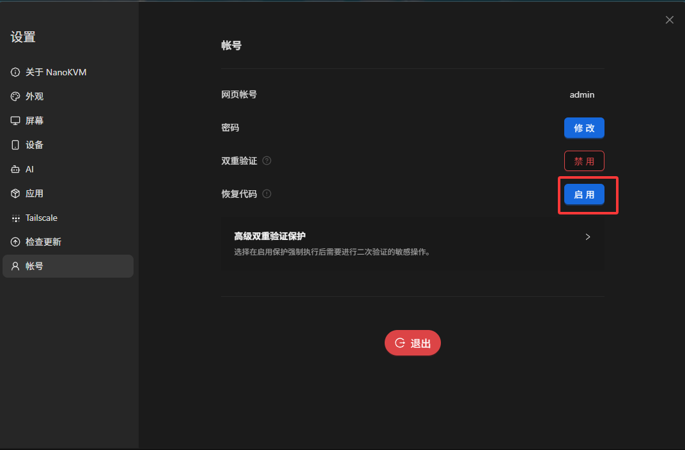

2. 输入当前登录密码和认证码，然后点击 `启用` 生成恢复代码。

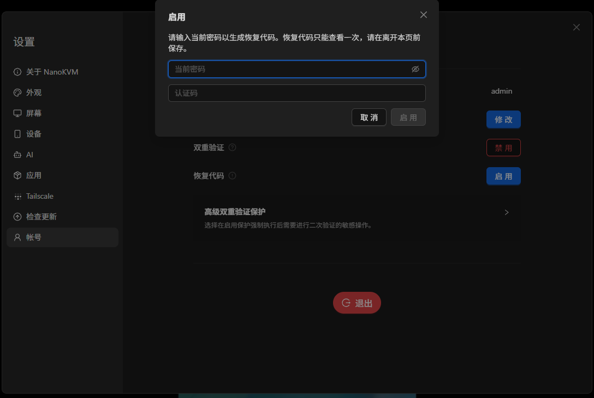

3. 页面会显示新生成的一组恢复代码。请在离开页面前点击 `复制` 或 `下载` 保存，确认保存后点击 `完成`。

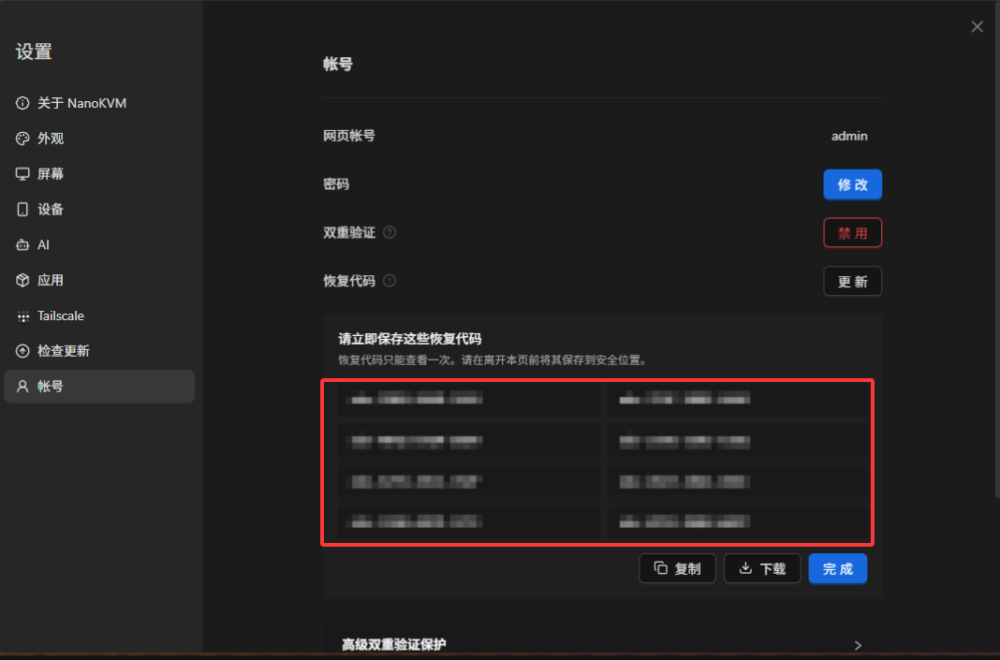

4. 如果恢复代码遗失或可能泄露，点击 `更新` 重新生成一组恢复代码。更新完成后，请立即保存新的恢复代码。

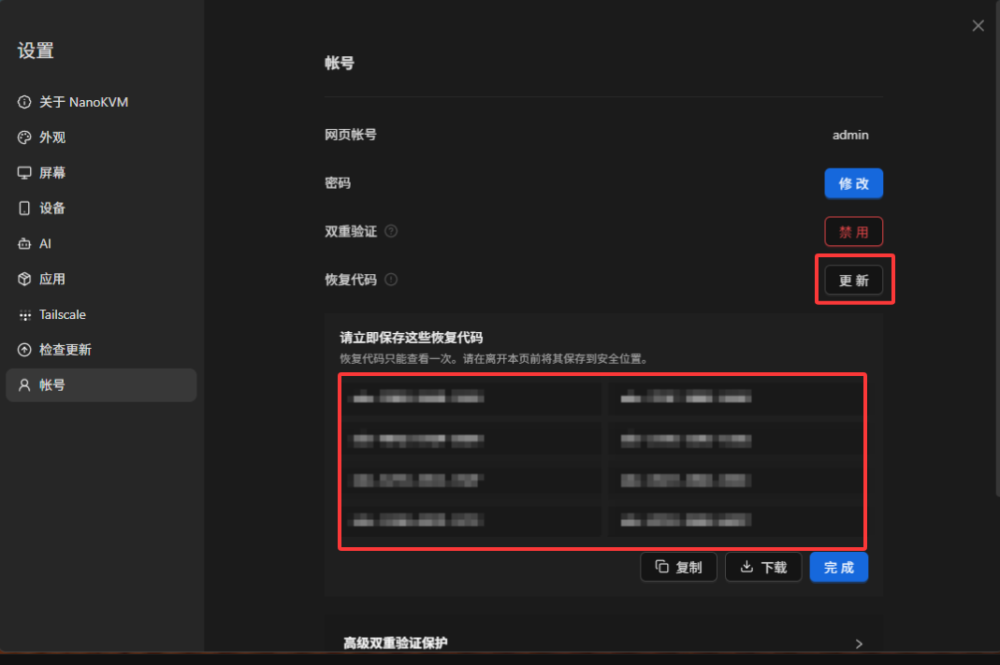

## 高级双重验证保护

高级双重验证保护可为指定的敏感操作增加额外的身份验证。启用某项保护后，执行对应操作时，需要输入认证器应用生成的 6 位验证码进行确认。

1. 进入设置页面，在左侧选择 `账号`，然后展开 `高级双重验证保护`。

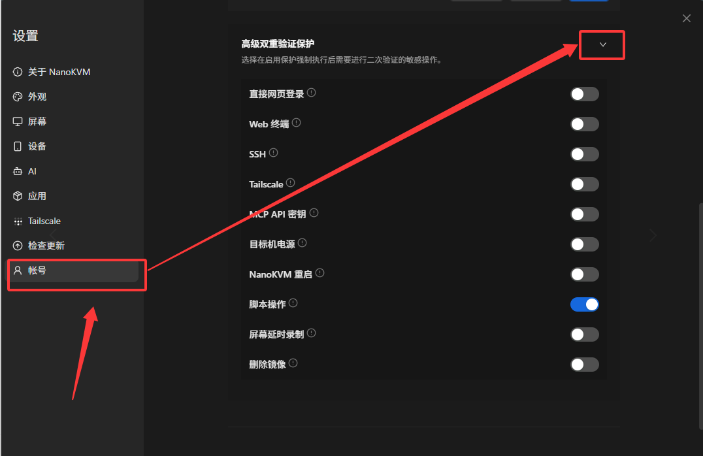

2. 根据实际需要开启对应的保护项目。可保护的操作包括直接网页登录、Web 终端、SSH、Tailscale、MCP API 密钥、目标机电源控制、NanoKVM 重启、脚本操作、屏幕延时录制和删除镜像。

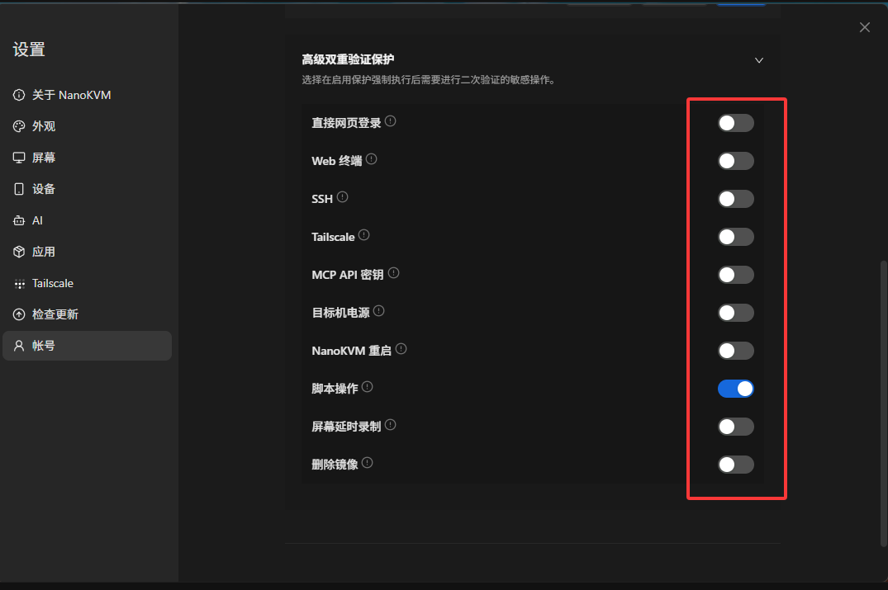

3. 开关显示为蓝色表示保护已启用，显示为灰色表示未启用。设置完成后，执行已开启保护的操作时，需要通过双重验证才能继续。

## 禁用双重验证

1. 进入设置页面，在左侧选择 `账号`，然后在 `双重验证` 一栏点击 `禁用`。

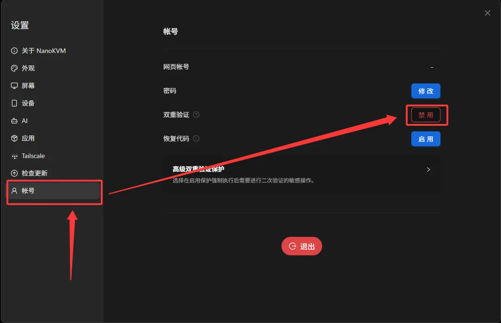

2. 输入当前登录密码，并输入认证器应用生成的验证码或恢复代码，然后点击 `禁用`。

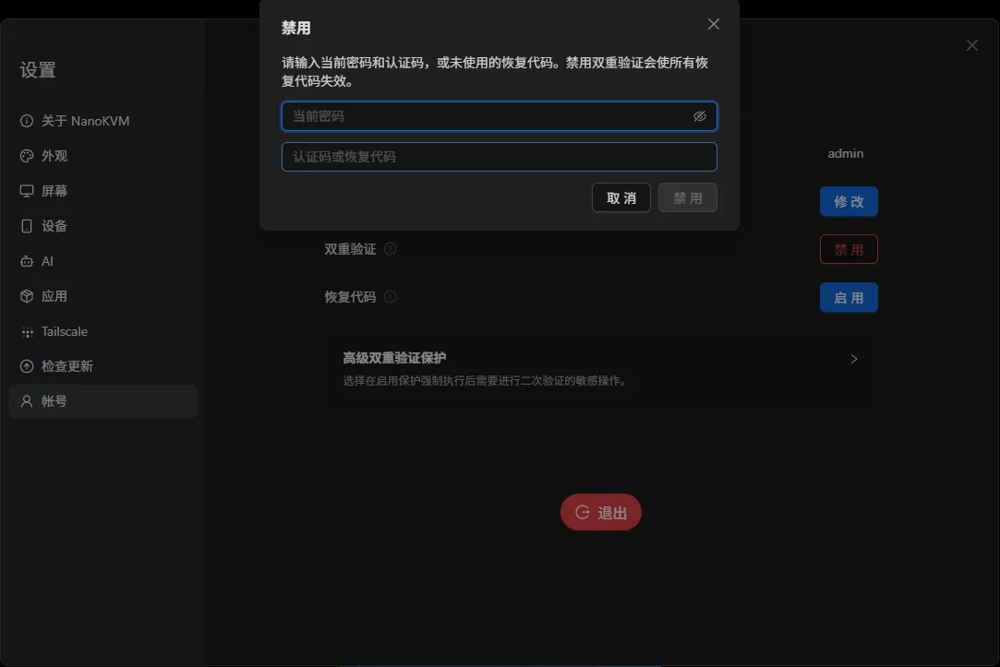
