## 界面

NanoKVM Go 屏幕用于显示设备状态和进入常用设置。常用界面包括主界面和设置界面。

### 主界面

主界面会显示网络状态、设备 IP 地址、当前分辨率、帧率和设备状态。完成网络配置后，可在此处查看 NanoKVM Go 当前获得的 IP 地址。

### 设置界面

设置界面包含多个功能入口，可通过左右切换查看不同页面。

设置页示例如下，左右切换可查看不同设置入口：

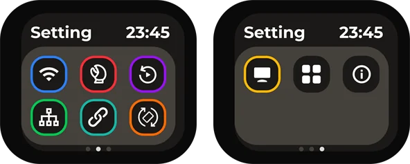

| 设置入口 | 设置入口 | 设置入口 |
| --- | --- | --- |
|  **Wi-Fi**：配置无线网络连接。 |  **MCP**：进入 MCP 相关设置。 |  **Replay**：进入回放相关功能。 |
|  **NCM**：配置 USB 网络共享。 |  **SSH**：配置 SSH 远程访问。 |  **Rotation**：调整画面旋转方向。 |
|  **Panel**：调整屏幕面板设置。 |  **Apps**：查看应用相关功能。 |  **About**：查看设备和版本信息。 |

## 网络配置

进行网络配置时，通常从 `Wi-Fi` 图标进入。

NanoKVM Go 首次使用或更换 Wi-Fi 环境时，需要先完成网络配置。配置完成后，设备会在主页面显示 IP 地址，控制端可通过该 IP 地址访问 Web 控制页面。

### 使用前准备

开始配置前，请确认：

+ NanoKVM Go 已正常开机；
+ 需要连接的 Wi-Fi 可以正常访问；
+ Wi-Fi 名称和密码正确；
+ 手机或电脑可用于扫码、连接临时热点或打开配置页面。

### 进入 Wi-Fi 设置

在 NanoKVM Go 主页面进入 Wi-Fi 设置页面，确认 Wi-Fi 开关处于 `ON` 状态。

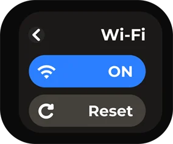

进入配置方式选择页面后，可以选择 `QRCODE` 或 `PASSWD` 两种方式完成配网。

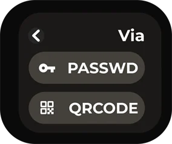

### 使用 QRCODE 配置

`QRCODE` 方式适合使用手机完成配置。该方式通过扫码连接 NanoKVM Go 的临时热点，再打开 Wi-Fi 配置页面。

1. 在配置方式页面选择 `QRCODE`。
2. NanoKVM Go 屏幕会显示 `Connect to AP` 二维码。
3. 使用手机扫描该二维码，并按手机提示连接到 NanoKVM Go 的临时热点。

4. 连接临时热点后，NanoKVM Go 屏幕会显示 `Configure WiFi` 二维码。

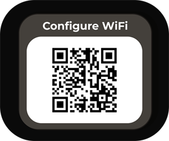

5. 使用手机扫描该二维码，打开 Wi-Fi 配置页面。

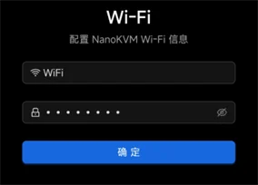

6. 在页面中填写需要连接的 Wi-Fi 名称和密码，并提交配置。

提交后请等待 NanoKVM Go 完成连接。连接过程中不要断开设备电源。

### 使用 PASSWD 配置

`PASSWD` 方式适合直接在 NanoKVM Go 屏幕上选择 Wi-Fi 并输入密码。

1. 在配置方式页面选择 `PASSWD`。
2. 在 Wi-Fi 列表中选择需要连接的 Wi-Fi 名称。

3. 在密码输入页面输入 Wi-Fi 密码。
4. 输入完成后选择 `OK`，提交配置。

提交后请等待 NanoKVM Go 完成连接。若密码输入错误，可返回 Wi-Fi 配置页面重新配置。

### 确认连接成功

配置完成后，NanoKVM Go 会返回主页面。若主页面显示设备的 IP 地址，即表示网络连接成功。

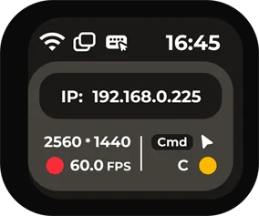

控制端与 NanoKVM Go 连接到同一网络后，可在浏览器地址栏输入该 IP 地址，进入 NanoKVM Go 的 Web 控制页面。

## 管理页面功能

登录 NanoKVM Go Web 控制页面后，可以在浏览器中查看被控设备画面，并通过顶部悬浮栏进入常用管理功能。

悬浮栏从左到右依次为：图像设置、竖屏模式、音量设置、麦克风、屏幕键盘、鼠标样式、界面预览、镜像挂载、自定义脚本、KVM 网页终端、设置、全屏、隐藏悬浮栏。

### 图像设置

点击悬浮栏左侧的图像设置图标，可调整远程画面的编码、显示参数和清晰度。新手用户建议优先保持默认设置；当画面卡顿、清晰度不足或分辨率不匹配时，再按需调整以下选项。

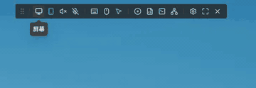

+ 视频模式用于选择视频编码和传输方式。一般情况下建议使用 `H.264 WebRTC`，兼容性较好；在网络稳定的局域网环境中，也可以按需尝试 Direct 模式。

+ EDID 用于选择 NanoKVM Go 向被控主机提供的显示器参数。主机读取 EDID 后，会根据该参数输出对应的分辨率和刷新率，例如 `3840 x 2160 30Hz`、`2560 x 1440 60Hz` 或 `1920 x 1080 60Hz`。修改 EDID 后，主机画面可能会短暂黑屏或重新识别显示器，属于正常现象。

+ 图像质量用于调整画面压缩质量。`自动` 适合大多数场景；网络较好且需要更清晰画面时，可选择 `无损` 或 `高`；网络带宽不足、画面延迟较高时，可选择 `中` 或 `低` 以降低带宽占用。

+ 缩放用于调整浏览器中的画面显示比例，例如 `50%`、`75%`、`100%`、`150%`、`200%`。该选项只改变网页中的显示大小，不会改变被控主机的实际输出分辨率。

+ 高级设置提供更完整的屏幕参数，可集中调整视频模式、码率控制模式、码率、GOP、FPS、缩放和 EDID。码率越高，画面通常越清晰，但占用带宽也越大；FPS 用于限制画面最大帧率，帧率越高画面越流畅，对网络和性能要求也更高。若不确定具体含义，建议保持默认值。

### 竖屏模式

竖屏模式用于适配手机、平板等竖屏比例的被控界面，提供 `自动`、`开启` 和 `关闭` 三种模式。

+ `自动`：由系统根据当前画面比例自动选择合适的鼠标映射方式。

+ `开启`：控制端鼠标移动时，被控光标会跟随鼠标移动；当移动到被控界面边缘时，光标会停在边缘位置。

+ `关闭`：鼠标移动会按当前远程画面的显示区域进行比例映射，适合普通横屏桌面或不需要边缘限制的操作场景。

### 音量设置

音量设置用于调整远程音频输出。开启音频后，浏览器会接收 NanoKVM Go 采集到的声音，并通过当前控制端播放。

+ 若需要听取被控设备声音，请确认浏览器页面未被静音，控制端系统音量处于正常状态。

+ 当网络延迟较高或带宽不足时，音频可能出现短暂停顿，可先降低图像质量或帧率，再观察音频是否恢复稳定。

### 麦克风

麦克风用于控制远程麦克风输入。开启后，控制端的麦克风音频可传输到被控设备，适用于远程会议、语音测试等场景。

+ 首次使用时，浏览器可能会请求麦克风权限，请根据实际需要允许访问。

+ 若不需要向被控设备传输声音，建议保持麦克风关闭，避免误输入。

### 屏幕键盘

屏幕键盘用于在网页中输入按键，适合控制端没有实体键盘、需要输入组合键，或被控设备暂时无法识别本地键盘的场景。

+ 打开屏幕键盘后，可直接点击按键向被控设备发送输入。

+ 输入密码、快捷键或系统安装界面中的按键时，建议先确认远程画面已经获得焦点。

### 鼠标设置

点击悬浮栏中的鼠标设置图标，可调整远程控制时的指针显示、鼠标输入方式和 HID 相关功能。新手用户建议优先保持默认设置；当鼠标无法控制、指针位置不准确或滚轮方向不符合习惯时，再按需修改以下选项。

+ 光标样式用于设置网页画面中的鼠标指针显示方式。可选择默认光标、抓取指针、单元指针、文本指针或隐藏指针。该选项只影响浏览器中的指针显示，不会改变被控主机系统的鼠标设置。

+ 鼠标模式用于选择鼠标坐标的传输方式。普通桌面系统建议使用 `绝对模式`；连接 Android 设备时可选择 `绝对模式（Android）`；在 BIOS、部分系统界面或鼠标位置不准确时，可切换为 `相对模式` 后再操作。

+ 输入适配器用于选择浏览器接收鼠标输入的方式。一般情况下建议使用 `自动（指针锁定）`；如果需要固定捕获鼠标移动，可选择 `指针锁定`；在触屏设备或移动端浏览器中操作时，可选择 `触控板`。

+ 滚轮方向用于切换滚轮滚动方向，可根据个人习惯选择向上或向下。滚轮速度用于调整滚动灵敏度，网页滚动过快时可调慢，滚动距离不足时可调快。

+ `HID-Only 模式` 会让 USB 仅模拟键盘和鼠标设备。若部分主机或 BIOS 对复合 USB 设备兼容性较差，可尝试开启该模式。

+ `重置 HID` 用于重新初始化键盘鼠标模拟设备。当键盘或鼠标无法控制被控主机时，可先检查 USB 连接，再尝试使用该功能恢复。

+ `修复 iPhone 拖拽` 用于处理 iPhone 浏览器中可能出现的拖拽异常。`触控板指南` 可查看触控板模式下的操作说明。

### 界面预览

界面预览用于快速查看当前远程画面的显示状态。需要确认画面是否正常输出、是否处于全屏或是否有画面变化时，可通过该入口进行查看。

### 镜像挂载

镜像挂载用于将镜像文件挂载给被控设备，常用于系统安装、系统维护或启动盘测试等场景。使用前请确认镜像文件来源可靠，并根据被控设备的启动顺序选择对应的启动项。详细使用方法请参考 [NanoKVM Cube 用户指南的镜像挂载章节](../NanoKVM/user_guide.html#ISO%E9%95%9C%E5%83%8F%E6%8C%82%E8%BD%BD%E4%BB%A5%E5%8F%8A%E8%BF%9C%E7%A8%8B%E8%A3%85%E6%9C%BA)。

### 自定义脚本

自定义脚本用于执行预设脚本或用户自行添加的脚本。该功能适合重复性的维护操作，例如重启服务、执行诊断命令或进行简单的自动化处理。

+ 执行脚本前，请确认脚本内容和作用，避免影响正在运行的业务。

### KVM 网页终端

KVM 网页终端用于在浏览器中打开 NanoKVM Go 的命令行终端。通过该终端可进行系统状态查看、网络检查和维护操作。

+ 若只进行常规远程控制，一般不需要使用网页终端。

+ 进行命令行操作前，请确认命令含义，避免误修改系统配置。

### 设置

设置用于进入 NanoKVM Go 的管理设置页面，可查看和调整设备相关参数。

### 全屏

全屏用于将远程画面切换为全屏显示，适合长时间操作桌面系统或需要更大显示区域的场景。退出全屏时，可使用浏览器或系统提供的退出全屏方式。

## 账号与密码

NanoKVM Go 默认网页登录账号为 `admin`，默认密码为 `admin`。首次登录后，建议及时修改默认密码。

### 修改密码

首次登录后建议及时修改默认密码。点击悬浮栏中的设置图标，进入 NanoKVM Go 设置页面。

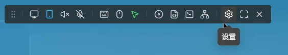

在设置页面左侧选择 `账号`，然后在 `密码` 一栏点击 `修改`。

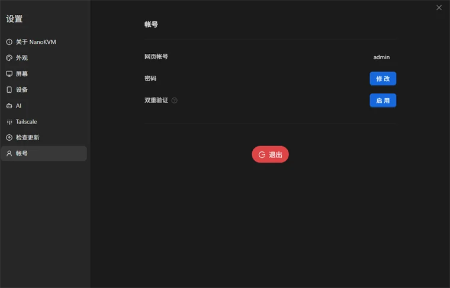

在修改密码页面填写用户名、新密码，并再次输入新密码确认。确认无误后点击 `确定` 保存。

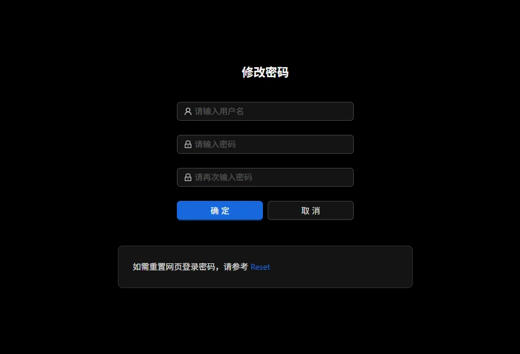

修改密码会同时更新网页登录密码和系统 `root` 用户密码（SSH 登录密码）。修改完成后，请使用新密码重新登录。

### 忘记密码重置

如果忘记网页登录密码，只能通过恢复出厂设置来重设密码。恢复出厂设置会清除当前设备配置。

1. 在设备屏幕的设置界面滑动到最后一页，找到 `About` 选项。

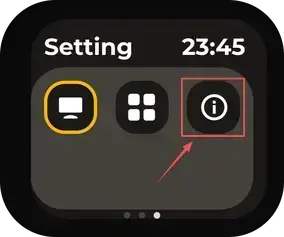

2. 长按 `Reset` 恢复出厂设置。

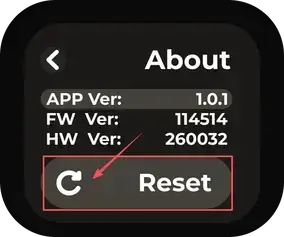

恢复完成后，使用默认账号 `admin` 和默认密码 `admin` 登录，并尽快重新设置新的安全密码。
