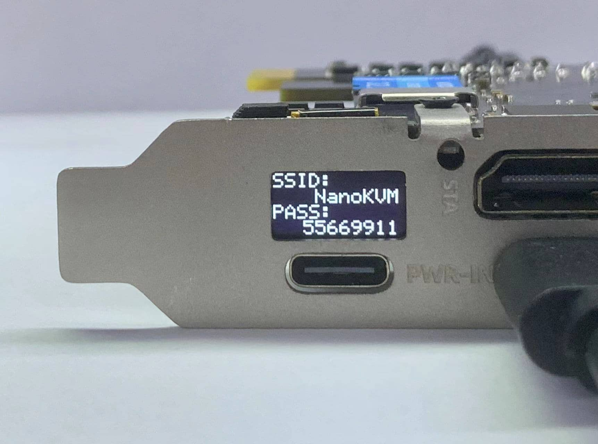

## 开箱

NanoKVM-PCIe 包装内包含主机, 半高 PCIe 挡板, 两条 USBA-C线缆, 一条 HDMI 线缆, 一根天线, 16P 公对母排线, 4P 母对母排线和一把小螺丝刀
主机上包含杜邦跳线(2+4P), SMA 天线座

注: 上图是 NanoKVM-PCIe 带WiFi 带PoE 版本,不带 WiFi 版本会少一根天线, 挡板上少 SMA 天线座

## 接口介绍

老版本的内测硬件两个USB-C口左右相反，参照一下图示，具体以到手后挡板标识为准

## 供电

+ NanoKVM-PCIe 有多种供电选择: USB HID直接供电, USB PWR IN辅助供电, PCIe 插槽取电, PoE 供电(选配) 请任选一种即可, 同时存在多路供电不会干扰 NanoKVM-PCIe 的运行,请至少使用一路供电

注: 如果需要USB HID直接供电,则需要在BIOS中设置主板关机 USB 常供电，否则会影响远程开机功能

注: NanoKVM-PCIe USB-PWR-IN CC 接口下拉5.1K电阻，可使用正规 PD 充电头供电。部分劣质PD电源存在烧坏 NanoKVM-PCIe 的风险。

## 安装

1. NanoKVM-PCIe 在接线上与 Cube 类似, 请在主机关机且断电的情况下安装 NanoKVM-PCIe, 测试功能全部正常后再装入机箱

2. 使用一条 USB C to A 数据线连接远程主机和 NanoKVM 的 USB-HID 接口（位于 HDMI 接口下方）

也可以参照下图方式, 直接连接机箱内部的九针USB2.0

连接时务必参照上方示意图和下面的 NanoKVM-PCIe 内部接口示意图, 上电前请反复检查, 接错可能会有烧坏 NanoKVM 的风险！部分批次的连接线上的 “HDD LED” 丝印有误，请按照实际情况调整。

3. 使用附赠的 HDMI 线缆连接远程主机和 NanoKVM 的 HDMI 接口

4. 使用网线连接 路由器/交换机 与 NanoKVM, 如果您在24/12/07后下单的 WiFi 版 NanoKVM-PCIe, 此步骤可以省略, 参照WiFi配网环节使用 WiFi 连入.

5. ATX电源控制: 主机电源远程控制的原理是模拟开关按下操作,并读取LED状态同步到网页, 为此, 需要将主板上原本连接机箱开机按键的9针接口断开,接入 NanoKVM-PCIe 对应接口, 同时为了机箱按钮仍可操控电源, 需要将机箱上的电源排线也连接到 NanoKCM-PCIe上

接线时,请务必参照上方示意图和 NanoKVM-PCIe 内部接口示意图

注：NanoKVM-PCIe 不会监控HDD状态

注：早期部分用户购买的NanoKVM-PCIe配套全高PCIe挡板在安装上可能存在过长的问题，请使用较长螺丝固定（注意不要太用力）或购买`外径7mm、内径4.2mm、高度3mm`规格的垫圈。若安装仍然存在困难，请联系淘宝/速卖通客服，或者kvm@sipeed.com邮箱获取支持

## WiFi 配网

+ 此步骤仅适用于购买了带 WiFi 版本的 NanoKVM-PCIe, 其他版本会在 WiFi 图标位置显示 "--"

+ 若您不便连接网线,NanoKVM-PCIe 提供了 AP 配网功能, 用手机连接 NanoKVM 创建的 AP -> 进入网页配置
  具体操作流程如下:
  1. 上电开机,等待出现主界面UI,当前 WiFi 状态没有亮起, 无 WiFi IP
    
  2. 用包装内附赠的小螺丝刀长按 PCIe 面板上的 BOOT 小孔按键 2s以上
    
  3. 等待出现 WiFi AP 二维码时, 扫码连接 AP
    
    
  4. 检测到手机连接成功后, OLED上将出现 Web 二维码, 扫码自动跳转到配置页面
    
    
  5. 输入 NanoKVM-PCIe 要连接的WiFi 帐号(SSID) 密码(Password), 点击OK, 即可完成配网
    
    
  注: 
  + 若无法通过二维码连接AP, 可短按 BOOT 按键, OLED上将出现 AP SSID 和 PASS, 可使用手机系统设置连接
    
  + 若无法通过二维码打开网页, 可短按 BOOT 案件, OLED上将出现 WiFI 配置地址, 手机浏览器输入地址后配置
    
  + 若无法打开配置网页,请关闭移动数据后再试
  + 如果 WiFi 帐号或密码设置错误, OLED上会回到步骤3, 请重新连接AP陪网
  + 长按 BOOT 会退出 WiFi 配置界面
  + 为保证安全,每次配置 WiFi 时, 都会生成一个随机AP密码, 建议按照上述流程完成配置

## 更新

### 更新应用

新的应用往往带来更多功能或修复某些重要漏洞，建议您将 NanoKVM 应用更新到最新版本，具体操作方式请参考 [更新应用](https://wiki.sipeed.com/hardware/zh/kvm/NanoKVM/system/updating.html)。

## 基础操作

### 如何获取IP地址

Full版NanoKVM自带OLED显示屏，联网之后会在显示屏显示IP地址；

WiFi 版本 NanoKVM-PCIe ETH 和 WiFi 获取的 IP 将会交替出现, 如图: IP前有'E'的是ETH IP; 有'W'的是 WiFi 获取的IP

### 查看远程桌面

浏览器直接输入获取的IP，进入登录页面，默认账号密码为admin、admin，登录后建议修改密码, 并更新最新的应用

注: 建议使用Chrome浏览器，其他浏览器可能出现无法显示画面或无法操作键鼠等兼容性问题

### ATX电源控制

如果连接了电源控制接口,可以在网页远程控制电脑启动

+ 网页端提供电源灯状态指示, 电源和重启按钮功能, 不能监控到HDD硬盘灯状态

