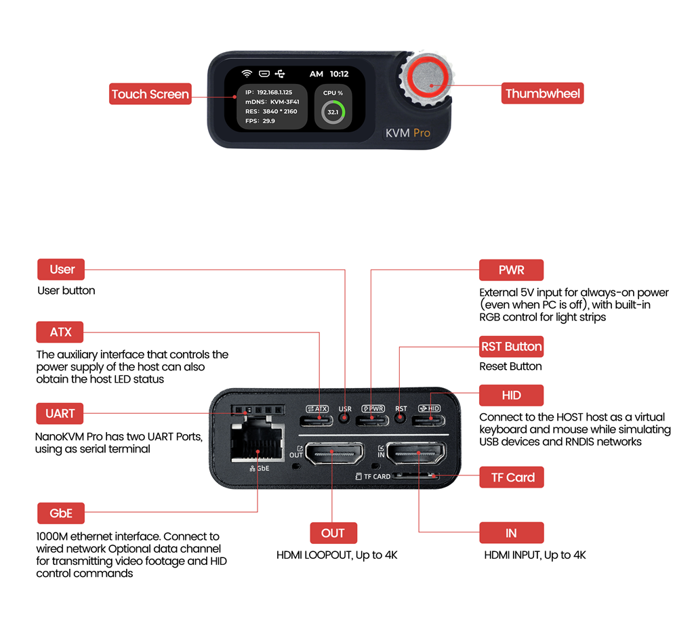
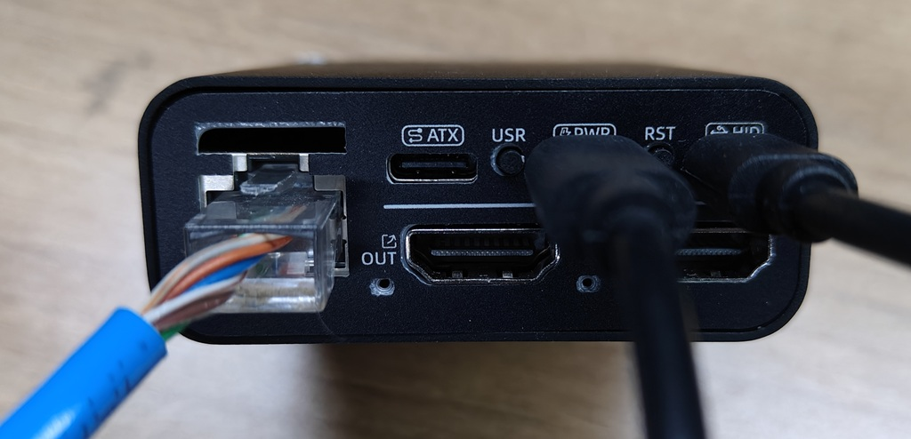

## 接口定义

   

## 接线

1. 连接电源

> NanoKVM-Pro 对电源要求略高，部分主板的USB接口无法提供充足的电流。
> 为保证 NanoKVM-Pro 正常工作，强烈建议外接5V1A及其以上的电源（实际运行功耗约3W）。
> 如果需要配合灯带使用，强烈建议外接 5V3A 及其以上的电源。

   

2. 连接USB-HID接口：

   

3. 使用网线连接路由器/交换机和NanoKVM-Pro，如果没有有线网络，可以跳过此步，开机后配置Wi-Fi使用（需要购买带有WiFi的版本，配网操作详见后续配网章节）

   

4. 连接HDMI-IN，如果主板仅有一个视频接口且有外接屏幕的需求，请将HDMI-OUT连接至你的显示屏

   

   > 注意 NanoKVM-Pro 采集最大支持4K30FPS，内置的HDMI一分二会主动读取外接屏幕的分辨率和帧率，并向主机提供屏幕和采集端公共的模式列表，
   > 如果你连接了一个4K60FPS的显示屏，电脑会识别为一个最高支持4K30的屏幕（被采集端限制，可以关闭采集，让4K60直出显示器）
   > 如果你连接了一个1080P的显示屏，电脑会识别为一个最高1080P的屏幕（被环出显示器限制）

5. （非必须）连接ATX电源控制接口

   

   使用一条 USB C to A 数据线连接 KVM-B 板和 NanoKVM-Desk 的 ATX 接口。

   KVM-B 板带有通用的9Pin排母接口，可以直接插在主板上，机箱的开机按键、Power LED 等接口可接到 KVM-B 的排针上，参考示意图（此处机箱仅连接开机线）：

   

## UI 操作指南

### 外观

Desk 版本正面配有两个可供交互的部件

* 1.47 寸 IPS 电容式触控 TFT 显示屏
* 带按钮的旋转编码器

### 旋转编码器操作

旋转编码器支持以下动作：

* **向左旋转**：焦点移动到左侧的可聚焦/可交互组件
* **向右旋转**：焦点移动到右侧的可聚焦/可交互组件
* **短按**：触发当前焦点组件的响应动作
* **长按**：若处于一级页面，则进入切换模式，显示切换页面

### 触摸操作

触摸支持以下动作：

* **向左滑动**：整体视图向左移动
* **向右滑动**：整体视图向右移动
* **短按**：触发被点击组件的响应动作
* **长按**：若处于一级页面，则进入切换模式，显示切换页面

## 内网访问

### 连接网络

   1. **有线连接**：设备上电后，KVM 将自动通过路由器的 DHCP 获取 IP 地址，可直接使用，无需额外配置。

   2. **Wi-Fi 连接**：

      1. 打开 `Settings` → `Wi-Fi`
      2. 短按 `Wi-Fi` 开关
      3. 如果未配置过 Wi-Fi，KVM 会释放一个 Wi-Fi 热点（AP），屏幕会显示该 AP 的信息
      4. 使用手机或电脑选择该 AP 并输入密码，或通过扫码快速连接
      5. 首次连接成功后，UI 会自动跳转并显示网页链接
      6. 使用浏览器打开该链接或扫码网页二维码进入配网界面

      > **注意**：
      > 在 AP 信息页面和网页链接页面之间可通过左右切换。
      > 成功连接 Wi-Fi 后且不关闭 Wi-Fi 功能，每次开机将自动连接。

   3. **USB-NCM 连接**：如有需要，可通过 USB-NCM 方式建立网络连接。

### 访问网络

   1. 连接成功后，首页将显示设备 IP 地址，显示优先级为以太网（ETH）优先，其次是 Wi-Fi。若需查看某网卡的详细 IP，可前往 `Settings` 对应页面查看。

   2. 在同一局域网内，使用主机浏览器（推荐 Chrome）输入设备 IP 地址即可访问页面。

      

      > **提示**：首次访问时出现安全警告属正常现象。NanoKVM-Pro 默认启用了 HTTPS 并使用自签名 SSL 证书以增强安全性。

   3. 使用初始默认帐号 `admin`，密码 `admin` 登陆系统。**强烈建议您首次登陆后立即修改帐号和密码**。

   4. 登陆成功后，检查图像显示、键鼠控制及开关机按钮功能是否正常。

      

## 远程连接

   1. **Tailscale**：NanoKVM-Pro 默认预装了 Tailscale 应用。您可在网页设置中登陆 Tailscale 帐号。所有已登陆 Tailscale 的设备将自动加入同一虚拟内网，并获得 `100.xxx.xxx.xxx` 的 IP。通过该 IP，您可以远程访问并控制您的主机。
   2. **其他异地组网工具**：NanoKVM-Pro 基于 Ubuntu 系统，支持使用 `apt` 安装第三方应用（如 ZeroTier）。请按照相关工具的官方文档完成安装与配置。
