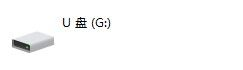
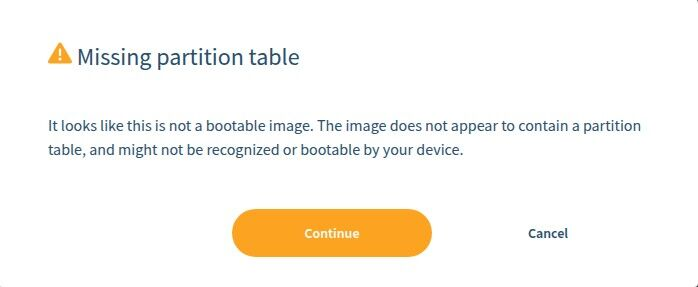

# 常见问题

## 更新解决问题

NanoKVM Pro 会不定期更新应用，一些问题可能在新的应用中已经解决，所以请首先尝试更新应用

## 系统启动

### 绿色LED闪烁

绿色LED是 NanoKVM Pro 的电源指示，如果连接了供电能力较弱的电源，绿色LED会因电压不稳定而无法启动，请拔掉所有供电并更换电源

## 视频相关问题

### NanoKVM 小屏幕上HDMI图表亮起但无法在网页中看到画面

NanoKVM-Pro具有采集和环出视频的功能，仅采集时默认向主机汇报最高4K30FPS的分辨率，连接环出显示器时会汇报一个公共的分辨率列表。
默认的分辨率帧率列表请参考[这里](https://wiki.sipeed.com/hardware/zh/kvm/NanoKVM_Pro/extended.html#%E5%A6%82%E4%BD%95%E4%BF%AE%E6%94%B9EDID)

连接视频转接器或拓展坞情况下可能会改变其内容，如汇报4K60FPS的采集能力导致无法采集，需要在主机系统设置中修改显示参数
+ Windows下一般在`设置`->`显示设置`->`高级显示设置`->选择`NanoKVM-Pro`显示器->`显示器属性`->`列出所有模式`->选择需要调整的模式->点击应用或确认


### 画面较糊，不符合采集到的分辨率

+ 上图中3号框：若出现桌面分辨率小于有源信号分辨率，可能会出现采集画面清晰度不符合预期的情况，也可以通过上述流程输出清晰的画面

## 镜像烧录方法

### USB 烧录

NanoKVM Pro 支持通过 USB 烧录镜像的方式来恢复或更新系统。

#### 准备工作

- 准备一根 USB 数据线
- 下载最新的 NanoKVM Pro 镜像文件
- 准备烧录工具（如 balenaEtcher、Rufus 或 dd 命令）

#### 烧录步骤

1. **下载镜像与烧录工具**
- 访问 [NanoKVM Pro 发布页面](https://github.com/sipeed/NanoKVM-Pro/releases/latest) 下载最新镜像文件
- 下载并安装烧录工具 [balenaEtcher](https://etcher.balena.io/)

2. **进入烧录模式**
- 使用 USB 数据线连接 NanoKVM Pro 的 HID 接口到电脑
- 先按住 NanoKVM 的 User 按键，然后接通电源（或者在通电状态下按下 Reset 按键），直到橙色 LED 灯熄灭
- 这时设备会进入烧录模式，橙色灯再次开始闪烁，查看电脑是否识别到新的磁盘设备

<div style="display: flex; justify-content: center; gap: 20px; flex-wrap: wrap; align-items: flex-end;">
    <div style="text-align: center; flex: 1; max-width: 400px; min-width: 300px;">
        
        <p style="margin-top: 8px; margin-bottom: 0; font-style: italic; color: #666; font-size: 16px;">Windows 识别设备</p>
    </div>
    <div style="text-align: center; flex: 1; max-width: 400px; min-width: 300px;">
        
        <p style="margin-top: 8px; margin-bottom: 0; font-style: italic; color: #666; font-size: 16px;">Linux 识别设备</p>
    </div>
</div>

3. **使用 balenaEtcher 烧录**（推荐）
- 启动 balenaEtcher
- 点击 "Flash from file" 选择下载的镜像文件
- 点击 "Select target" 选择识别到的 NanoKVM Pro 设备
- 点击 "Flash!" 开始烧录
- 等待烧录完成并验证

<div align="center">
    
</div>

- 如果提示找不到分区表是正常现象，点击继续即可

<div align="center">
    
</div>

4. **使用命令行烧录**
```bash
# 查找设备名
sudo fdisk -l

# 解压镜像文件（如果是 .xz 格式）
xz -dv 20250828_NanoKVMPro_1_0_10.img.xz

# 烧录镜像（请替换 /dev/sdX 为实际的设备名）
sudo dd if=20250828_NanoKVMPro_1_0_10.img of=/dev/sdX bs=4M status=progress

sudo sync
```

5. **重启设备**
- 烧录完成后，安全弹出设备
- 断开 USB 连接
- 重新接通电源，设备将自动启动新系统

#### 注意事项

- 确保选择正确的设备，避免误操作其他存储设备
- 烧录过程中不要断开电源或移除 USB 连接
- 首次启动可能需要较长时间进行初始化配置
- 如果橙色灯一直不亮，或者磁盘设备没有出现，请参考下面的方法使用 AXDL 烧录

### AXDL 烧录

AXDL 是爱芯官方推出的镜像烧录工具，可以烧录 AXP 格式的系统镜像，目前仅支持 Windows 平台。

#### 准备工作

- 准备一根 USB 数据线
- 访问 [NanoKVM Pro 发布页面](https://github.com/sipeed/NanoKVM-Pro/releases) 下载最新的 AXP 格式镜像文件
- 下载并安装 AXDL 工具和对应驱动 [下载地址](https://dl.sipeed.com/shareURL/MaixIV/M4N-Dock/10_PC_Software)

#### 烧录步骤

1. **连接设备**
   - 使用 USB 数据线连接 NanoKVM Pro 的 HID 接口到电脑

2. **配置烧录工具**
   - 打开 AXDL 工具
   - 选择下载的 AXP 格式镜像文件
   - 点击开始烧录按钮

   <div align="center">
       
   </div>

3. **进入烧录模式并开始烧录**
   - 先按住 NanoKVM 的 User 按键，然后接通电源（或者在通电状态下按下 Reset 按键）
   - 烧录将自动开始，等待进度条完成
   - 直到提示烧录成功，整个过程完成
