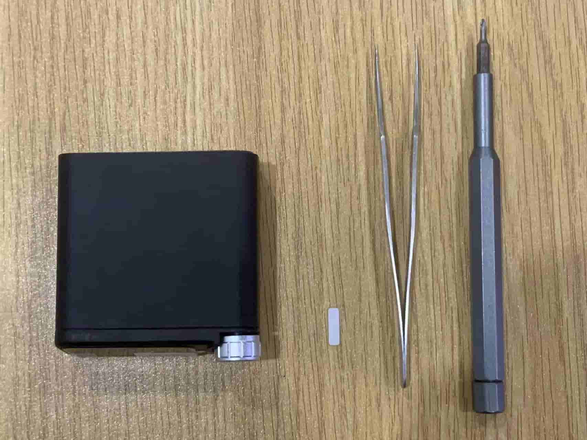
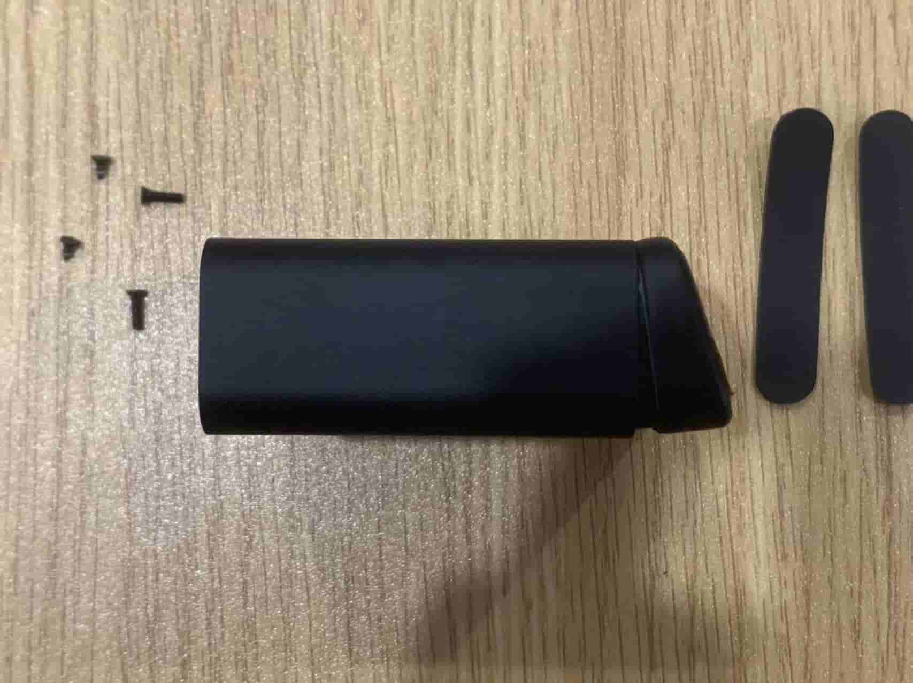
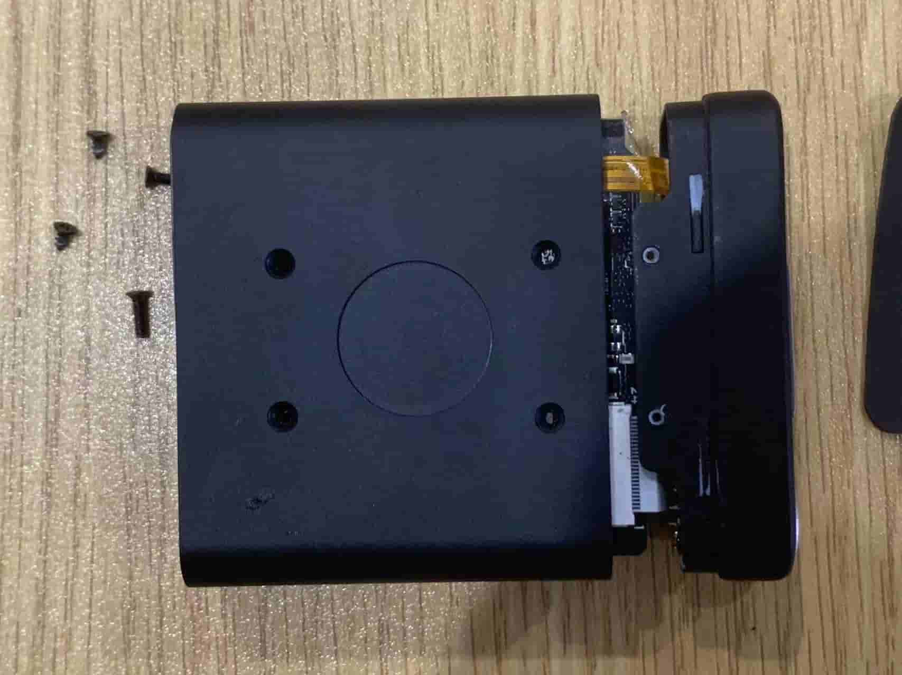
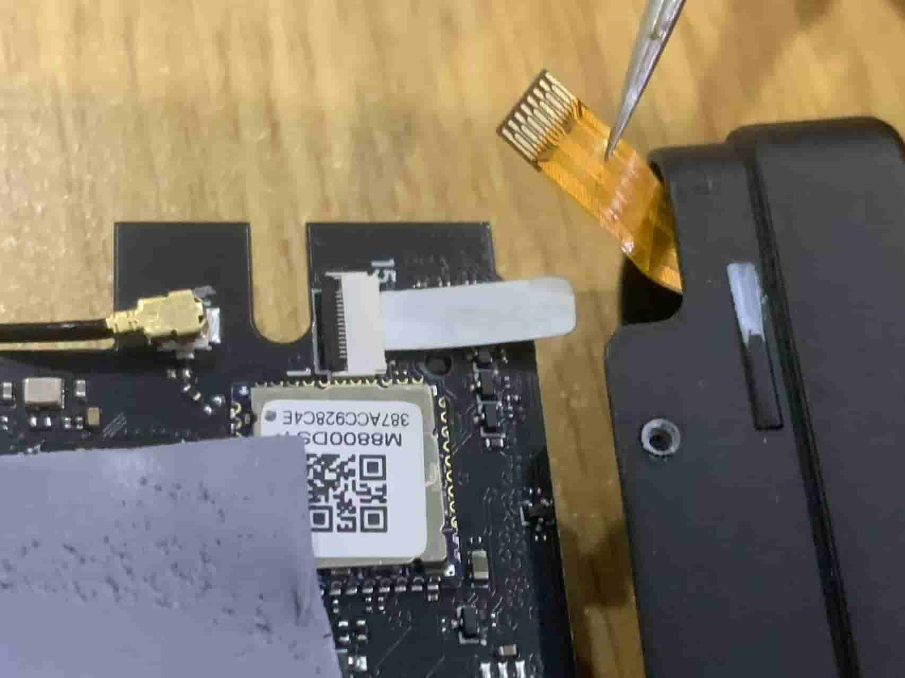

## 适用情况

1. 屏幕无法正常显示：开机无logo，但背面橙色LED正常闪烁
2. 屏幕触摸失灵：无论如何点击/长按/滑动都无反应

## 问题原因

NanoKVM Desk 因运输颠簸，可能因屏幕FPC排线脱落/接触不良导致显示异常

## 修复步骤

> ❗❗❗以下步骤涉及拆解，拆解有风险，请仔细阅读以下步骤后再小心操作❗❗❗

**材料准备**

1. 屏幕异常的 NanoKVM Desk
2. 螺丝刀
3. 窄垫片（可以用纸片替代）
4. 镊子

**详细步骤**

1. 撕开底部两条硅胶垫（略微施加倾斜的拉力缓慢撕开可避免留胶）；拧开四颗螺丝，注意靠近屏幕一侧的螺丝是两颗短自攻螺丝，靠近尾部接口处的是两颗长M2螺丝，保存好胶垫和螺丝。

2. 屏幕支架通过底部和顶部4个卡扣固定在阳极氧化铝制外壳上，先从底部掰开屏幕盖板，再掰开顶部

> ❗❗❗此步骤风险较高，可能会扯断底部的屏幕排线，请控制力道❗❗❗

3. 从接口后面板将 NanoKVM Desk 机芯推出

4. 用镊子去掉贴在屏幕FPC排线上的贴纸；挑开FPC座子上的黑色压紧座后取出屏幕排线

5. 在FPC座子中塞入窄纸条；在纸条上插入屏幕FPC排线，插到底后锁紧座子

> 注：屏幕排线使用上接方式连接座子，即触点朝上

6. 上电测试，启动时logo亮起
7. 组装外壳，注意屏幕支架套入铝壳后先卡紧顶面的卡扣，再卡紧底面

8. 拧上螺丝，注意靠近屏幕测使用两颗较短螺丝，接口侧使用两颗较长螺丝；最后粘贴脚垫