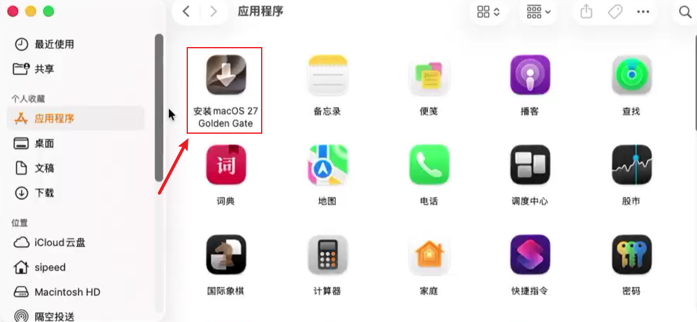
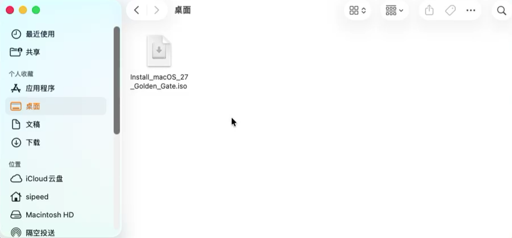
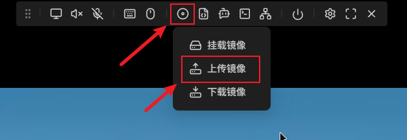
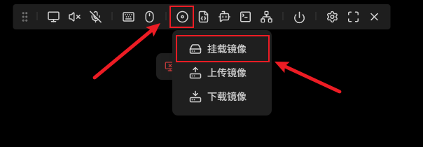
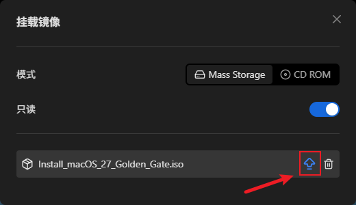
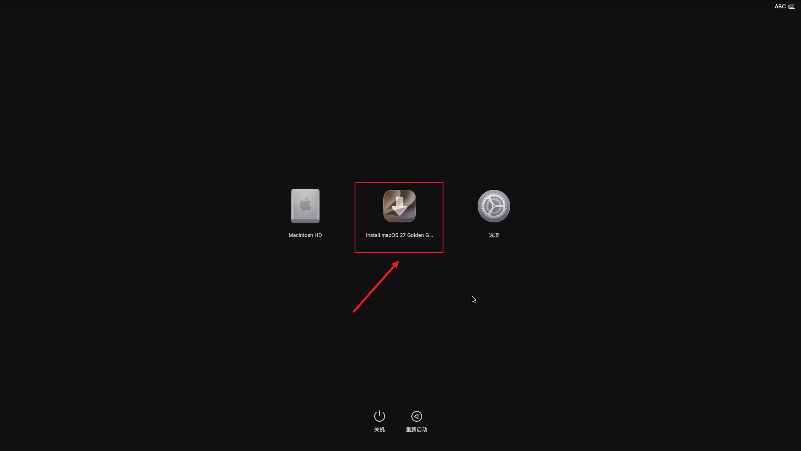

## 简介

NanoKVM Pro 的 USB-C 端口会模拟一个 U 盘设备，可以把存放在 NanoKVM Pro 内的 ISO 镜像挂载给被控主机。本文介绍如何用这套功能给被控 Mac 重装 macOS：先在一台正常的 Mac 上把 Apple 官方安装器打包成可引导的 ISO，上传到 NanoKVM Pro，再挂载给被控 Mac，从该镜像启动完成安装。全程通过 NanoKVM Pro 操作，被控 Mac 不需要额外接显示器和键盘。

适合以下场景：

- 被控 Mac 无法正常进入系统（系统损坏、卡在启动画面、忘记密码等），需要重装或全新安装 macOS；
- 被控 Mac 已经可以启动，只想把系统恢复到出厂状态。

> 重装（尤其是抹盘后安装）会清空目标磁盘上的数据，请先确认数据已备份或不再需要。

本文示例使用 macOS 27（Golden Gate），其他版本参考[更换 macOS 版本](#更换-macos-版本)。

## 准备工作

| 项目 | 说明 |
| --- | --- |
| 制作镜像用的 Mac | 一台可以正常使用的 Mac，需要管理员密码（制作 ISO 要用 `sudo`），并预留充足的磁盘空间 |
| 网络环境 | 制作镜像的 Mac 需要联网下载安装器；NanoKVM Pro 需要能通过网络访问网页控制端 |
| NanoKVM Pro | 已完成上手指南中的接线与联网，可以正常登录控制端，参考 [NanoKVM-Desk 上手指南](./desk_start.md) / [NanoKVM-ATX 上手指南](./atx_start.md) |
| 被控 Mac | 将要重装系统的机器。不需要额外接显示器和键盘，画面与操作都通过 NanoKVM Pro 完成 |
| 连接线材 | HDMI 线、USB-C 数据线（NanoKVM Pro 的 HID/虚拟 U 盘口） |

> 磁盘空间说明：本文示例生成的 macOS 镜像约 18.45GB。制作过程中，安装器本体、临时文件和最终生成的 ISO 会同时占用空间，建议制作机上预留 50GB 左右的剩余空间（以实际占用为准）。

## 下载 macOS 完整安装器

在用于制作镜像的 Mac 上打开「终端」（Terminal），执行：

```shell
softwareupdate --fetch-full-installer --full-installer-version 27.0
```

- `--full-installer-version` 后面跟的是要下载的系统版本号，本文示例为 `27.0`；
- 该命令会下载完整的安装器（体积较大），下载时间取决于网络情况，请耐心等待，中途不要关闭终端；
- 必须是**完整安装器**（full installer），不能用 App Store 里的增量更新包。

下载完成后，安装器会出现在 `/Applications` 目录下，名称为：

```
/Applications/Install macOS 27 Golden Gate.app
```

可以在「访达」→「应用程序」中确认该安装器存在，双击图标可以查看版本信息（查看完请退出，不要继续安装）。



## 制作可引导 ISO 镜像

Apple 官方只提供 `createinstallmedia`（制作可引导 U 盘），不直接提供 ISO。这里使用开源工具 [createinstalliso](https://github.com/BITespresso/createinstalliso)，它可以把下载好的安装器打包成可引导的 ISO 镜像。

1. 下载脚本到 `~/bin` 目录并赋予执行权限：

```shell
mkdir -p ~/bin && curl -fsSL https://raw.githubusercontent.com/BITespresso/createinstalliso/master/createinstalliso -o ~/bin/createinstalliso
chmod +x ~/bin/createinstalliso
```

2. 以管理员权限运行脚本，把 ISO 生成到桌面：

```shell
sudo ~/bin/createinstalliso -i ~/Desktop --applicationpath /Applications/Install\ macOS\ 27\ Golden\ Gate.app
```

参数说明：

| 参数 | 含义 |
| --- | --- |
| `-i` / `--isodirectory` | ISO 的输出目录，本文为桌面 `~/Desktop` |
| `--applicationpath` / `-a` | macOS 安装器 App 的路径，路径中带空格时需要用 `\` 转义 |

执行后会提示输入管理员密码（输入时终端不显示字符），随后终端会打印制作进度。制作过程会进行挂载磁盘映像、转码等操作，耗时较长，请勿中断终端。

3. 制作完成后，桌面上会出现生成的 ISO 文件：

```
~/Desktop/Install macOS 27 Golden Gate.iso
```

## 重命名 ISO 文件

把生成出来的 ISO 重命名，去掉文件名中的空格：

```
Install macOS 27 Golden Gate.iso
        ↓
Install_macOS_27_Golden_Gate.iso
```

文件名中带空格时，上传镜像可能会失败，所以这里先把空格换成下划线。

重命名后得到的 `Install_macOS_27_Golden_Gate.iso` 就是最终要上传的 macOS 镜像（本文示例生成的镜像大小约 18.45GB）。



## 上传镜像到 NanoKVM Pro

1. 在浏览器中登录 NanoKVM Pro 的网页控制端；
2. 点击控制栏上的光盘图标：


3. 在弹出的菜单中选择 `上传镜像`：



4. 选中上面制作好的 `Install_macOS_27_Golden_Gate.iso`，等待上传完成。

说明：

- 上传的镜像会保存在 NanoKVM Pro 的 `/data` 目录中，可用空间约 21G。本文示例的 macOS 镜像约 18.45GB，可以存下，但剩余空间不多，建议不要同时存放多个大镜像；
- 上传时间取决于局域网速度与 ISO 体积，请勿在上传过程中关闭页面或断开网络；
- NanoKVM Pro 内可以同时存放多个镜像，挂载时选择其中一个即可。

## 连接被控 Mac 并挂载镜像

1. 在**被控 Mac 关机**的状态下，把 NanoKVM Pro 接到被控 Mac 上：
   - HDMI-IN 接口连接到被控 Mac 的视频输出口（用于采集画面）；
   - HID 接口连接到被控 Mac 的 USB 口（提供虚拟键鼠与虚拟 U 盘）；
   - PWR 接口接到 5V1A 及以上的外接电源上（NanoKVM Pro 对电源要求略高，部分 Mac 的 USB 口在关机状态下不输出电源，建议**不要**直接插到 Mac 上取电）。
   具体接线方式参考上手指南中的接线章节：[Desk 版接线](./desk_start.html#接线) / [ATX 版接线](./atx_start.html#接线)。
2. 在网页控制端中，点击光盘图标，在弹出的菜单中选择 `挂载镜像`：



3. 在挂载镜像的窗口中选中 `Install_macOS_27_Golden_Gate.iso`，点击该行右侧的按钮即可挂载。



4. 挂载成功后，网页端一般会提示当前已挂载的镜像；此时被控 Mac 就相当于插上了一个包含 macOS 安装器的 U 盘。

## 让被控 Mac 从镜像启动

在**关机状态**下按住电源键不放，直到屏幕出现「正在载入启动选项」的界面再松开。

在启动选项界面中选中 NanoKVM Pro 挂载出来的安装介质 `Install macOS 27 Golden Gate`，即可进入安装环境。



该界面同时会列出内置磁盘 `Macintosh HD` 和 `选项`，选择 `选项` 也可以进入 macOS 恢复。

> 本文流程在搭载 Apple 芯片（M 系列芯片）的 Mac 上验证。

## 在安装界面完成安装

进入安装环境后，界面与 macOS 恢复一致，按提示选择「重新安装 macOS」并选中目标磁盘即可；如果需要全新安装，可以先在「磁盘工具」里抹掉目标磁盘。

> 抹掉磁盘会清除该磁盘上的所有数据，请务必确认已经备份。

安装过程中被控 Mac 会自动重启多次，此时不要断开 NanoKVM Pro、不要断电，等待安装完成即可。

## 更换 macOS 版本

本文示例为 macOS 27，如果要安装其他版本，只需替换版本号与安装器名称，例如：

```shell
# 1. 下载对应版本的完整安装器（版本号以 Apple 实际提供的为准）
softwareupdate --fetch-full-installer --full-installer-version 15.6

# 2. 生成 ISO（把安装器路径换成实际名称）
sudo ~/bin/createinstalliso -i ~/Desktop --applicationpath /Applications/Install\ macOS\ Sequoia.app
```

## 常见问题

### 被控 Mac 看不到挂载的安装镜像 / 无法从镜像启动

1. 确认镜像已经挂载成功（网页端有成功提示）；
2. 在网页端弹出镜像后重新点击挂载；
3. 重新进入启动选项界面，手动选择挂载出来的安装介质。

### 上传镜像中断 / 上传后镜像不可用

重新上传；上传过程中请保持页面打开、网络稳定。上传完成后，可在 NanoKVM Pro 的网页终端中检查 `/data` 目录下是否存在完整的镜像文件。

### 网络不稳定，镜像反复上传失败

如果受网络波动影响，镜像通过网页端怎么也传不上去，可以改用 SSH 直接把镜像文件推送到 NanoKVM Pro 的 `/data` 目录：

1. 在网页端的 `设置` → `设备` 中开启 `SSH`（NanoKVM-Pro 出厂默认关闭 SSH，需要先手动打开），Desk 版本也可以在屏幕上点击 `Settings` → `SSH` 开启；
2. 在制作镜像的 Mac 上执行：

```shell
rsync -avP ~/Desktop/Install_macOS_27_Golden_Gate.iso root@<NanoKVM-IP>:/data/
```

把 `<NanoKVM-IP>` 换成 NanoKVM Pro 的实际 IP。默认账号为 `root`，密码为 `sipeed`；如果在网页端改过密码，SSH 密码会同步更新。

`-P` 相当于 `--partial --progress`，会在进度中断时保留已经传输的部分，重新执行同一条命令即可继续，适合网络不稳定的情况。

推送完成后回到网页控制端，即可在镜像列表中看到它，后续挂载步骤与上文一致。
