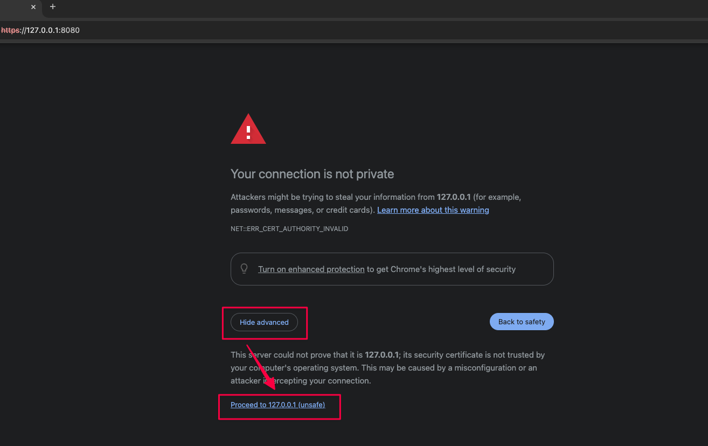

## 下载文件

点击下载[网页文件](https://cdn.sipeed.com/nanokvm/NanoKVM-USB.zip)，解压后会得到`NanoKVM-USB`文件夹。

## 生成证书

> 首先请确保已安装 `openssl`。

1. 打开终端，进入上一步骤中的 `NanoKVM-USB` 目录；
2. 执行 `openssl req -newkey rsa:2048 -new -nodes -x509 -days 3650 -keyout key.pem -out cert.pem`；
3. 终端会提示需要输入信息，可以一直按回车键跳过，也可以按自己的需要输入信息。

完成后会在当前目录生成两个文件：`key.pem` 和 `cert.pem`。

## 启动本地服务

这里提供了 Node.js 和 Python 的示例。

### Node.js 服务

1. 执行 `npm install -g http-server` 安装 `http-server`;
2. 执行 `http-server -S -C cert.pem -K key.pem` 启动服务；
3. 服务启动后的日志输出如下，从日志中可以找到服务的地址：

```shell
Starting up http-server, serving ./ through https

http-server version: 14.1.1

http-server settings:
CORS: disabled
Cache: 3600 seconds
Connection Timeout: 120 seconds
Directory Listings: visible
AutoIndex: visible
Serve GZIP Files: false
Serve Brotli Files: false
Default File Extension: none

Available on:
  https://127.0.0.1:8080
  https://192.168.3.250:8080
  https://198.18.0.1:8080
Hit CTRL-C to stop the server
```

### Python 服务

在 `NanoKVM-USB` 目录中创建 `server.py` 文件，写入以下代码并保存：

```python
import http.server
import ssl

server_address = ('0.0.0.0', 8080)

httpd = http.server.HTTPServer(server_address, http.server.SimpleHTTPRequestHandler)
context = ssl.SSLContext(ssl.PROTOCOL_TLS_SERVER)
context.load_cert_chain(certfile='cert.pem', keyfile='key.pem')
httpd.socket = context.wrap_socket(httpd.socket, server_side=True)

print(f"Serving HTTPS on {server_address[0]}:{server_address[1]}")

httpd.serve_forever()
```

执行 `python server.py` 运行服务。

## 在网页中访问

打开浏览器，输入在上一步骤中获取到的地址，这里以 `https://127.0.0.1:8080` 为示例。

打开网址后可能会提示`隐私错误`，需要手动点击访问：


