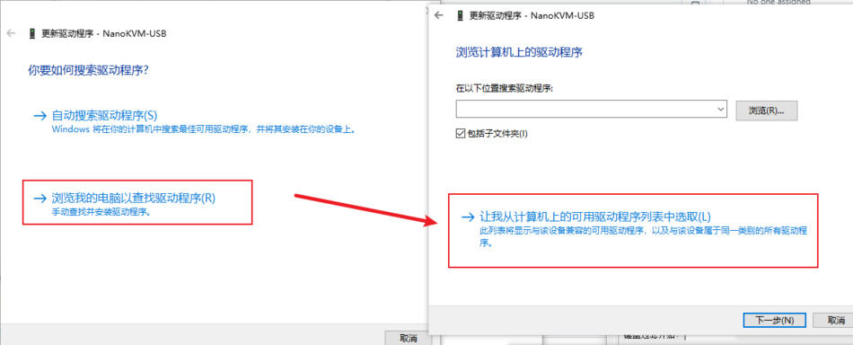
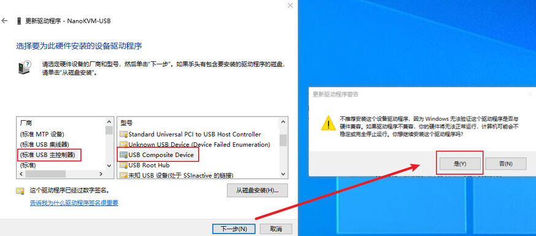

## 串口/键鼠问题

### Linux打开网页后无 ttyUSBx 串口设备

+ 可能缺少串口驱动导致,请按照以下方法重新安装CH34x驱动:

1. 在WCH官网下载驱动([下载地址](https://www.wch.cn/downloads/CH341SER_LINUX_ZIP.html))，解压后进入driver目录
2. 执行`uname -r`查看操作系统发行版本，在([此处](https://elixir.bootlin.com/linux/v6.2/source/drivers/usb/serial/ch341.c))找到对应的版本，将内容复制到`ch341.c`中
3. 执行`make`命令编译驱动
4. 执行`sudo make load`命令安装驱动
5. 替换旧驱动:`cp ch341.ko /lib/modlues/$(uname -r)/kernel/drivers/usb/serial/ch341.ko`

+ 部分linux发行版内置了`brltty`,这是一款盲文阅读工具，但会占用/dev/ttyUSB0串口，导致网页检测不到，在确认不使用`brltty`后建议将其卸载`sudo apt remove brltty`

### Windows 打开网页后无 USB Serial (COMx) 串口设备

+ 可能缺少串口驱动导致,请按照以下方法重新安装CH34x驱动:

  + 在WCH官网下载驱动([下载地址](https://www.wch.cn/downloads/CH341SER_EXE.html))，下载后双击运行安装程序

### Windows 被控端出现 NanoKVM-USB 设备驱动程序未被安装

+ 可能是 USB 复合设备未被正确识别导致，请按照以下方法重新安装驱动:
  + 打开 `设备管理器` → `其他设备`
  + 找到 `NanoKVM-USB` → 右键 `属性` → `驱动程序` → `更新驱动程序`
    
  + 选择 `浏览我的电脑以查找驱动程序` → `让我从计算机上的可用驱动程序列表中选取`
    
  + 双击 `显示所有设备`
    
  + 在 `Standard USB Host Controller` / `标准 USB 主控制器` / `Standard system devices` / `标准系统设备` 中找到 `USB 复合设备 (USB Composite Device)` → 双击安装
    

    

    > **注意**：不同版本 Windows 驱动位置可能有所差异，请耐心查找。

### 打开网页后 NanoKVM-USB 对应串口设备无法打开

+ 可能是部分程序占用该串口，请确认无占用后再试
+ Linux可能缺少权限，导致串口无法打开，在终端中执行`sudo chmod 777 /dev/ttyUSB*`
+ Chrome浏览器可能没有检测到该串口，请刷新网页或重启 Chrome
+ Chrome权限可能不足，请打开相应权限

### Mac Mini (Apple Silicon) 上连接设备后找不到串口设备

这通常是因为新款 Mac Mini 后置的雷雳 (Thunderbolt) 接口与前置 USB 接口采用了不同的控制器，导致对部分 USB 设备的兼容性表现不同。后置雷雳接口在兼容传统的 USB 串口设备 (CDC ACM) 时可能会更挑剔，而前置的原生 USB-C 接口兼容性通常更好。

建议解决方案：

+ 更换接口：优先将设备连接到 Mac Mini 的前置 USB-C 接口。
+ 使用集线器：如果您必须使用后置接口，建议通过一个 USB 集线器 (Hub) 进行连接，通常可以解决识别问题。

## 视频问题

### 部分主机BIOS下环出/采集颜色异常

+ NanoKVM-USB早期固件可能在部分BIOS下环出颜色偏红，采集颜色偏绿，可以通过烧录新固件解决，请先下载烧录软件和固件： [固件下载链接](https://dl.sipeed.com/fileList/KVM/NanoKVM_USB/MS2131_LIB_V2_0_27_Demo_GPIO0_PlugDetect_20251205_replaced_E158EDID.bin)、[烧录软件下载链接](https://dl.sipeed.com/fileList/KVM/NanoKVM_USB/MS_USB3_0_UpgradeTool_V1_3_2.exe)

+ 烧录步骤：
    1. 打开软件，选择下载的固件
    2. 将NanoKVM-USB Host端的USB-C插入电脑
    3. 等待软件连接，点击开始烧录，等待完成

> **请勿在烧录过程中拔出NanoKVM-USB，有变砖风险**
> 烧录软件仅支持Windows
> 目前不支持NanoKVM-USB(4K)版本的烧录

### 视频画质差

+ 首先检查是否使用了 USB2.0 的线缆/HOST接口，当分辨率较大时 USB2.0 不足以提供充足的传输带宽，会被动降低画质，建议选用 USB3.0的线缆
+ 2K分辨率下受限于芯片编码能力，画质会下降，请切换为1080P使用
+ 如果 Target 连接的是 Windws主机，请前往系统设置-显示设置-高级显示设置-列出所有模式中更改为 1080P60，并检查`桌面分辨率`和`活动信号分辨率是否一致`

### DP-HDMI转接器

+ 部分无源DP转HDMI转换器内部电路仅做电平转换，对NanoKVM-USB兼容性较差，表现为视频信号从无到有（比如从睡眠唤醒时）NanoKVM-USB仍显示然黑屏，需要手动拔插HDMI。

### 无HDMI环出

+ 内测版硬件仅支持HOST侧USB供电，请在使用时保持HOST测供电正常

### 环出显示屏

+ NanoKVM-USB在未连接环出显示屏前使用自身的EDID（显示器识别数据），连接环出显示器后切换为环出显示器的EDID。
+ 由于EDID中包含显示器厂家以及颜色信息，插入环出显示器前后Target系统设置中可能显示为不同的分辨率列表，USB采集的画面颜色可能在插入前后有所差异

## 音频问题

### 音频不连续

+ NanoKVM-USB 在USB2.0模式下可能会因带宽不够的原因出现音频传输不连续的问题，请尽量使用USB3.0连接NanoKVM-USB和Host

## 已知问题

### 延迟

+ ARM 版的 macOS 通过 NanoKVM-USB 连接树莓派时延迟会增大，其他组合则不受影响

## 反馈方式

+ 若上述方法不能解决异常，请在论坛,GitHub或QQ群说明您购买的型号和遇到的问题，我们会耐心解答

+ [Github issues](https://github.com/sipeed/NanoKVM)
+ [MaixHub 论坛](https://maixhub.com/discussion/nanokvm)
+ QQ 交流群: 703230713
