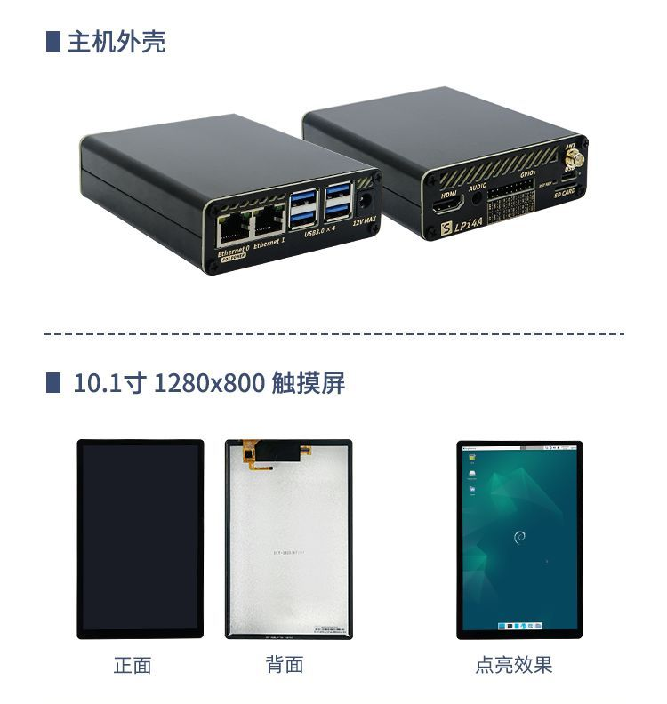

## 开箱内容

### 基础套餐
你收到的包裹内是如下包装：

打开白色纸盒，可以看到LicheePi3A板卡和基础配件（硅脂片+散热风扇+USB-C线）：

如果开箱后发现缺少相关部件，请联系客服咨询。

### 选配件

LicheePi 4A还有丰富的配件可供选择，如下图所示：

选购说明：

|配件名|选购说明|
|---|---|
|铝合金外壳|适合作为小主机，软路由的外壳|
|10.1寸触摸屏|1280x800 4lane MIPI，适合作为车机，安卓 调试使用|
|USB摄像头|5MP USB摄像头，板载麦克风，适合作为openCV的摄像头使用|
|PoE电源模块|5V2.4A PoE电源模块，网关类应用使用网线PoE供电|
|12V电源|12V2A电源适配器，板卡外接很多耗电外设时选购|
|RV Debugger Plus|UART+JTAG调试小板，连接系统串口终端调试用|

## 组装板卡

### SOM安装

默认情况下 LM3A SOM 已经安装至主板上，如果你需要升级/替换 SOM，可按如下说明进行 SOM 的取出和安装

1. 取出 SOM:
   <table>
    <tr>
      <td colspan=2>先用手指往外拨动弹片解锁 SOM, 然后将 SOM 取出</td>
    </tr>
    <tr>
      <td></td>
      <td></td>
    </tr>
   </table>

2. 安装 SOM:
   <table>
    <tr>
      <td colspan=2>先把 SOM 斜着插入连接器插槽, 然后按压SOM，两边弹片会自动锁住SOM</td>
    </tr>
    <tr>
      <td></td>
      <td></td>
    </tr>
   </table>

### 散热器安装

LicheePi 3A 是高性能 SBC，需要安装主动散热器对 SOM 进行散热，否则在满载时可能由于核心过热而自动降频，无法达到最优性能。
1. 安装导热硅脂片
    取出导热硅脂片，撕开两面薄膜，将硅脂片放置在下图位置并轻轻按压固定（硅脂片自己具备一定粘性可以固定住），注意完整覆盖住主芯片与两颗内存芯片
    

2. 安装散热风扇
    在硅脂片上对齐安装30mm的散热风扇，并轻轻按压固定住。
    

3. 安装散热风扇电源
    默认收到时应该已经插入好了风扇电源，如果风扇电源线脱出，请按下图所示插入，注意电源线顺序，装反风扇不会旋转。
    注意，该位置上的插针电源受 linux 内核控制，需正确配置内核才会旋转，如果风扇不转，也可插到板卡下方的 20pin 插针的 5V + GND 处测试风扇好坏。
    

### WIFI天线安装 

默认情况下WIFI天线已经安装在主板上，如果脱出，请按照下图安装回去：

### 组装完成

组装完成后的状态如下所示：

## 启动板卡

LicheePi 3A出库已预烧录了基础系统镜像，至此你已可以快速进行开机体验！

使用 HDMI 线缆(自备)连接显示器(自备)与 LicheePi 3A 的 HDMI 口，使用配套的 USB-C 线缆连接到至少 5V2A 输出的 USB 电源(自备)上，LicheePi 3A 即会开机启动，默认镜像会在 30s 内启动到桌面系统的登录界面, 第一次登录会进入用户帐号设置序列。

默认镜像的帐号密码配置如下：
账户：`root`，密码： `bianbu`；
插入键鼠，输入用户名密码后即可登录体验，具体操作请查看后续章节。

如果按照上述操作，没能点亮显示器，进入系统，有以下可能请自查：
1. 检查电源电压是否正常，USB-C 口连接是否正常，电源指示灯是否点亮
2. 检查散热器是否正常安装，风扇是否旋转
3. 检查 HDMI 是否稳固连接，显示器是否开机，以及可以尝试更换显示器测试
4. 也可能是出厂遗漏固件烧录，请按下章方法进行镜像烧录后再试
5. 如果以上均不奏效，请联系客服售后

## POE模块安装说明
POE模块需要用户手工焊接安装，请按下图焊接：  
    
> 注意 POE模块焊接后无法装入铝合金外壳。

## 板卡硬件说明

完成初次点亮板卡后，可以静下心来认识下 LicheePi 3A 的硬件，方便后期可能的维护工作。
 

### 硬件资料下载
[板卡规格书](https://dl.sipeed.com/shareURL/LICHEE/LicheePi3A)

## 其他链接
[淘宝](https://item.taobao.com/item.htm?id=715508771884)
[Aliexpress](https://xxx)
QQ群: 559614960 [点我自动加群](http://qm.qq.com/cgi-bin/qm/qr?k=5YkapIhdtWHp8AEfM5_bFFYQIX3CUQN6)
Telegram: https://t.me/linux4rv

论坛：https://maixhub.com/discussion
联系邮箱：support@sipeed.com
