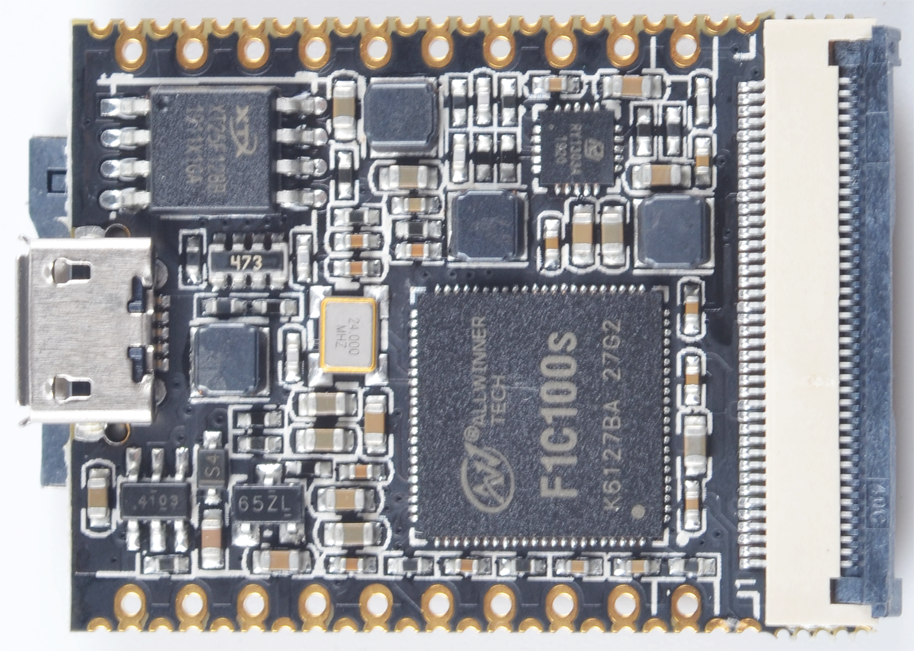
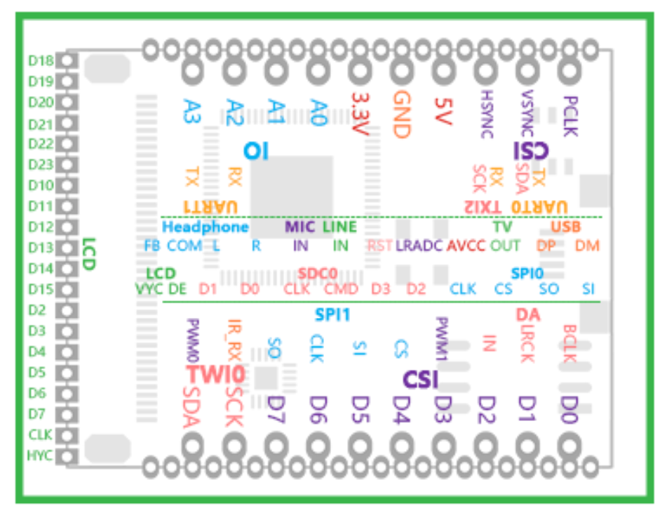

# Lichee Nano
## 概述

Lichee Nano是基于全志科技的F1C100s(ARM 926EJS内核)高性能soC芯片设计的迷你开发板。开发板设计小巧精致，将芯片的所有资源都引出，板载USB、Flash、TF卡、4OP LCD接口等，并把所有IO资源引出，方便开发者拓展使用，非常适合初学者学习linux或者商用于产品开发。

## 参数

### F1C100s参数
Lichee Nano开发板板载的F1C100s芯片功能很强大，芯片内置32MBDDR，拥有SDIO、SPI、UART、Speaker、Mic等接口，支持外挂 8~32MB SPI Nor Flash;在视频处理方面表现出现，支持720P视频输出，支持H.264、MJPEG等高清格式的解码。

| 项目 | 参数 |
| --- | ---- |
| CPU | •ARM9 CPU architecture •16KByte D-Cache •32KByte I-Cache |
| Memory | •SIP 32MB DDR1 •SD2.0,eMMC 4.41 |
| Video | •H.264 1280x720@30fps decoding •MPEG1/2/4 1280x720@30fps decoding •MJPEG 1280x720@30fps encoding •JPEG encode size up to 8192x8192|
| Camera | •8-bit CMOS-sensor interface •CCIR656 protocol for NTSC and PAL |
| Audio | •Integrated analog audio codec with two DAC channels and one ADC channel,maximum 192kHz DAC sample rate and 48kHz ADC sample rate •One I2S/PCM interface |
| Display | •LCD RGB interface up to 1280x720@60fps •TV CVBS output, support NTSC/PAL, with auto plug detecting |
| Connectivity | •USB OTG, SDIO,IR, 3 x TWI, 2 x SPI, 3 x UART |

### 开发板参数
| 项目 | 参数 |
| --- | --- |
| CPU | 全志 F1C100s， ARM 926EJS , 主频 408MHz， 可超频至 600Mhz |
| 内存及存储 |集成 32MB DDR 板载 16MB NOR FLASH， 可从 FLASH 启动 板载 TF 卡座，可从 TF 启动 |
| 显示 | 通用 40P RGB LCD FPC 0.5mm 座子 可直接使用常见的 40P 4.3/5/7 寸屏幕（板载背光驱动） 支持常见的 272x480, 480x800, 1024x600 等分辨率 板载电阻式触摸屏芯片 |
| 视频处理能力 | H.264 1280x720@30FPS 解码 MPEG1/2/4 1280x720@30FPS 解码 MJPEG 1280x720@30 FPS 解码 JPEG encode size up to 8192x8192 |
| 通信接口 | SDIO，可搭配配套 SDIO WiFi+BT 模块 SPI x2 TWI x3 UART x3 OTG USB x1 TV out |
| 其它接口 | PWM x2 LRADC x1 Speakerx2 + Mic x1 |

### 软件参数
| 开发环境 | 参数 |
| --- | --- |
| Linux | 支持3.10 BSP Linux 支持4.19 主线 Linux |
| 裸机 | Xboot |
| 裸机 | RT-Thread |

## 使用教程
[Lichee Nano](/soft/Lichee/zh/Nano-Doc-Backup/index.md)

## 产品技术支持

Lichee Zero 开发板可以在多种场景实现客户不同方面的需要，在AIoT上已经广泛的使用，品质和性能在行业内已经有非常好的口碑，专业的技术团队为广大客户解决硬件设计和软件功能上的各种各样问题。专业技术支持和更详细资料请联系商务 <support@sipeed.com>。
