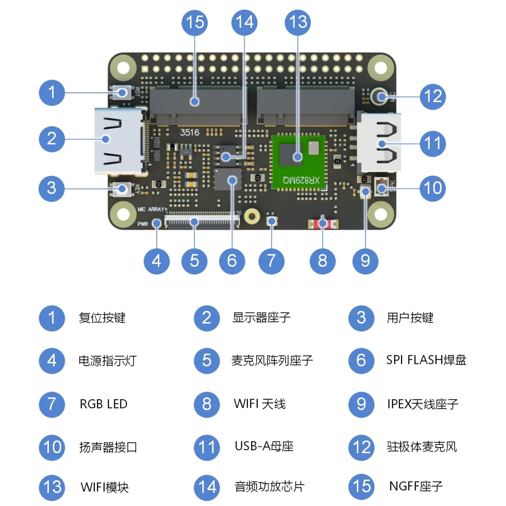

# Lichee Dock

## 概述

Lichee RV Dock 是为开源开发者而设计的一款功能**集成度高**、**体积小**且价格亲民的RISC-V Linux开发板套件。它不仅支持 **HDMI 输出**，搭配屏幕转接板更可以支持多种的屏幕显示（**MIPI、RGB和MCU接口**）。它同时具备丰富的外设，包括一个主机 **USB-A** 接口，**2.4G Wi-Fi+BT** 模块，一个模拟麦克风和扬声器插口等。使用者拿到套件之后，无需等待和焊接，即可用套件连接显示器和 USB 设备快速上手开发各种有趣且实用的 Linux 应用，较大地**加速了**开发者的试研和开发工作。除此之外，用户还可以利用开发板的多种显示接口，无线功能和 GPIO ，搭配板载麦克风和扬声器，快速实现各种创意。

## 参数

| 项目 | 参数 |
| --- | --- |
|支持的核心板 | Lichee RV 核心板 |
| 显示输出接口 | 板载一个显示输出连接器； RGB屏幕信号和MIPI屏幕信号连接到2x20P排针焊盘  （可以使用我们的屏幕转接板驱动RGB接口或者MIPI接口的屏幕） |
| 网络连接 | 板载2.4G WIFI+BT模组、2.4G 贴片天线、IPEX连接器 |
| USB | 板载一个USB type-A母座 |
| 音频 | 板载扬声器驱动电路（最高支持4Ω3W扬声器）和扬声器连接器 板载驻极体麦克风电路 |
| 存储 | 预留了一个SOP8焊盘，SPI协议，默认不焊接元件 |
| 拓展连接器 | 板载30P FPC连接器，可以直接连接到我们的Mic Array R6 麦克风阵列板 |
| GPIO拓展 | 通过2x20P 2.54mm 焊盘引出GPIO供用户使用 |
| LED | 板载一个WS2812 RGB LED 板载一个电源指示灯 |
| 按键 | 板载一个复位RST按键 板载一个用户按键 |

## 相关链接

[下载站](https://dl.sipeed.com/shareURL/LICHEE/D1/Lichee_RV-Dock)

[使用教程](./flash.md)

## 产品技术支持

Lichee RV Dock 可以在多种场景实现客户不同方面的需要，品质和性能在行业内已经有非常好的口碑，专业的技术团队为广大客户解决硬件设计和软件功能上的各种各样问题。专业技术支持和更详细资料请联系商务 support@sipeed.com。