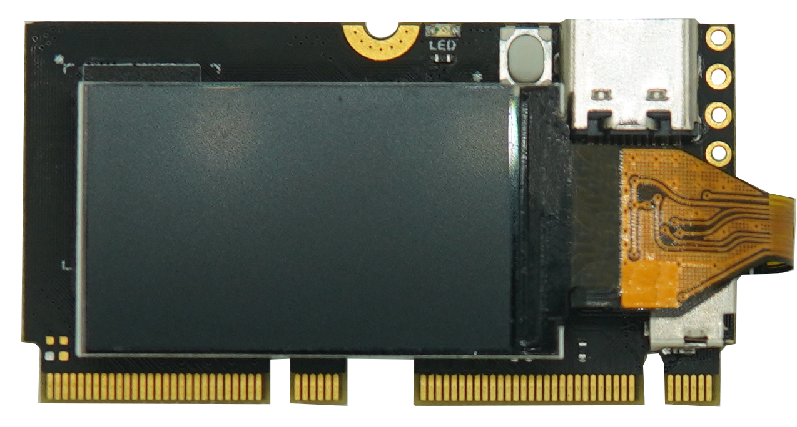
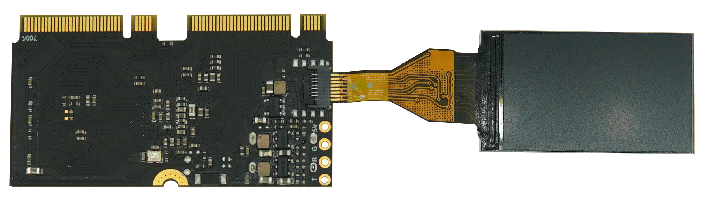
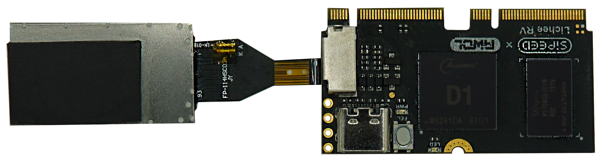

# Lichee RV - Nezha CM

## 概述
Lichee RV - Nezha CM是模块化设计的核心计算模组，搭载全志D1主控芯片(基于平头哥玄铁C906处理器），512MB DDR3内存，可选启动介质为TF卡或者SDNAND芯片，并使用两组M.2B - KEY 67 Pin金手指引出所有l0，方便量产使用，也方便安装替换。

## 参数

| 项目 | 参数 |
| --- | --- |
| CPU | 全志 D1 阿里平头哥 玄铁 C906 内核，主频 1GHz |
| 内存 | 16bit 512MB DDR3，时钟频率 792MHz |
| 存储 | 板载 TF 卡连接器，可插入 TF 卡作为存储，已测试能够识别1TB容量的卡；  预留 SD-NAND 焊盘（与 8pin LCD 接口冲突，用于商业应用定制） |
| 显示接口 | MIPI：引出 4-lane MIPI DSI 至金手指  RGB：引出 RGB888（部分与 DSI 复用） 至金手指  MCU(I80)：引出 I80 接口至金手指  SPI：板载 8pin SPI 液晶屏接口，可扩展 1.14 英寸液晶屏 |
| 音频接口 | 模拟音频耳机输出(HPOUT)： 引出至金手指  模拟音频线路输入(LINEIN)： 引出至金手指  数字音频 (I2S/SPDIF)： 引出至金手指  模拟麦克风接口(MIC3)： 引出至金手指  数字麦克风接口(DMIC)： 引出至金手指 |
| 以太网 | 引出 RMII/RGMII 接口至金手指（与部分 GPIO 复用） |
| USB | 板载 TYPE-C USB-OTG 接口(USB0)  USB-HOST 引出至金手指(USB1) |
| GPIO | 剩余 GPIO 全部引出至金手指 |
| 按键 | • FEL 按键（进入下载模式）|
| 指示灯 | • 一个电源指示灯  • 一个用户指示灯（高电平有效） |
|PCB | 板层 4 层 |
| 固定方式 | 通过两组 M.2 B-KEY 金手指连接器与底板连接，使用一颗 M2 螺丝紧固 |
| 支持开发语言 | C/C++, Python, Golang, etc... |
| 系统镜像 | Tina Linux(基于OpenWRT 14.07)、 Debian、YoC (RTOS ) |

## 底板之间的对比

| 项目 | Lichee RV Dock | Lichee RV Panel |
| :---: | --- | --- |
| SOC | 全志D1（XuanTie C906 RISC-V） | 全志D1（XuanTie C906 RISC-V） |
| 内存 | 1GByte | 1GByte |
| 无线网络 | 可选择： -2.4G WIFI+BT -无（可以自行焊接其他型号的WIFI模块调试）	| 2.4G WIFI+BT |
| 有线网络 | 无	| 支持100M以太网 |
| 影像输出 | HDMI连接器  SPI接口屏幕连接器  连接屏幕转接板，可以实现： -  常用RGB接口屏幕连接器（含TP引脚）（支持我们店铺的4.3寸/5.0寸屏） -  MIPI接口屏幕连接器（兼容Nezha开发板适配的8寸屏） | sRGB接口屏幕连接器（含TP引脚）（支持标配的4寸IPS屏带TP）  MIPI接口屏幕连接器（兼容Nezha开发板适配的8寸屏）|
| USB端口 | "1个USB OTG(核心板板载的USB-C座子)   1个USB Host(底板板载的USB-A座子) | 1个USB OTG(核心板板载的USB-C座子)  1个USB Host(底板板载的USB-C座子) |  
| 拓展接口 | 支持麦克风阵列板 大部分GPIO通过2x20P直插焊盘引出 | 小部分GPIO通过直插焊盘引出 |
| 音频 | 板载3W音频功放  板载驻极体麦克风电路 | 板载3W音频功放  板载2个MEMS数字麦克风 |
| 按键	| 1个FEL按键（进入下载模式） 1个RST按键（复位） 1个用户按键 | 1个FEL按键（进入下载模式） |
| LED | 1个电源指示灯 1个2812 RGB LED | 1个电源指示灯 |
| 外壳 | 无 | 有3D打印外壳 |
| 尺寸 | 65.0mm x 40.0mm | 86.0mm x 86.0mm |

## 连接1.14寸屏幕

> 目前 1.14 显示屏是点不亮的，需要等待后续的更新; 

## 系统烧录

[烧录教程](./flash.md)

## 注意事项

当前核心板的USB Type-C连接器使用CC引脚作为自动OTG的识别引脚，但是与USB C to C 数据线的识别存在冲突，只能使用A to C数据线，可在硬件上改动器件进行切换，共有两种工作方式，具体特性对应如下：

| Type-C工作模式 | OTG（出厂默认产品） | CC识别（需要改动硬件） |
| --- | :---: | :---: |
| 电阻R30与电阻R31 | 不贴 | 贴装5.1K 1% 0402电阻 |
| 二极管D3与D4 | 贴装4148二极管 | 不贴 |
| 是否兼容C to C数据线 | 否 | 是 |
| 是否兼容A to C 数据线 | 是 | 是 |
| 是否支持自动OTG切换 | 是 | 否 |

如需使用C to C数据线，则需要改动TypeC接口周围的器件对应CC识别模式，并在需要扩展外置USB设备时手动切换为HOST模式。核心板正面位号图如下，供参考：
> ① 换上5.1K 1% 0402电阻，② 拆除二极管

## 资料下载
[硬件资料下载](https://dl.sipeed.com/shareURL/LICHEE/D1/Lichee_RV/HDK)

Debian 系统镜像请到

>[百度网盘](https://pan.baidu.com/s/1QJTaDw6kkTM4c_GAlmG0hg)(提取码：`wbef`)
>[Mega netdisk](https://mega.nz/folder/lx4CyZBA#PiFhY7oSVQ3gp2ZZ_AnwYA)

[源码获取](/hardware/zh/lichee/RV/user.html#BSP-SDK-开发指南)

## 相关问题

[licheeRV debian镜像相关问题](./Armbian_img_apt.md)
