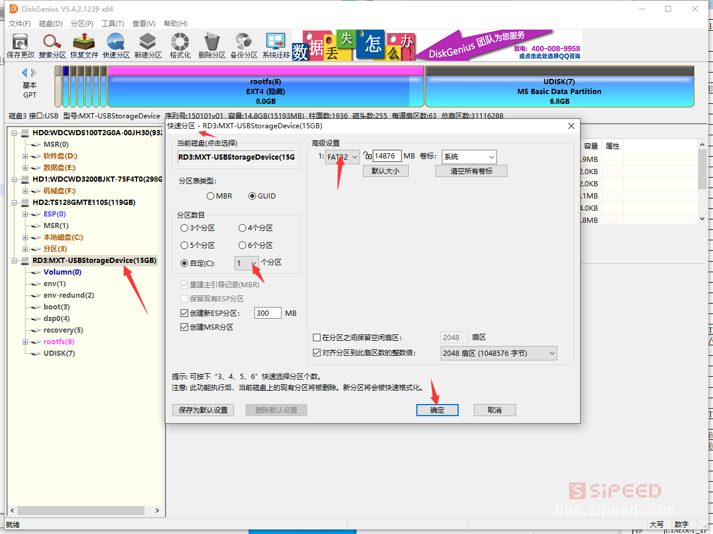

# Lichee RV 烧录系统

系统镜像分为 Tina与Debian两种，Tina为专用小linux镜像，Debian为桌面级镜像

## 准备

1. Lichee RV 核心板
2. TF 内存卡（建议使用[官方店](https://shop365481095.taobao.com/)的的内存卡，其他的卡可能会有各种奇怪的问题）
3. 烧录工具 [PhoenixCard](https://dl.sipeed.com/shareURL/LICHEE/D1/Lichee_RV/tool)
4. 系统镜像下载
    国内用户：[百度网盘](https://pan.baidu.com/s/1QJTaDw6kkTM4c_GAlmG0hg) 提取码：wbef
    国外用户：[Mega](https://mega.nz/folder/lx4CyZBA#PiFhY7oSVQ3gp2ZZ_AnwYA)

| 镜像词缀说明 | 含义 | 备注 |
| --- | --- | --- |
| LicheeRV | Sipeed 专用的 RISCV D1 Linux 系列系统。 | --- |
| Tina | 标记为 tina openwrt 系统。 | --- |
| debian | 标记为 riscv debian 系统。 | --- |
| 86panel | [taobao 86panel](https://item.taobao.com/item.htm?spm=a230r.1.14.18.30b534187YMsRx&id=663345415205&ns=1&abbucket=7#detail) | --- |
| dock | [taobao dock](https://item.taobao.com/item.htm?spm=a1z10.3-c-s.w4002-21410578028.20.35765d54K9XCOt&id=666274331852) | --- |
| hdmi | 表示屏幕默认输出到 HDMI 屏幕上。 |  |
| 800480 / 480P | 表示屏幕默认输出到 LCD 屏幕上，分辨率可以是 800*480 或 480P (640X480)。 |  |
| 8723ds | 表示该镜像支持 8723ds WIFI / BLE 驱动。 |  |
| xr829 | 表示该镜像支持 xr829 WIFI / BLE 驱动。 |  |
| waft | 是否内置 waft 软件。 |  |

## 烧录镜像

### 烧录步骤

烧录前最好使用[SD card Formatter](https://www.sdcard.org/downloads/formatter/eula_windows/SDCardFormatterv5_WinEN.zip)先把内存卡格式化一次，格式化的时候注意不要选择错了镜像。

- 打开烧录软件 [PhoenixCard](https://dl.sipeed.com/shareURL/LICHEE/D1/Lichee_RV/tool)，选择烧录的固件，将内存卡通过读卡器插入电脑中
- 选择 `启动卡` 选项
- 选择正确的盘符
- 点击 `烧卡`
- 根据状态栏的颜色可以判断烧录结果：红色的话说明烧录失败了，建议使用[SD card Formatter](https://www.sdcard.org/downloads/formatter/eula_windows/SDCardFormatterv5_WinEN.zip)格式化后再重新烧录一次；绿色则表示一切正常。

要注意 Windows 默认打不开 linux 的文件系统，所以对于烧录过 linux 镜像的 sd 卡在 Windows 上会不能直接被打开，且被提示需要格式化之类的。
这时可以使用[SD card Formatter](https://www.sdcard.org/downloads/formatter/eula_windows/SDCardFormatterv5_WinEN.zip)来格式化 sd 卡来恢复到 Windows 系统可用的状态。
对于嵌入式 linux，建议持有两张以上的 sd 卡。

> 并不能保证每台电脑和每个人的内存卡都是可以烧录的，烧录失败的话建议购买官方的镜像卡。

等待烧录结束；烧录 Tina 系统镜像会比较快，烧录 Debian 系统镜像将会久一点，可能多用10分钟。

### 烧录失败相关

如果在烧录时提示格式化失败，或者使用烧录过的卡但是电脑上没有显示盘符，可以按以下操作来解决：

1. 在此下载磁盘处理软件： https://www.diskgenius.cn/
2. 电脑上显示不出的盘符，会在该软件里显示出来，使用该软件进行快速分区：
    
3. 分区完成后，电脑上就能够看到盘符，PhoenixCard 里也能看到，在 PhoenixCard 里点击恢复卡即可恢复卡到正常状态
4. 按之前步骤继续烧录即可

## 启动

启动后若提示需要用户名和密码的话的分别如下：

- Tina 系统登录用户名：`root`  密码：`tina`

- Debian 系统登录用户名：`sipeed` 密码：`licheepi`

插卡启动，可以在串口工具中查看到启动信息:

- debian 启动的打印信息

  
点开查看部分debian启动日志

<pre><code class="language-shell">
[270]HELLO! BOOT0 is starting!
[273]BOOT0 commit : 27369ab

OpenSBI v0.6
   ____                    _____ ____ _____
  / __ \                  / ____|  _ \_   _|
 | |  | |_ __   ___ _ __ | (___ | |_) || |
 | |  | | '_ \ / _ \ '_ \ \___ \|  _ < | |
 | |__| | |_) |  __/ | | |____) | |_) || |_
  \____/| .__/ \___|_| |_|_____/|____/_____|
        | |
        |_|
</code></pre>

- Tina 启动的打印信息

  
点开查看Tina启动日志

<pre><code class="language-shell">
BusyBox v1.27.2 () built-in shell (ash)

    __  ___     _        __   _
   /  |/  /__ _(_)_ __  / /  (_)__  __ ____ __
  / /|_/ / _ `/ /\ \ / / /__/ / _ \/ // /\ \ /
 /_/  /_/\_,_/_//_\_\ /____/_/_//_/\_,_//_\_\
 ----------------------------------------------
 Maix Linux (Neptune, 5C1C9C53)
 ----------------------------------------------
root@MaixLinux:/#
</code></pre>

## 相关问题

[点我跳转](./problems.md)