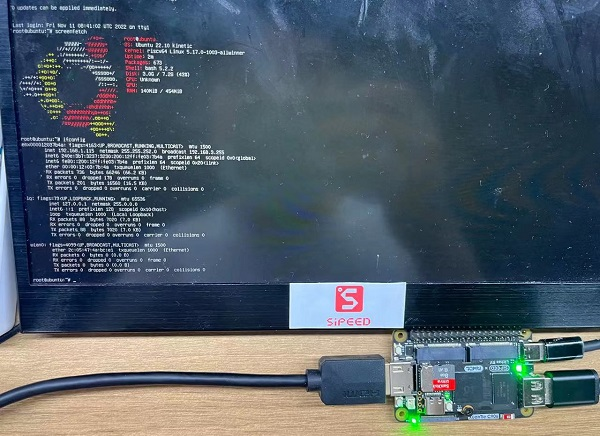
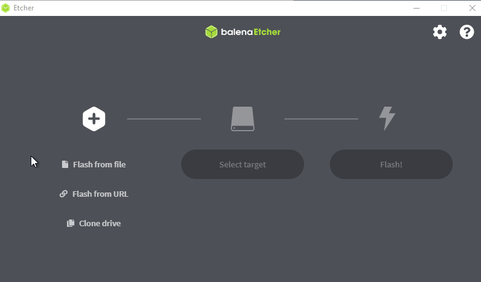
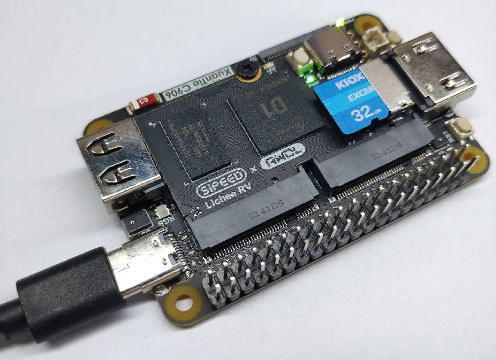
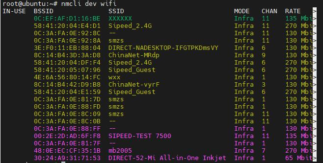
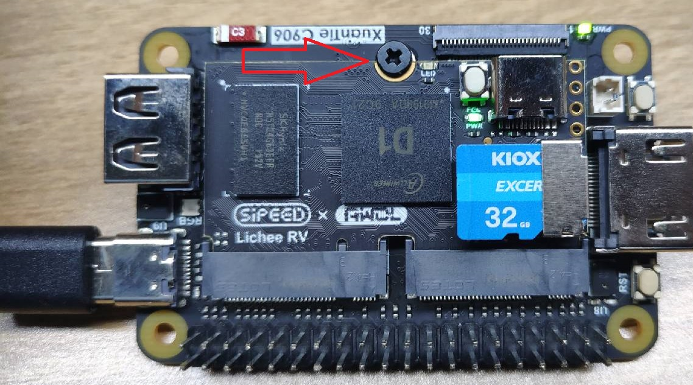

Ubuntu 提供了可以在 LicheeRV 上面运行的镜像，它的烧录方法与并不是使用 PhoenixCard，因此这边专门说明一下使用方法。

有显示器的话可以接键盘来使用命令行操作该系统，没有的话只能通过串口来操作板子。

## Ubuntu 介绍

Ubuntu 是基于另一个 Linux 发行版 Debian 发展而来，网上大多数 linux 相关的教程也是基于 ubuntu 的，这点对于新手很友好，遇到问题的时候可以比较快地找到解决办法。

因为 D1 的性能有限，所以只提供命名行版本，需要的话自行安装、适配桌面也是能有 GUI 的。




上图为 D1 Dock Pro 板卡，与普通的 Dock 底板是不同的，底板上自带了串口，可以仅使用一根数据线来进行板卡与电脑的串口通信。相关外设可以看下图的标注。


可以在官方淘宝店咨询卖家购得该板卡。

## 操作步骤

### 获取镜像

提供了百度网盘下载方式。

百度网盘: https://pan.baidu.com/s/1OrePh_HamqAuLi5T_66ScA
提取码: dock

### 软件获取

可以前往 [balenaEtcher](https://www.balena.io/etcher/) 官网下载软件或者[下载站](https://dl.sipeed.com/shareURL/others/balenaEtcher)下载，其中下载站仅提供 Windows 版本软件，其他系统想用这个软件自行前往 [balenaEtcher](https://www.balena.io/etcher/) 官网下载。

### 烧录系统

准备一张容量 8G 以上的内存卡，读写速度快一些的卡能带来更好的体验。

将 TF 卡与电脑连接起来，使用读卡器或者其他方式都可以。下图的电脑上的 TF 卡槽仅做示例，电脑上没有 TF 卡读取插槽的话依然是需要准备读卡器的。

<table>
    <tr>
        <th colspan="2"> 将 TF 卡与电脑连接 </th>
    </th>
    </tr>
    <tr>
        <td>使用读卡器来连接 TF 卡和电脑</td>
        <td>直接使用电脑上的 TF 卡插槽来连接</td>
    </tr>
    <tr>
        <td></td>
        <td></td>
    </tr>
</table>

打开 balenaEtcher，选择所下载的镜像文件，选择 TF 卡，点击烧录：



要注意的是烧录的时候别选错了 TF 卡。


烧录时间有点久，烧录结束后会出现下图的提示。如果不是 Successful 的话就需要重新烧录。


## 启动系统

烧录完系统且看到 Successful 字样后，可以将 TF 卡插到板子上启动了。



使用串口可以查看启动信息，并且操作板卡。


等待启动一段时间后，使用 `root` 作为用户名和密码就可以登录进板卡了，


## 连接 wifi

然后使用 `nmcli` 命令来连接 2.4G 无线网络。

- 查看周围的 wifi

```bash
nmcli dev wifi
```



- 使用命令行来连接 wifi，语法为 `nmcli dev wifi connect (网络名称） password (密码）`

```bash
nmcli dev wifi connect Sipeed_Guest password 12345678
```


出现 successfully 就表示连接上了，后面可以正常使用 `apt` 等软件了


## 点灯

在这个 ubuntu 系统上，我们可以向之前使用 tina 系统时一样，控制核心板上的 led 灯。相关代码和结果如下所示：

点亮板卡上的 LED :

```bash
echo 1 > /sys/class/leds/\:status/brightness
```

上面的命令中的 `:` 使用了 "\" 进行转义，不然会报错。


熄灭板卡上的 LED :

```bash
echo 0 > /sys/class/leds/\:status/brightness
```



## 结语

在 Ubuntu 官方所提供的镜像上[点我跳转](https://wiki.ubuntu.com/RISC-V/LicheeRV)，我们这边补上了 wifi 驱动免去了自行编译的麻烦。