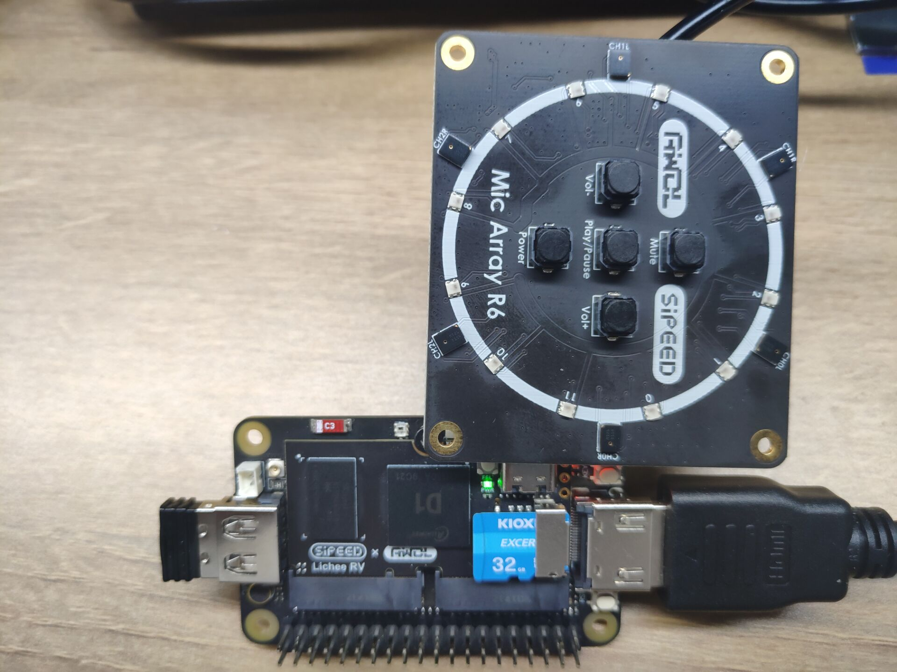
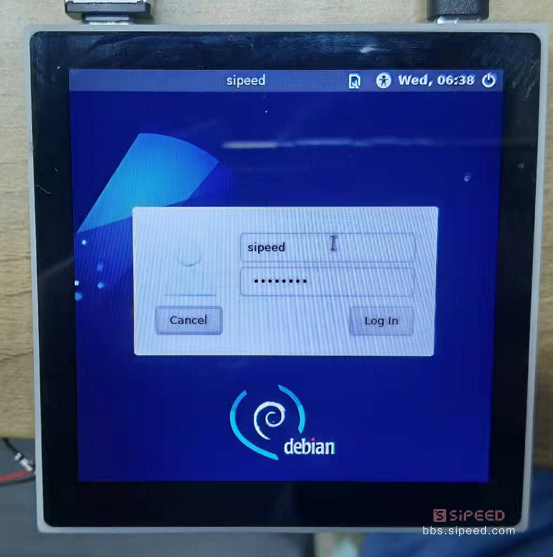

# 基础上手

> 编辑于20220616

## Dock 相关使用

### 连接板子

- 我们可以很容易看到底板背部上有串口的 TX 和 RX 引脚标识。因此可以使用 ttl 电平的串口来使板子与电脑进行通信（Tina和Debian均适用）。

- 对于 Tina 系统可以使用核心板上的 typec 接口和电脑上的 adb 终端来进行连接

- 对于 Debian 系统可以外接键盘和鼠标来直接操作

#### Debian 相关事项

启动会比较慢，取决于TF卡的速度。

用户名为 `root`  密码是 `licheepi`

**使用串口与 debian 系统连接的话会一直打印内核信息。解决方法是：**
- 使用root权限编辑 `/etc/rsyslog.conf` 并且把文件最后一行中的 `*.emerg` 改成 `#*.emerg` 
- 重启 rsyslog 服务，直接执行 `/etc/init.d/rsyslog restart` 即可

**想要在图形化界面中调出命令行的方法：**
键盘执行 `Alt+F2` 打开运行，接着在里面输入 `termit` 即可打开命令行终端。

### 点灯示例

当我们成功进入系统(Tina和debian均可)后，就可以进行基础的点灯操作啦！

核心板的螺丝固定焊盘旁有一颗 LED ，查看尺寸图很容易看到：

<details>
  <summary><font color="#4F84FF">点开查看尺寸图</font></summary>
  
</details>

从[原理图](https://dl.sipeed.com/shareURL/LICHEE/D1/Lichee_RV/HDK/2_Schematic)可以查到 LED 连接的是 PC0 引脚，换算该 IO 的数字标号为：2*32+0=64；

当然我们也可以查看 pinmux-pins 文件中的内容来知道 IO 复用情况表：

```bash
cat /sys/kernel/debug/pinctrl/2000000.pinctrl/pinmux-pins
...
pin 64 (PC0): device 2008000.ledc function ledc group PC0 #这里可以看到是LED引脚
pin 65 (PC1): UNCLAIMED
pin 66 (PC2): UNCLAIMED
pin 67 (PC3): UNCLAIMED
pin 68 (PC4): UNCLAIMED
pin 69 (PC5): UNCLAIMED
pin 70 (PC6): UNCLAIMED
pin 71 (PC7): UNCLAIMED
...
```

我们先导出该 GPIO：

```bash
echo 64 > /sys/class/gpio/export  #导出GPIO64
```

然后再将该 IO 置为输出状态，即可操作其电平：

```bash
echo out>/sys/class/gpio/gpio64/direction #设置IO为输出
echo 1 > /sys/class/gpio/gpio64/value   #输出高电平
echo 0 > /sys/class/gpio/gpio64/value   #输出低电平
```

上面的是最简单的使用 IO 的操作了，就不细说了吧。

不使用IO的话就取消导出

```bash
echo 64 > /sys/class/gpio/unexport    #取消导出GPIO64
```

至此我们就成功在 RISC-V 64 D1上点灯啦~

你也可以对 串行RGB LED WS2812 进行花式点灯：

```bash
echo 255 > /sys/class/leds/sunxi_led0r/brightness #红灯亮
echo 0 > /sys/class/leds/sunxi_led0r/brightness   #红灯灭
echo 255 > /sys/class/leds/sunxi_led0g/brightness #绿灯亮
echo 0 > /sys/class/leds/sunxi_led0g/brightness   #绿灯灭
echo 255 > /sys/class/leds/sunxi_led0b/brightness #蓝灯亮
echo 0 > /sys/class/leds/sunxi_led0b/brightness   #蓝灯灭
```

### 外设功能验证

#### 音频功能

- 录音设备查看

使用 `arecord -l` 命令

```bash
root@MaixLinux:~# arecord -l
**** List of CAPTURE Hardware Devices ****
card 0: audiocodec [audiocodec], device 0: SUNXI-CODEC 2030000.codec-0 []
  Subdevices: 1/1
  Subdevice 0: subdevice 0
card 1: snddmic [snddmic], device 0: 2031000.dmic-dmic-hifi dmic-hifi-0 []
  Subdevices: 1/1
  Subdevice 0: subdevice 0
card 2: sndhdmi [sndhdmi], device 0: 2034000.daudio-audiohdmi-dai 20340a4.hdmiaudio-0 []
  Subdevices: 1/1
  Subdevice 0: subdevice 0
```

- 播放设备查看

使用 `aplay -l` 命令

```bash
root@MaixLinux:~# aplay -l
**** List of PLAYBACK Hardware Devices ****
card 0: audiocodec [audiocodec], device 0: SUNXI-CODEC 2030000.codec-0 []
  Subdevices: 1/1
  Subdevice 0: subdevice 0
card 2: sndhdmi [sndhdmi], device 0: 2034000.daudio-audiohdmi-dai 20340a4.hdmiaudio-0 []
  Subdevices: 1/1
  Subdevice 0: subdevice 0
```

录音播放测试：

```bash
arecord -D hw:1,0 -f S16_LE -t wav -d 3 t.wav     #录音
```
```bash
aplay -D hw:0,0 t.wav                             #播放录音
```

另外可以使用 alsamixer 进行音量调整

<details>
  <summary><font color="#4F84FF">点开查看运行alsamixer</font></summary>
    <pre><code class="language-shell">┌────────────────────────────── AlsaMixer v1.2.4 ──────────────────────────────┐
│ Card: audiocodec                                     F1:  Help               │
│ Chip:                                                F2:  System information │
│ View: F3:[Playback] F4: Capture  F5: All             F6:  Select sound card  │
│ Item: Headphone [dB gain: -24.00]                    Esc: Exit               │
│                                                                              │
│     ┌──┐                                                           ┌──┐      │
│     │  │                                                           │  │      │
│     │  │                                                           │  │      │
│     │  │                                                           │  │      →
│     │  │                                                           │  │      →
│     │  │                                                           │▒▒│      →
│     │  │                                                           │▒▒│      →
│     │  │                                                           │▒▒│      →
│     │  │                                                           │▒▒│      →
│     │▒▒│                                                           │▒▒│      →
│     │▒▒│                                                           │▒▒│      │
│     │▒▒│                                                           │▒▒│      │
│     ├──┤     ┌──┐     ┌──┐     Off      ┌──┐     ┌──┐     ┌──┐     └──┘      │
│     │MM│     │MM│     │MM│              │MM│     │MM│     │MM│               │
│     └──┘     └──┘     └──┘              └──┘     └──┘     └──┘               │
│      25                                                             63       │
│  &lt;Headphon>FMINL ga FMINR ga ADC1 ADC ADC1 Inp ADC1 Inp ADC1 Inp ADC1 vol    │
└──────────────────────────────────────────────────────────────────────────────┘</code></pre>
</details>

#### USB功能

默认内核支持外挂U盘的驱动，插上U盘后可以使用 `fdisk -l` 指令查看到新增的 /dev/sda 设备 <br>

如果U盘没有被格式化，应该使用mkfs.vfat指令来格式化U盘，再使用mount指令挂载U盘。

#### 无线网络

##### **使用 Tina 系统**

  LicheeRV 底板默认使用 XR829 或者 RTL8723BS wifi 模块，可以使用以下指令进行联网操作

  先配置热点信息：需要手动在 /etc/wifi/wpa_supplicant.conf 文件里添加下面内容

  ```bash
  network={  
      ssid="WiFi_name"  
      psk="WiFi_password"  
  } 
  ```

  配置完成后重启一下(执行 `roboot` 命令即可)，重启完成后执行 `ifconfig wlan0 up; udhcpc -iwlan0` 即可连上对应的wifi。
  连上网络后，就可以使用ssh(自己记得设置一下密码)来远程登录板卡，或者使用scp来进行文件传输。

##### **使用 debian 系统**

> Debian 不支持命令行联网
  
  点击系统菜单--Preferenes--Connman Settings，打开 Network Settings ，查看网络属性中的 Interface 是否为 wlan0。双击网络名称，并输入 WiFi 密码进行连接

  

  成功连接网络之后，通过系统系统菜单--Preferenes--Connman Settings，查看网络属性查看网络的 IP 地址

  

#### 屏显触摸

LicheeRV系列可以使用以下显示屏：
- SPI屏		1.14寸屏(TODO)
- RGB屏		4.3寸 480x272；5.0寸 800x480；
- RGB+SPI屏	4.0寸 480x480(st7701s); 4.0寸 720x720(nv3052c)
- MIPI屏		8.0寸 1280x720(ILI9881C)

如果需要调试屏幕驱动，可以使用以下指令查看屏幕驱动信息：

以下信息根据烧录镜像的不同而打印的不一样。

```bash
cat /sys/class/disp/disp/attr/sys

screen 0:
de_rate 300000000 hz, ref_fps:60
mgr0: 480x480 fmt[rgb] cs[0x204] range[full] eotf[0x4] bits[8bits] err[0] force_sync[0] unblank direct_show[false] iommu[1]
dmabuf: cache[0] cache max[0] umap skip[0] overflow[0]
	lcd output	backlight( 50)	fps:59.5	esd level(0)	freq(60)	pos(0)	reset(0)	 480x 480
	err:0	skip:184	irq:230715	vsync:0	vsync_skip:0
   BUF    enable ch[1] lyr[0] z[16] prem[N] a[globl 255] fmt[  0] fb[ 480, 480; 480, 480; 480, 480] crop[   0,   0, 480, 480] frame[   0,   0, 480, 480] addr[ffe00000,       0,       0] flags[0x       0] trd[0,0]
```

屏幕彩条测试：`echo 1 > /sys/class/disp/disp/attr/colorbar`

#### 视频播放

我们可以尝试在LicheeRV上播放BadApple啦~ [视频文件下载](https://dl.sipeed.com/shareURL/LICHEE/D1/Lichee_RV/MP4)

Tina镜像中内置了ffmpeg软件包；ffmpeg是强大的多媒体库，可以用于录屏或者播放

录屏指令：

```bash
ffmpeg -f fbdev -framerate 10 -i /dev/fb0 record.avi
```

播放指令（分别是扬声器播放音频和hdmi播放音频）：

```bash
ffmpeg -i /mnt/UDISK/badapple_640480_xvid.mp4 -pix_fmt bgra -f fbdev /dev/fb0 -f alsa hw:0,0  
ffmpeg -i /mnt/UDISK/badapple_640480_xvid.mp4 -pix_fmt bgra -f fbdev /dev/fb0 -f alsa hw:2,0   
```

这里由于是CPU软解，所以测试最高分辨率约为720x540， 再高会变卡

<iframe src="https://player.bilibili.com/player.html?aid=209723771&bvid=BV1xa411r7PP&cid=457742249&page=1" scrolling="no" border="0" frameborder="no" framespacing="0" allowfullscreen="true"> </iframe>

#### 麦克风阵列(仅debian系统)

将板子与麦克风阵列连接好后（需要注意不要将排线接反和不要把引脚接反。），直接执行内置的 `micarr_0609` 指令即可即

```bash
sudo ./micarr_0609
```

有麦克风阵列相关的二次开发需求，可以联系 support@sipeed.com



<iframe src="https://player.bilibili.com/player.html?aid=849734125&bvid=BV1HL4y1H7nv&cid=457750392&page=1" scrolling="no" border="0" frameborder="no" framespacing="0" allowfullscreen="true"> </iframe>

## 86Panel

如果烧录后显示不正确或者不对劲的话，前往[相关问题](./problems.md)纠错一下

下面仅进行简单的操作。另外上面 dock 板子的操作同样适用于 86Panel。

烧录debian系统后，插卡启动，等待2分钟左右，屏幕上就会显示登录界面



输入用户名 sipeed，密码 licheepi，即可进入桌面 （使用USB HOST口外接键盘鼠标进行输入）


进入桌面后可以进行一些基础操作

- Alt+F2 可以打开 运行 ，接着输入 termit 即可打开命令行终端


接下来让我们尝试在Debian下跑一下Hello World:


另有720P高清屏的效果对比，有米的朋友可以考虑入手：


### 点灯操作

由于 86Panel 的核心板的 LED 与底板外设复用了，因此不能直接使用核心板的灯了。

但是我们可以看到它上面有许多的额外引脚。因此我们可以使用类似于 dock 底板点灯的方式来点灯。

### 连接网络

#### 有线网络

86 Panel 支持百兆网络，使用套餐附送的网线接上板子网口后，执行以下指令来连接有线网络

```bash
ifconfig eth0 up
udhcpc -ieth0
```

#### 无线网络

可以参考 Dock 底板连接[网络的方法](#无线网络)

### 其他

与 dock 底板相关操作一致

## BSP SDK 开发指南

为了方便用户自行开发，矽速整理发布了 LicheeRV 的bsp开发docker镜像，大家使用该镜像可以快速开始D1的系统级开发。

国内用户：[百度网盘](https://pan.baidu.com/s/1QJTaDw6kkTM4c_GAlmG0hg)  提取码：wbef
国外用户：[Mega](https://mega.nz/folder/lx4CyZBA#PiFhY7oSVQ3gp2ZZ_AnwYA)

在网盘中下载对应的docker文件后，解压到tar文件后导入到docker

```bash
gzip -d licheerv_d1_compile.tar.gz #解压成tar文件
docker import licheerv_d1_compile.tar licheerv_d1_compile:latest #docker导入镜像
```

成功运行后应当重新登陆一次；用户名为 `nihao`，密码为 `sipeed123`

```bash
sudo docker run -it licheerv_d1_compile:latest /bin/bash # 交互模式启动D1镜像编译环境
login #切换用户
```

进入容器后的基础编译操作为：

```bash
cd ~/sdk/tina-d1-open_new/
source build/envsetup.sh
lunch   #选1
make menuconfig  #去掉里面的 alsa-plugin选项，否则编译不过
make -j8  #按实际CPU性能编译
pack  #打包
```

SDK内置了一些版型的dts，你可以自行选择编辑：
device/config/chips/d1/configs/nezha/board_xxx.dts

其他SDK的开发说明，可以参见全志开发平台上下载的相关文档
https://open.allwinnertech.com/
也可以加全志交流QQ群：`498263967`

如果需要自己下载SDK开发，参考全志在线相关网页：https://d1.docs.aw-ol.com/

## WAFT 开发指南

TODO