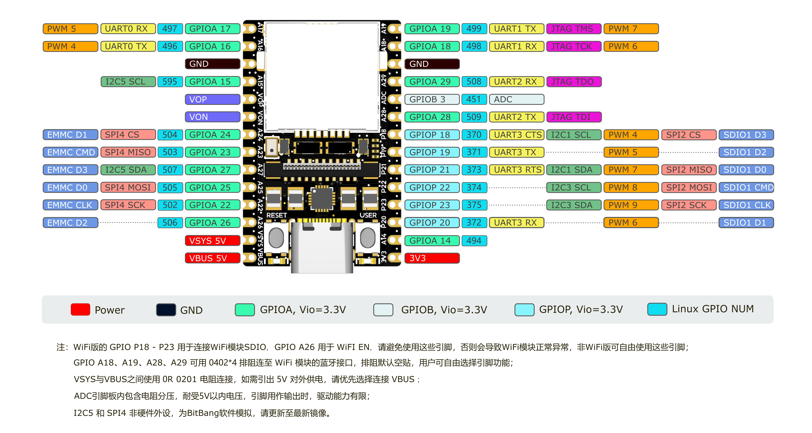

## 简介
LicheeRV Nano 是一款迷你尺寸的开发板（仅22.86*35.56mm），搭载算能GC2002处理器，大核1GHZ （RISC-V/ARM可选）小核700MHZ RISC-V，256MB DDR3内存，内置 1Tops NPU；板载MIPI-CSI、MIPI-DSI、SDIO、ETH、USB、SPI、UART、I2C等丰富的接口，可扩展多种多样的应用；直插/半孔设计，方便量产贴片。

## 参数

| 项目 | 参数 |
| --- | --- |
| CPU | 算能 SG2002；  大核：1GHz RISC-V C906 / ARM A53 二选一；  小核：700MHz RISC-V C906； 低功耗核：25～300M 8051 |
| NPU | 1TOPS INT8，支持 BF16 |
| 内存 | 内封 2Gbit (256MByte) DDR3 |
| 存储 | TF卡 / SD NAND 二选一启动 （SD NAND 焊盘在 TF 卡槽下）|
| 视频接口 | 视频输出：2 lane MIPI DSI 输出，标准 31pin 接口，支持 6pin 电容触摸屏  视频输入： 4 lane MIPI CSI 输入，22Pin 接口，支持拆分双路 CSI |
| 音频接口 | 音频输出： 板载PA功放，可在排针上直接连接1W以内的喇叭  音频输入： 板载模拟硅麦，可直接收音 |
| 有线连接 | E 后缀版本支持百兆 RJ45 连接器 |
| 无线连接 | W 后缀版本支持 2.4G / 5.8G 双频 WiFi6 + BLE5.4 |
| USB | 1 x USB2.0 OTG Type-C |
| IO接口 | 2 x 14pin 2.54 插针接口，间距 800mil，可直插面包板 |
| 按键 | 1 x RST 按键 + 1 x BOOT 按键 |
| 指示灯 | 1 x 电源 LED，1 x 用户 LED                                   |
|操作系统 | Buildroot Linux / Debian |
| 尺寸 | 22.86*35.56mm |

## 版本对比

| **配置** | **基础系统** | **麦克风/扬声器** | **以太网** | **WiFi6/BT5** |
| :---: | :---: | :---: | :---: | :---: |
| **LicheeRV-Nano-B** | Y | Y | N | N |
| **LicheeRV-Nano-E** | Y | Y | Y | N |
| **LicheeRV-Nano-W** | Y | Y | N | Y |
| **LicheeRV-Nano-WE** | Y | Y | Y | Y |

## 硬件资料

规格书、原理图、尺寸图等均可在这里找到：[点击这里](http://cn.dl.sipeed.com/shareURL/LICHEE/LicheeRV_Nano)

+ [板卡规格书](http://cn.dl.sipeed.com/shareURL/LICHEE/LicheeRV_Nano/01_Specification)
+ [板卡原理图](http://cn.dl.sipeed.com/shareURL/LICHEE/LicheeRV_Nano/02_Schematic)
+ [板卡点位图](http://cn.dl.sipeed.com/shareURL/LICHEE/LicheeRV_Nano/03_Designator_drawing)
+ [板卡尺寸图](http://cn.dl.sipeed.com/shareURL/LICHEE/LicheeRV_Nano/04_Mechanical_drawing)
+ [3D 模型文件](http://cn.dl.sipeed.com/shareURL/LICHEE/LicheeRV_Nano/06_3D_file)
+ [核心板封装](http://cn.dl.sipeed.com/shareURL/LICHEE/LicheeRV_Nano/05_PCB_Lib)
+ [板卡芯片资料](http://cn.dl.sipeed.com/shareURL/LICHEE/LicheeRV_Nano/07_Datasheet)

## 注意事项

+ 内测版硬件（70405）NPU 仅支持工作在0.5T下，1.0T下运行不保证板卡运行的稳定性
+ 若购买摄像头配件或WE版本套餐，包装内随附螺丝、焊接铜柱和螺丝刀，为避免焊接时烫伤，请参照[摄像头、WE网口小板安装指南](https://wiki.sipeed.com/hardware/zh/lichee/RV_Nano/unbox.html)
+ 若购买3寸、4寸、10.1寸屏幕配件，包装内随附屏幕转接板以及排线，请参照[屏幕安装指南](https://wiki.sipeed.com/hardware/zh/lichee/RV_Nano/unbox.html)

## 相关问题

