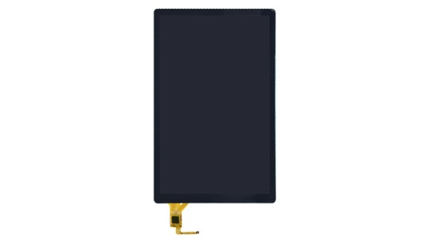
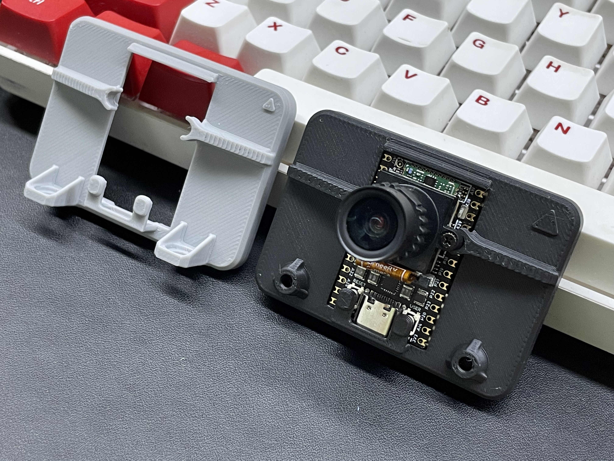

## LicheeRV Nano 套餐介绍

LicheeRV Nano根据网络分为四个版本：

+ 标准版（B）无网络配件

+ 网口版（E）板载100M网口

+ WiFi版（W）板载WiFi6/BT5.2模块，BT5.2功能默认不启用，如需使用蓝牙功能，需要贴此处4颗0201电阻或使用2B铅笔填涂短接

  

+ WiFi网口版（WE）板载WiFi6/BT5.2模块，同时提供一个网口小板，通过铜柱与排线连接到开发板上

同时我们提供以下六种配件：

+ 摄像头

  

  该摄像头（3754）左右螺丝固定孔不短路，铜柱推荐固定到第5个焊盘上

  

+ 3寸屏幕

  

  屏幕分辨率为480*845，带触摸；包装附赠屏幕触摸转接板和排线

+ 5寸屏幕

  

  屏幕分辨率为480*845，不带触摸；排线可直接连接到LicheeRV Nano 31Pin屏幕接口上

+ 7寸屏幕

  

  屏幕分辨率为800*1280，带触摸；排线可直接连接到LicheeRV Nano 31Pin屏幕接口和6Pin触摸接口上

+ 10寸屏幕

  

  屏幕分辨率为800*1280，带触摸；包装附赠触摸转接板和排线，屏幕排线可直接连接到LicheeRV Nano 31Pin屏幕接口

+ 树莓派摄像头转接排线（即将推出）

  
  
  树莓派标准15Pin摄像头转LicheeRV 22Pin CSI Camera接口

## 安装指南

### WE小板的安装

+ 焊接排线
  1. 按照下图方向焊接排线
  
     
  
  2. 使用万用表检测通断
  
     
  
+ 固定铜柱
  1. 为避免焊接铜柱时烫手，可以先将将铜柱拧到网口小板上
  
     
  
  2. 将铜柱插入第5个焊盘，可以提前在焊盘上涂抹锡膏，提升焊接后铜柱的稳定性
  
     
  
  3. 在底部使用电烙铁焊接
  
     
  
+ 组装
  1. 将排线接入网口小板的FPC座子，并锁紧
  
     
  
  2. 用螺丝将网口小板固定到铜柱上
  
     

### 摄像头的安装

+ 固定铜柱
  1. 与上面固定方法类似：先将铜柱和螺丝拧到摄像头模组上
  
     
  
  2. 将铜柱插入第5个焊盘，可以提前在焊盘上涂抹锡膏，提升焊接后铜柱的稳定性
  
     
  
  3. 在底部使用电烙铁焊接
  
     
  
+ 组装
  1. 根据下图连接摄像头排线
  
     
  
  2. 螺丝固定
  
     

## 开源模型

为提升用户使用体验，我们开源了LicheeRV Nano + 2.28寸屏幕（即将上架） + 摄像头 的3D打印框架
 

大家可以在[这里](https://makerworld.com/zh/models/167463#profileId-183872)下载到模型，喜欢的话别忘了给设计师点个赞哦