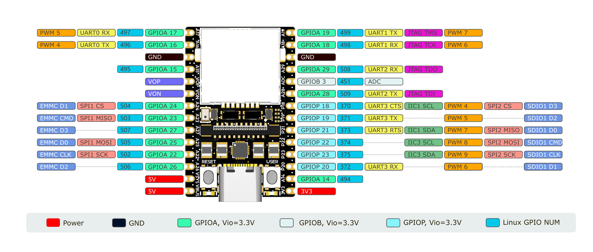

## 连接开发板

### UART0

将UART串口连接到板子的 `GND `、`A16（TX） `、`A17（RX） `

然后使用终端软件连接串口，波特率115200

在USB接口上的SBU1/2上也引出了UART0，可使用USB TypeC转接板引出RX0、TX0

#### 禁止 UART0 输出日志

首先将用户空间的输出转到别的tty设备上:

```
#include <stdlib.h>
#include <unistd.h>
#include <sys/ioctl.h>
#include <fcntl.h>

int main(int argc, char *argv[]) {
        int fd;
        if (argc < 2) {
                fprintf(stderr, "usage: %s /dev/ttyX\n", argv[0]);
                exit(EXIT_FAILURE);
        }
        fd = open(argv[1], O_RDWR);
        if (fd < 0) {
                perror("open");
                exit(EXIT_FAILURE);
        }
        ioctl(fd, TIOCCONS);
        close(fd);
        exit(EXIT_SUCCESS);
}
```

```
riscv64-unknown-linux-gcc tioccons.c -o tioccons
./tioccons /dev/tty2 # 将/dev/console转接到tty2上
```

然后设置内核日志等级:

```
echo 0 > /proc/sys/kernel/printk
```

测试方法:

```
echo userspace > /dev/console
echo kernel > /dev/kmsg
```

### UART1 UART2 UART3

UART1和2的引脚默认用作连接UART蓝牙芯片:

https://github.com/sipeed/LicheeRV-Nano-Build/blob/61ecf59b8b3653e430c8905c7a1ae80201d60f84/build/boards/sg200x/sg2002_licheervnano_sd/u-boot/cvi_board_init.c#L91
```
mmio_write_32(0x03001070, 0x1); // GPIOA 28 UART1 TX
mmio_write_32(0x03001074, 0x1); // GPIOA 29 UART1 RX
mmio_write_32(0x03001068, 0x4); // GPIOA 18 UART1 CTS
mmio_write_32(0x03001064, 0x4); // GPIOA 19 UART1 RTS
```

如果想要同时使用UART1和UART2的功能，则需要写入寄存器来设置引脚的PINMUX:

在Linux用户空间可以使用devmem工具来写入寄存器

shell:

```
devmem 0x03001070 32 0x2 # GPIOA 28 UART2 TX
devmem 0x03001074 32 0x2 # GPIOA 29 UART2 RX
devmem 0x03001068 32 0x6 # GPIOA 18 UART1 RX
devmem 0x03001064 32 0x6 # GPIOA 19 UART1 TX
```

UART3 的引脚被默认复用为SDIO:

https://github.com/sipeed/LicheeRV-Nano-Build/blob/61ecf59b8b3653e430c8905c7a1ae80201d60f84/build/boards/sg200x/sg2002_licheervnano_sd/u-boot/cvi_board_init.c#L83

```
mmio_write_32(0x030010D0, 0x0); // D3
mmio_write_32(0x030010D4, 0x0); // D2
mmio_write_32(0x030010D8, 0x0); // D1
mmio_write_32(0x030010DC, 0x0); // D0
mmio_write_32(0x030010E0, 0x0); // CMD
mmio_write_32(0x030010E4, 0x0); // CLK
```

如果想要使用UART3的功能，则需要写入寄存器来设置引脚的PINMUX:

在Linux用户空间可以使用devmem工具来写入寄存器

shell:

```
devmem 0x030010D0 32 0x5 # GPIOP 18 UART3 CTS
devmem 0x030010D4 32 0x5 # GPIOP 19 UART3 TX
devmem 0x030010D8 32 0x5 # GPIOP 20 UART3 RX
devmem 0x030010DC 32 0x5 # GPIOP 21 UART3 RTS
```

Linux系统中的串口使用:

C:

```
/* TODO */
```


shell:

```
stty -F /dev/ttyS1 115200 # 设置UART1波特率为115200
stty -F /dev/ttyS1 raw    # 设置tty为RAW模式
echo -n UUU > /dev/ttyS1 # 发送 UUU(0x55 0x55 0x55)
hexdump -C /dev/ttyS1     # 以HEX格式显示收到的数据
```

### usb rndis 网口

将板子的usb typec口连接到电脑时会提供一个usb rndis网卡设备(linux gadget 提供)

PC会使用DHCP自动获取地址

将自动获取的IPv4地址最后一位换成1即是板子的IPv4地址:

```
10.44.55.66 PC机的IPv4地址
10.44.55.1  板子的IPv4地址
```

然后使用 ssh root@板子的IP地址进行连接:

用户名: root
密码:   root

Windows 系统下，需要进行一些配置。

打开设备管理器，找到下面的选项：


选择更新驱动程序：


选择浏览我的电脑以查找驱动程序：


选择让我从计算机上的可用驱动程序列表中选取：


在设备类型列表中选择网络适配器：


厂商选择 Microsoft，型号选择远程NDIS兼容设备：


若弹出这个警告请点击确定：


更新成功后显示如下：


然后可在设备管理器中的网络适配器列表下找到远程NDIS兼容设备项：


### 网线连接

将网线连接到板子，板子开机时会使用DHCP自动获取地址

板子镜像默认启用了MDNS服务

使用命令:

```
avahi-browse -art | grep licheervnano
```

列出广播域中域名带有的licheervrvnano的设备


然后使用:

```
ssh root@licheervnano-XXXX.local
```

连接板子

## SOC相关

查看SOC温度：
```shell
cat /sys/class/thermal/thermal_zone0/temp
```

查看SOC时钟：
```shell
cat /sys/kernel/debug/clk/clk_summary
```

## Audio

licheerv nano 支持录音和播放，使用标准 ALSA 工具可以进行录音、播放等操作。

### 录音

首先设置麦克风音量，范围：0-24
```shell
amixer -Dhw:0 cset name='ADC Capture Volume' 24
```

如果没有找到amixer工具，也可以使用alsamixer(tui)

设置完成后开始录音：
```shell
arecord -Dhw:0,0 -d 3 -r 48000 -f S16_LE -t wav test.wav & > /dev/null &
```

### 播放

```shell
./aplay -D hw:1,0 -f S16_LE test.wav
```

## GPIO

### LicheeRV Nano引脚图&Linux GPIO编号：



系统内GPIO查看：

```shell
cat /sys/kernel/debug/clk/clk_summary
```

### GPIO操作

首先用 'devmem 0x0300xxxx 32 0xxx' 修改引脚的PINMUX到GPIO

寄存器查找方式（以A22为例）：在[此处](https://github.com/sophgo/sophgo-doc/releases/download/sg2000-trm-v1.0-beta/sg2000_trm_cn.pdf)下载SG2002寄存器手册，手册中查找XGPIOA[22]，在表格中对应到GPIO，shell命令： 'devmem 0x03001050 32 0x03'

```shell
# xxx 为上图中Linux GPIO NUM，如A22：num=502
num=xxx
echo ${num} > /sys/class/gpio/export  
# GPIO 写
echo out > /sys/class/gpio/gpio${num}/direction 
echo 1 > /sys/class/gpio/gpio${num}/value  
echo 0 > /sys/class/gpio/gpio${num}/value
# GPIO 读
echo in > /sys/class/gpio/gpio${num}/direction 
cat /sys/class/gpio/gpio${num}/value
```

## UART

### UART1/2
UART1和2的引脚默认用作连接UART蓝牙芯片:

https://github.com/sipeed/LicheeRV-Nano-Build/blob/61ecf59b8b3653e430c8905c7a1ae80201d60f84/build/boards/sg200x/sg2002_licheervnano_sd/u-boot/cvi_board_init.c#L91
```c
mmio_write_32(0x03001070, 0x1); // GPIOA 28 UART1 TX
mmio_write_32(0x03001074, 0x1); // GPIOA 29 UART1 RX
mmio_write_32(0x03001068, 0x4); // GPIOA 18 UART1 CTS
mmio_write_32(0x03001064, 0x4); // GPIOA 19 UART1 RTS
```

如果想要同时使用UART1和UART2的功能，则需要写入寄存器来设置引脚的PINMUX:

在Linux用户空间可以使用devmem工具来写入寄存器

shell:

```shell
devmem 0x03001070 32 0x2 # GPIOA 28 UART2 TX
devmem 0x03001074 32 0x2 # GPIOA 29 UART2 RX
devmem 0x03001068 32 0x6 # GPIOA 18 UART1 RX
devmem 0x03001064 32 0x6 # GPIOA 19 UART1 TX
```

### UART3

UART3 的引脚被默认复用为SDIO:

https://github.com/sipeed/LicheeRV-Nano-Build/blob/61ecf59b8b3653e430c8905c7a1ae80201d60f84/build/boards/sg200x/sg2002_licheervnano_sd/u-boot/cvi_board_init.c#L83

```c
mmio_write_32(0x030010D0, 0x0); // D3
mmio_write_32(0x030010D4, 0x0); // D2
mmio_write_32(0x030010D8, 0x0); // D1
mmio_write_32(0x030010DC, 0x0); // D0
mmio_write_32(0x030010E0, 0x0); // CMD
mmio_write_32(0x030010E4, 0x0); // CLK
```

如果想要使用UART3的功能，则需要写入寄存器来设置引脚的PINMUX:

在Linux用户空间可以使用devmem工具来写入寄存器

shell:

```shell
devmem 0x030010D0 32 0x5 # GPIOP 18 UART3 CTS
devmem 0x030010D4 32 0x5 # GPIOP 19 UART3 TX
devmem 0x030010D8 32 0x5 # GPIOP 20 UART3 RX
devmem 0x030010DC 32 0x5 # GPIOP 21 UART3 RTS
```

Linux系统中的串口使用:

C:

```
/* TODO */
```


shell:

```shell
stty -F /dev/ttyS1 115200 # 设置UART1波特率为115200
stty -F /dev/ttyS1 raw    # 设置tty为RAW模式
echo -n UUU > /dev/ttyS1 # 发送 UUU(0x55 0x55 0x55)
hexdump -C /dev/ttyS1     # 以HEX格式显示收到的数据
```

## I2C

插针上引出了 I2C1 和 I2C3，将设备连接到其上即可。

使用前需要先正确设置 PINMUX：
```shell
# I2C1
devmem 0x030010D0 32 0x2 # GPIOP 18 I2C1 SCL
devmem 0x030010DC 32 0x2 # GPIOP 21 I2C1 SDA
# I2C3
devmem 0x030010E0 32 0x2 # GPIOP 22 I2C3 SCL
devmem 0x030010E4 32 0x2 # GPIOP 23 I2C3 SDA
```

然后可以使用 i2c-tools 进行 i2c 外设的操作，镜像中已经预装。

带WiFi模块的板卡（W、WE版）I2C1和I2C3硬件上连接到WiFi模块的SDIO，存在I2C无法读写的可能，PINMUX到I2C时WiFi模块暂时不可用，可使用以下命令恢复WiFi连接：
```shell
# PINMUX到SDIO
devmem 0x030010D0 32 0x0
devmem 0x030010DC 32 0x0
devmem 0x030010D0 32 0x0
devmem 0x030010DC 32 0x0
# 重启WiFi服务
/etc/init.d/S30wifi stop
/etc/init.d/S30wifi start
```

摄像头和触摸屏接口共用I2C4，可使用 'i2cdetect -ry 4' 扫描设备。需注意I2C4处于1.8V电源域，连接其他设备时请注意电平匹配。

## SPI

SPI2默认被复用作SDIO:

https://github.com/sipeed/LicheeRV-Nano-Build/blob/61ecf59b8b3653e430c8905c7a1ae80201d60f84/build/boards/sg200x/sg2002_licheervnano_sd/u-boot/cvi_board_init.c#L83

```
mmio_write_32(0x030010D0, 0x0); // D3
mmio_write_32(0x030010D4, 0x0); // D2
mmio_write_32(0x030010D8, 0x0); // D1
mmio_write_32(0x030010DC, 0x0); // D0
mmio_write_32(0x030010E0, 0x0); // CMD
mmio_write_32(0x030010E4, 0x0); // CLK
```

如果想要使用SPI2，则需要更改PINMUX:

```
devmem 0x030010D0 32 0x1 # GPIOP 18 SPI2 CS
devmem 0x030010DC 32 0x1 # GPIOP 21 SPI2 MISO
devmem 0x030010E0 32 0x1 # GPIOP 22 SPI2 MOSI
devmem 0x030010E4 32 0x1 # GPIOP 22 SPI2 SCK
```

简单测试SPI:

将SPI的MISO和MOSI连起来，然后执行:

```
spidev_test -D /dev/spidevN.N -p 1234 -v
# 将N.N换成对应的BUS
```

如果TX和RX的数据一样，则引脚复用没有问题

## ADC

LicheeRV Nano插针上引出了一路12位ADC，在板内已做分压处理，如图：


经测试，ADC输入电压在0-4.6V时，对应ADC值为0000-4095 

首先选择 ADC channel，这里以 ADC1 为例：
```shell
echo 1 > /sys/class/cvi-saradc/cvi-saradc0/device/cv_saradc
```

读取 ADC1 的值：
```shell
cat /sys/class/cvi-saradc/cvi-saradc0/device/cv_saradc
```

## LCD

将屏幕的排线接到板子的MIPI接口，注意线序

创建或编辑sd卡第一个分区中的uEnv.txt文件，添加或修改panel字段:

注：镜像将第一个分区已经挂载到/boot目录下，可在终端中直接操作：
```shell
cd /boot
touch uEnv.txt
vi uEnv.txt
# 使用 'i' 进入编辑
# 使用 'Esc',':wq'保存并退出
```

7寸屏:

```
panel=zct2133v1
```

5寸屏:
```
panel=st7701_dxq5d0019b480854
```

3寸屏:

```
panel=st7701_d300fpc9307a
```

2.3寸屏:

```
panel=st7701_hd228001c31
```

如果想用framebuffer功能，则在sd卡第一个分区创建一个文件名为fb的文件:

```
touch /boot/fb
```

然后加载驱动:

```
/etc/init.d/S04fb start
```

调整屏幕背光亮度:

```
echo 0 > /sys/class/pwm/pwmchip8/pwm2/enable
echo 5000 > /sys/class/pwm/pwmchip8/pwm2/duty_cycle # 50%
echo 1 > /sys/class/pwm/pwmchip8/pwm2/enable

# some example:
#echo 2000 > /sys/class/pwm/pwmchip8/pwm2/duty_cycle # 20%
#echo 4000 > /sys/class/pwm/pwmchip8/pwm2/duty_cycle # 40%
#echo 7000 > /sys/class/pwm/pwmchip8/pwm2/duty_cycle # 70%
#echo 9000 > /sys/class/pwm/pwmchip8/pwm2/duty_cycle # 90%
```

## 触摸屏

将触摸屏排线接到板子的触摸屏接口，注意线序

如果是gt911芯片，则需要在第一个分区创建一个gt9xx文件:

```
touch /boot/gt9xx
```

然后加载驱动

```
/etc/init.d/S05tp start
```

然后执行:

```
echo 2 | evtest
```

点击触摸屏会在终端看到具体坐标

## WIFI

将天线安装到WIFI模块的天线座子上

### STA

在sd卡第一个分区创建wifi.sta文件启用sta模式:

```
touch /boot/wifi.sta
rm /boot/wifi.ap /boot/wifi.mon
```

然后将AP的SSID和密码写入文件:

```
echo ssid > /boot/wifi.ssid
echo pass > /boot/wifi.pass
```

重启Wifi服务

```
/etc/init.d/S30wifi stop
/etc/init.d/S30wifi start
```

### AP

在sd卡第一个分区创建wifi.ap文件启用ap模式:

```
touch /boot/wifi.ap
rm /boot/wifi.mon /boot/wifi.sta
```

然后将要创建AP的SSID和密码写入文件:

```
echo ssid > /boot/wifi.ssid
echo pass > /boot/wifi.pass
```

重启Wifi服务

```
/etc/init.d/S30wifi stop
/etc/init.d/S30wifi start
```


### MON

在sd卡第一个分区创建wifi.mon文件启用监听模式:

```
touch /boot/wifi.mon
rm /boot/wifi.ap /boot/wifi.sta
```

重启Wifi服务

```
/etc/init.d/S30wifi stop
/etc/init.d/S30wifi start
```

使用tcpdump或airodump-ng来捕获报文


## 摄像头

将摄像头安装到摄像头座子，注意线序

然后执行:

```
/mnt/system/usr/bin/sample_vio 6 # 将摄像头画面实时显示到屏幕
# 输入255回车，退出程序
```

```
/mnt/system/usr/bin/sensor_test # 摄像头测试程序，可以用来dump单张yuv图像
```

如果使用70405(内测版)的板子:

```
touch /boot/alpha # 内测版
# rm /boot/alpha  # 正式版
cd /mnt/data
cp sensor_cfg.ini.alpha sensor_cfg.ini   # 内测版
# cp sensor_cfg.ini.beta sensor_cfg.ini  # 正式版

```


## 按键

使用命令查看按键事件:

```
echo 1 | evtest
```

然后按下USER按键，可以在终端看到对应的事件报告
