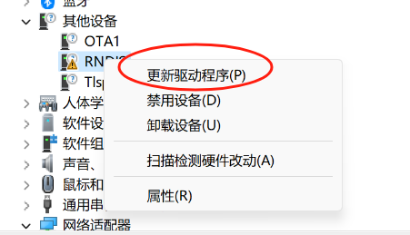
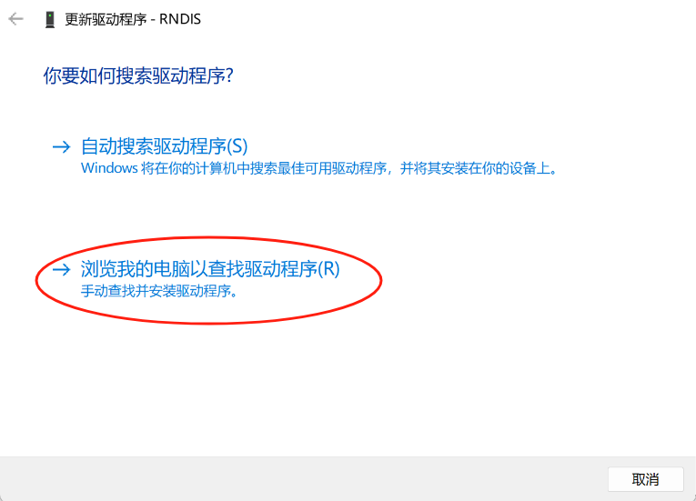
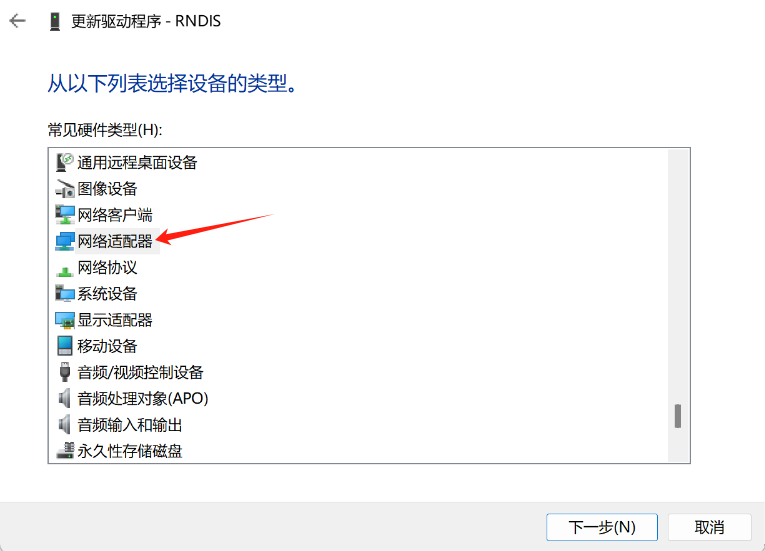
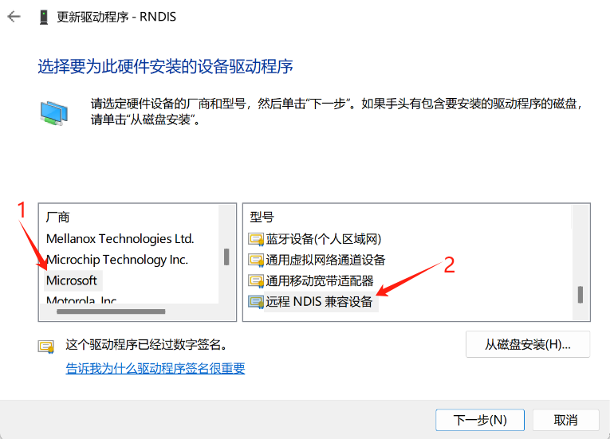
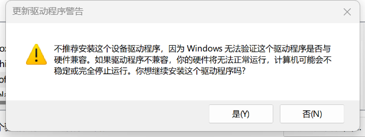

## 引脚分布


### UART0

将UART串口连接到板子的:

A17 A16 GND

然后使用终端软件连接串口，波特率115200


### usb cdc acm 串口

将板子的usb typec口连接到电脑时会提供一个usb cdc acm串口设备(linux gadget 提供)

Linux:

```
# 将/dev/ttyACMX替换为具体的设备，取决于你的电脑
picoco -b 9600 /dev/ttyACMX
```

Windows:

Win + R devmgmt.msc 回车

在串口设备处找到新的设备的串口号

然后使用putty或超级终端进行连接

### usb rndis 网口

将板子的usb typec口连接到电脑时会提供一个usb rndis网卡设备(linux gadget 提供)

PC会使用DHCP自动获取地址

将自动获取的IPv4地址最后一位换成1即是板子的IPv4地址:

```
10.44.55.66 PC机的IPv4地址
10.44.55.1  板子的IPv4地址
```

然后使用 ssh root@板子的IP地址进行连接:

用户名: root
密码:   cvitek

Windows 系统下，需要进行一些配置。

打开设备管理器，找到下面的选项：


选择更新驱动程序：


选择浏览我的电脑以查找驱动程序：


选择让我从计算机上的可用驱动程序列表中选取：


在设备类型列表中选择网络适配器：


厂商选择 Microsoft，型号选择远程NDIS兼容设备：


若弹出这个警告请点击确定：


更新成功后显示如下：


然后可在设备管理器中的网络适配器列表下找到远程NDIS兼容设备项：


### 网线连接

将网线连接到板子，板子开机时会使用DHCP自动获取地址

板子镜像默认启用了MDNS服务

使用命令:

```
avahi-browse -art | grep licheervnano
```

列出广播域中域名带有的lpirvnano的设备


然后使用:

```
ssh root@licheervnano-XXXX.local
```

连接板子

## Audio

licheerv nano 支持录音和播放，使用标准 ALSA 工具可以进行录音、播放等操作。

### 录音

首先设置麦克风音量，范围：0-24
```shell
amixer -Dhw:0 cset name='ADC Capture Volume' 24
```

设置完成后开始录音：
```shell
arecord -Dhw:0,0 -d 3 -r 48000 -f S16_LE -t wav test.wav & > /dev/null &
```

### 播放

```shell
./aplay -D hw:1,0 -f S16_LE test.wav
```

## I2C

插针上引出了 I2C1 和 I2C3，将设备连接到其上即可。

使用前需要先正确设置 PINMUX：
```shell
# I2C1
devmem 0x030010D0 32 0x2
devmem 0x030010DC 32 0x2
# I2C3
devmem 0x030010E4 32 0x2
devmem 0x030010E0 32 0x2
```

然后可以使用 i2c-tools 进行 i2c 外设的操作，镜像中已经预装。

## ADC

插针上引出了一路 ADC，使用的是 ADC1。

首先选择 ADC channel，这里以 ADC1 为例：
```shell
echo 1 > /sys/class/cvi-saradc/cvi-saradc0/device/cv_saradc
```

读取 ADC1 的值：
```shell
cat /sys/class/cvi-saradc/cvi-saradc0/device/cv_saradc
```

## LCD

将屏幕的排线接到板子的MIPI接口，注意线序

然后在cvi_mmf_sdk的panel中选择对应的时序设置，（MIPI屏幕初始化代码放在uboot中）

然后编译出新的uboot: fip.bin，放在系统SD卡的第一个分区

LCD会提供framebuffer供用户空间程序访问：

一些用于测试的demo:

```
fbpattern # 测试LCD时序
fbbar     # 在屏幕上显示字符串
```

建议使用QT5，SDL1.2，或LVGL进行界面开发，也可以直接写入Framebuffer

## 触摸屏

将触摸屏排线接到板子的触摸屏接口，注意线序

然后执行:

```
echo 2 | evtest
```

点击触摸屏会在终端看到具体坐标

## WIFI

将天线安装到WIFI模块的天线座子上

### STA

在sd卡第一个分区创建wifi.sta文件启用sta模式:

```
touch wifi.sta
rm wifi.ap wifi.mon
```

然后将AP的SSID和密码写入文件:

```
echo ssid > wifi.ssid
echo pass > wifi.pass
```

执行 /etc/init.d/S30wifi start 来切换模式

### AP

在sd卡第一个分区创建wifi.ap文件启用ap模式:

```
touch wifi.ap
rm wifi.mon wifi.sta
```

然后将要创建AP的SSID和密码写入文件:

```
echo ssid > wifi.ssid
echo pass > wifi.pass
```

执行 /etc/init.d/S30wifi start 来切换模式

### MON

在sd卡第一个分区创建wifi.mon文件启用监听模式:

```
touch wifi.mon
rm wifi.ap wifi.sta
```

执行 /etc/init.d/S30wifi start 来切换模式

使用tcpdump或airodump-ng来捕获报文


## 摄像头

将摄像头安装到摄像头座子，注意线序

然后执行:

```
/mnt/system/usr/bin/sample_vio 6 # 将摄像头画面实时显示到屏幕
```

## 按键

使用命令查看按键事件:

```
echo 1 | evtest
```

然后按下USER按键，可以在终端看到对应的事件报告
