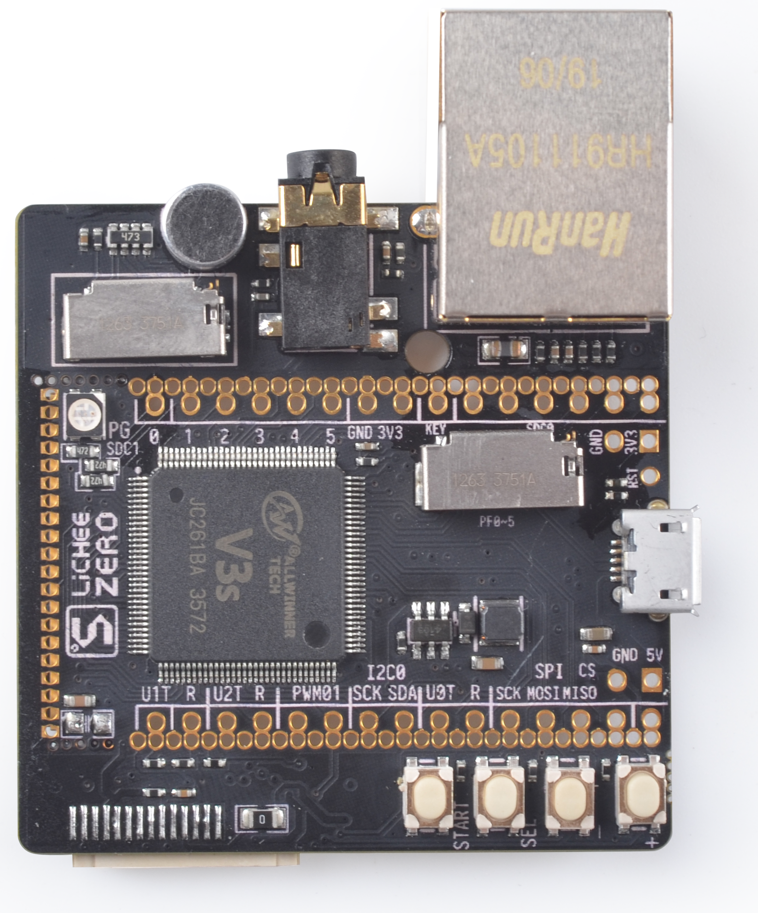
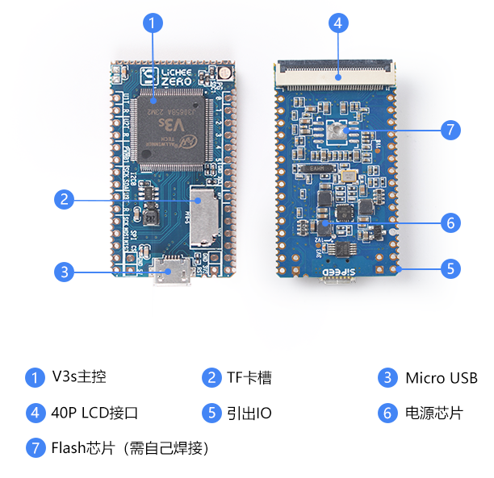

# Lichee Zero

## Lichee Zero 概述
Lichee Zero是基于全志科技的V3s(ARM Cortex-A7内核)高性能CPL芯片设计的迷你开发板。开发板设计小巧精致，将芯片的所有资源都引出,板载USB、Flash、TF卡、4OP LCD接口等，并把所有IO资源引出，方便开发者拓展使用，适合初学者学习linux或者商用于产品开发。

核心板：

<html>

</html>

核心板+扩展板：

<html>

</html>

## 参数

### V3s参数

V3s框架

| 项目 | 参数 |
| --- | --- |
| CPU | ARM Cortex™-A7 最高1.2GHz|
| Memory |  Integrated 64MB DRAM  |
| Audio Codec | • Integrated 92dB audio codec • Supports two ADC channels and two DAC channels • Supports one low-noise analog microphone bias outputs • Supports one microphone input and one stereo microphone outpu |
| Video | • Supports 1080p@40fps or 1080p@30fps+VGA@30fps H.264 video encoding, • Supports H.264 1080p@30fps decoding, MJPEG 1080@30fps decoding |
| Video Input/Output | • Supports 8/10/12-bit parallel CSI and 4-lane MIPI CSI2 • Supports up to 5M CMOS sensor • Supports RGB/i80/LVDS LCD up to 1024x768 resolution |
| Connectivity | •  3 x SD card controllers •  LRADC/SPI/TWI/UART/PWM •  USB, EMAC+PHY |
| ISP | • Integrated ISP up to 5M pixels • Supports two channel outputs for display and encoding respectively • Supports various input and output formats • Supports AE/AF/AWB • Supports saturation adjustment/ noise reduction/ defect pixel correction/distortion correction |

### Lichee Zero核心板参数

| 项目 | 参数 | 
| ---- | ---- |
| CPU | V3s |
| 内存 | 64MB DDR2 |
| 存储 | 预留 SOP8 SPI Flash焊盘  板载TF卡座 |
| 显示 | 通用40P RGB LCD FPC座 可直插常见的40P 4.3/5/7寸屏幕（板载背光驱动)，通过转接板可插50P 7/9寸屏 支持常见的272x480,480x800,1024x600等分辨率板载电阻式触摸屏芯片，支持电阻屏 板载RGB LED |
| 通讯接口 | SDIO x2，可搭配配套SDIO WiFi+BT模块 SPl x1 12C x2 UART x3 100M Ether x1(含EPHY) OTG USB x1 MIPI CSI x1 |
| 其他接口 |  PWM x2 LRADC x1 Speakerx2+ Mic x1 |
| 电气特性 | Micro USB 5V供电 2.54mm插针3.3V~5V供电 1.27mm邮票孔供电 |

### Lichee Zero 拓展板

| 项目 | 参数 |
| ---- | ---- |
| CPU | V3s |
| 内存 | 64MB DDR2 |
| 存储 | 预留 SOP8 SPI Flash焊盘  板载TF卡座 |
| 显示 | 通用40P RGB LCD FPC座 可直插常见的40P 4.3/5/7寸屏幕（板载背光驱动)，通过转接板可插50P 7/9寸屏 支持常见的272x480,480x800,1024x600等分辨率板载电阻式触摸屏芯片，支持电阻屏 板载RGB LED |
| 通讯接口 | SDIO x2，可搭配配套SDIO WiFi+BT模块 SPI x1 I2C x2 UART x3 100M Ether x1(含EPHY) OTG USB x1 MIPI CSI x1 |
| 其他接口 |  PWM x2 LRADC x1 Speakerx2+ Mic x1 |
| 板载外设 | 以太网接口 3.5mm耳机接口 驻极体麦克风 额外TF卡卡槽 4个按键 MIPI接口 |
| 电气特性 | Micro USB 5V供电 2.54mm插针3.3V~5V供电 1.27mm邮票孔供电 |

## 使用教程

[Lichee Zero](/soft/Lichee/zh/Zero-Doc/Start/board_intro.md)

## 产品技术支持

Lichee Zero 开发板可以在多种场景实现客户不同方面的需要，在 AIoT 上已经广泛的使用，品质和性能在行业内已经有非常好的口碑，专业的技术团队为广大客户解决硬件设计和软件功能上的各种各样问题。专业技术支持和更详细资料请联系商务 <support@sipeed.com>。