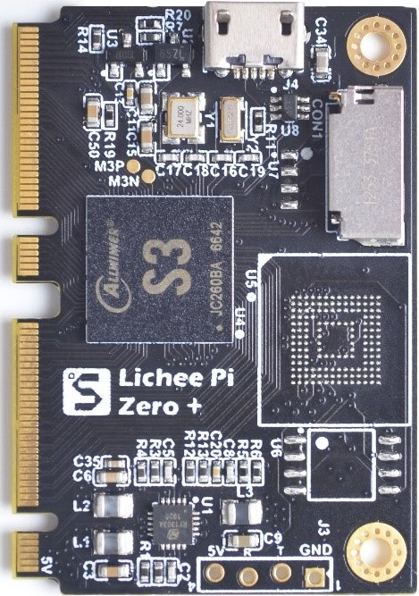

# Lichee ZeroPlus

## 概述
Lichee Zero Plus是基于全志科技的S3 (ARM Cortex-A7内核)的高性能CPU芯片设计的高集成度核心板。
使用双NGFF金手指设计，引出134pin引脚，方便开发者拓展使用。S3是V3s的升级版，1.2GHz主频，内置128MB ddr3内存，引脚相对V3s全很多。
支持MIPI摄像头，普通并口摄像头，RGB屏幕，内置ePHY.

## 参数
### 芯片
S3芯片架构

| 项目 | 参数 |
| --- | --- |
| CPU | • ARM® Cortex™-A7 @1.2GHz |
| GPU | • Supports 1080p@60fps or 2-channel 1080p@30fps H.264 video encoding, supports 8M JPEG encoding  • Supports H.264 1080p@60fps decoding, MJPEG 1080@30fps decoding |
| ISP | • Integrated ISP up to 8M pixels • Supports two channel outputs for display and encoding respectively • Supports various input and output formats • Supports AE/AF/AWB • Supports saturation adjustment/ noise reduction/ defect pixel correction/distortion correction |
| Video Input/Output | • Supports 8/10/12-bit parallel CSI and 4-lane MIPI CSI2 • Supports BT1120 input • Supports up to 8M CMOS sensor • Supports RGB/i80/LVDS LCD up to 1024x768 resolution • Supports Allwinner's next-gen SmartColor display technology for better visual effects for images & videos |
| Memory | • SIP 16-bit DDR3, up to 1333Mbp |
| Audio Codec | • Integrated 92dB audio codec • Supports two ADC channels and two DAC channels • Supports 3 MIC-in, a stereo Line-in, a headphone output and a stereo line-out output |
| Security Engine | • Supports AES/DES |
| Connectivity | • 3 x SD card controllers • LRADC/SPI/TWI/UART/PWM • USB, EMAC+PHY |

### 核心板
| 项目 | 参数 |
| --- | --- |
| CPU | ARM Cortex-A7 处理器(1.2Ghz)， VFPv4 浮点处理器 |
| 内存 | 芯片内置 128Mbyte DDR3 内存 (时钟频率最高 672MHz) |
| 存储 |可选 SPI Nor Flash(8/16/32MB)，SD Nand(128/512MB)，eMMC(4/8GB) Micro SD 卡 |
| 电源 | 5V 电源输入， 3 路 DCDC 稳压输出 (1.2,1.5,3.3) |
| 复位 | 板载复位芯片 |
| 晶振 | 板载 24M 主晶振， 32.768KHz RTC 晶振 |
| 接口 | NGFF M.2 B KEY x 2 共引出 67x2=134pin 板载 micro usb 接口和系统串口，可供下载固件及调试 |
| 系统支持 | 支持最新 Linux 5.2 mainline kernel, Linux 3.4 bsp kernel 支持 debian 发行版 |

## 使用教程

[Lichee Zero](/soft/Lichee/zh/Zero-Doc/Start/intro_cn.md)

## 产品技术支持

Lichee ZeroPlus 开发板可以在多种场景实现客户不同方面的需要，在 AIoT 上已经广泛的使用，品质和性能在行业内已经有非常好的口碑，专业的技术团队为广大客户解决硬件设计和软件功能上的各种各样问题。专业技术支持和更详细资料请联系商务 <support@sipeed.com>。