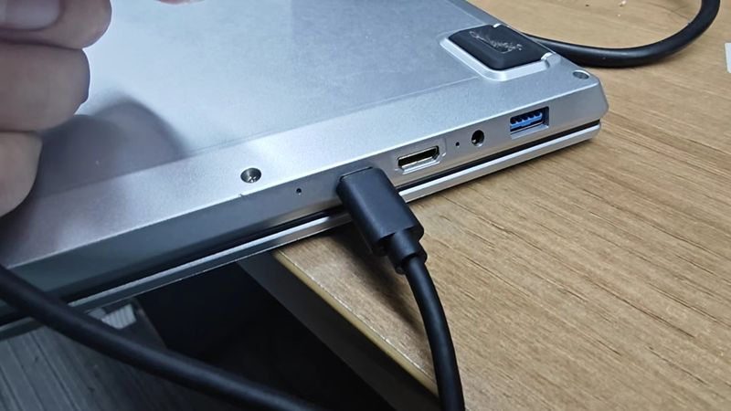

## 镜像下载:

https://github.com/0x754C/sipeed-th1520-laptop-extra/releases

百度网盘：
链接: https://pan.baidu.com/s/1jkJ4YR7EhMRZ11XmccKDtg   
提取码: qj1r   

Mega网盘：   
https://mega.nz/folder/p9BCTbLb#sWSZvLw6nrBmqujQXfvWrg   


## 全量镜像

### 通过 typeC 口烧录

1. 拆掉SSD后盖

2. 找到BOOT按键和RST按键


3. 按着BOOT按键，然后按键盘上的电源按键开机 （或者开机状态下按复位键），然后将 Book 连接 typec 口到烧录镜像的 PC。



1. 在烧录镜像的 PC 上下载用于烧录的镜像:


5. 执行烧录指令:

```
fastboot flash ram u-boot-with-spl-plastic8g.bin   #根据购买的内存型号选择
fastboot reboot
fastboot flash uboot u-boot-with-spl-plastic8g.bin
fastboot flash boot boot.ext4
fastboot flash root root.ext4
```

10. 按下 BOOT 旁边的 RST 按键重启 Book 笔记本。


