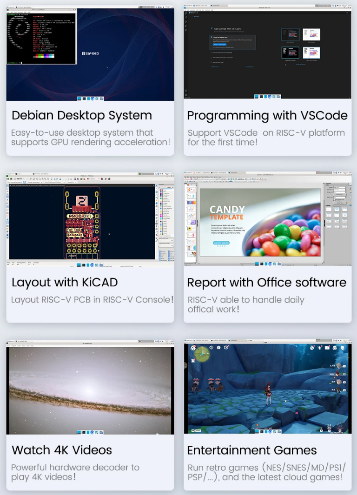
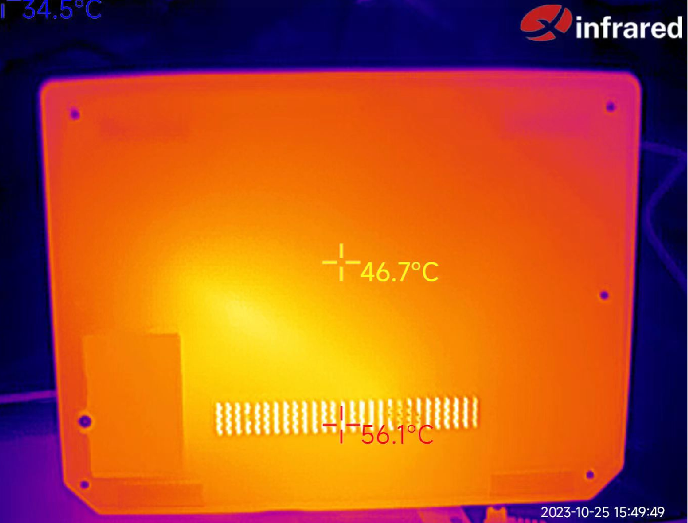

## 简介

Lichee Console 4A (以下简称 Console ) 是矽速科技研发的高性能 RISC-V 便携终端，旨在让RISC-V开发者提前体验RISC-V产品在实际生活中的应用。  
Lichee Console 4A 在不到A5笔记本的尺寸下集成了高性能RISC-V TH1520 SOM(8+32/16+128可选), 7寸1280x800电容触摸屏，72键键盘，以及USB-A，USB-C，2242 SSD卡槽，TF卡槽，miniHDMI，3.5mm耳机孔，以太网口 等丰富接口，真正做到了将RISC-V开发终端塞进口袋里～  
Lichee Console 4A 的软件支持也做到了较为完善的程度，默认搭载Debian操作系统，支持 Chrome浏览器，VSCode IDE，KiCAD PCB绘图软件，Office软件，4K播放器，多种游戏模拟器，基本满足日常工作学习使用。  
Lichee Console 4A 使用了模块化的设计方式，如果你之前购买了LicheePi4A，则可以复用SOM到Console上。

> 注意:高性能RISCV消费电子在当前(2023年)还是属于较为早期的阶段，Lichee Console 4A主要面向 RISC-V 开发者体验开发使用，至少要求熟练的Linux操作经验，普通消费者是无法直接上手使用的。
> 如果你是没有Linux经验的普通用户，请不要购买。


## 技术规格

<table>
<colgroup>
<col  class="org-left" />
<col  class="org-left" />
</colgroup>
<tr>
<td class="org-left">SOM</td>
<td class="org-left"> <a href="https://wiki.sipeed.com/lm4a">LM4A</a> </td>
</tr>
<tr>
<td class="org-left">CPU</td>
<td class="org-left"><strong>RISC-V RV64GCV C910@1.85GHz * 4</strong> </td>
</tr>
<tr>
<td class="org-left">GPU</td>
<td class="org-left">IMG™ B 系列 BXM-4-64 </td>
</tr>
<tr>
<td class="org-left">NPU</td>
<td class="org-left">4TOPS@INT8 </td>
</tr>
<tr>
<td class="org-left">Memory</td>
<td class="org-left"> 8GB or 16GB LPDDR4X </td>
</tr>
<tr>
<td class="org-left">Storage</td>
<td class="org-left"> 32GB or 128GB eMMC, NGFF 2242 SATA SSD </td>
</tr>
<tr>
<td class="org-left">Display</td>
<td class="org-left"> 7 inch 1280 x 800 LCD, miniHDMI </td>
</tr>
<tr>
<td class="org-left">Inoput</td>
<td class="org-left"> Capacitive Touch, RedPoint, 72-Keyboard </td>
</tr>
<tr>
<td class="org-left">Camera</td>
<td class="org-left"> 2MP Front Camera </td>
</tr>
<tr>
<td class="org-left">Audio</td>
<td class="org-left"> 3.5mm Headphone, MEMS MIC, StereoSpeaker </td>
</tr>
<tr>
<td class="org-left">Network</td>
<td class="org-left"> WiFi6 + BT5.4, RJ45 GbE </td>
</tr>
<tr>
<td class="org-left">Interface</td>
<td class="org-left"> USB3.0 Type-A, USB3.0 Type-C, 
USB2.0 Type-A, MicroSD Slot </td>
</tr>
<tr>
<td class="org-left"> Battery </td>
<td class="org-left"> 3000 mAh@7.6V </td>
</tr>
<tr>
<td class="org-left">Case</td>
<td class="org-left">Aluminum Alloy Case</td>
</tr>
<tr>
<td class="org-left">Size & Weight</td>
<td class="org-left">18.5 x 14 x 2 cm, 720g</td>
</tr>
<tr>
<td class="org-left">System</td>
<td class="org-left">Debian </td>
</tr>
</table>


## 上手指南

### 开箱
打开包装盒，上层是LicheeConsole4A主机


取下上层主机后，下层是12V3A电源适配器，和MiniHDMI线。


取出主机，认识下主机侧面的接口：


（如果你购买的是准系统套餐，则需要先查看后面的“SOM安装指南”安装好LM4A后再进行下面操作。）
打开主机，长按右上角电源键3s开机（看到屏幕背光亮起即可松开）


如果背光一直未亮起，可能是运输过程中电量耗尽，可以尝试插上电源适配器后长按电源开机。

开机背光亮起约10s后，屏幕会显示Linux企鹅图标和开机启动日志（早期镜像版本在此阶段竖屏显示）   
日志打印约20s后，开始进入Debian桌面系统。

进入桌面系统后，你可以测试 屏幕触摸，指点杆，键盘 是否工作，如有发现不能工作的，可以与客服联系。  

默认系统为Debian，预装了 Chrome，VSCode，Office，KiCAD，KODI，Parole 等应用软件，你可以一一体验。  
你可以使用sudo apt instal xxx 来安装软件，默认用户名密码为 sipeed，licheepi  
其它一般性软件使用可以参考LicheePi4A的相关文档章节。  

### SSD安装指南
Console支持M.2 2242 SATA 接口的SSD，可以拆卸掉后壳的SSD盖板后安装


### SOM安装指南
如果你选购了准系统套餐，则需要安装SOM模块。  
需要自备六角螺丝刀，拆卸开后盖，安装好SOM模块，在CPU/DDR上方安装硅脂，放置热管，再在热管上放置长条形硅脂片，重新安装回后盖。
详细安装可以参见下面章节的图片。


## 系统
Console的镜像与LicheePi4A的镜像一同发布，默认为Full镜像，建议使用8+32及以上配置的SOM。如果使用8+8的SOM需要自行裁剪文件系统。

可以到[这里](https://wiki.sipeed.com/hardware/zh/lichee/th1520/lcon4a/3_images.html)下载镜像。


常见应用展示：



Console 系统架构如下，细节可参照原理图或设备树文件。


## 功耗相关

### 供电
Console 整机功耗最大约11W，空载时约7~8W.  
可以使用12V DC3.5mm接口供电，或者USB-C口5V供电。

### 续航
为了Console的续航和发热考虑，目前默认镜像的CPU主频上限限制到了1.5GHz。  
在该主频下，实测使用时间在2~3小时。（stress-ng 压测 2小时，亮屏空载3小时）。  
默认屏幕亮度为50%，如果需要延长续航时间，可以降低屏幕亮度：   
```
sudo -i
cd /sys/class/backlight/pwm-backlight@0
echo xxx > brightness   # xxx is brightness you want, 0~100
```

功耗组成（300MHz空载亮屏，50%亮度）


### 散热
Console使用3cm涡轮风扇+10cm热管对CPU进行散热, 热管一端贴CPU，另一端由涡轮风扇散热，并且顶面使用导热硅脂接触底壳散热。  


在持续进行高负载工作下（如浏览器视频软解），CPU温度最终可达60～65度，底壳温度最高可达50度左右。  


如有更好的散热建议，可发送邮件到support@sipeed.com 
> 目前（2023.11）浏览器硬解尚未适配，所以在观看浏览器视频时会占用大量CPU，预计在12月份会合并入浏览器硬解功能。  

### 待机
Console的硬件电路设计中考虑了待机情况，对每个相关外设都加入了电源控制，但是目前(2023.11)TH1520的低功耗功能还未加入SDK，所以待机功能还需等待更新。  


### 关机
Console目前的关机功耗约为1.3mA，可支撑约3个月关机时间。


## 资料下载
[Sipeed 下载站](https://dl.sipeed.com/shareURL/LICHEE/LicheeConsole4A)


## 其他链接
[淘宝]
[Aliexpress](https://www.aliexpress.us/item/3256805987954160.html)

QQ群: 559614960 [点我自动加群](http://qm.qq.com/cgi-bin/qm/qr?k=5YkapIhdtWHp8AEfM5_bFFYQIX3CUQN6)
Telegram: https://t.me/linux4rv

论坛：Maixhub.com/discussion
联系邮箱：support@sipeed.com


