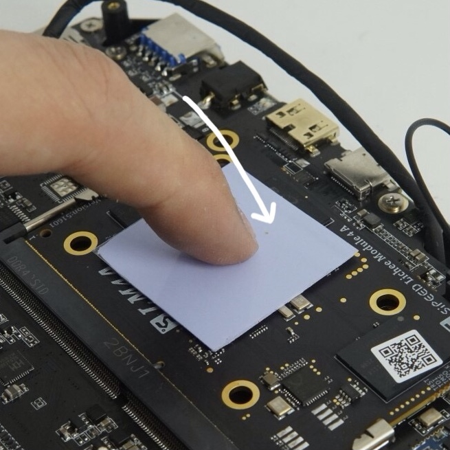
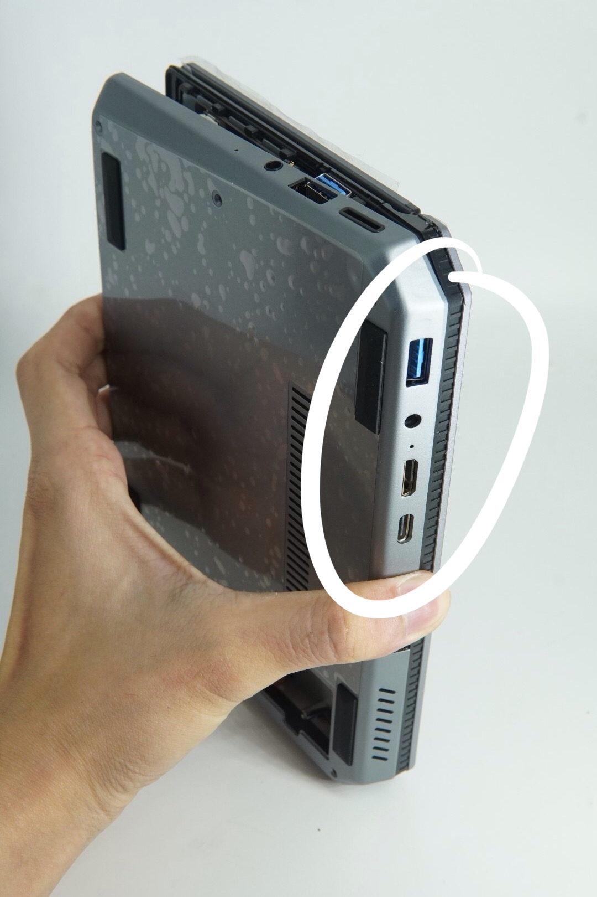
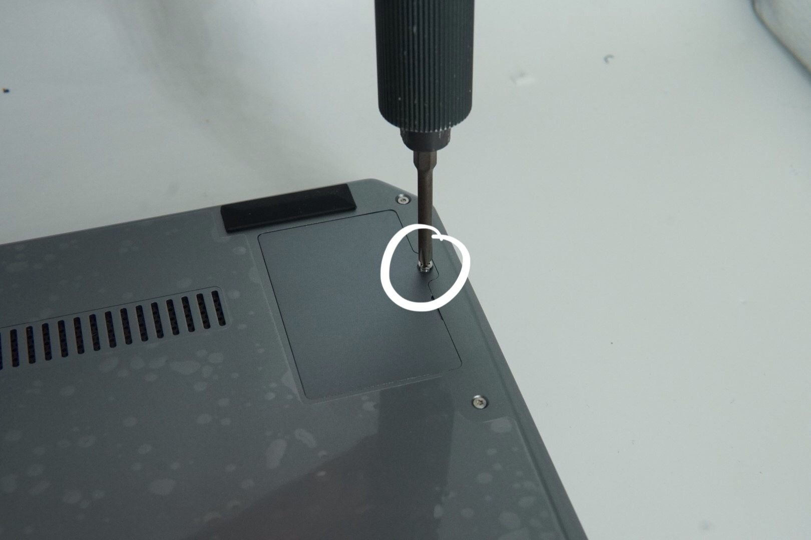
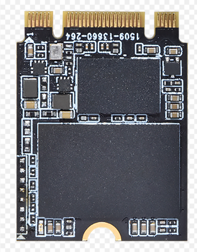

**购买A套餐用户收到配件如下，请先核对收到的产品配件是否齐全**
后壳x1、SSD盖板x1、SSD盖板螺丝x1、螺丝刀x1、导热垫x2、热管x1、后盖螺丝x6

图中所示十字批头请自备

# 组装步骤

1. 将核心板插入主板
    将其中一片导热垫置于下图所示TH1520核心位置。
    

2. 剥离导热垫离型膜
    

3. 将另一片导热垫从中间剪开备用

4. 将热管放置于核心板和风扇中间**（尽量靠近风扇以保证散热效果）**如下图所示。
    

5. 将剪开的两块散热垫放置于热管上，用于将热量导出至外壳，如图所示。

  为保证热管固定牢固，建议使用胶带对热管中部进行固定。

7. 插入电池连接排线**（注意电池排线的方向）**

  

7. 将后壳盖回，此处建议先将后方对齐后按压较为方便。

  **扣合另一边时可使用拆机片辅助会更为省力**

8. 将后壳扣回后，取出随机附带的6颗后盖螺丝及配送的螺丝刀，拧紧后壳固定螺丝，拧紧螺丝时建议同时按压后盖以保证卡扣不会弹开。
    
    **此处应注意固定SSD盖板的螺丝与后壳固定螺丝为不同尺寸**
    至此组装完成，开机使用即可

  # SSD安装

  1.使用十字螺丝刀取下SSD盖板

  2.准备NGFF接口的2242尺寸SSD

  

  3.旋下SSD固定螺丝
  

  4.将SSD插入，**此处由于空间较小，建议先将SSD放入机身，垂直于接口用力将SSD插入**
  

  

  5.插入到位后，旋上SSD固定螺丝，盖上SSD盖板，旋上盖板固定螺丝即可
  

