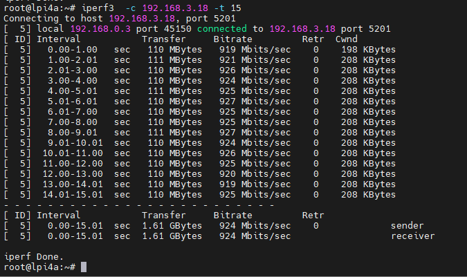
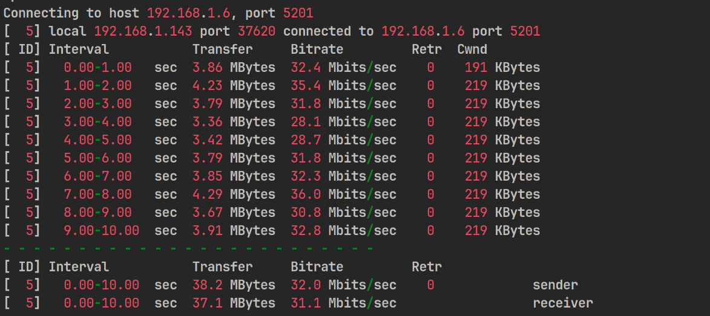
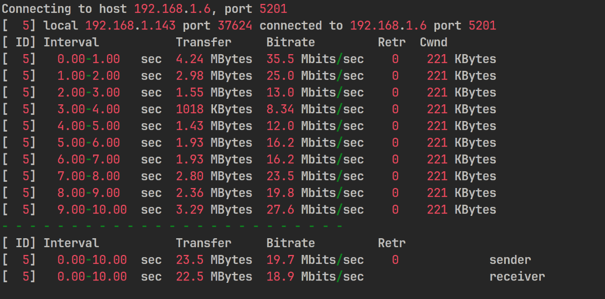
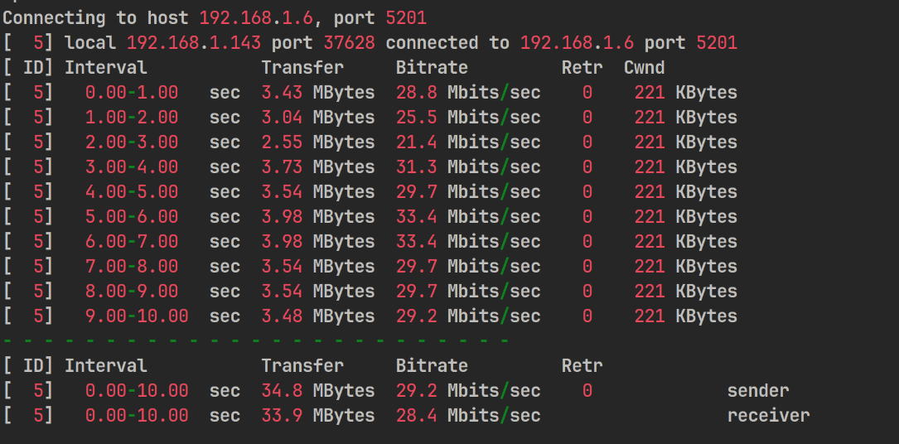
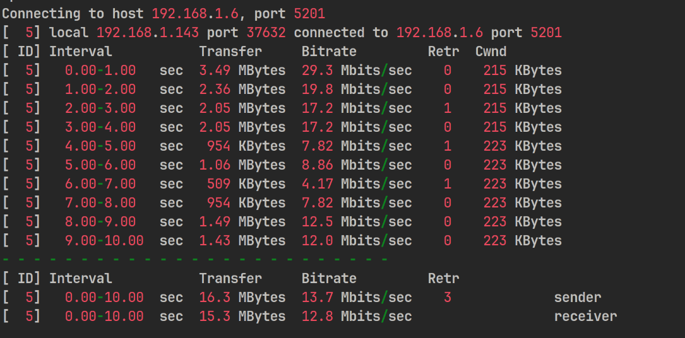
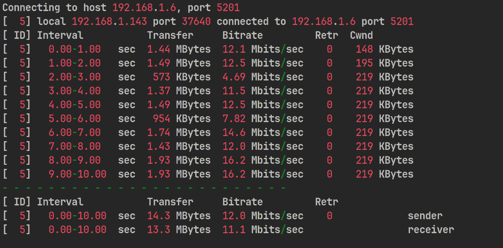
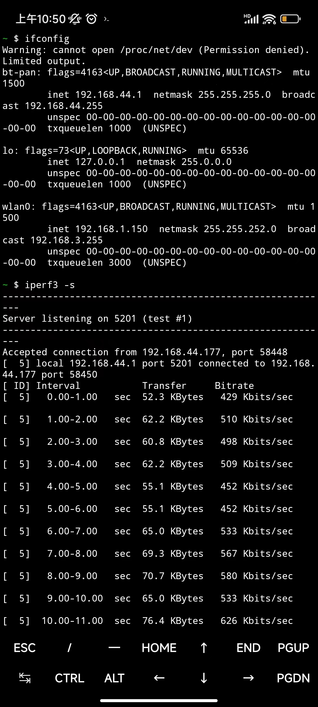
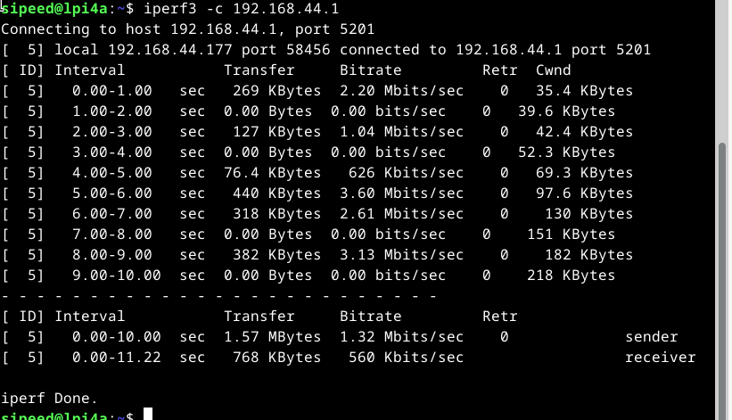

## 功耗测试 

### 静态功耗

| 场景(静态)     | 电压  | 电流  | 功耗  | 备注                                 |
| -------------- | ----- | ----- | ----- | ------------------------------------ |
| 待机           | 5.11V | 0.46A | 2.35W | 开启风扇，后续所有测试中风扇均不关闭 |
| 单网口连接网线 | 5.06V | 0.52A | 2.63W |                                      |
| 双网口连接网线 | 5.08V | 0.53A | 2.69W |                                      |
| 连接 HDMI 显示器 | 5.04V | 0.53A | 2.67W |                                      |

### 动态功耗

| 场景(动态)                 | 电压  | 电流  | 功耗  | 备注                                |
| -------------------------- | ----- | ----- | ----- | ----------------------------------- |
| 待机                       | 5.04V | 0.71A | 3.58W | 连接显示器、键盘、鼠标 使用一个网口 |
| STRESS-NG 压测<br>( CPU 矩阵运算) | 4.95V | 1.22A | 6.04W | CPU 频率上限 1.845GHz，电压 1V      |
| 浏览器播放视频             | 4.96V | 1.06A | 5.26W | 使用 GPU、无硬件解码, firefox 浏览器  |

## eMMC

```bash
#4k写入
dd if=/dev/zero of=test bs=4k count=100000 oflag=direct
#4k读取
dd if=test of=/dev/null bs=4k count=100000 iflag=direct
#删除测试文件
rm test
#连续写入(4MB)
dd if=/dev/zero of=test bs=4096k count=100 oflag=direct
#连续读取(4MB)
dd if=test of=/dev/null bs=4096k count=100 iflag=direct
#删除测试文件
rm test
#连续写入(64MB)
dd if=/dev/zero of=test bs=65536k count=10 oflag=direct
#连续读取(64MB)
dd if=test of=/dev/null bs=65536k count=10 iflag=direct
#删除测试文件
rm test
```

**8GB eMMC**

| Test Item | Result    |
| --------- | --------- |
| 4KB W     | 22.4 MB/s |
| 4KB R     | 22.4 MB/s |
| 4MB W     | 53.9 MB/s |
| 4MB R     | 296 MB/s  |
| 64MB W    | 229 MB/s  |
| 64MB R    | 298 MB/s  |


**32/128GB eMMC**

| Test Item | Result    |
| --------- | --------- |
| 4KB W     | 24.0 MB/s |
| 4KB R     | 40.3 MB/s |
| 4MB W     | 209 MB/s  |
| 4MB R     | 296 MB/s  |
| 64MB W    | 229 MB/s  |
| 64MB R    | 298 MB/s  |


## LPDDR4X

 

## GbE

`iperf3  -c 192.168.3.18 -t 15`

 

## WiFi

测试环境：室内空旷长走廊
测试方法：使用 iperf3，笔记本电脑作为 server，LPi4A 作为 client
测试设备：路由器使用 newifi D2, 笔记本电脑型号为 宏碁掠夺者战斧300

在路由器与 LPi4A 间隔不同距离的测试结果如下：
5m


10m


15m


20m


25m


30m



## Bluetooth

测试环境：室内近距离
测试方法：手机开启蓝牙共享网络，与开发板配对并连接蓝牙，使用iperf3测试
测试设备：小米13，LPi4A




## 温度

散热器: 风扇+铝散热片(25*25*5)
硅脂垫: Laird 500
待机状态：
 

压测结束：
 

## 其它

欢迎投稿～ 投稿接受后可得￥5～150（$1~20）优惠券！