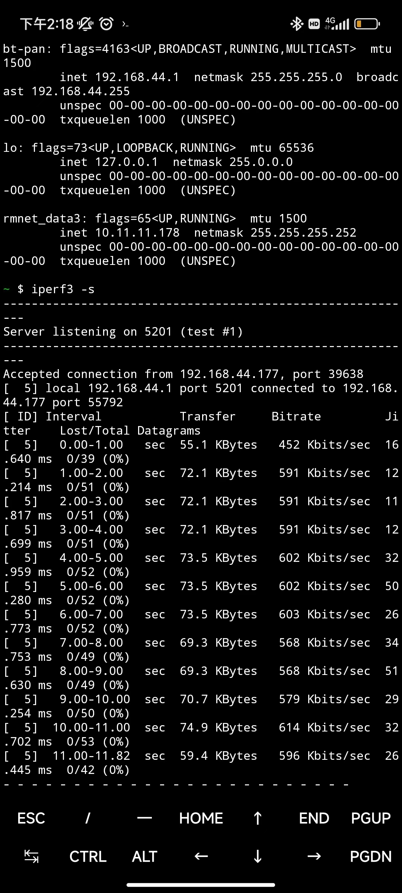

## 功耗测试 

### 静态功耗

| 场景(静态)     | 电压  | 电流  | 功耗  | 备注                                 |
| -------------- | ----- | ----- | ----- | ------------------------------------ |
| 待机           | 5.11V | 0.46A | 2.35W | 开启风扇，后续所有测试中风扇均不关闭 |
| 单网口连接网线 | 5.06V | 0.52A | 2.63W |                                      |
| 双网口连接网线 | 5.08V | 0.53A | 2.69W |                                      |
| 连接 HDMI 显示器 | 5.04V | 0.53A | 2.67W |                                      |

### 动态功耗

| 场景(动态)                 | 电压  | 电流  | 功耗  | 备注                                |
| -------------------------- | ----- | ----- | ----- | ----------------------------------- |
| 待机                       | 5.04V | 0.71A | 3.58W | 连接显示器、键盘、鼠标 使用一个网口 |
| STRESS-NG 压测<br>( CPU 矩阵运算) | 4.95V | 1.22A | 6.04W | CPU 频率上限 1.845GHz，电压 1V      |
| 浏览器播放视频             | 4.96V | 1.06A | 5.26W | 使用 GPU、无硬件解码, firefox 浏览器  |

## eMMC

```bash
#4k写入
dd if=/dev/zero of=test bs=4k count=100000 oflag=direct
#4k读取
dd if=test of=/dev/null bs=4k count=100000 iflag=direct
#删除测试文件
rm test
#连续写入(4MB)
dd if=/dev/zero of=test bs=4096k count=100 oflag=direct
#连续读取(4MB)
dd if=test of=/dev/null bs=4096k count=100 iflag=direct
#删除测试文件
rm test
#连续写入(64MB)
dd if=/dev/zero of=test bs=65536k count=10 oflag=direct
#连续读取(64MB)
dd if=test of=/dev/null bs=65536k count=10 iflag=direct
#删除测试文件
rm test
```

**8GB eMMC**

| Test Item | Result    |
| --------- | --------- |
| 4KB W     | 22.4 MB/s |
| 4KB R     | 22.4 MB/s |
| 4MB W     | 53.9 MB/s |
| 4MB R     | 296 MB/s  |
| 64MB W    | 229 MB/s  |
| 64MB R    | 298 MB/s  |


**32/128GB eMMC**

| Test Item | Result    |
| --------- | --------- |
| 4KB W     | 24.0 MB/s |
| 4KB R     | 40.3 MB/s |
| 4MB W     | 209 MB/s  |
| 4MB R     | 296 MB/s  |
| 64MB W    | 229 MB/s  |
| 64MB R    | 298 MB/s  |


## LPDDR4X

 

## GbE

`iperf3  -c 192.168.3.18 -t 15`

 

## WiFi

测试环境：室内空旷长走廊
测试方法：使用 iperf3，笔记本电脑作为 server，LPi4A 作为 client
测试设备：路由器使用 newifi D2, 笔记本电脑型号为 宏碁掠夺者战斧300

在路由器与 LPi4A 间隔不同距离的测试结果如下：
5m


10m


15m


20m


25m


30m


## Bluetooth

测试环境：室内近距离
测试方法：手机开启蓝牙共享网络，与开发板配对并连接蓝牙，使用iperf3测试
测试设备：小米13，LPi4A




## 温度

散热器: 风扇+铝散热片(25*25*5)
硅脂垫: Laird 500
待机状态：
 

压测结束：
 

## 浏览器测试

在 Chromium 中进行鱼缸测试，结果如图：


## GPU

使用 `glmark2` 的测试结果如下：
```shell
root@lpi4a:~# glmark2-es2 
=======================================================
    glmark2 2021.12
=======================================================
    OpenGL Information
    GL_VENDOR:      Imagination Technologies
    GL_RENDERER:    PowerVR B-Series BXM-4-64
    GL_VERSION:     OpenGL ES 3.2 build 1.16@6099580
    Surface Config: buf=32 r=8 g=8 b=8 a=8 depth=24 stencil=8
    Surface Size:   800x600 windowed
=======================================================
[build] use-vbo=false: FPS: 460 FrameTime: 2.174 ms
[build] use-vbo=true: FPS: 434 FrameTime: 2.304 ms
[texture] texture-filter=nearest: FPS: 489 FrameTime: 2.045 ms
[texture] texture-filter=linear: FPS: 493 FrameTime: 2.028 ms
[texture] texture-filter=mipmap: FPS: 776 FrameTime: 1.289 ms
[shading] shading=gouraud: FPS: 1055 FrameTime: 0.948 ms
[shading] shading=blinn-phong-inf: FPS: 1049 FrameTime: 0.953 ms
[shading] shading=phong: FPS: 832 FrameTime: 1.202 ms
[shading] shading=cel: FPS: 781 FrameTime: 1.280 ms
[bump] bump-render=high-poly: FPS: 481 FrameTime: 2.079 ms
[bump] bump-render=normals: FPS: 1056 FrameTime: 0.947 ms
[bump] bump-render=height: FPS: 730 FrameTime: 1.370 ms
[effect2d] kernel=0,1,0;1,-4,1;0,1,0;:1 FPS: 456 FrameTime: 2.193 ms
[effect2d] kernel=1,1,1,1,1;1,1,1,1,1;1,1,1,1,1;:2 FPS: 184 FrameTime: 5.435 ms
[pulsar] light=false:quads=5:texture=false: FPS: 585 FrameTime: 1.709 ms
[desktop] blur-radius=5:effect=blur:passes=1:separable=true:windows=4: FPS: 177 FrameTime: 5.650 ms
[desktop] effect=shadow:windows=4: FPS: 405 FrameTime: 2.469 ms
[buffer] columns=200:interleave=false:update-dispersion=0.9:update-fraction=0.5:update-method=map: FPS: 135 FrameTime: 7.407 ms
[buffer] columns=200:interleave=false:update-dispersion=0.9:update-fraction=0.5:update-method=subdata: FPS: 160 FrameTime: 6.250 ms
[buffer] columns=200:interleave=true:update-dispersion=0.9:update-fraction=0.5:update-method=map: FPS: 197 FrameTime: 5.076 ms
[ideas] speed=duration: FPS: 442 FrameTime: 2.262 ms
[jellyfish] <default>: FPS: 433 FrameTime: 2.309 ms
[terrain] <default>: FPS: 31 FrameTime: 32.258 ms
[shadow] <default>: FPS: 275 FrameTime: 3.636 ms
[refract] <default>: FPS: 45 FrameTime: 22.222 ms
[conditionals] fragment-steps=0:vertex-steps=0: FPS: 775 FrameTime: 1.290 ms
[conditionals] fragment-steps=5:vertex-steps=0: FPS: 484 FrameTime: 2.066 ms
[conditionals] fragment-steps=0:vertex-steps=5: FPS: 819 FrameTime: 1.221 ms
[function] fragment-complexity=low:fragment-steps=5: FPS: 1048 FrameTime: 0.954 ms
[function] fragment-complexity=medium:fragment-steps=5: FPS: 694 FrameTime: 1.441 ms
[loop] fragment-loop=false:fragment-steps=5:vertex-steps=5: FPS: 1093 FrameTime: 0.915 ms
[loop] fragment-steps=5:fragment-uniform=false:vertex-steps=5: FPS: 678 FrameTime: 1.475 ms
[loop] fragment-steps=5:fragment-uniform=true:vertex-steps=5: FPS: 438 FrameTime: 2.283 ms
=======================================================
                                  glmark2 Score: 551 
=======================================================
```


运行 `glxgears` 结果如下：
```shell
es2gears_x11
```


## 其它

欢迎投稿～ 投稿接受后可得￥5～150（$1~20）优惠券！