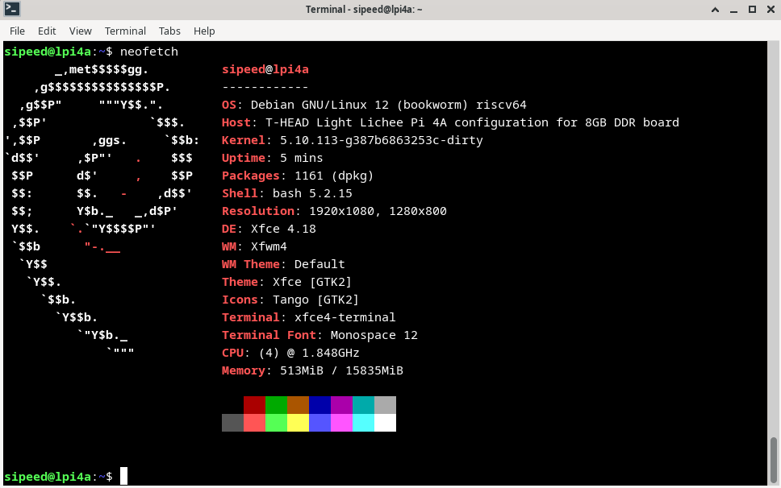
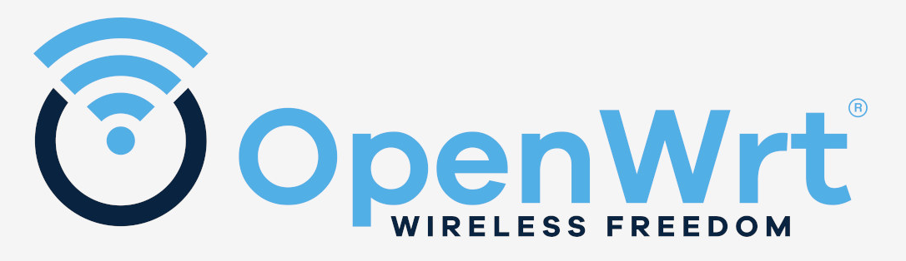
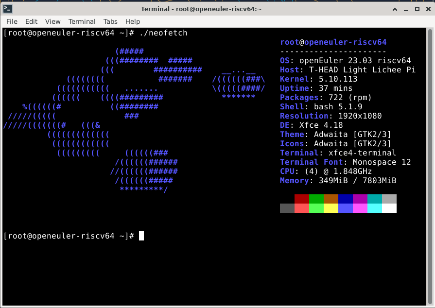
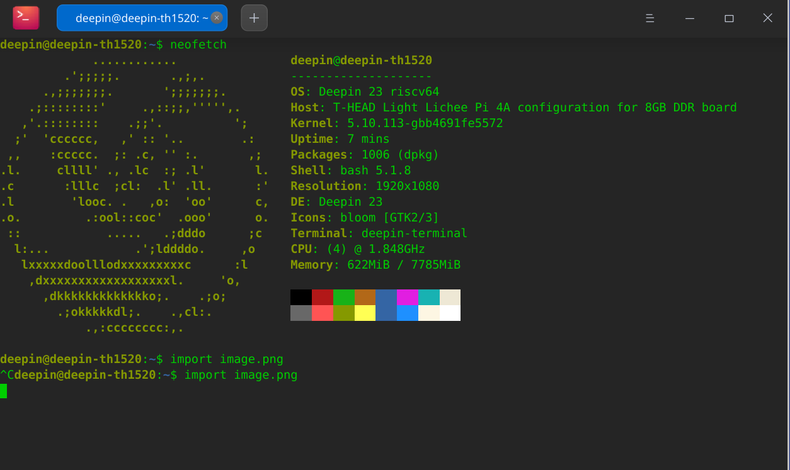
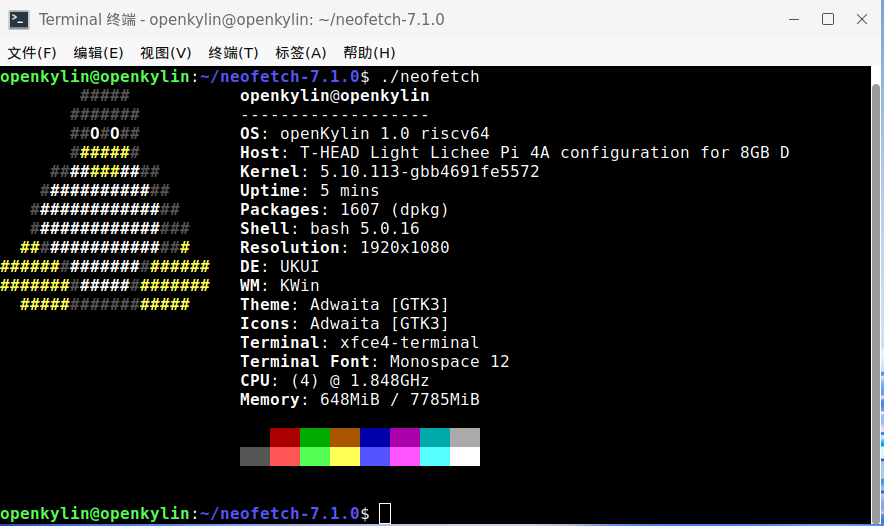
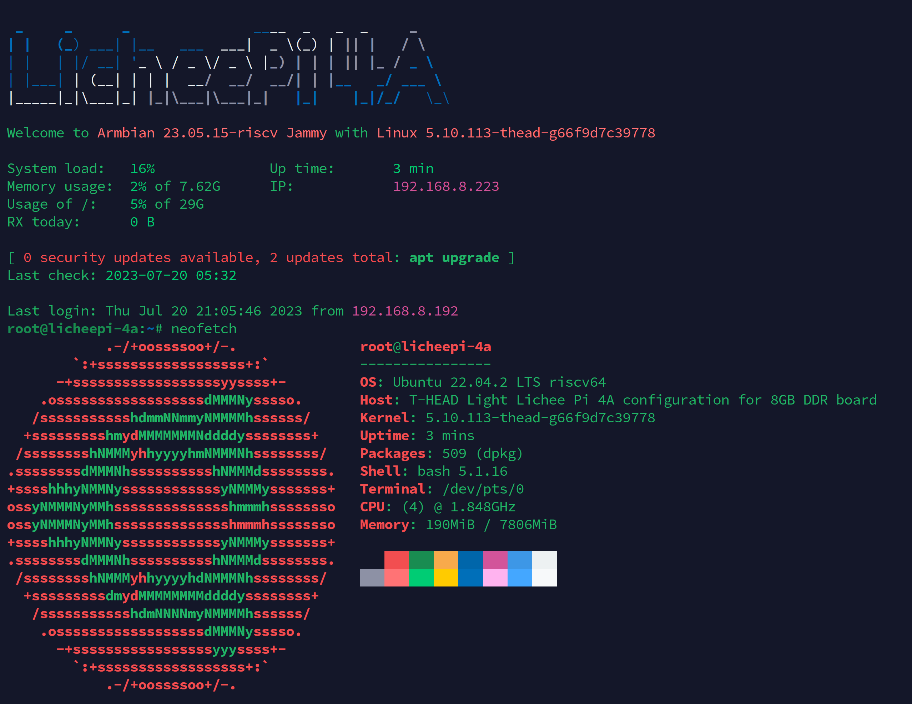
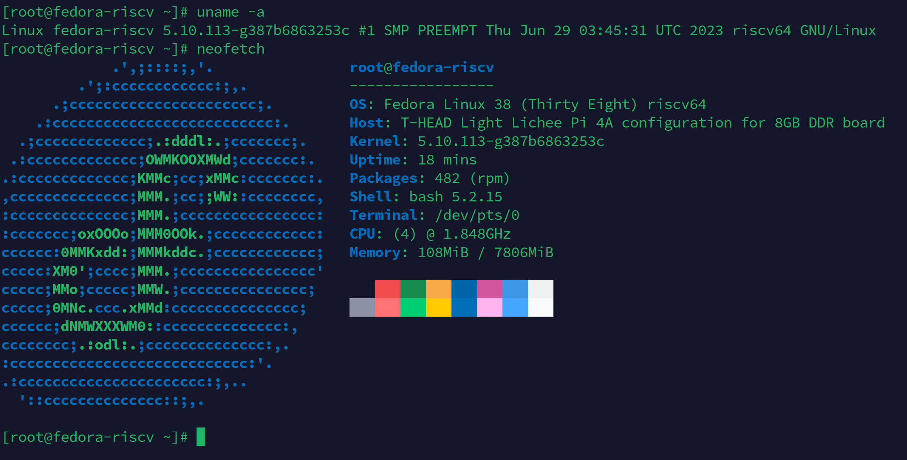
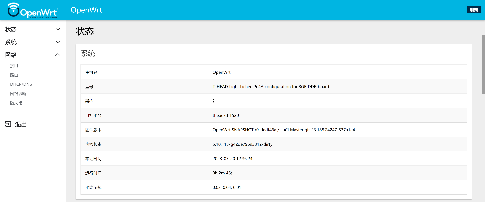
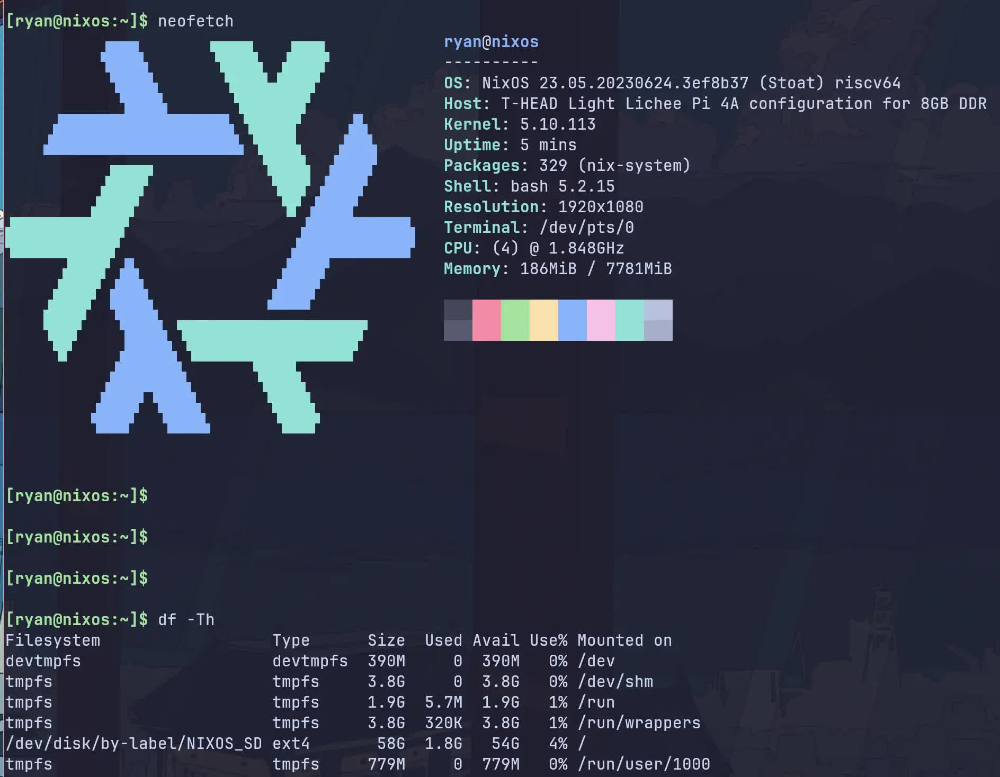

## 内核支持

目前平头哥官方 SDK 使用 Linux5.10 内核： https://gitee.com/thead-yocto
主线 linux6.x 内核正在移植中，主要社区贡献者：`Jisheng Zhang `

## Sipeed官方镜像

LicheePi 4A 的镜像不定期更新中，初期的镜像可能不太稳定，或者无法发挥 TH1520 的完全性能，请关注本页面，获取最新镜像。
Sipeed 官方镜像基于 Debian 系统修改适配。 

默认镜像的帐号密码配置如下：
账户：`debian`，密码： `debian`；
账户： `sipeed`，密码：`licheepi`；
root 账户默认没有设置密码。

### 内存问题修复说明
重要提示：2023.8.1 之前发出的 16GB 内存板存在错误图像，无法正确识别 16GB 内存（运行大型应用程序可能导致系统崩溃），请按照以下说明修复此错误。

请使用下面的命令烧录新的 u-boot 到板子中，16G 内存使用的 u-boot 在[网盘链接](https://pan.baidu.com/s/1xH56ZlewB6UOMlke5BrKWQ)中，也能在[这个链接](https://dl.sipeed.com/shareURL/LICHEE/licheepi4a/07_Tools)中下载
相关文件在 `20230803_tempfix.zip` 压缩包中。
（0721及以后版本的镜像内存能正常使用，无需替换为此处的文件）

```shell
sudo ./fastboot flash ram ./images/u-boot-with-spl-lpi4a-16g.bin
sudo ./fastboot reboot
sleep 1
sudo ./fastboot flash uboot ./images/u-boot-with-spl-lpi4a-16g.bin
# 若自己使用的 boot.ext4 中没有 16G ddr 对应的设备树，则需要再烧录 16G ddr 对应的 boot.ext4
sudo ./fastboot flash boot ./images/boot.ext4
```

### Debian

  
  

下载地址：
百度网盘：[点我](https://pan.baidu.com/s/1xH56ZlewB6UOMlke5BrKWQ)
Mega 云盘：[点我](https://mega.nz/folder/phoQlBTZ#cZeQ3qZ__pDvP94PT3_bGA)
ISCAS 镜像站（内含测试镜像，普通用户请使用前面网盘中的镜像）：[点我](https://mirror.iscas.ac.cn/revyos/extra/images/lpi4a/)

1. LPI4A_20231023_BASIC.zip

   - 发布日期：2023年10月23日
   - 内核：5.10
   - 根文件系统：ext4, 4.3GB
   - 主要预装软件包：
      - 开发类 python3.11
      - 办公类 libreoffice 套件
      - 浏览器 chromium
      - 媒体类 支持播放4K视频的播放器 Parole、VLC、GIMP
   - 修复问题：
      - HDMI 显示设备和 HDMI 音频设备识别问题（20230706）
      - 修复蓝牙问题，现在蓝牙设备功能正常，蓝牙耳机也能正常播放音频（20230706）
      - 修复桌面底部启动栏浏览器快捷方式不可用的问题，现在能点击这里进入 chromium（20230706）
      - 修复在长时间连接 USB 摄像头情况下，会导致 kernel panic 的问题（20230706）
      - 修复16GB内存识别问题，需完全识别16GB内存请更新此镜像（20230721）
      - 修复HDMI 音频在 chromium 下播放音质的问题（20230912）
      - 修复双屏异显时字体显示像素缺失的问题（20230912）
      - 修复光标指针不准问题（20231023）
      - 修复NPU驱动 kernel 和 user 版本不匹配的问题（20231023）
      - 修复烧录4G以上根文件系统失败问题（20231023）
   - 使用说明：
      - 该镜像开启了自动登陆，默认登陆用户为 sipeed；
      - 该镜像开启了免密码 sudo 功能；
      - 该镜像会自动加载 NPU 相关的驱动，无需手动初始化;
      - 该镜像同时支持 HDMI 和 MIPI 显示，需要通过启动菜单切换
         - 启动菜单配置文件在 boot.ext4 中，路径为 /boot/extlinux/extlinux.conf。其中有三项，区别在于后缀，启动项1后缀为(HDMI only)，启动项2后缀为(HDMI and MIPI)，启动项3后缀为(rescue target)，若因为一些更改，导致无法正常进入系统，可以尝试使用启动项3进行修复。
         - 默认启动项仅支持 HDMI 显示，有两种办法更换为支持 MIPI 显示的启动项：
            1. 连接串口工具，在开机时会出现启动菜单，按下数字键2即可选择第二项启动，该方法仅针对当前这次启动生效；
            2. 修改 extlinux.conf 文件，将文件中的 default l0 更改为 default l1 即可实现修改默认启动项为支持 MIPI 显示的镜像。
      - 该压缩包包含两种 u-boot 烧录时请注意文件名中的后缀和设备相关参数对应
         - u-boot 带 16g 后缀的为支持 16g 内存的u-boot，不带后缀的为支持 8g 内存的 u-boot
   - 已知问题：
      - MIPI 屏幕暂时只能通过手动写值调节亮度
         - 切换为 root 用户，执行`echo 亮度值(0-7的整数值) > /sys/class/backlight/pwm-backlight@0/brightness`

2. LPI4A_20231023_FULL.zip

   - 发布日期：2023年10月23日
   - 内核：5.10
   - 根文件系统：ext4, 9.7GB
   - 主要预装软件包：
      - 开发类 python3.11、GCC、VScode、Kicad（含示例工程）、AI环境（含预编译yolov5n/yolov5s可执行示例）
      - 办公类 libreoffice 套件
      - 浏览器 chromium
      - 媒体类 支持播放4K视频的播放器 Parole（含示例4k视频）、VLC、GIMP、视频编辑软件 Kdenlive（含示例视频素材）、kodi
      - 游戏 SuperTuxKart
      - 其他 btop、neofetch
   - 修复问题：
      - HDMI 显示设备和 HDMI 音频设备识别问题（20230706）
      - 修复蓝牙问题，现在蓝牙设备功能正常，蓝牙耳机也能正常播放音频（20230706）
      - 修复桌面底部启动栏浏览器快捷方式不可用的问题，现在能点击这里进入 chromium（20230706）
      - 修复在长时间连接 USB 摄像头情况下，会导致 kernel panic 的问题（20230706）
      - 修复16GB内存识别问题，需完全识别16GB内存请更新此镜像（20230721）
      - 修复HDMI 音频在 chromium 下播放音质的问题（20230912）
      - 修复双屏异显时字体显示像素缺失的问题（20230912）
      - 修复光标指针不准问题（20231023）
      - 修复NPU驱动 kernel 和 user 版本不匹配的问题（20231023）
      - 修复烧录4G以上根文件系统失败问题（20231023）
   - 使用说明：
      - 该镜像开启了自动登陆，默认登陆用户为 sipeed；
      - 该镜像开启了免密码 sudo 功能；
      - 该镜像会自动加载 NPU 相关的驱动，无需手动初始化;
      - 该镜像同时支持 HDMI 和 MIPI 显示，需要通过启动菜单切换
         - 启动菜单配置文件在 boot.ext4 中，路径为 /boot/extlinux/extlinux.conf。其中有三项，区别在于后缀，启动项1后缀为(HDMI only)，启动项2后缀为(HDMI and MIPI)，启动项3后缀为(rescue target)，若因为一些更改，导致无法正常进入系统，可以尝试使用启动项3进行修复。
         - 默认启动项仅支持 HDMI 显示，有两种办法更换为支持 MIPI 显示的启动项：
            1. 连接串口工具，在开机时会出现启动菜单，按下数字键2即可选择第二项启动，该方法仅针对当前这次启动生效；
            2. 修改 extlinux.conf 文件，将文件中的 default l0 更改为 default l1 即可实现修改默认启动项为支持 MIPI 显示的镜像。
      - 该压缩包包含两种 u-boot 烧录时请注意文件名中的后缀和设备相关参数对应
         - u-boot 带 16g 后缀的为支持 16g 内存的u-boot，不带后缀的为支持 8g 内存的 u-boot
   - 已知问题：
      - MIPI 屏幕暂时只能通过手动写值调节亮度
         - 切换为 root 用户，执行`echo 亮度值(0-7的整数值) > /sys/class/backlight/pwm-backlight@0/brightness`

### OpenWRT



[Click me](https://github.com/ruyisdk/openwrt)

### Android


Readme and image download link: [Click me](https://gitee.com/thead-android/thead-android)

预构建镜像下载地址：
百度网盘：[点我](https://pan.baidu.com/s/1xH56ZlewB6UOMlke5BrKWQ)
Mega 云盘：[点我](https://mega.nz/folder/phoQlBTZ#cZeQ3qZ__pDvP94PT3_bGA)

> 安卓13 SDK 仍处于初期状态，会逐步修复其中的问题

Sipeed 官方镜像的网盘下载链接中提供了 Android 13的预编译镜像文件，下载后烧录方式如下，fastboot工具请使用从这里下载的版本：
https://developer.android.com/tools/releases/platform-tools

网盘中也有提供 fastboot 的文件

```shell
#烧录uboot并初始化boot环境变量
fastboot flash ram u-boot-with-spl.bin
fastboot reboot
fastboot flash uboot u-boot-with-spl.bin

#烧录各个分区
#在非boot烧写模式，可以在uboot的命令行中输入命令fastboot usb 0，单独烧录分区
fastboot flash bootpart bootpart.ext4
fastboot flash boot boot.img
fastboot flash vendor_boot vendor_boot.img
fastboot flash super super.img 
fastboot flash userdata userdata.img
fastboot flash vbmeta vbmeta.img
fastboot flash vbmeta_system vbmeta_system.img

#初始化metadata和misc分区
fastboot erase metadata 
fastboot erase misc
```

## 第三方镜像

这里整理了第三方提供的镜像，仅供用户体验，sipeed 不保证此类镜像的可用性，稳定性。

### openEuler

   
  

Download: [Click me](https://mirror.iscas.ac.cn/openeuler-sig-riscv/openEuler-RISC-V/preview/openEuler-23.03-V1-riscv64/lpi4a/)   
Twitter: https://twitter.com/openEuler

### DeepinOS 深度

   
  

Readme and image download link: [Click me](https://github.com/aiminickwong/licheepi4a-images)

### openKylin




Readme link: [Click me](https://github.com/aiminickwong/licheepi4a-images)
[openKylin V1.0 Download address](https://www.openkylin.top/downloads/index-cn.html)

### armbian (official build-framework, use RV64GC toolchain)


Project address: [Click me](https://github.com/armbian/build)
Download and Infomations: [Click me](https://www.armbian.com/licheepi-4a/)

### armbian (unofficial build-framework, use T-Head optimized toolchain)




Project address: [Click me](https://github.com/chainsx/armbian-riscv-build)

### Fedora (unofficial)




Project address: [Click me](https://github.com/chainsx/fedora-riscv-builder)

### OpenWrt (unofficial)




Project address: [Click me](https://github.com/chainsx/openwrt-th1520)

### Ubuntu


[Click me](http://cdimage.ubuntu.com/ubuntu-base/releases/22.04/release/)


### NixOS (unofficial)




Project address: [Click me](https://github.com/ryan4yin/nixos-licheepi4a)

### Gentoo

Project address: [Click me](https://wiki.gentoo.org/wiki/Project:RISC-V)

下面链接说明如何从stage3制作一个Gentoo Linux系统

Deplay Gentoo Linux [Click me](https://wiki.gentoo.org/wiki/User:Dlan/RISC-V/TH1520)


### slarm64

  
Project address: [Click me](https://gitlab.com/sndwvs/images_build_kit)  
Download: [Click me](https://dl.slarm64.org/slackware/images/lichee_pi_4a/)  
