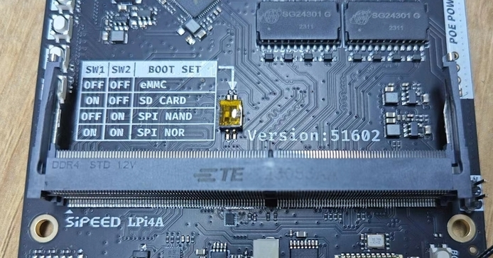

## 准备工作

### 获取镜像

参见上一章“镜像集合”，选取需要的镜像下载。
以下的烧录方式以 Debian 单屏镜像 `LPI4A_20230721.zip`，16+128核心板为例。

### 获取烧录工具

在镜像集合的网盘内可以获得 `burn_tool.zip`, 解压可得 win/linux/mac 三个系统下的 fastboot 烧录工具。

## 进入烧录模式

### 内测版硬件

按住板上的BOOT按键不放，然后插入 USB-C 线缆上电（线缆另一头接 PC ），即可进入 USB 烧录模式。


在 Windows 下使用设备管理器查看，会出现 “USB download gadget” 设备。

在 Linux 下，使用 `lsusb` 查看设备，会显示以下设备： `ID 2345:7654 T-HEAD USB download gadget`

### 正式版硬件

注意检查底板的拨码开关是否为 EMMC 启动模式：  



确认无误后即可烧录，接下来的烧录步骤同内测版。

### Windows 下驱动安装

Windows 下烧录时，需要先进入高级启动模式，禁用数字签名。才能正常安装下面的驱动。

禁用数字签名请按照下面的步骤：

**Win10**
1. 找到 WIN10 的设置，点击“设置”：


2. 点击最后一个“更新和安全”，然后点击“恢复”：


3. 点击“恢复”之后，在右边点击高级启动下面的“重新启动”，此时电脑会重新启动，如果有其他重要 程序在跑，请慎重：


**Win11**
1. 在设置中找到"系统菜单"，然后点击“恢复”。 

2. 在右边点击高级启动下面的“重新启动”，此时电脑会重新启动，如果有其他重要 程序在跑，请慎重。


**相同部分**
1. 重启之后会出现几个选项，点击选项“疑难解答”，然后点击“高级”，启动设置，重启。 


2. 这会重启之后就跳出一个列表，其中有安全模式等选项，也包括这里我们关心的“禁止强制驱动程序签名”，选择“禁用强制驱动程序签名”，对应哪个数字就按那个数字，之后电脑会重新启动。


3. 重启之后，驱动就可以成功安装。若有提示点击继续安装即可。 fastboot 驱动安装具体步骤如下： 
a. 开发板通过 usb 连接到电脑。 
b. 打开设备管理器出现“USB download gadget”设备。 


## 烧录镜像

进入烧录模式后，可使用 burn_tool.zip 内的 fastboot 进行烧录操作，注意可能需要先赋予 fastboot 可执行权限。

### Windows 系统步骤

编辑 burn_tool.zip 文件夹里面的 `burn_lpi4a.bat` 文件，将对应的镜像路径更改成自己实际使用的镜像及名称。然后双击运行 `burn_lpi4a.bat` 就能够正常进行烧录了。

需要注意的是 `fastboot.exe` 的路径也需要匹配上，不然会被提示找不到文件。


### Linux 系统步骤

在按住BOOT按键的条件下，系统在reset启动后，会默认进入fastboot模式，
这时侯我们可以通过fastboot下载并启动u-boot镜像的命令，来进入到u-boot的fastboot烧录模式（相比Brom阶段，会有更大下载buffer，速度会更快）
下面的指令会检查并格式化分区，请务必执行，否则后面烧录 rootfs 会很慢。

`u-boot-with-spl-lpi4a.bin` 和 `u-boot-with-spl-lpi4a-16g.bin` 为u-boot 固件，具体差异请参考镜像说明。
```bash
sudo ./fastboot flash ram ./images/u-boot-with-spl-lpi4a-16g.bin
sudo ./fastboot reboot
sleep 1
```

分别烧录下面三个镜像：启动引导镜像-uboot，启动分区-boot，操作系统根分区-root
```bash
sudo ./fastboot flash uboot ./images/u-boot-with-spl-lpi4a-16g.bin
sudo ./fastboot flash boot ./images/boot_sing.ext4
sudo ./fastboot flash root ./images/rootfs-sing.ext4
```

`boot-sing.ext4` 和 `boot-dual.ext4` 为 boot 分区，具体差异请参考镜像说明。它们主要包含以下内容： 
```bash
fw_dynamic.bin        #opensbi
Image                 #kernel image
kernel-release        #commit id of kernel
light_aon_fpga.bin    #fw for E902 aon
light_c906_audio.bin  #fw for C906 audio
light-lpi4a.dtb       # ddr8G dtb
light-lpi4a-ddr16g.dtb # ddr16G dtb
```

`rootfs-sing.ext4` 和 `rootfs-mipi.ext4` 为根文件系统，默认为 Debian 系统。两者的具体差异请参考镜像说明。

烧录镜像的典型 log 输出如下：


<!--  
```bash
(base) pc@n5105:~/work/$ sudo ./fastboot flash ram u-boot-with-spl.bin
Sending 'ram' (935 KB)                             OKAY [  0.248s]
Writing 'ram'                                      OKAY [  0.002s]
Finished. Total time: 0.255s
(base) pc@n5105:~/work/$ sudo ./fastboot reboot
Rebooting                                          OKAY [  0.001s]
Finished. Total time: 0.202s
(base) pc@n5105:~/work/$ sudo ./fastboot flash uboot u-boot-with-spl.bin
Sending 'uboot' (935 KB)                           OKAY [  0.054s]
Writing 'uboot'                                    OKAY [  0.030s]
Finished. Total time: 0.107s
(base) pc@n5105:~/work/$ sudo ./fastboot flash boot boot_20230420.ext4 
Sending 'boot' (40000 KB)                          OKAY [  1.705s]
Writing 'boot'                                     OKAY [  0.877s]
Finished. Total time: 2.770s
(base) pc@n5105:~/work/$ sudo ./fastboot flash root rootfs-20230425-001635-nogpu.ext4 
Invalid sparse file format at header magic
Sending sparse 'root' 1/37 (114572 KB)             OKAY [  4.793s]
Writing 'root'                                     OKAY [  3.087s]
Sending sparse 'root' 2/37 (105264 KB)             OKAY [  4.465s]
Writing 'root'                                     OKAY [  2.330s]
Sending sparse 'root' 3/37 (111970 KB)             OKAY [  4.814s]
Writing 'root'                                     OKAY [  2.861s]
Sending sparse 'root' 4/37 (114684 KB)             OKAY [  4.902s]
Writing 'root'                                     OKAY [  2.658s]
Sending sparse 'root' 5/37 (101490 KB)             OKAY [  4.305s]
Writing 'root'                                     OKAY [  2.652s]
Sending sparse 'root' 6/37 (114684 KB)             OKAY [  4.648s]
Writing 'root'                                     OKAY [  2.657s]
Sending sparse 'root' 7/37 (113862 KB)             OKAY [  4.755s]
Writing 'root'                                     OKAY [  2.826s]
Sending sparse 'root' 8/37 (111189 KB)             OKAY [  4.741s]
Writing 'root'                                     OKAY [  2.695s]
Sending sparse 'root' 9/37 (114625 KB)             OKAY [  4.865s]
Writing 'root'                                     OKAY [  2.660s]
Sending sparse 'root' 10/37 (104030 KB)            OKAY [  4.506s]
Writing 'root'                                     OKAY [  4.108s]
Sending sparse 'root' 11/37 (111701 KB)            OKAY [  4.744s]
Writing 'root'                                     OKAY [  2.717s]
Sending sparse 'root' 12/37 (107317 KB)            OKAY [  4.568s]
Writing 'root'                                     OKAY [  2.583s]
Sending sparse 'root' 13/37 (114629 KB)            OKAY [  4.830s]
Writing 'root'                                     OKAY [  2.753s]
Sending sparse 'root' 14/37 (109798 KB)            OKAY [  4.711s]
Writing 'root'                                     OKAY [  2.778s]
Sending sparse 'root' 15/37 (112203 KB)            OKAY [  4.795s]
Writing 'root'                                     OKAY [  2.982s]
Sending sparse 'root' 16/37 (112502 KB)            OKAY [  4.827s]
Writing 'root'                                     OKAY [  2.991s]
Sending sparse 'root' 17/37 (114110 KB)            OKAY [  4.849s]
Writing 'root'                                     OKAY [  2.853s]
Sending sparse 'root' 18/37 (114681 KB)            OKAY [  4.888s]
Writing 'root'                                     OKAY [  2.802s]
Sending sparse 'root' 19/37 (112042 KB)            OKAY [  4.799s]
Writing 'root'                                     OKAY [  3.674s]
Sending sparse 'root' 20/37 (109101 KB)            OKAY [  4.631s]
Writing 'root'                                     OKAY [  2.582s]
Sending sparse 'root' 21/37 (114225 KB)            OKAY [  4.623s]
Writing 'root'                                     OKAY [  2.782s]
Sending sparse 'root' 22/37 (114365 KB)            OKAY [  4.703s]
Writing 'root'                                     OKAY [  2.667s]
Sending sparse 'root' 23/37 (103529 KB)            OKAY [  4.133s]
Writing 'root'                                     OKAY [  2.442s]
Sending sparse 'root' 24/37 (114664 KB)            OKAY [  4.631s]
Writing 'root'                                     OKAY [  2.581s]
Sending sparse 'root' 25/37 (114550 KB)            OKAY [  4.749s]
Writing 'root'                                     OKAY [  2.878s]
Sending sparse 'root' 26/37 (114686 KB)            OKAY [  4.796s]
Writing 'root'                                     OKAY [  2.853s]
Sending sparse 'root' 27/37 (114466 KB)            OKAY [  4.800s]
Writing 'root'                                     OKAY [  2.894s]
Sending sparse 'root' 28/37 (110689 KB)            OKAY [  4.711s]
Writing 'root'                                     OKAY [  2.616s]
Sending sparse 'root' 29/37 (114687 KB)            OKAY [  4.880s]
Writing 'root'                                     OKAY [  2.992s]
Sending sparse 'root' 30/37 (110984 KB)            OKAY [  4.710s]
Writing 'root'                                     OKAY [  2.451s]
Sending sparse 'root' 31/37 (114685 KB)            OKAY [  4.920s]
Writing 'root'                                     OKAY [  2.749s]
Sending sparse 'root' 32/37 (114684 KB)            OKAY [  4.825s]
Writing 'root'                                     OKAY [  2.503s]
Sending sparse 'root' 33/37 (114684 KB)            OKAY [  4.816s]
Writing 'root'                                     OKAY [  3.262s]
Sending sparse 'root' 34/37 (114686 KB)            OKAY [  4.745s]
Writing 'root'                                     OKAY [  2.825s]
Sending sparse 'root' 35/37 (114684 KB)            OKAY [  4.913s]
Writing 'root'                                     OKAY [  2.630s]
Sending sparse 'root' 36/37 (114684 KB)            OKAY [  4.838s]
Writing 'root'                                     OKAY [  2.593s]
Sending sparse 'root' 37/37 (21324 KB)             OKAY [  0.926s]
Writing 'root'                                     OKAY [  0.487s]
Finished. Total time: 281.671s
```
-->

## 启动机制

brom -> U-Boot SPL -> U-Boot -> OpenSBI -> Kernel

接下来简单介绍一下每个阶段，并展示使用串口工具连接开发板时能够看到的相应日志。
正式版开发板中，系统串口IO新增电平转换IC到3.3V，可以使用普通串口模块连接。

### brom

该阶段的典型输出如下：   
```shell
brom_ver 8
[APP][E] protocol_connect failed, exit. 
```

brom 阶段会从 SoC 的 ROM 中获取核心代码，并寻找下一阶段的 bootloader。

### U-Boot SPL

该阶段的典型输出如下：   
```shell
U-Boot SPL 2020.01-gd6c9182f (Jul 07 2023 - 12:31:51 +0200)
FM[1] lpddr4x dualrank freq=3733 64bit dbi_off=n sdram init
ddr initialized, jump to uboot
image has no header
```

这里的 U-Boot SPL 中的 SPL 指的是 Secondary Program Loader，其中的 Secondary，也就是第二阶段，是相对于前面的 brom 来说的。
U-Boot SPL 的主要功能是加载真正的 U-Boot 运行，因为一些 SoC 中无法装下一个完整的 U-Boot 镜像，那么就需要 U-Boot SPL 来初始化外部 RAM 和环境，加载真正的 U-Boot 到外部 RAM 中执行。

### U-Boot

该阶段的典型输出如下：
```shell
U-Boot 2020.01-gd6c9182f (Jul 07 2023 - 12:31:51 +0200)

CPU:   rv64imafdcvsu
Model: T-HEAD c910 light
DRAM:  8 GiB
C910 CPU FREQ: 750MHz
AHB2_CPUSYS_HCLK FREQ: 250MHz
AHB3_CPUSYS_PCLK FREQ: 125MHz
PERISYS_AHB_HCLK FREQ: 250MHz
PERISYS_APB_PCLK FREQ: 62MHz
GMAC PLL POSTDIV FREQ: 1000MHZ
DPU0 PLL POSTDIV FREQ: 1188MHZ
DPU1 PLL POSTDIV FREQ: 1188MHZ
MMC:   sdhci@ffe7080000: 0, sd@ffe7090000: 1
Loading Environment from MMC... OK
Error reading output register
Warning: cannot get lcd-en GPIO
LCD panel cannot be found : -121
splash screen startup cost 15 ms
In:    serial
Out:   serial
Err:   serial
Net:   ethernet@ffe7070000 (eth0) using MAC address - ae:be:2a:50:5e:89
eth0: ethernet@ffe7070000ethernet@ffe7070000:0 is connected to ethernet@ffe7070000.
ethernet@ffe7060000 (eth1) using MAC address - ae:be:2a:50:5e:8a
, eth1: ethernet@ffe7060000
Hit any key to stop autoboot:  0
```

这个阶段，看到 `Hit any key to stop autoboot:` 时，在2秒倒计时结束前可以按回车键进入 U-Boot，在这里可以设置各种环境变量，对于常用的环境变量举例设置如下：  

设置 MAC 地址：  
```shell
setenv ethaddr ae:be:2a:50:5e:89
setenv eth1addr ae:be:2a:50:5e:8a
saveenv
```
将上述命令中的 MAC 地址替换为自己的 MAC 地址即可，注意 `eth1addr` 的值为 `ethaddr` 的值加1。

设置内核使用的设备树：  
```shell
setenv fdt_file light-lpi4a.dtb
saveenv
```
上述命令中的 `light-lpi4a.dtb` 替换为存放在 `boot.ext4` 中想使用的设备树的文件名。
设置完成后也可以使用 `printenv` 命令检查是否正确，然后输入 `boot` 命令即可进入内核。

此外，也可以在这里设置启动参数来选择启动方式，比如使用 SD 卡启动。
烧录镜像到 SD 卡中后，将 SD 卡插入开发板，进入到 U-Boot：
```shell
env set -f set_bootargs 'setenv bootargs console=ttyS0,115200 root=/dev/mmcblk1 rootfstype=ext4 rootwait rw earlycon clk_ignore_unused loglevel=7 eth=ethaddr rootrwoptions=rw,noatime rootrwreset={factory_reset} init=/lib/systemd/systemd'
env save
```
上述步骤完成后，输入 `reset` 命令重启开发板，即可从 SD 卡启动系统。

对于正式版开发板则可以使用底板上的拨码开关来选择启动方式：   


### OpenSBI
OpenSBI 的 sbi_init.c 文件中的一些初始化打印不会在启动 log 中展示出来，但能够在 Kernel 启动时看到一些关于 OpenSBI 的信息被打印出来：   
```shell
[    0.000000] SBI specification v0.3 detected
[    0.000000] SBI implementation ID=0x1 Version=0x9
[    0.000000] SBI v0.2 TIME extension detected
[    0.000000] SBI v0.2 IPI extension detected
[    0.000000] SBI v0.2 RFENCE extension detected
[    0.000000] SBI v0.2 HSM extension detected
```
OpenSBI 有三种 firmware，这里所使用的是 FW_DYNAMIC，它会根据前一个阶段传入的信息加载下一个阶段。OpenSBI 的 fw_dynamic.bin 固件被存放在 boot.ext4 中，这个阶段会引导内核启动。

### Kernel
该阶段的典型 log 如下（由于太长，仅截取部分）：  
```shell
[    0.000000] Linux version 5.10.113-g387b6863253c-dirty
[    0.000000] OF: fdt: Ignoring memory range 0x0 - 0x200000
[    0.000000] earlycon: uart0 at MMIO32 0x000000ffe7014000 (options '115200n8')
[    0.000000] printk: bootconsole [uart0] enabled
[    0.000000] efi: UEFI not found.
[    0.000000] Reserved memory: created CMA memory pool at 0x00000003e4000000, size 320 MiB
[    0.000000] OF: reserved mem: initialized node linux,cma, compatible id shared-dma-pool 
[    0.000000] Zone ranges:                       
[    0.000000]   DMA32    [mem 0x0000000000200000-0x00000000ffffffff]
[    0.000000]   Normal   [mem 0x0000000100000000-0x00000003ffffffff]
[    0.000000] Movable zone start for each node   
[    0.000000] Early memory node ranges
[    0.000000]   node   0: [mem 0x0000000000200000-0x000000000fffffff]
[    0.000000]   node   0: [mem 0x0000000010000000-0x00000000166fffff]
[    0.000000]   node   0: [mem 0x0000000016700000-0x0000000016ffffff]
[    0.000000]   node   0: [mem 0x0000000017000000-0x0000000018ffffff]
[    0.000000]   node   0: [mem 0x0000000019000000-0x000000001bffffff]
[    0.000000]   node   0: [mem 0x000000001c000000-0x000000001dffffff]
[    0.000000]   node   0: [mem 0x000000001e000000-0x000000001fffffff]
[    0.000000]   node   0: [mem 0x0000000020000000-0x00000000207fffff]
[    0.000000]   node   0: [mem 0x0000000020800000-0x00000003ffffffff]
[    0.000000] Initmem setup node 0 [mem 0x0000000000200000-0x00000003ffffffff]
[    0.000000] software IO TLB: mapped [mem 0x00000000fbfff000-0x00000000fffff000] (64MB)
[    0.000000] SBI specification v0.3 detected
[    0.000000] SBI implementation ID=0x1 Version=0x9
[    0.000000] SBI v0.2 TIME extension detected
[    0.000000] SBI v0.2 IPI extension detected
[    0.000000] SBI v0.2 RFENCE extension detected
[    0.000000] SBI v0.2 HSM extension detected
[    0.000000] riscv: ISA extensions acdfimsuv
[    0.000000] riscv: ELF capabilities acdfimv
[    0.000000] percpu: Embedded 27 pages/cpu s73496 r8192 d28904 u110592
[    0.000000] Built 1 zonelists, mobility grouping on.  Total pages: 4128264
[    0.000000] Kernel command line: console=ttyS0,115200 root=PARTUUID=80a5a8e9-c744-491a-d
[    0.000000] Dentry cache hash table entries: 2097152 (order: 12, 16777216 bytes, linear)
[    0.000000] Inode-cache hash table entries: 1048576 (order: 11, 8388608 bytes, linear) 
[    0.000000] Sorting __ex_table...
[    0.000000] mem auto-init: stack:off, heap alloc:off, heap free:off
[    0.000000] Memory: 15887448K/16775168K available (12390K kernel code, 5982K rwdata, 61)
[    0.000000] SLUB: HWalign=64, Order=0-3, MinObjects=0, CPUs=4, Nodes=1
[    0.000000] rcu: Preemptible hierarchical RCU implementation.
[    0.000000] rcu:     RCU restricting CPUs from NR_CPUS=8 to nr_cpu_ids=4.
[    0.000000]  Trampoline variant of Tasks RCU enabled.
[    0.000000]  Tracing variant of Tasks RCU enabled.
[    0.000000] rcu: RCU calculated value of scheduler-enlistment delay is 25 jiffies.
[    0.000000] rcu: Adjusting geometry for rcu_fanout_leaf=16, nr_cpu_ids=4
[    0.000000] NR_IRQS: 64, nr_irqs: 64, preallocated irqs: 0
[    0.000000] riscv-intc: 64 local interrupts mapped
[    0.000000] plic: interrupt-controller@ffd8000000: mapped 64 interrupts with 4 handlers.
[    0.000000] random: get_random_bytes called from start_kernel+0x372/0x4d4 with crng_ini0
[    0.000000] riscv_timer_init_dt: Registering clocksource cpuid [0] hartid [0]
[    0.000000] clocksource: riscv_clocksource: mask: 0xffffffffffffffff max_cycles: 0x1623s
[    0.000008] sched_clock: 64 bits at 3000kHz, resolution 333ns, wraps every 439804651109s
[    0.008693] Console: colour dummy device 80x25
```

都可以在启动内核后，可以替换设备树 DTB 文件、OpenSBI 固件、内核镜像文件 Image 等文件，它们位于 `/boot/` 目录下：  
```shell
sipeed@lpi4a:~$ ls /boot/
Image                                    light-lpi4a.dtb
System.map-5.10.113-g387b6863253c-dirty  light_aon_fpga.bin
config-5.10.113-g387b6863253c-dirty      light_c906_audio.bin
fw_dynamic.bin                           vmlinuz-5.10.113-g387b6863253c-dirty
kernel-commitid
```

## 批量烧录

如果你有商业需求，需要批量烧录固件，可以使用 sipeed 提供的 ARM/RV 版 fastboot 制作离线批量烧录器。
如果你需要烧录的数量很大，也可以直接联系 support@sipeed.com，我们提供预烧录镜像服务。