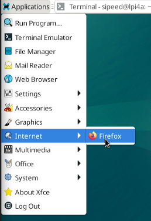

## 登录系统

本篇文档以默认的 Debian 桌面系统为例，介绍基础系统使用操作。

将 LicheePi 4A 连接上显示器后，可以看到图形化交互界面了。

在登录界面，输入用户名 `sipeed`，密码 `licheepi` 就可以登录进系统了。

> 总共有三个用户，`root`，`debian`，`sipeed`，初始密码均为`licheepi` 
> 有些版本的`debian`用户的密码为`sipeed`


## 打开命令行

在 LicheePi 4A 的 Debian 图形化系统中，使用快捷键 `Ctrl` + `Alt` + `T` 三个组合键可以直接打开命令行终端，来快速方便地操作系统。


## 连接网络

### 连接有线网络

LicheePi 4A 由两个千兆网络接口；将已经接通网络的网线插入到 LicheePi 4A 的网络接口中节能实现连接有线网络了。

<table>
    <tr>
        <td>插上网线之前</td>
        <td>插上网线之后</td>
    </tr>
    <tr>
        <td></td>
        <td></td>
    </tr>
    <tr>
        <td colspan=2> 上面两张图对比可以看到：在接上网线前，系统中 <code>Ethernet Network</code> 下面显示着 <code>disconnected</code>, 接上网线后显示 <code>Wired connection </code></td>
    </tr>
</table>

### 连接无线网络

LicheePi 4A 板载无线模组，支持蓝牙和 wifi 。

从状态栏中的 `Avaliable networks` 中查看自己想要连接到的无线网络，输入密码之后就自动连接上了。

<table>
    <tr>
        <td colspan=2></td>
    </tr>
    <tr>
        <td></td>
        <td></td>
    </tr>
</table>

在输入密码的弹出窗口中，`Wi-Fi adapter` 中需要选择 `wlan0` 来连接网络。

<!-- ## TODO 连接蓝牙 -->

## 软件安装

在完成网络连接后，即可进行软件包的更新，安装。

### 软件源

在 Debian 系统中，可以使用 apt (Advanced Packaging Tool) 来进行软件的安装。

安装软件的时候，会从系统指定的软件网站中搜索并下载目标软件，当目标网站访问困难（比如服务器距离太远或者服务器网络不佳）时，可以手动设置编辑软件源网站，改成距离自己当前最近的源，来减少下载时间。

软件源默认使用 `/etc/apt/sources.list` 文件里面的内容，有额外需要的话可以自行更改。但是要注意需要使用支持 Risc-V 架构的软件源。


### 升级软件

使用 `sudo apt update` 可以更新软件列表，一般在更换软件源之后需要使用这个命令。

然后使用 `sudo apt upgrade package_name` 可以更新名称为 `package_name` 的软件。

比如下面是使用 `sudo apt upgrade vim` 来更新 `vim` 这个软件的示例


### 安装程序

可以借助于 apt 命令来安装软件；比如使用 `sudo apt install package_name` 命令来安装 `package_name`，下面是使用 apt 来安装 `net-tools` 的例子。


安装 `net-tools` 后，就可以使用 `ifconfig` 命令了。


箭头指向的地方就是常说的 IP 地址了。

## SSH

如果你的镜像里没有 ssh 或 sshd 指令，可以先通过以下指令安装：

```bash
sudo apt install ssh openssh-server
```

安装之后即可使用 ssh 来远程登录到其它机器操作，或者在其它机器上使用 ssh 登录到 LicheePi 4A
还可以使用 scp 进行文件传输：

```bash
scp demo.zip sipeed@192.168.1.9:~/
```

## 输入法

如果你需要进行非 ascii 的字符输入，就需要安装输入法，这里以中文输入法为例，其它语言请自行查找相关教程。

先安装 ibus-libpinyin：

```bash
sudo apt install -y ibus-libpinyin
```

> 注意这里会消耗约200MB磁盘空间

安装完后，重启板卡，即可在 Applications 下看到 `IBus Preference` 选项，点击进入设置。  


在出现的界面里点击 `Input Method`，点击 `Add`，选择 `Chinese`，选择 `Intelligent Pinyin`，点击 `Add`，即可添加中文拼音输入法。  
 

在右上角点击输入法图标，可见以下选项，选择 `Chinese - Intelligent Pinyin` 即可。  


此时即可在系统中顺利输入中文：  
  

> 注：在 0425 版本镜像中，可能会由于 GPU 支持问题，导致安装了输入法后，出现图形界面卡顿滞后的问题。

## 办公软件

部分镜像里内置了基础的 Office 办公软件（LibreOffice）：
  

LibreOffice Calc 即 XLS 功能：
 

LibreOffice Impress 即 PPT 功能：
 

LibreOffice Writer 即 WORD 功能：
 

## 浏览器

系统内置了火狐浏览器（Firefox）：  


使用搜索引擎：  
  

观看在线视频：  
  

> 注：由于目前（0425）版本还未完全适配好 GPU，视频编解码使用 CPU 软解，所以浏览器下播放视频占用率较高。实际性能以未来的 GPU 适配完成的镜像为准。

## 播放器

系统内置了一些开源播放器，我们建议使用 VLC Player 作为视频播放器


## 编程开发 

### Python

系统已内置了 python3 环境，可以在终端直接运行：  
  

如果需要安装Python包，则使用：`sudo apt install python3-XXX`
比如安装pyserial包：`sudo apt install python3-serial` 即可

### C

需要安装 `build-essential` 包，占用约800MB磁盘空间

```bash
sudo apt install build-essential
```

然后即可使用 gcc 进行相关编译操作：  
  

## 扩展存储空间

内测版板载 eMMC 容量较小，留给用户的空间只有 2～3GB，如果需要进行大容量存储，则需要扩展存储空间，可选使用 USB 存储或者 TF 存储。

### 挂载 U 盘

将一个 U 盘插入 LicheePi 4A 的 USB 口后，可以在命令终端窗口使用 `dmesg` 查看板卡硬件变动信息。

如下是连接 U 盘后，使用 `dmesg` 在命令行终端看到的最新信息（截取）。


上面的信息显示出了板卡的外设更改信息；从中可以看到有一个大容量 USB 存储设备连接到了 LicheePi 4A。

使用命令 `cat /proc/partitions | grep "sd*"` 命令可以查看到 U 内部的分区个数


以上面的结果为例，其中 `sda` 指代的是整个 U 盘，`sda1` 和 `sda2` 表示的是 U 盘里面的两个分区。

先在桌面系统创建一个文件夹，然后使用 `mount` 命令将 U 盘的某一分区挂载到该文件夹下。

```bash
mkdir ~/Desktop/udisk # 在桌面创建一个名为 udisk 的文件夹
mount /dev/sda2 ~/Desktop/udisk # 挂载 U 盘的 sda2 分区到 udisk 文件夹
```

<table>
    <tr>
        <td> 运行命令前 </td>
        <td> 运行命令后 </td>
    </tr>
    <tr>
        <td style="white-space:nowrap"></td>
        <td style="white-space:nowrap"></td>
    </tr>
    <tr>
        <td colspan=2> 运行命令后桌面新增了一个名为 udisk 的文件夹，使用鼠标双击打开 udisk 文件夹后可以看到文件夹里面的内容与 U 盘里面的实际内容一致 </td>
    </tr>
</table>

### 挂载 TF卡

将 TF 卡插入 LicheePi 4A 背面的 TF 卡槽中，即可在系统下看到 `/dev/mmcblk1` 设备 （/dev/mmcblk0 是 SOM 上的 eMMC）

如果 TF 卡尚未分区或者格式化，用户可以使用 `sudo fdisk /dev/mmcblk1` 指令进行分区，
然后使用 `sudo mkfs.ext4 /dev/mmcblk1p1` 或者 `sudo mkfs.vfat /dev/mmcblk1p1` 对新建的分区进行格式化操作。
如果想作为扩展分区使用，建议使用 ext4；如果想作为与 Windows 交换数据的 TF 卡，建议使用 vfat。

格式化好后，即可与上节内容一样进行挂载操作，确认是否挂载正常。

### 设置开机挂载

验证手工挂载成功后，你可以进一步设置开机挂载。

只需要在 /etc/fstab 文件内加上需要开机自动挂载的设备信息即可，以下是在最后一行添加TF卡自动挂载的示例。

```bash
sipeed@lpi4a:~$ cat /etc/fstab
# UNCONFIGURED FSTAB FOR BASE SYSTEM
/dev/mmcblk0p3 /       auto    defaults    1 1
/dev/mmcblk0p2 /boot   auto    defaults    0 0
/dev/mmcblk1p1 /mnt    auto    defaults    0 2
```

- 第一个数字：0 表示开机不检查磁盘，1 表示开机检查磁盘；
- 第二个数字：0 表示交换分区，1 代表启动分区（Linux），2 表示普通分区

/dev/mmcblk1p1 也可使用磁盘 UUID，即写成 UUID=xxxx-xxx 的形式，UUID 可以使用`sudo blkid`查看：
`/dev/mmcblk1p1: UUID="033173ff-b3ab-494c-ab14-4dcd656a9214" BLOCK_SIZE="4096" TYPE="ext4" PARTUUID="8e4e28df-01"`

## 更多
欢迎投稿～ 投稿接受后可得￥5～150（$1~20）优惠券！
