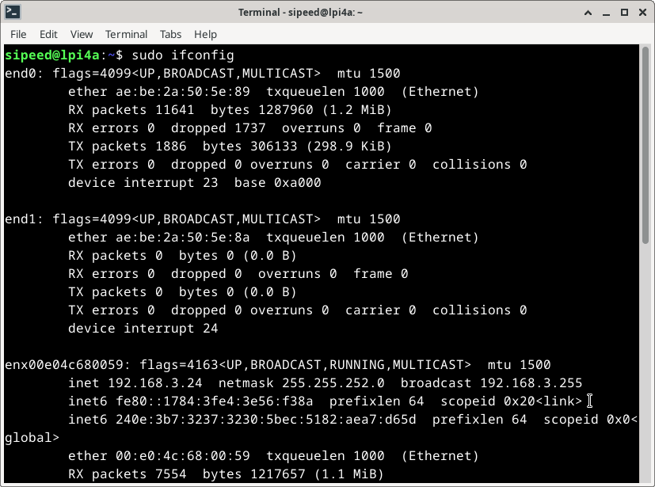
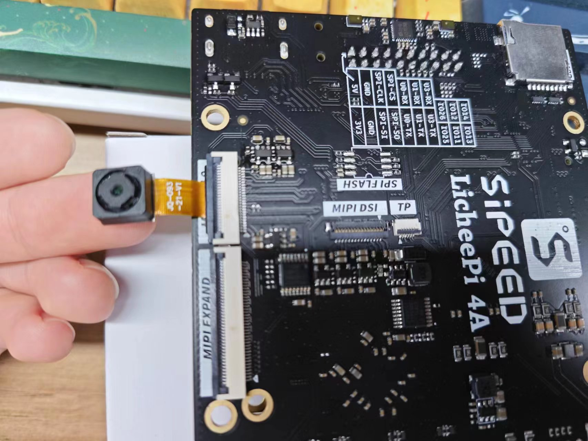

## SoC 相关
 
### CPU 运行频率

`sudo cat /sys/devices/system/cpu/cpu*/cpufreq/cpuinfo_cur_freq `
单位为 KHz   
注意系统自带温控策略，当系统过于空闲或者温度过高时，都会降频。请保持良好散热，使得 CPU 在 60 度以下，获得最佳性能。   

### 芯片温度

`cat /sys/class/thermal/thermal_zone0/temp`   

单位为0.001摄氏度  

### CPU超频

TH1520 默认最大运行频率为 1.85GHz，但是经过初步测试发现，有 80% 左右的芯片可以在 2GHz 运行，有 50% 左右的芯片可以在 2GHz 通过压力测试。   
这里放出简易超频步骤，仅供参考，不对稳定性和安全性做保证。  

查看`/boot`下的文件：

```bash
fw_dynamic.bin        #opensbi
Image                 #kernel image
kernel-release        #commit id of kernel
light_aon_fpga.bin    #fw for E902 aon
light_c906_audio.bin  #fw for C906 audio
light-lpi4a.dtb       #1.85GHz dtb
light-lpi4a_2Ghz.dtb  #2GHz overclock dtb
light-lpi4a-ddr2G.dtb #history dtb
```

将 `light-lpi4a_2Ghz.dtb` 拷贝覆盖为 `light-lpi4a.dtb`，重启，即可修改开机后的最大频率。   
注意有一定几率这样修改后无法启动，此时需要重新烧录固件来恢复。

如果成功启动，则可以查看下面的数值确认是否已成功超频：     
`sudo cat /sys/devices/system/cpu/cpu0/cpufreq/cpuinfo_max_freq`

## PWM

以散热风扇所接的 PWM1 为例，可以通过如下代码进行风扇使能操作：

```bash
echo 1 > /sys/class/pwm/pwmchip0/export
echo 1000000 > /sys/class/pwm/pwmchip0/pwm1/period
echo 1000000 > /sys/class/pwm/pwmchip0/pwm1/duty_cycle
echo 1 > /sys/class/pwm/pwmchip0/pwm1/enable
```

## GPIO

LicheePi 4A 板载 2x10pin 插针，其中有 16 个原生 IO，包括 6 个普通 IO，3 对串口，一个 SPI。
> 注意：SOC的所有原生IO均是1.8V电平，请注意电平转换。 
> 插针上的串口输入侧已经进行了1/2分压处理，可以接3.3V的串口。 

TH1520 SOC 具有4个GPIO bank，每个bank最大有32个IO：

|Bank      |Address      | kernel io num|
|---       |---          |---           |
|GPIO0     |0xffec005000 | 456-487 |
|GPIO1     |0xffec006000 | 424-455 |
|GPIO2     |0xffe7f34000 | 392-423 |
|GPIO3     |0xffe7f38000 | 360-391 |
|AO_GPIO   |0xfffff41000 | 328-359 |
|AO_GPIO4  |0xfffff52000 | 296-327 |
|AUDIO_GPIO|0xffcb013000 | - |

其中 0x0 偏移处的 4Byte（32bit）是 GPIO 数据寄存器，0x4 偏移处的 4Byte（32bit）是 GPIO 方向寄存器

LicheePi 4A上的插针的 GPIO 对应关系为（以俯视底板正面为视角，TOP为左侧，BOTTOM为右侧）：  
  

> 以文档的标注为准，内测版的丝印标注可能有误 

GPIO 操作：  
> 注意，可能需要事先设置 pinmux

```bash
num=xxx
echo ${num} > /sys/class/gpio/export  
echo out > /sys/class/gpio/gpio${num}/direction 
echo 1 > /sys/class/gpio/gpio${num}/value  
echo 0 > /sys/class/gpio/gpio${num}/value
```

GPIO 号的对应关系如下图所示：


比如要操作插针上的4个 GPIO，对应关系如下，将上述代码的num改为想要操作的 GPIO 脚对应的数字即可: 
 
|num|IO Number|
|---|---|
|427|IO 1_3|
|428|IO 1_4|
|429|IO 1_5|
|430|IO 1_6|

也可以直接操作寄存器：

> devmem 可以从此处下载编译：https://github.com/VCTLabs/devmem2/blob/master/devmem2.c   

```bash
./devmem 0xffe7f38000 w
```

系统内GPIO信息查看：

```bash
sipeed@lpi4a:~$ sudo cat /sys/kernel/debug/gpio
```

下面是示例结果:


接下来，以底板插针上的 GPIO1_3 为例，我们通过 libgpiod 在用户空间操作 gpio。首先安装 libgpiod：
```shell
sudo apt update
sudo apt install libgpiod-dev
```

使用 `vi gpio.c` 命令，将下面的代码写入文件：
```c
#include <stdio.h>
#include <stdlib.h>
#include <unistd.h>
#include <gpiod.h>

int main()
{
    int i;
    int ret;

    struct gpiod_chip * chip;
    struct gpiod_line * line;

    chip = gpiod_chip_open("/dev/gpiochip1");
    if(chip == NULL)
    {
        printf("gpiod_chip_open error\n");
        return -1;
    }

    line = gpiod_chip_get_line(chip, 3);
    if(line == NULL)
    {
        printf("gpiod_chip_get_line error\n");
        gpiod_line_release(line);
    }

    ret = gpiod_line_request_output(line,"gpio",0);
    if(ret < 0)
    {
        printf("gpiod_line_request_output error\n");
        gpiod_chip_close(chip);
    }

    for(i = 0; i < 10; i++)
    {
        gpiod_line_set_value(line,1);
        sleep(1);
        gpiod_line_set_value(line,0);
        sleep(1);
    }

    gpiod_line_release(line);
    gpiod_chip_close(chip);

    return 0;
}
```

通过以下命令编译：
```shell
gcc gpio.c -I /usr/include/ -L /usr/lib/riscv64-linux-gnu/ -lgpiod -o gpio
```

然后以 root 权限执行：
```shell
sudo ./gpio
```

此时用万用表测量底板上的 IO1_3 引脚，可以发现每隔一秒该引脚电压会发生变化。

<!--
```bash
sipeed@lpi4a:~$ sudo cat /sys/kernel/debug/gpio
gpiochip8: GPIOs 296-327, parent: platform/fffff52000.gpio, fffff52000.gpio:    AO_GPIO4

gpiochip7: GPIOs 328-359, parent: platform/fffff41000.gpio, fffff41000.gpio:    AO_GPIO
 gpio-332 (                    |hubswitch           ) out hi 

gpiochip6: GPIOs 360-391, parent: platform/ffe7f38000.gpio, ffe7f38000.gpio:    GPIO3

gpiochip5: GPIOs 392-423, parent: platform/ffe7f34000.gpio, ffe7f34000.gpio:    GPIO2
 gpio-395 (                    |cs                  ) out hi ACTIVE LOW
 gpio-406 (                    |aon:soc_vdd5v_se_en ) out lo 
 gpio-407 (                    |spi0 CS0            ) out hi ACTIVE LOW
 gpio-417 (                    |Volume Up Key       ) in  lo IRQ ACTIVE LOW
 gpio-421 (                    |aon:soc_wcn33_en    ) out lo 

gpiochip4: GPIOs 424-455, parent: platform/ffec006000.gpio, ffec006000.gpio:    GPIO1
 gpio-443 (                    |Volume Down Key     ) in  hi IRQ ACTIVE LOW
 gpio-446 (                    |aon:soc_vbus_en     ) out hi 

gpiochip3: GPIOs 456-487, parent: platform/ffec005000.gpio, ffec005000.gpio:    GPIO0
 gpio-457 (                    |spi2 CS0            ) out hi ACTIVE LOW
 gpio-486 (                    |aon:soc_vdd_3v3_en  ) out hi 

gpiochip2: GPIOs 488-495, parent: i2c/3-0018, 3-0018, can sleep:    IO expend 3
 gpio-490 (                    |regulator-hub-vdd12-) out hi 
 gpio-491 (                    |regulator-hub-vcc5v-) out hi 
 gpio-492 (                    |regulator-pwr-en    ) out hi 
 gpio-493 (                    |aon:soc_lcd0_vdd33_e) out hi 
 gpio-494 (                    |aon:soc_lcd0_vdd18_e) out hi 
 gpio-495 (                    |reset               ) out hi ACTIVE LOW

gpiochip1: GPIOs 496-503, parent: i2c/1-0018, 1-0018, can sleep:    IO expend 2
 gpio-496 (                    |aon:soc_cam2_dvdd12_) out lo 
 gpio-501 (                    |wlan_default_wlan_po) out hi 
 gpio-502 (                    |bt_default_poweron  ) out lo 

gpiochip0: GPIOs 504-511, parent: i2c/0-0018, 0-0018, can sleep:    IO expend 1
 gpio-504 (                    |aon:soc_dvdd12_rgb  ) out lo 
 gpio-505 (                    |aon:soc_avdd28_rgb  ) out lo 
 gpio-506 (                    |aon:soc_dovdd18_rgb ) out lo 
 gpio-507 (                    |aon:soc_dovdd18_ir  ) out lo 
 gpio-508 (                    |aon:soc_dvdd12_ir   ) out lo 
 gpio-509 (                    |aon:soc_avdd25_ir   ) out lo 
 gpio-510 (                    |aon:soc_cam2_dovdd18) out lo 
 gpio-511 (                    |aon:soc_cam2_avdd25_) out lo
```  
### gpiod库的使用
gpiod库是一个可以在同户空间调用GPIO的库，方便用户在应用程序中对GPIO进行操作。
首先安装和部署GPIO库：
```shell
sudo apt install wget
wget https://git.kernel.org/pub/scm/libs/libgpiod/libgpiod.git/snapshot/libgpiod-2.0.tar.gz

tar zxvf libgpiod-2.0.tar.gz

cd libgpiod-2.0
sudo apt-get install build-essential pkg-config m4 automake autoconf libtool autoconf-archive
sudo apt install gcc g++

export CC=gcc
export CXX=g++

#部署库的相关文件到项目文件夹：--prefix后面的路径要换成自己项目所在的路径，方便后续操作
./autogen.sh --enable-tools=yes --prefix=/home/sipeed/mylib_local
make
sudo make install
```

如果执行：./autogen.sh --enable-tools=yes --prefix=/home/sipeed/mylib_local 出现以下错误：

```shell
aclocal: warning: couldn't open directory 'm4': No such file or directory
#可以执行以下命令
mkdir m4
./autogen.sh --enable-tools=yes --prefix=/home/sipeed/mylib_local
make 
make install
```
开始操作GPIO：
```shell
sudo vim gpio.c

#gpio.c的内容如下：

#include<stdio.h>
#include<unistd.h>
#include<gpiod.h>

#define PIN_IO1_3   3
#define PIN_IO1_4   4
#define PIN_IO1_5   5

int main() {
  struct gpiod_chip *gchip;
  struct gpiod_line_info *glinein, *glineout;
  struct gpiod_line_settings *gline_settings_in, *gline_settings_out;
  struct gpiod_line_config   *gline_config_in, *gline_config_out;
  struct gpiod_request_config *gline_request_config_in, *gline_request_config_out;
  struct gpiod_line_request   *gline_request_in, *gline_request_out;
  int offset_in[1] = {PIN_IO1_5};
  int offset_out[2] = {PIN_IO1_3, PIN_IO1_4};
  int value;

  if ((gchip=gpiod_chip_open("/dev/gpiochip4")) == NULL) {
    perror("gpiod_chip_open");
    return 1;
  }

  
  gline_settings_in = gpiod_line_settings_new();
  if ((value=gpiod_line_settings_set_direction(gline_settings_in, GPIOD_LINE_DIRECTION_INPUT)) != 0)  {
    perror("gpiod_line_settings_set_direction");
  }

  gline_config_in = gpiod_line_config_new();
  value=gpiod_line_config_add_line_settings(gline_config_in, offset_in, 1, gline_settings_in);
  gline_request_config_in = gpiod_request_config_new();
  gline_request_in = gpiod_chip_request_lines(gchip, gline_request_config_in, gline_config_in);


  value=gpiod_line_request_get_value(gline_request_in, PIN_IO1_5);
  printf("IO1-5 = %d\n", value);


  gline_settings_out = gpiod_line_settings_new();
  if (gpiod_line_settings_set_direction(gline_settings_out, GPIOD_LINE_DIRECTION_OUTPUT) != 0) {
    perror("gpiod_line_settings_set_direction");
  }
  gline_config_out = gpiod_line_config_new();

  gpiod_line_config_add_line_settings(gline_config_out, offset_out, 2, gline_settings_out);
  gline_request_config_out = gpiod_request_config_new();
  gline_request_out = gpiod_chip_request_lines(gchip, gline_request_config_out, gline_config_out);


  value=gpiod_line_request_set_value(gline_request_out, PIN_IO1_3, 1);

  value=gpiod_line_request_set_value(gline_request_out, PIN_IO1_4, 0);

  printf("IO1-3 = 1, IO1-4 = 0\n");
  sleep(1);


  for (int i = 0; i < 10; i++) {


      value=gpiod_line_request_get_value(gline_request_in, PIN_IO1_5);
      printf("IO1-5 = %d\n", value);

      
      value=gpiod_line_request_set_value(gline_request_out, PIN_IO1_3, 0);
      value=gpiod_line_request_set_value(gline_request_out, PIN_IO1_4, 1);
   
      printf("IO1-3 = 0, IO1-4 = 1\n");
      sleep(1);


      value=gpiod_line_request_get_value(gline_request_in, PIN_IO1_5);
      printf("IO1-5 = %d\n", value);


      value=gpiod_line_request_set_value(gline_request_out, PIN_IO1_3, 1);
      value=gpiod_line_request_set_value(gline_request_out, PIN_IO1_4, 0);

      printf("IO1-3 = 1, IO1-4 = 0\n");
      sleep(1);

  }

  gpiod_chip_close(gchip);
  return 0;
}

```

保存，进行编译

```shell
gcc  -I/home/sipeed/mylib_local/include -L/home/sipeed/mylib_local/lib -o gpio gpio.c -lgpiod

```
执行前需要给一些设备权限

```shell
export LD_LIBRARY_PATH=/home/sipeed/mylib_local/lib:$LD_LIBRARY_PATH
export PATH=/home/sipeed/mylib_local/bin:$PATH
sudo chmod o+rw /dev/gpiochip4
sudo chmod o+rw /dev/spidev2.0

#可以直接放在一个.sh文件里面执行

```

运行程序：

```shell

./gpio

```

控制台输出如下：

```shell

sipeed@lpi4a:~/gpio$ ./gpio 
IO1-5 = 1
IO1-3 = 1, IO1-4 = 0
IO1-5 = 1
IO1-3 = 0, IO1-4 = 1
IO1-5 = 1
IO1-3 = 1, IO1-4 = 0
IO1-5 = 1
IO1-3 = 0, IO1-4 = 1
IO1-5 = 1
IO1-3 = 1, IO1-4 = 0
IO1-5 = 1
IO1-3 = 0, IO1-4 = 1
IO1-5 = 1
IO1-3 = 1, IO1-4 = 0
IO1-5 = 1
IO1-3 = 0, IO1-4 = 1
IO1-5 = 1
IO1-3 = 1, IO1-4 = 0
IO1-5 = 1
IO1-3 = 0, IO1-4 = 1

```-->


## UART 

### 系统串口

LicheePi 4A 的系统串口是 UART0,在侧边插针中有引出。  
你可以使用 USB 转串口模块连接该串口，即 `U0-RX` 和 `U0-TX`，注意交叉连接，以及 GND 连接。   
  

连接完成后，即可使用串口工具进行通信，Windows 下推荐 `XShell`，`mobaterm`，Linux下推荐 `minicom`   
设置串口波特率为 `115200`，即可在串口终端下登录并进行指令操作：  
> 注：刚连接后可以敲几个回车查看是否有反应，如果没有反应则检查接线或者串口配置

  

### 一般串口

LicheePi 4A的侧边插针中还引出了 UART1/2/3, 同样可以操作。
默认镜像中仅使能了 UART1, 其它串口可能需要重新配置设备树操作。

> 注意：SOC串口电平为1.8V，刚好处于3.3V的高电平阈值附近，可能某些串口模块无法正确输入输出，建议使用我们提供配套串口模块，或者微调其他串口模块的3.3V电压到2.8V 

#### 查看串口设备

```bash
ls /dev/ttyS*
```

#### 查看串口的波特率等信息

```bash
stty -F /dev/ttyS1 -a 
```

#### 设置串口波特率、数据模式

```bash
stty -F /dev/ttyS1 ispeed 115200 ospeed 115200 cs8
```

#### 查看串口数据

```bash
cat /dev/ttyS1
```

#### 发送串口数据

```bash
echo "12345" > /dev/ttyS1
```

#### 其它方法

也可以使用`minicom`，或者pyserial库进行串口操作，请用户自行查找相关资料使用。  

## I2C

LicheePi 4A 上有多个 I2C 设备（I2C0/1/2/3），其中 0/1/3 用于连接 I2C IO 扩展芯片，I2C2 预留在对外插针上。  

这里我们使用 i2c-tools 来进行 i2c 验证操作，镜像默认预装了 i2c-tools:

```bash
sipeed@lpi4a:/usr$ ls /sbin/i2c*
/sbin/i2c-stub-from-dump  /sbin/i2cdetect  /sbin/i2cdump  /sbin/i2cget  /sbin/i2cset  /sbin/i2ctransfer
```

列出所有I2C总线：

```bash
sipeed@lpi4a:~$ /sbin/i2cdetect -l
i2c-0   unknown         Synopsys DesignWare I2C adapter         N/A
i2c-1   unknown         Synopsys DesignWare I2C adapter         N/A
i2c-2   unknown         Synopsys DesignWare I2C adapter         N/A
i2c-3   unknown         Synopsys DesignWare I2C adapter         N/A
i2c-4   unknown         Synopsys DesignWare I2C adapter         N/A
i2c-5   unknown         Synopsys DesignWare I2C adapter         N/A
i2c-6   unknown         Synopsys DesignWare I2C adapter         N/A
i2c-7   unknown         DesignWare HDMI                         N/A
```

检测 I2C 总线上的设备，可见 PCA9557PW 的 I2C 地址为 0x18，与原理图相符： 

```bash
sipeed@lpi4a:~$ sudo /sbin/i2cdetect -r -y 0
     0  1  2  3  4  5  6  7  8  9  a  b  c  d  e  f
00:                         -- -- -- -- -- -- -- -- 
10: -- -- -- -- -- -- -- -- UU -- -- -- -- -- -- -- 
20: -- -- -- -- -- -- -- -- -- -- -- -- -- -- -- -- 
30: -- -- -- -- -- -- -- -- -- -- -- -- -- -- -- -- 
40: -- -- -- -- -- -- -- -- -- -- -- -- -- -- -- -- 
50: -- -- -- -- -- -- -- -- -- -- -- -- -- -- -- -- 
60: -- -- -- -- -- -- -- -- -- -- -- -- -- -- -- -- 
70: -- -- -- -- -- -- -- --  
``` 

  

此外还可以使用 `i2cdump` 来 dump 指定 i2c 地址的所有寄存器，用 `i2cget` 来读出指定 i2c 地址的指定寄存器值，用 `i2cset` 来写入指定 i2c 地址的指定寄存器值。   
不过由于 IO 扩展芯片已经被内核使用，所以无法直接使用这些命令验证。用户可以自行在 I2C2 上外接外设来验证。  

## SPI   

LicheePi4A上预留了两路SPI，一路是背面空贴的SPI Flash焊盘，一路是插针上的SPI。

```bash
sipeed@lpi4a:~$ ls /dev/spidev2.0 
/dev/spidev2.0
```

<!--
### 开始
 
 注意IO驱动能力，Licheepi4A需要外置电平转化芯片，自用TXS0108E）
 该例程所有程序均在板子上编译，如有需要交叉编，在编译的时候更换工具链即可。
 以下例程的GPIO操作基于上面的GPIOD库。

 #### 1.下载源码

```shell
git clone https://github.com/fffdee/ST7735_for_Licheepi4A.git
```
#### 2. 构建GPIOD库
安装所需要的依赖：
```shell
sudo apt-get install build-essential pkg-config m4 automake autoconf libtool autoconf-archive
sudo apt install gcc g++ gpiod cmake
```
安装GPIOD库(源文件已安装,需要更改库路径参考以下操作)：
```shell
tar zxvf libgpiod-2.0.tar.gz
cd libgpiod-2.0

export CC=gcc
export CXX=g++

#部署库的相关文件到项目文件夹：--prefix后面的路径要换成自己项目所在的路径，方便后续操作
./autogen.sh --enable-tools=yes --prefix=/home/sipeed/TFT_demo/
make
sudo make install
#安装完毕
```

#### 3.编译以及运行
```shell

cd TFT_demo
cmake .
make -j4

#授予设备权限，每次开机执行一次即可
. exec.sh
./tft_demo
```

### 效果图

-->

SPI 常用的 ioctl 命令：

- SPI_IOC_MESSAGE：用于发送和接收 SPI 消息，可以用于读写数据、控制设备等操作
- SPI_IOC_WR_MODE：用于设置 SPI 设备的工作模式, 如 CPOL、CPHA 等
- SPI_IOC_RD_MODE：用于读取 SPI 设备的工作模式
- SPI_IOC_WR_LSB_FIRST：用于设置 SPI 设备的字节顺序，即最高位先传输还是最低位先传输
- SPI_IOC_RD_LSB_FIRST：用于读取 SPI 设备的字节顺序
- SPI_IOC_WR_BITS_PER_WORD：用于设置 SPI 设备的数据位宽
- SPI_IOC_RD_BITS_PER_WORD：用于读取 SPI 设备的数据位宽
- SPI_IOC_WR_MAX_SPEED_HZ：用于设置 SPI 设备的最大时钟频率
- SPI_IOC_RD_MAX_SPEED_HZ：用于读取 SPI 设备的最大时钟频率
- SPI_IOC_WR_MODE32：用于设置 SPI 设备的 32 位模式, 如 CPOL、CPHA 等
- SPI_IOC_RD_MODE32：用于读取 SPI 设备的 32 位模式

以上是一些常用的 SPI 设备 ioctl 命令，可以用于配置和控制 SPI 设备的各种参数。

打开/关闭 SPI 设备：
```c
int open(const char *pathname, int flags);
int close(int fd);
```
需要引用的头文件：
```c
#include<fcntl.h>
#include<unistd.h>
```

示例代码：

```c
#include <stdint.h>
#include <unistd.h> // C 语言标准头文件，定义了 POSIX API 的一部分，如文件操作、进程管理等
#include <stdio.h>
#include <stdlib.h>
#include <string.h>
#include <getopt.h>
#include <fcntl.h>  // C 语言头文件，定义了文件控制相关的宏和函数
#include <sys/ioctl.h>  // C 语言头文件，定义了 ioctl 函数和相关宏
#include <linux/types.h>  // Linux 内核头文件，定义了内核中使用的一些基本数据类型
#include <linux/spi/spidev.h> // Linux SPI 子系统头文件，定义了 SPI 设备驱动程序使用的数据结构和 ioctl 命令

#define DATA_NUM 2  // 自定义数据长度
#define CHECK(ret, str) if (ret < 0) {printf("%s\r\n", str); return ret;}
static uint8_t bits = 8;
static uint32_t speed = 1000000; // 1M Hz
static int mode = 0;

int main(int argc, char *argv[]) {
    int ret, fd;
    fd = open("/dev/spidev2.0", O_RDWR);
    CHECK(fd, "can't open device"); // 打开具体 spi 设备
    mode = SPI_MODE_0 | SPI_CS_HIGH;
    ret = ioctl(fd, SPI_IOC_WR_MODE32, &mode); //设置 SPI 模式
    CHECK(ret, "can't set spi mode");
    ret = ioctl(fd, SPI_IOC_RD_MODE32, &mode); //获取 SPI 模式设置
    CHECK(ret, "can't get spi mode");

    ret = ioctl(fd, SPI_IOC_WR_BITS_PER_WORD, &bits); //设置 SPI 的 bit/word
    CHECK(ret, "can't set bits per word");
    ret = ioctl(fd, SPI_IOC_RD_BITS_PER_WORD, &bits); //获取 SPI 的 bit/word 设置
    CHECK(ret, "can't get bits per word");

    ret = ioctl(fd, SPI_IOC_WR_MAX_SPEED_HZ, &speed); //设置 SPI 的最大传输速度
    CHECK(ret, "can't set max speed hz");

    ret = ioctl(fd, SPI_IOC_RD_MAX_SPEED_HZ, &speed); //获取 SPI 的最大传输速度设置
    CHECK(ret, "can't get max speed hz");

    printf("spi mode: %d\n", mode);
    printf("bits per word: %d\n", bits);
    printf("max speed: %d Hz (%d KHz)\n", speed, speed/1000);
    //数据传输
    uint8_t tx[] = {0x11, 0x22};
    uint8_t rx[DATA_NUM] = {0};

    struct spi_ioc_transfer tr = {
        .tx_buf = (unsigned long)tx,  //定义发送缓冲区指针
        .rx_buf = (unsigned long)rx,  //定义接收缓冲区指针
        .len = DATA_NUM,
        .delay_usecs = 0,
        .speed_hz = speed,
        .bits_per_word = bits
    };

    ret = ioctl(fd, SPI_IOC_MESSAGE(1), &tr); //执行 spidev.c 中 ioctl 的 default 进行数据传输
    CHECK(ret, "can't send spi message");

    printf("tx: %.2X %.2X\r\n", tx[0], tx[1]);
    printf("rx: %.2X %.2X\r\n", rx[0], rx[1]);

    close(fd);

    return ret;
}
```

## USB 

### USB SSD

连接好 USB SSD：  
  
在系统中可以看到相应的设备：  
  

### USB 网卡

连接好 USB 网卡：  
  
右上角的网络图标会变为已连接有线网的状态：  
   
终端中使用`sudo ifconfig`命令，也可以看到相应设备的信息：  
  

### USB 摄像头

连接好 USB 摄像头：  

  

安装 guvcview 后，使用相应的命令，即可看到 USB 摄像头的图像流：  
```shell
sudo apt-get install guvcview
guvcview
```
  

按下 Ctrl+C 或点击 guvcview 窗口的 quit 按钮都可以结束图像流。

也可以使用 fswebcam 来直接在命令行中 dump USB 摄像头的图像。
```shell
sudo apt-get install fswebcam
fswebcam /dev/video0 image.jpg
```

若要让 USB 摄像头自动存图，以下给出一个参考脚本。该脚本使用 uvccapture 工具，可以方便地根据需要调整拍摄参数。

首先安装这个工具
```shell
sudo apt install uvccapture
```

这个工具支持各种参数，使用 `-x -y` 调整拍摄分辨率，`-B`调整亮度，`-C`调整对比度，`-S`调整饱和度，`-o`可以指定拍摄图像存储路径，具体使用参考下面的脚本代码：
```shell
#!/bin/bash

# 检查是否传入了间隔时间参数
if [ -z "$1" ]; then
  echo -e "未指定间隔时间参数，默认使用1秒间隔"
  interval=1
else
  interval=$1
fi

# 检查是否传入了输出文件路径参数
if [ -z "$2" ]; then
  echo -e "未指定输出文件路径参数，默认输出到当前目录下"
  output_file="$PWD"
else
  output_file=$2
fi

# 检查是否传入了拍摄次数参数
if [ -z "$3" ]; then
  echo -e "未指定拍摄次数，默认拍摄10张"
  num_executions=10
else
  num_executions=$3
fi

echo -e "脚本开始执行，按下q键停止"

for ((i = 1; i <= num_executions; i++)); do
    echo -e "capture img $i"
    uvccapture -x640 -y480 -m -o$output_file/$image$i.jpg
	  # 间隔指定时间再拍照
	  sleep $interval
	  # 按下q键退出
	  read -t 1 -n 1 key
	  if [[ $key = "q" ]]; then
	    break
	  fi
done

echo -e "脚本执行结束"
```
上述脚本中也可以使用 fswebcam 来操作，做相应更改即可。

### USB 声卡

TODO

## ETH

LicheePi4A 具有双千兆网口，其中 Eth0 还具备 PoE 功能。 

TODO

### PoE

LicheePi 4A的Ethernet 0接口具有PoE功能，可通过PoE实现供电。

PoE供电模块需要自行购买，使用5V电压，35.6mm长度的规格，可以通过搜索“5V PoE 插针”关键词搜索得到。

当目视方向正对“POE POWER”标识时，针脚左边4根针脚定义从左到右依次为：VA1、VA2、VB1、VB2，右边为：GND、5VIN。


## Speaker Audio

LicheePi 4A 上有两个模拟硅麦，使用 ES7210 CODEC，以及有一路板载的扬声器，和立体声耳机，使用 ES8156 CODEC。

> 注：板载扬声器与立体声耳机使用了互斥设计，插入耳机后，音频输出自动切换到耳机，板载扬声器失能。

使用 aplay 和 arecord 可以进行简易录放测试， 注意板载扬声器是右声道。  

```bash
#!/bin/bash

echo "Play Test Audio" 
aplay /usr/share/sounds/alsa/Side_Right.wav

# Record Audio
echo "Start record auido, auto replay after 3 seconds"
arecord -Dhw:0,1 -d 3 -r 48000 -f S16_LE -t wav test.wav & > /dev/null &
sleep 4

# Play Audio
aplay test.wav
echo "Start Play"
```

你还可以使用alsa相关工具，如`alsamixer`，进行音量调整等操作。

## HDMI 音频

> 注：早期镜像的HDMI音频不生效，请升级到较新版本使能HDMI音频功能。  

点击屏幕右上角的喇叭图标，进入 Audio mixer，可以看到下面的界面：  

  

名字为 **Built-in Audio** 设备即 HDMI 音频，可以在这个界面点击它对应的绿色对勾图标进行音频设备切换，也可以在直接单击小喇叭图标后进行设备的切换。
若确认连接无误，且使用的 HDMI 显示器支持 HDMI 音频功能，但没有在设备列表中看到相应设备，可以尝试运行以下命令：  

```shell
systemctl --user restart pulseaudio.service
```

## MIPI CSI

LicheePi 4A 具有 CAM0/CAM1/CAM2 三个摄像头接口， CAM0 最大 4lane，CAM1/2 为 2lane，默认使用 CSI0 接口，接 OV5693 摄像头。  

连接方式如下图所示，使用 CSI0 接口，摄像头金手指面朝下连接：


目前暂时需要烧录专用的镜像测试，在文档镜像集合页面中的[百度网盘](https://pan.baidu.com/e/1xH56ZlewB6UOMlke5BrKWQ)，下载 /image/latest_20230714/LPI4A_YOCTO_CAM.zip 镜像文件。
烧录后，进入到 /usr/share/csi_hal/ 目录下，运行如下命令：

```shell
./cam_demo_simple 2 0 1 0 640 480 1 30
```

运行完成后，可以在当前目录看到dump下来的拍摄照片，典型命名为 demo_save_img_OV5693_ch0_0_* ，分辨率为640\*480(当前仅支持640*480分辨率)，格式为 YUV420SP(NV12)，该格式下UV分量交织存储， bit depth 为 8bit，查看时注意相关参数配置是否正确。
Linux 下可以使用 YUView 设置相关参数查看图片；此外，还可以使用 python 处理相关参数后查看图片，参考代码如下：

```python
import numpy as np
import cv2

class nv12_to_jpg:
def __init__(self):
return

def to_jpg(self, yuv_path, resolution):
width, height = resolution
with open(yuv_path, 'rb') as f:
yuvdata = np.fromfile(f, dtype=np.uint8)
self.input_file=yuv_path
cv_format = cv2.COLOR_YUV2RGB_NV21
bgr_img = cv2.cvtColor(yuvdata.reshape((height*3//2, width)), cv_format)
return bgr_img

def save(self, img_data, output_path):
cv2.imwrite(output_path, img_data)

if __name__ == "__main__":
# 例：将10bit raw格式的图像转换为jpg格式
file_name = input("请输入 raw 图片的文件名：")
input_str = input("width 和 hight，用空格分隔：")
width, height = map(int, input_str.split())

img = nv12_to_jpg()
jpg_data = img.to_jpg(file_name, (width, height))
img.save(jpg_data, file_name+'nv12tojpg.jpg')
```

## MIPI DSI

LicheePi 4A 具有 MIPI DSI0 接口，支持 4K 视频输出，可以选配 10.1 寸 1280x800 或者 1920x1200 的屏幕。  

连接方式如下图，两根 fpc 软排线均为下接（排线末端金属触点的那一面朝下），其中触摸屏的转接小板在连接时需要注意方向，确认ToLPi4A 的那一头连接LPi4A的触摸软排线，ToLcdTP 的那一头连接屏幕：

软排线金属触点面示意图：  
  

注意在连接前，先拨起接口上用于固定排线的黑色翻盖，确认接好后再拨下。
触摸屏软排线连接：  
   
   

MIPI 屏软排线连接：  
  
确认连接无误后，使用支持 MIPI 屏幕的固件，开机即可看到 MIPI 屏幕显示。

若只使用 MIPI 屏幕，可以在系统设置中关闭 HDMI 显示，将 MIPI 屏幕设置为主屏幕，也可使用以下命令：  

```shell
xrandr --output HDMI-1 --off
xrandr --output DSI-1 --rotate normal --primary
```
上述命令中 `rotate` 参数为屏幕的旋转方向，`normal` 表示为不旋转，即竖屏显示，若要继续横屏显示可以改为 `left` 或者 `right`。 

若同时使用 MIPI 屏幕和 HDMI 屏幕，也可以根据上述命令来设置主屏幕和两个屏幕间的关系，例如下面的命令，将 HDMI 设置为主屏幕，MIPI 屏幕设置为主屏幕下方的扩展屏幕且为横屏显示：

```shell
xrandr --output HDMI-1 --auto --primary
xrandr --output DSI-1 --rotate left --below HDMI-1
```
上述的屏幕标识符和可供设置的分辨率可以直接输入 `xrandr` 命令来查看。  

若修改设置后发现触摸屏的坐标不对，可以按照下面的步骤修正：  

查看触摸屏设备对应的 ID 

```shell
xinput
```
  
这里可以看到是触摸屏设备 Goodix  7，那么则输入下面命令，将触摸设备映射到正确的屏幕上：  
```shell
xinput map-to-output 7 DSI-1
```
同样的，根据 ID，也可以使用下列命令来关闭相应的触摸设备：  
```shell
xinput disable 7
```

若只使用 HDMI 屏幕，先断电，将 MIPI 屏幕和触摸板的软排线都拔掉后再上电。再运行下面的命令（需要切换到 root 用户执行，直接 sudo 可能会遇到权限不够的问题）： 

```shell
echo off > /sys/class/drm/card0-DSI-1/status
```

## JTAG

在核心板上预留了 JTAG 接口，但需要自己将 GND，TDI，TDO，TMS，TCK 飞线引出，需要引出的线示意图如下：


连接调试器前，确定调试器处于 CKLink 模式。接下来，以[SLogic Combo 8](https://en.wiki.sipeed.com/hardware/zh/logic_analyzer/combo8/index.html) 和 RV-Debugger Plus 为例。
对于 SLogic Combo 8，请参考[相应文档](https://en.wiki.sipeed.com/hardware/zh/logic_analyzer/combo8/use_cklink_function.html)切换为CKLink模式。
对于 RV-Debugger Plus，请参考[该仓库](https://github.com/bouffalolab/bouffalo_sdk/tree/master/tools/cklink_firmware)刷入 CKLink 专用固件。**注意，使用时最好再接电平转换芯片，直连有烧毁风险。**

完成上述步骤后，通过排针用杜邦线连接到调试器


连接到 JTAG 调试器后，在串口中使用 memtool 工具设置一下 pinmux（这一步是在开发板上执行，memtool工具也是在开发板中安装）：
```shell
sudo apt install memtool
sudo memtool mw 0xfffff4a404 0
```

该 pinmux 设置会在关机后失效。因为 JTAG 引脚用作了 USB 路选的功能，在每次调试时设置一下 pinmux 即可。

接下来下载安装 debug server，在[平头哥官网下载](https://xuantie.t-head.cn/community/download?id=4209675990638596096)。
下载完成后，参考[平头哥官方文档](https://occ-oss-prod.oss-cn-hangzhou.aliyuncs.com/resource//1682234034575/T-Head+Debugger+Server+User+Guide+%28ZH-CN%29.pdf)安装。

确认连接好设备，并且正确设置 pinmux 之后， 以 Linux 为例，使用命令 `DebugServerConsole` 打开 DebugServerConsole：


即可看到成功连接：


## GPU

使用命令以下命令可以实时查看 GPU 的状态：
```shell
sudo watch cat /sys/kernel/debug/pvr/status
```

在 xfce 桌面下，GPU 的状态如下：


使用 Chromium 浏览器播放视频时，GPU 的状态如下：


## NPU

> **注意**：使用 NPU 驱动，需要使用[20230920](https://pan.baidu.com/e/1xH56ZlewB6UOMlke5BrKWQ)以上版本镜像，该镜像开机会自动加载 NPU 相关驱动。

LicheePi4A 板载了一颗支持 4TOPS@INT8 通用 NNA 算力，主频 1GHz 的 NPU。Wiki 中包含的支持 NPU 的示例如下：

|示例名称|示例功能|使用模型|接口|HHB版本|
|---|---|---|---|---|
|Mobilenetv2 做图像分类|图像分类|mobilenetv2|c/c++|2.4及以上|
|YOLOv5 做目标检测|目标检测|YOLOv5|python|2.4及以上|
|RTMPose 做姿态估计|姿态估计|RTMPose|python|2.6及以上|

为了将上述示例中的模型交叉编译为 LicheePi4A 上的可执行程序，我们首先需要在自己的电脑上搭建 HHB 开发环境。
> 推荐环境：ubuntu20.04 系统，Docker 使用20.10.21版本。推荐使用 Docker 镜像来搭建环境。

### 环境配置

**开发板配置**

#### SHL 库安装

使用 pip 安装
```shell
pip3 install shl-python
```

安装后，使用 --whereis 查看安装位置
```shell
python3 -m shl --whereis th1520
# 若使用纯 CPU 推理，则替换为 python3 -m shl --whereis c920
```

根据打印的位置，将目录中的动态库复制到 /usr/lib 目录中，比如，打印的是：
```shell
/home/sipeed/ort/lib/python3.11/site-packages/shl/install_nn2/th1520
```

可以使用复制命令：
```shell
sudo cp /home/sipeed/ort/lib/python3.11/site-packages/shl/install_nn2/th1520/lib/* /usr/lib/
```

#### python 虚拟环境

需要先安装 python 虚拟环境，再使用 pip3 安装 python 包。
使用如下命令，安装 venv 包，用于创建python虚拟环境（以在 root 目录中创建 python 虚拟环境为例）：
```shell
sudo -i
apt install python3.11-venv
cd /root
python3 -m venv ort
source /root/ort/bin/activate
```

#### HHB-onnxruntime 安装

HHB-onnxuruntime 是移植了 SHL 后端（execution providers），让 onnxruntime 能复用到 SHL 中针对玄铁 CPU 的高性能优化代码。

CPU 版本
```shell
wget https://github.com/zhangwm-pt/onnxruntime/releases/download/riscv_whl_v2.6.0/hhb_onnxruntime_c920-2.6.0-cp311-cp311-linux_riscv64.whl
pip install hhb_onnxruntime_c920-2.6.0-cp311-cp311-linux_riscv64.whl
```

NPU 版本
```shell
wget https://github.com/zhangwm-pt/onnxruntime/releases/download/riscv_whl_v2.6.0/hhb_onnxruntime_th1520-2.6.0-cp311-cp311-linux_riscv64.whl
pip install hhb_onnxruntime_th1520-2.6.0-cp311-cp311-linux_riscv64.whl
```

**x86主机配置**

首先要在自己的电脑上安装 Docker，先卸载可能存在的 Docker 版本：
```shell
sudo apt-get remove docker docker-engine docker.io containerd runc
```

安装Docker依赖的基础软件：
```shell
sudo apt-get update
sudo apt-get install apt-transport-https ca-certificates curl gnupg-agent software-properties-common
```

添加官方源：
```shell
curl -fsSL https://download.docker.com/linux/ubuntu/gpg | sudo apt-key add -
sudo add-apt-repository "deb [arch=amd64] https://download.docker.com/linux/ubuntu $(lsb_release -cs) stable"
```

安装 Docker：
```shell
sudo apt-get update
sudo apt-get install docker-ce docker-ce-cli containerd.io
```

安装完毕后，获取 HHB 环境的 Docker 镜像：
```shell
docker pull hhb4tools/hhb:2.4.5
```

拉取镜像完毕后，使用下面的命令进入 Docker 镜像：
```shell
docker run -itd --name=your.hhb2.4 -p 22 "hhb4tools/hhb:2.4.5"
docker exec -it your.hhb2.4 /bin/bash
```

进入 Docker 镜像后，可使用下面的命令确认 HHB 版本：
```shell
hhb --version
```

进入 Docker 镜像中后，还需要配置交叉编译环境。注意必须要使用这这里的工具链，否则编译出的二进制文件无法在 LicheePi4A 上运行。
```shell
export PATH=/tools/Xuantie-900-gcc-linux-5.10.4-glibc-x86_64-V2.6.1-light.1/bin/:$PATH
```

clone NPU 示例代码：
```shell
git clone https://github.com/zhangwm-pt/lpi4a-example.git
```

至此，HHB 环境初步搭建完成。可以尝试以下的 NPU 示例：

[Mobilenetv2 做图像分类](https://wiki.sipeed.com/hardware/zh/lichee/th1520/lpi4a/8_application.html#MobilenertV2)
[YOLOv5 做目标检测](https://wiki.sipeed.com/hardware/zh/lichee/th1520/lpi4a/8_application.html#Yolov5n)

NPU 相关 API 等其他信息，请查看[hhb-tools 语雀文档](https://www.yuque.com/za4k4z)。

## 其它
欢迎投稿～ 投稿接受后可得￥5～150（$1~20）优惠券！
