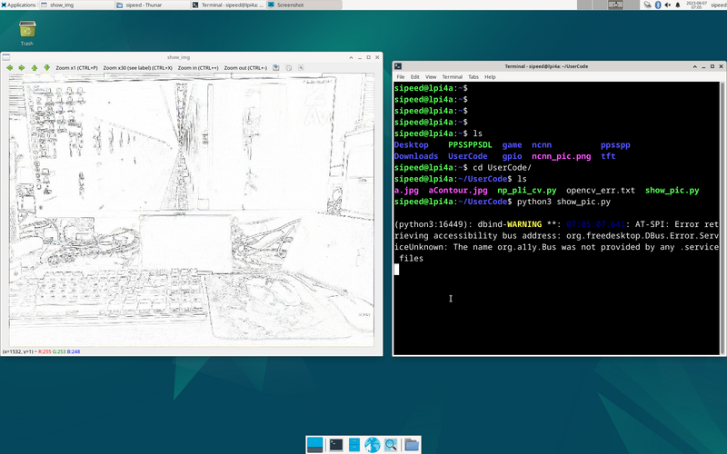

## llama.cpp

llama 是 META 开源的大语言模型，[llama.cpp](https://github.com/ggerganov/llama.cpp) 是 ggerganov 开源的纯 cpp 运行的 llama 推理项目。
感谢 llama.cpp 这个优秀的项目，我们可以在 LicheePi 4A 上运行 LLM。

笔者在早些时候稍微修改了 llama.cpp [https://github.com/Zepan/llama.cpp](https://github.com/Zepan/llama.cpp)，使其可以在更小内存（低至 700MB 左右）运行 7B 模型。

可以看到 TH1520 花费约 6s 计算一个 token（未使用 V 扩展加速，V 扩展加速预计可加速 4～8 倍，如果你加入了 V 扩展支持，欢迎投稿！）
  

同时还简单测试了下在入门级 C906 内核上运行7B模型的可行性，由于 D1 的内存过小，使用了 mmap 方式只读扩展，所以引入了大量低速 IO 操作，使得运行速度大为降低，最后仅 18s/token

  

## YOLOX 目标检测

本教程是一个如何在 LPi4A（LicheePi 4A） 开发板平台上部署 [YOLOX](https://github.com/Megvii-BaseDetection/YOLOX) 模型完成目标检测的示例（CPU推理）。
教程中包括了：
- 在 LPi4A 开发版上安装 Python 环境
- 使用 YOLOX 项目中的源码执行模型

教程遵循通常的模型部署流程：
1. LPi4A 上的基础 Python 环境配置
2. 获取 yolox 源码和模型
3. 安装 yolox 所依赖的 python 包
4. LPi4A 上的使用 HHB-onnxruntime 执行示例

**基础 Python 环境配置**
**基本软硬件配置**

参考 LPi4A 的 《[开箱体验](https://wiki.sipeed.com/hardware/zh/lichee/th1520/lpi4a/2_unbox.html)》中的描述，正确安装好开发板，上电启动后以 root 权限进入。

确保已联网的状态下，更新 apt 源
```bash
sudo apt update
```

安装一些软件，用于示例中后续使用
```bash
sudo apt install wget git vim
```

安装 SHL 库
```bash
wget https://github.com/T-head-Semi/csi-nn2/releases/download/v2.4-beta.1/c920.tar.gz
tar xf c920.tar.gz
cp c920/lib/* /usr/lib/riscv64-linux-gnu/ -rf
```


**Python 环境配置**
LPi4A 烧录的系统中已默认安装 python 3.11 版本。可以使用如下命令确认
```bash
python --version
```

后续均以 python3.11 版本为例，其他版本在安装依赖时需要修改到对应版本的命令。
各种 python 程序软件依赖的软件包大多可通过 pip 安装，可以使用如下命令安装 pip
```bash
apt install python3-pip
```

安装其他python包之前，先安装 venv 包，用于创建python虚拟环境
```bash
apt install python3.11-venv
```

创建 python虚拟环境，并激活
```bash
cd /root
python3 -m venv ort
source /root/ort/bin/activate
```


至此，基本 python 环境已经创建完成，与其他体系结构类似，可以直接通过 pip install 安装纯 python 包。

opencv 安装是会依赖其他 python 包，如果 pip 不能自动下载，则可以先手动安装依赖项的安装包。如何获取安装包可以参考 [下载 riscv whl](https://www.yuque.com/za4k4z/uzn618/zsp0krgg9dlp0fhx)。

**获取 YOLOX 模型**

[YOLOX](https://github.com/Megvii-BaseDetection/YOLOX) 是一个类 YOLO 的目标检测模型，有相当优异的性能表现。
可以直接下载 github 上的源码和模型
```bash
git clone https://github.com/Megvii-BaseDetection/YOLOX.git
cd YOLOX/demo/ONNXRuntime
wget https://github.com/Megvii-BaseDetection/YOLOX/releases/download/0.1.1rc0/yolox_s.onnx
```

**修改源码**

本教程将使用 HHB-onnxruntime 执行模型，因此切换到。在源码中的 onnxruntime 示例目录，修改文件 demo/ONNXRuntime/onnx_inference.py 的开头新增两行代码
```bash
#!/usr/bin/env python3
# Copyright (c) Megvii, Inc. and its affiliates.

+import sys
+sys.path.insert(0, "../../")
+
import argparse
import os
```
代码中使用 sys.path.insert 指定搜索路径，以此免去从源码中安装 YOLOX 的安装包的操作。

**安装依赖包**

RISC-V 体系结构的 python 生态还有欠缺，未来完善之后，YOLOX 中依赖的包可以通过 [requirements.txt](https://github.com/Megvii-BaseDetection/YOLOX/blob/main/requirements.txt) 文件直接安装。
本教程中的 YOLOX 示例依赖了较多的 python 包，下载预编译好的 python 包
```bash
git clone -b python3.11 https://github.com/zhangwm-pt/prebuilt_whl.git
cd prebuilt_whl
```

可以按照以下顺序，手工处理。
```bash
pip install numpy-1.25.0-cp311-cp311-linux_riscv64.whl
pip install opencv_python-4.5.4+4cd224d-cp311-cp311-linux_riscv64.whl
pip install kiwisolver-1.4.4-cp311-cp311-linux_riscv64.whl
pip install Pillow-9.5.0-cp311-cp311-linux_riscv64.whl
pip install matplotlib-3.7.2.dev0+gb3bd929cf0.d20230630-cp311-cp311-linux_riscv64.whl
pip install pycocotools-2.0.6-cp311-cp311-linux_riscv64.whl
pip3 install loguru-0.7.0-py3-none-any.whl
pip3 install torch-2.0.0a0+gitc263bd4-cp311-cp311-linux_riscv64.whl
pip3 install MarkupSafe-2.1.3-cp311-cp311-linux_riscv64.whl
pip3 install torchvision-0.15.1a0-cp311-cp311-linux_riscv64.whl
pip3 install psutil-5.9.5-cp311-abi3-linux_riscv64.whl
pip3 install tqdm-4.65.0-py3-none-any.whl
pip3 install tabulate-0.9.0-py3-none-any.whl
```

安装过程中会涉及到其他纯 python 依赖包，pip 会自动从官方源下载。

**安装 HHB-onnxruntime**

HHB-onnxuruntime 是移植了 SHL 后端（execution providers），让 onnxruntime 能复用到 SHL 中针对玄铁 CPU 的高性能优化代码。

```bash
wget https://github.com/zhangwm-pt/onnxruntime/releases/download/riscv_whl/onnxruntime-1.14.1-cp311-cp311-linux_riscv64.whl
pip install onnxruntime-1.14.1-cp311-cp311-linux_riscv64.whl
```

**执行**

在示例目录中执行 onnx_inference.py 示例

```bash
python3 onnx_inference.py -m yolox_s.onnx -i soccer.jpg -o outdir -s 0.3 --input_shape 640,640
```

`python3 onnx_inference.py -m yolox_s.onnx -i soccer.jpg -o outdir -s 0.3 --input_shape640,640`

参数说明：
- -m：指定模型
- -i：指定图片
- -o：指定输出目录
- -s：指定检测的阈值
- --input_shape：指定检测时使用的图片尺寸

**参考结果**

本教程中输入如下图，是运动员踢足球的图片，预期的检测结果是检测到两个人和一个足球。

> 图片来源于网络


示例正常执行后，会在 outdir 目录下生成结果图片 soccer.jpg。图片中会用框画出检测到的目标，并标注概率，效果如下图：


## MobilenetV2 

本教程是一个如何在 LicheePi4A 平台上部署 mobilenetv2 模型完成图像分类的示例。

教程中包括了：
- 使用 HHB 编译 onnx 模型为 LicheePi4A 上可用的二进制
- 在 LicheePi4A 上使用 opencv c++ 版本做 mobilenetv2 模型的预处理
- 在 LicheePi4A 上使用 CPU 和 NPU 的差异

### NPU

#### 环境配置

参考[外设使用](https://wiki.sipeed.com/hardware/zh/lichee/th1520/lpi4a/6_peripheral.html#NPU)文档搭建好 NPU 使用相关环境后，进入到 HHB 环境的 Docker 镜像中。

首先获取本节教程的模型，下载到示例目录 `/home/example/th1520_npu/onnx_mobilenetv2_c++` 下：
[mobilenetv2-12.onnx](https://github.com/onnx/models/raw/main/validated/vision/classification/mobilenet/model/mobilenetv2-12.onnx)

并获取本次教程所使用的优化版本 opencv 所需的库文件，前往 [github仓库下载](https://xuantie.t-head.cn/community/download?id=4112956065753141248)下载到上一级目录 `/home/example/th1520_npu/` 下。
```shell
cd /home/example/th1520_npu/
git clone https://github.com/zhangwm-pt/prebuilt_opencv.git
```

#### 编译

**HHB 编译模型：**
将 ONNX 模型交叉编译成 NPU 上可执行的程序，需要使用 hhb 命令。注意，NPU 上仅支持8位或者16位定点运算，本示例中指定为 int8 非对称量化。编译时需要先进入到示例所在目录 `/home/example/th1520_npu/onnx_mobilenetv2_c++`：
```shell
cd /home/example/th1520_npu/onnx_mobilenetv2_c++
hhb -D --model-file mobilenetv2-12.onnx --data-scale 0.017 --data-mean "124 117 104"  --board th1520  --postprocess save_and_top5 --input-name "input" --output-name "output" --input-shape "1 3 224 224" --calibrate-dataset persian_cat.jpg  --quantization-scheme "int8_asym"
```

选项说明：
- -D ：指定 HHB 流程执行到生成可执行文件的阶段为止
- --model-file ：指定当前目录中已经下载好的 mobilenet 模型
- --data-mean ：指定均值
- --data-scale ：指定缩放值
- --board ：指定目标平台为 th1520
- --input-name： 模型的输入名
- --output-name：模型的输出名
- --input-shape：模型的输入大小
- --postprocess：保存输出结果，并且打印 top5 结果
- --calibrate-dataset：指定量化时所需的校准图片
- --quantization-scheme：指定量化方式为 int8 非对称

命令执行完成后，会在当前目录生成 hhb_out 子目录，里面的包括了 hhb_runtime，model.c 等多个文件：
- hhb.bm：HHB 的模型文件，包括了量化后的权重数据等信息
- hhb_runtime：th1520 平台上的可执行文件，由目录中的c文件编译而成
- main.c：临时文件，示例程序的参考入口
- model.c：临时文件，模型结构文件，与模型结构相关
- model.params：临时文件，权重数值
- io.c：临时文件，读写文件的辅助函数
- io.h：临时文件，读写文件的辅助函数声明
- process.c：临时文件，图像预处理函数
- process.h：临时文件，图像预处理函数声明

更详细的 HHB 选项说明可以参考 [HHB用户手册](https://www.yuque.com/za4k4z/oxlbxl/keyg70qggt5n3fpa)中的命令行选项说明。

**g++编译示例：**
```shell
riscv64-unknown-linux-gnu-g++ main.cpp -I../prebuilt_opencv/include/opencv4 -L../prebuilt_opencv/lib   -lopencv_imgproc   -lopencv_imgcodecs -L../prebuilt_opencv/lib/opencv4/3rdparty/ -llibjpeg-turbo -llibwebp -llibpng -llibtiff -llibopenjp2    -lopencv_core -ldl  -lpthread -lrt -lzlib -lcsi_cv -latomic -static -o mobilenetv2_example
```

编译命令正确执行完成后会在示例目录生成 mobilenetv2_example 文件。

#### 执行

交叉编译完成后，即可将程序执行所需的文件复制到开发板的目录中。可以使用 scp 命令：
```shell
scp -r ../onnx_mobilenetv2_c++ sipeed@你的开发板ip:~
```

先确认开发板中驱动是否加载：
```shell
lsmod
```
若在输出中有 `img_mem`，`vha` 和 `vha_info` 这三个模块，NPU驱动即加载成功。

参考 [YOLOX章节](https://wiki.sipeed.com/hardware/zh/lichee/th1520/lpi4a/8_application.html#YOLOX-%E7%9B%AE%E6%A0%87%E6%A3%80%E6%B5%8B) 安装并配置好 python 虚拟环境：
```shell
sudo apt update
sudo apt install wget git vim

wget https://github.com/T-head-Semi/csi-nn2/releases/download/v2.4-beta.1/c920.tar.gz
tar xf c920.tar.gz
cp c920/lib/* /usr/lib/riscv64-linux-gnu/ -rf

sudo apt install python3-pip
sudo apt install python3.11-venv

cd /root
python3 -m venv ort
source /root/ort/bin/activate

git clone -b python3.11 https://github.com/zhangwm-pt/prebuilt_whl.git
cd prebuilt_whl

pip install numpy-1.25.0-cp311-cp311-linux_riscv64.whl
pip install opencv_python-4.5.4+4cd224d-cp311-cp311-linux_riscv64.whl
pip install kiwisolver-1.4.4-cp311-cp311-linux_riscv64.whl
pip install Pillow-9.5.0-cp311-cp311-linux_riscv64.whl
pip install matplotlib-3.7.2.dev0+gb3bd929cf0.d20230630-cp311-cp311-linux_riscv64.whl
pip install pycocotools-2.0.6-cp311-cp311-linux_riscv64.whl
pip3 install loguru-0.7.0-py3-none-any.whl
pip3 install torch-2.0.0a0+gitc263bd4-cp311-cp311-linux_riscv64.whl
pip3 install MarkupSafe-2.1.3-cp311-cp311-linux_riscv64.whl
pip3 install torchvision-0.15.1a0-cp311-cp311-linux_riscv64.whl
pip3 install psutil-5.9.5-cp311-abi3-linux_riscv64.whl
pip3 install tqdm-4.65.0-py3-none-any.whl
pip3 install tabulate-0.9.0-py3-none-any.whl
```

在开发板相应目录下运行刚刚编译好的示例：
```shell
./mobilenetv2_example
```

执行完成后，会在终端上提示执行到的各个阶段：
1. 预处理
2. 模型执行
3. 后处理

mobilenetv2_example 执行会使用到的文件：
- persian_cat.jpg：输入图片
- input_img.bin：预处理阶段，根据输入图片生成的中间结果
- hhb_out/hhb_runtime：模型执行阶段使用的文件，由x86主机上 HHB 生成
- hhb_out/hhb.bm：模型执行阶段使用的文件，由x86主机上 HHB 生成
- input_img.bin_output0_1_1000.txt：模型执行阶段的输出文件，包括了模型执行输出的 1000 个结果数值

#### 参考结果

```shell
(ort) root@lpi4a:/home/sipeed/onnx_mobilenetv2_c++# ./mobilenetv2_example
 ********** preprocess image **********
 ********** run mobilenetv2 **********
INFO: NNA clock:792000 [kHz]
INFO: Heap :ocm (0x18)
INFO: Heap :anonymous (0x2)
INFO: Heap :dmabuf (0x2)
INFO: Heap :unified (0x5)
Run graph execution time: 7.87149ms, FPS=127.04

=== tensor info ===
shape: 1 3 224 224 
data pointer: 0x857ca0

=== tensor info ===
shape: 1 1000 
data pointer: 0x3fc9abe000
The max_value of output: 16.053827
The min_value of output: -8.026914
The mean_value of output: -0.001889
The std_value of output: 9.203342
 ============ top5: ===========
283: 16.053827
281: 14.165141
287: 11.709850
285: 11.615416
282: 11.332113
 ********** postprocess result **********
 ********** probability top5: ********** 
n02123394 Persian cat
n02123045 tabby, tabby cat
n02127052 lynx, catamount
n02124075 Egyptian cat
n02123159 tiger cat
```

### CPU
将上述 NPU 步骤中的 HHB 编译命令替换为：
```shell
hhb -D --model-file mobilenetv2-12.onnx --data-scale 0.017 --data-mean "124 117 104"  --board c920  --postprocess save_and_top5 --input-name "input" --output-name "output" --input-shape "1 3 224 224"
```

g++ 编译后处理命令替换为：
```shell
riscv64-unknown-linux-gnu-g++ main.cpp -I../prebuilt_opencv/include/opencv4 -L../prebuilt_opencv/lib   -lopencv_imgproc   -lopencv_imgcodecs -L../prebuilt_opencv/lib/opencv4/3rdparty/ -llibjpeg-turbo -llibwebp -llibpng -llibtiff -llibopenjp2    -lopencv_core -ldl  -lpthread -lrt -lzlib -lcsi_cv -latomic -static -o mobilenetv2_example
```

再将编译的到的二进制文件发送到开发板上运行即可。参考结果如下：
```shell
(ort) root@lpi4a:/home/sipeed/onnx_mobilenetv2_c++# ./mobilenetv2_example 
 ********** preprocess image **********
 ********** run mobilenetv2 **********
Run graph execution time: 79.77252ms, FPS=12.54

=== tensor info ===
shape: 1 3 224 224 
data pointer: 0x259240

=== tensor info ===
shape: 1 1000 
data pointer: 0x1c5200
The max_value of output: 16.843750
The min_value of output: -7.414062
The mean_value of output: 0.001131
The std_value of output: 9.056762
 ============ top5: ===========
283: 16.843750
281: 13.789062
287: 12.257812
282: 10.898438
285: 10.765625
 ********** postprocess result **********
 ********** probability top5: ********** 
n02123394 Persian cat
n02123045 tabby, tabby cat
n02127052 lynx, catamount
n02123159 tiger cat
n02124075 Egyptian cat
```

## Yolov5n 

### NPU

#### 环境配置

参考[外设使用](https://wiki.sipeed.com/hardware/zh/lichee/th1520/lpi4a/6_peripheral.html#NPU)文档搭建好 NPU 使用相关环境后，进入到 HHB 环境的 Docker 镜像中。

首先获取本节教程的模型，下载到示例目录 `/home/example/th1520_npu/yolov5n` 下：
```shell
git clone https://github.com/ultralytics/yolov5.git
cd yolov5
pip3 install ultralytics
python3 export.py --weights yolov5n.pt --include onnx --imgsz 384 640
```

#### 编译

**HHB 编译模型：**
将 ONNX 模型交叉编译成 NPU 上可执行的程序，需要使用 hhb 命令。注意，NPU 上仅支持8位或者16位定点运算，本示例中指定为 int8 非对称量化。编译时需要先进入到示例所在目录 `/home/example/th1520_npu/yolov5n`：
```shell
cd /home/example/th1520_npu/yolov5n
hhb -D --model-file yolov5n.onnx --data-scale-div 255 --board th1520 --input-name "images" --output-name "/model.24/m.0/Conv_output_0;/model.24/m.1/Conv_output_0;/model.24/m.2/Conv_output_0" --input-shape "1 3 384 640" --calibrate-dataset kite.jpg  --quantization-scheme "int8_asym"
```

选项说明：
- -D ：指定 HHB 流程执行到生成可执行文件的阶段为止
- --model-file ：指定当前目录中已经下载好的 yolov5 模型
- --data-mean ：指定均值
- --data-scale ：指定缩放值
- --board ：指定目标平台为 th1520
- --input-name： 模型的输入名
- --output-name：模型的输出名
- --input-shape：模型的输入大小
- --postprocess：保存输出结果，并且打印 top5 结果
- --calibrate-dataset：指定量化时所需的校准图片
- --quantization-scheme：指定量化方式为 int8 非对称

命令执行完成后，会在当前目录生成 hhb_out 子目录，里面的包括了 hhb_runtime，model.c 等多个文件：
- hhb.bm：HHB 的模型文件，包括了量化后的权重数据等信息
- hhb_runtime：th1520 平台上的可执行文件，由目录中的c文件编译而成
- main.c：临时文件，示例程序的参考入口
- model.c：临时文件，模型结构文件，与模型结构相关
- model.params：临时文件，权重数值
- io.c：临时文件，读写文件的辅助函数
- io.h：临时文件，读写文件的辅助函数声明
- process.c：临时文件，图像预处理函数
- process.h：临时文件，图像预处理函数声明

更详细的 HHB 选项说明可以参考 [HHB用户手册](https://www.yuque.com/za4k4z/oxlbxl/keyg70qggt5n3fpa)中的命令行选项说明。

**g++编译示例：**
```shell
riscv64-unknown-linux-gnu-gcc yolov5n.c -o yolov5n_example hhb_out/io.c hhb_out/model.c -Wl,--gc-sections -O2 -g -mabi=lp64d -I hhb_out/ -L /usr/local/lib/python3.8/dist-packages/hhb/install_nn2/th1520/lib/ -lshl -L /usr/local/lib/python3.8/dist-packages/hhb/prebuilt/decode/install/lib/rv -L /usr/local/lib/python3.8/dist-packages/hhb/prebuilt/runtime/riscv_linux -lprebuilt_runtime -ljpeg -lpng -lz -lstdc++ -lm -I /usr/local/lib/python3.8/dist-packages/hhb/install_nn2/th1520/include/ -mabi=lp64d -march=rv64gcv0p7_zfh_xtheadc -Wl,-unresolved-symbols=ignore-in-shared-libs
```

编译命令正确执行完成后会在示例目录生成 yolov5n_example 文件。

#### 执行

交叉编译完成后，即可将程序执行所需的文件复制到开发板的目录中。可以使用 scp 命令：
```shell
scp -r ../yolov5n sipeed@你的开发板ip:~
```

先确认开发板中驱动是否加载：
```shell
lsmod
```
若在输出中有 `img_mem`，`vha` 和 `vha_info` 这三个模块，NPU驱动即加载成功。

参考 [YOLOX章节](https://wiki.sipeed.com/hardware/zh/lichee/th1520/lpi4a/8_application.html#YOLOX-%E7%9B%AE%E6%A0%87%E6%A3%80%E6%B5%8B) 安装并配置好 python 虚拟环境：
```shell
sudo apt update
sudo apt install wget git vim

wget https://github.com/T-head-Semi/csi-nn2/releases/download/v2.4-beta.1/c920.tar.gz
tar xf c920.tar.gz
cp c920/lib/* /usr/lib/riscv64-linux-gnu/ -rf

sudo apt install python3-pip
sudo apt install python3.11-venv

cd /root
python3 -m venv ort
source /root/ort/bin/activate

git clone -b python3.11 https://github.com/zhangwm-pt/prebuilt_whl.git
cd prebuilt_whl

pip install numpy-1.25.0-cp311-cp311-linux_riscv64.whl
pip install opencv_python-4.5.4+4cd224d-cp311-cp311-linux_riscv64.whl
pip install kiwisolver-1.4.4-cp311-cp311-linux_riscv64.whl
pip install Pillow-9.5.0-cp311-cp311-linux_riscv64.whl
pip install matplotlib-3.7.2.dev0+gb3bd929cf0.d20230630-cp311-cp311-linux_riscv64.whl
pip install pycocotools-2.0.6-cp311-cp311-linux_riscv64.whl
pip3 install loguru-0.7.0-py3-none-any.whl
pip3 install torch-2.0.0a0+gitc263bd4-cp311-cp311-linux_riscv64.whl
pip3 install MarkupSafe-2.1.3-cp311-cp311-linux_riscv64.whl
pip3 install torchvision-0.15.1a0-cp311-cp311-linux_riscv64.whl
pip3 install psutil-5.9.5-cp311-abi3-linux_riscv64.whl
pip3 install tqdm-4.65.0-py3-none-any.whl
pip3 install tabulate-0.9.0-py3-none-any.whl
```

在开发板相应目录下运行刚刚编译好的示例：
```shell
python3 inference.py 
```

执行完成后，会在终端上提示执行到的各个阶段：
1. 预处理：将原图填充缩放到 384 * 640 的大小
2. 模型执行和后处理：执行模型推理，并做 nms 等后处理
3. 画框：将检测结果画在 384 *640 尺寸的图上，并输出新图片

inference.py 执行会使用到的文件：
- kite.jpg：输入图片
- image_preprocessed.bin：预处理阶段，根据输入图片生成的中间结果
- yolov5n_example：模型执行阶段使用的文件，由x86主机上 gcc 编译生成
- hhb_out/hhb.bm：模型执行阶段使用的文件，由x86主机上 HHB 生成
- detect.txt：后处理阶段的输出文件，包括了图片中检测出来的 4 个目标
- kite_result.jpg：输出图片，将检测框加入到输入图上的结果

#### 参考结果

```shell
(ort) root@lpi4a:/home/sipeed/yolov5n_npu# python3 inference.py 
 ********** preprocess image **********
 ******* run yolov5 and postprocess *******
INFO: NNA clock:792000 [kHz]
INFO: Heap :ocm (0x18)
INFO: Heap :anonymous (0x2)
INFO: Heap :dmabuf (0x2)
INFO: Heap :unified (0x5)
Run graph execution time: 5.36258ms, FPS=186.48
detect num: 4
id:     label   score           x1              y1              x2              y2
[0]:    0       0.895277        273.492188      161.245056      359.559814      330.644257
[1]:    0       0.887368        79.860062       179.181244      190.755692      354.304474
[2]:    0       0.815214        222.054550      224.477600      279.828979      333.717285
[3]:    33      0.563324        67.625580       173.948883      201.687988      219.065765
 ********** draw bbox **********
[273.492188, 161.245056, 359.559814, 330.644257, 0.895277, 0]
[79.860062, 179.181244, 190.755692, 354.304474, 0.887368, 0]
[222.05455, 224.4776, 279.828979, 333.717285, 0.815214, 0]
[67.62558, 173.948883, 201.687988, 219.065765, 0.563324, 33]
```

> 示例图片来源于网络。


### CPU
将上述 NPU 步骤中的 HHB 编译命令替换为：
```shell
hhb -D --model-file yolov5n.onnx --data-scale-div 255 --board c920 --input-name "images" --output-name "/model.24/m.0/Conv_output_0;/model.24/m.1/Conv_output_0;/model.24/m.2/Conv_output_0" --input-shape "1 3 384 640"
```

gcc 编译后处理命令替换为：
```shell
riscv64-unknown-linux-gnu-gcc yolov5n.c -static -o yolov5n_example hhb_out/io.c hhb_out/model.c -Wl,--gc-sections -O2 -g -mabi=lp64d -I hhb_out/ -L /usr/local/lib/python3.8/dist-packages/hhb/install_nn2/c920/lib/ -lshl -static -L /usr/local/lib/python3.8/dist-packages/hhb/prebuilt/decode/install/lib/rv -L /usr/local/lib/python3.8/dist-packages/hhb/prebuilt/runtime/riscv_linux -lprebuilt_runtime -ljpeg -lpng -lz -lstdc++ -lm -I /usr/local/lib/python3.8/dist-packages/hhb/install_nn2/c920/include/ -mabi=lp64d -march=rv64gcv0p7_zfh_xtheadc
```

再将编译的到的二进制文件发送到开发板上运行即可。参考结果如下：
```shell
(ort) root@lpi4a:/home/sipeed/yolov5n_cpu# python3 inference.py 
 ********** preprocess image **********
 ******* run yolov5 and postprocess *******
Run graph execution time: 387.34067ms, FPS=2.58
detect num: 4
id:     label   score           x1              y1              x2              y2
[0]:    0       0.901887        274.524475      158.559036      359.169312      332.431702
[1]:    0       0.879545        80.073883       184.767792      190.130157      349.906281
[2]:    0       0.845192        219.378418      221.662415      283.860413      333.798584
[3]:    33      0.666908        67.099136       174.128189      202.971451      220.213608
 ********** draw bbox **********
[274.524475, 158.559036, 359.169312, 332.431702, 0.901887, 0]
[80.073883, 184.767792, 190.130157, 349.906281, 0.879545, 0]
[219.378418, 221.662415, 283.860413, 333.798584, 0.845192, 0]
[67.099136, 174.128189, 202.971451, 220.213608, 0.666908, 33]
```

## Yolov5s

参考 yolov5n 的编译步骤，只需将 yolov5n.onnx 文件替换为 yolov5s.onnx，并将 HHB 和 GCC 编译命令中的参数 `yolov5n.onnx` 更改为 `yolov5s.onnx` 即可。

### 环境配置
在 x86 主机中，参考[外设使用](https://wiki.sipeed.com/hardware/zh/lichee/th1520/lpi4a/6_peripheral.html#NPU)文档搭建好 NPU 使用相关环境后，进入到 HHB 环境的 Docker 镜像中。
在 1520 上，参考 [YOLOX章节](https://wiki.sipeed.com/hardware/zh/lichee/th1520/lpi4a/8_application.html#YOLOX-%E7%9B%AE%E6%A0%87%E6%A3%80%E6%B5%8B) 安装并配置好 python 虚拟环境。

### CPU

#### 编译过程

**HBB 编译**
```shell
hhb -D --model-file yolov5s.onnx --data-scale-div 255 --board c920 --input-name "images" --output-name "/model.24/m.0/Conv_output_0;/model.24/m.1/Conv_output_0;/model.24/m.2/Conv_output_0" --input-shape "1 3 384 640"
```

HHB 命令中截取到最后的卷积层为止，卷积层之后的后处理，由 yolov5s.c 文件处理。`yolov5s.c` 可以参考 yolov5n 示例下的 `yolov5n.c` 文件。
**GCC 编译**
```shell
riscv64-unknown-linux-gnu-gcc yolov5s.c -static -o yolov5s_example hhb_out/io.c hhb_out/model.c -Wl,--gc-sections -O2 -g -mabi=lp64d -I hhb_out/ -L /usr/local/lib/python3.8/dist-packages/hhb/install_nn2/c920/lib/ -lshl -static -L /usr/local/lib/python3.8/dist-packages/hhb/prebuilt/decode/install/lib/rv -L /usr/local/lib/python3.8/dist-packages/hhb/prebuilt/runtime/riscv_linux -lprebuilt_runtime -ljpeg -lpng -lz -lstdc++ -lm -I /usr/local/lib/python3.8/dist-packages/hhb/install_nn2/c920/include/ -mabi=lp64d -march=rv64gcv0p7_zfh_xtheadc
```

#### 参考结果

```shell
(ort) root@lpi4a:/home/sipeed/yolov5s# python3 inference.py 
 ********** preprocess image **********
 ******* run yolov5 and postprocess *******
Run graph execution time: 821.20135ms, FPS=1.22
detect num: 4
id:     label   score           x1              y1              x2              y2
[0]:    0       0.932165        275.538910      159.163147      359.211151      329.072205
[1]:    0       0.888989        219.883255      222.074265      285.310486      334.005676
[2]:    0       0.840487        85.319901       184.137268      186.844284      346.103210
[3]:    33      0.783095        70.033737       176.102921      202.740250      218.405075
 ********** draw bbox **********
[275.53891, 159.163147, 359.211151, 329.072205, 0.932165, 0]
[219.883255, 222.074265, 285.310486, 334.005676, 0.888989, 0]
[85.319901, 184.137268, 186.844284, 346.10321, 0.840487, 0]
[70.033737, 176.102921, 202.74025, 218.405075, 0.783095, 33]
```

### NPU

#### 编译过程

参考 yolov5n 即可。

**HHB 编译**
```shell
hhb -D --model-file yolov5s.onnx --data-scale-div 255 --board th1520 --input-name "images" --output-name "/model.24/m.0/Conv_output_0;/model.24/m.1/Conv_output_0;/model.24/m.2/Conv_output_0" --input-shape "1 3 384 640" --calibrate-dataset kite.jpg  --quantization-scheme "int8_asym"
```

**GCC 编译**
HHB 命令中截取到最后的卷积层为止，卷积层之后的后处理，由 yolov5s.c 文件处理。`yolov5s.c` 可以参考 yolov5n 示例下的 `yolov5n.c` 文件。
```shell
riscv64-unknown-linux-gnu-gcc yolov5s.c -o yolov5s_example hhb_out/io.c hhb_out/model.c -Wl,--gc-sections -O2 -g -mabi=lp64d -I hhb_out/ -L /usr/local/lib/python3.8/dist-packages/hhb/install_nn2/th1520/lib/ -lshl -L /usr/local/lib/python3.8/dist-packages/hhb/prebuilt/decode/install/lib/rv -L /usr/local/lib/python3.8/dist-packages/hhb/prebuilt/runtime/riscv_linux -lprebuilt_runtime -ljpeg -lpng -lz -lstdc++ -lm -I /usr/local/lib/python3.8/dist-packages/hhb/install_nn2/th1520/include/ -mabi=lp64d -march=rv64gcv0p7_zfh_xtheadc -Wl,-unresolved-symbols=ignore-in-shared-libs
```

#### 参考结果

```shell
(ort) root@lpi4a:/home/sipeed/yolov5s_npu# python3 inference.py 
 ********** preprocess image **********
 ******* run yolov5 and postprocess *******
INFO: NNA clock:792000 [kHz]
INFO: Heap :ocm (0x18)
INFO: Heap :anonymous (0x2)
INFO: Heap :dmabuf (0x2)
INFO: Heap :unified (0x5)
Run graph execution time: 9.85487ms, FPS=101.47
detect num: 4
id:     label   score           x1              y1              x2              y2
[0]:    0       0.933075        276.321838      157.925751      358.274475      329.757538
[1]:    0       0.893568        219.203781      221.895264      286.790039      334.801636
[2]:    0       0.848185        83.283234       182.688538      187.325684      346.702515
[3]:    33      0.800765        68.743454       175.539230      204.108292      218.260056
 ********** draw bbox **********
[276.321838, 157.925751, 358.274475, 329.757538, 0.933075, 0]
[219.203781, 221.895264, 286.790039, 334.801636, 0.893568, 0]
[83.283234, 182.688538, 187.325684, 346.702515, 0.848185, 0]
[68.743454, 175.53923, 204.108292, 218.260056, 0.800765, 33]
```

## BERT

### CPU

#### 环境配置

参考[外设使用](https://wiki.sipeed.com/hardware/zh/lichee/th1520/lpi4a/6_peripheral.html#NPU)文档搭建好 NPU 使用相关环境后，进入到 HHB 环境的 Docker 镜像中。

首先获取模型，本教程中使用的模型来自 google bert 仓库，已转换成 onnx 版本的 BERT 模型，可以用如下命令下载到 `/home/example/c920/bert_small` 目录下:
```shell
cd home/example/c920/bert_small
wget https://github.com/zhangwm-pt/bert/releases/download/onnx/bert_small_int32_input.onnx
```

#### 编译

**HHB 编译模型：**
将 ONNX 模型交叉编译成 NPU 上可执行的程序，需要使用 hhb 命令。注意，NPU 上仅支持8位或者16位定点运算，本示例中指定为 int8 非对称量化。编译时需要先进入到示例所在目录 `/home/example/c920/bert_small`：
```shell
cd /home/example/c920/bert_small
hhb --model-file bert_small_int32_input.onnx --input-name "input_ids;input_mask;segment_ids" --input-shape '1 384;1 384;1 384' --output-name "output_start_logits;output_end_logits" --board c920 --quantization-scheme "float16" --postprocess save_and_top5 -D --without-preprocess
```

选项说明：
- -D ：指定 HHB 流程执行到生成可执行文件的阶段为止
- --model-file ：指定当前目录中已经下载好的 bert 模型
- --data-mean ：指定均值
- --data-scale ：指定缩放值
- --board ：指定目标平台为 th1520
- --input-name： 模型的输入名
- --output-name：模型的输出名
- --input-shape：模型的输入大小
- --postprocess：保存输出结果，并且打印 top5 结果
- --calibrate-dataset：指定量化时所需的校准图片
- --quantization-scheme：指定量化方式为 int8 非对称

命令执行完成后，会在当前目录生成 hhb_out 子目录，里面的包括了 hhb_runtime，model.c 等多个文件：
- hhb.bm：HHB 的模型文件，包括了量化后的权重数据等信息
- hhb_runtime：th1520 平台上的可执行文件，由目录中的c文件编译而成
- main.c：临时文件，示例程序的参考入口
- model.c：临时文件，模型结构文件，与模型结构相关
- model.params：临时文件，权重数值
- io.c：临时文件，读写文件的辅助函数
- io.h：临时文件，读写文件的辅助函数声明
- process.c：临时文件，图像预处理函数
- process.h：临时文件，图像预处理函数声明

更详细的 HHB 选项说明可以参考 [HHB用户手册](https://www.yuque.com/za4k4z/oxlbxl/keyg70qggt5n3fpa) 中的命令行选项说明。


编译命令正确执行完成后会在示例目录生成可执行文件，将该示例目录拷贝至开发板中即可运行。

```shell
scp -r ../bert_small sipeed@你的ip:~
```

#### 执行

执行示例程序的前置步骤同 YOLOv5n，此处不在赘述。
前置步骤准确无误后，即可在示例目录执行命令
```shell
python3 inference.py
```

#### 参考结果

本示例中的参考输入来自 SQuAD 数据集，SQuAD 是一个阅读理解数据集，由一组维基百科文章提出的问题组成，其中每个问题的答案都是来自相应阅读文章或问题的一段文本。
本示例的输入如下，文章内容描述了一次橄榄球比赛的赛况，提出的问题是谁参加了比赛。

```
[Context]:  Super Bowl 50 was an American football game to determine the champion of the National Football League (NFL) for the 2015 season. The American Football Conference (AFC) champion Denver Broncos defeated the National Football Conference (NFC) champion Carolina Panthers 24–10 to earn their third Super Bowl title. The game was played on February 7, 2016, at Levi's Stadium in the San Francisco Bay Area at Santa Clara, California. As this was the 50th Super Bowl, the league emphasized the "golden anniversary" with various gold-themed initiatives, as well as temporarily suspending the tradition of naming each Super Bowl game with Roman numerals (under which the game would have been known as "Super Bowl L"), so that the logo could prominently feature the Arabic numerals 50.

[Question]:  Which NFL team represented the AFC at Super Bowl 50?
```
根据阅读理解的结果，预期输出将是 Denver Broncos

```shell
(ort) root@lpi4a:/home/sipeed/bert_small_cpu# python3 inference.py
 ********** preprocess test **********
[Context]:  Super Bowl 50 was an American football game to determine the champion of the National Football League (N
FL) for the 2015 season. The American Football Conference (AFC) champion Denver Broncos defeated the National Footba
ll Conference (NFC) champion Carolina Panthers 24–10 to earn their third Super Bowl title. The game was played on Fe
bruary 7, 2016, at Levi's Stadium in the San Francisco Bay Area at Santa Clara, California. As this was the 50th Sup
er Bowl, the league emphasized the "golden anniversary" with various gold-themed initiatives, as well as temporarily
 suspending the tradition of naming each Super Bowl game with Roman numerals (under which the game would have been k
nown as "Super Bowl L"), so that the logo could prominently feature the Arabic numerals 50.
[Question]:  Which NFL team represented the AFC at Super Bowl 50?
 ******* run bert *******
Run graph execution time: 1713.15491ms, FPS=0.58

=== tensor info ===
shape: 1 384 
data pointer: 0x183d60

=== tensor info ===
shape: 1 384 
data pointer: 0x185380

=== tensor info ===
shape: 1 384 
data pointer: 0x1869a0

=== tensor info ===
shape: 1 384 
data pointer: 0x2a8610
The max_value of output: 3.826172
The min_value of output: -9.968750
The mean_value of output: -8.412353
The std_value of output: 5.128320
 ============ top5: ===========
 46: 3.826172
 57: 3.142578
 39: 1.303711
 38: 1.179688
 27: 0.624512

=== tensor info ===
shape: 1 384 
data pointer: 0x2a8300
The max_value of output: 3.617188
The min_value of output: -9.625000
The mean_value of output: -7.798176
The std_value of output: 4.820137
 ============ top5: ===========
 47: 3.617188
 58: 3.482422
 32: 2.523438
 29: 1.541992
 41: 1.473633
 ********** postprocess **********
[Answer]:  Denver Broncos
```

## Docker

首先安装所需要的软件包
```shell
sudo apt-get update
sudo apt-get install docker docker-compose
```

安装完成后，使用 `sudo docker info` 命令验证安装是否成功：  
```shell
sipeed@lpi4a:~$ sudo docker info
Client: 
 Context: default
 Debug Mode: false  
Server:
 Containers: 0
  Running: 0 
  Paused: 0  
  Stopped: 0 
 Images: 0
 Server Version: 20.10.24+dfsg1 
 Storage Driver: overlay2 
  Backing Filesystem: extfs  
  Supports d_type: true
  Native Overlay Diff: true  
  userxattr: false  
 Logging Driver: json-file
 Cgroup Driver: systemd
 Cgroup Version: 2
 Plugins:
  Volume: local  
  Network: bridge host ipvlan macvlan null overlay
  Log: awslogs fluentd gcplogs gelf journald json-file local logentries splunk syslog 
 Swarm: inactive 
 Runtimes: io.containerd.runc.v2 io.containerd.runtime.v1.linux runc 
 Default Runtime: runc 
 Init Binary: docker-init 
 containerd version: 1.6.20~ds1-1+b1
 runc version: 1.1.5+ds1-1+b1
 init version:
 Security Options:
  seccomp 
Profile: default 
  cgroupns
 Kernel Version: 5.10.113-gfac22a756532
 Operating System: Debian GNU/Linux 12 (bookworm)  
 OSType: linux
 Architecture: riscv64 
 CPUs: 4  
 Total Memory: 15.47GiB
 Name: lpi4a 
 ID: MCKE:SEGQ:EBUX:ZMLC:P2WK:GIJ7:XAEQ:F56H:73HK:C3L5:IA5A:7GJI  
 Docker Root Dir: /var/lib/docker
 Debug Mode: false  
 Registry: https://index.docker.io/v1/ 
 Labels:  
 Experimental: false
 Insecure Registries:  
  127.0.0.0/8
 Live Restore Enabled: false
```

若想让普通用户也有 Docker 的执行权限，可以执行以下命令来实现：  
```shell
sudo groupadd docker
sudo usermod -aG docker $USER
newgrp docker
```
这些命令添加普通用户权限的用户名到 `docker` 用户组，并激活组权限。若不添加，则每次执行 Docker 相关命令时，需要以 sudo 权限来执行。

接下来，我们拉取 hello-world 镜像体验 Docker 的使用：  
```shell
sipeed@lpi4a:~$ docker pull hello-world
Using default tag: latest
latest: Pulling from library/hello-world   
b102dd09f2b3: Pull complete 
Digest: sha256:926fac19d22aa2d60f1a276b66a20eb765fbeea2db5dbdaafeb456ad8ce81598      
Status: Downloaded newer image for hello-world:latest    
docker.io/library/hello-world:latest 
```

接下来，启动刚刚拉取下来的容器：
```shell
sipeed@lpi4a:~$ docker run hello-world
Hello from Docker!
This message shows that your installation appears to be working correctly.

To generate this message, Docker took the following steps:
 1. The Docker client contacted the Docker daemon.
 2. The Docker daemon pulled the "hello-world" image from the Docker Hub.
    (amd64)
 3. The Docker daemon created a new container from that image which runs the
    executable that produces the output you are currently reading.
 4. The Docker daemon streamed that output to the Docker client, which sent it
    to your terminal.

To try something more ambitious, you can run an Ubuntu container with:
 $ docker run -it ubuntu bash

Share images, automate workflows, and more with a free Docker ID:
 https://hub.docker.com/

For more examples and ideas, visit:
 https://docs.docker.com/get-started/
```

查看 hello-world 镜像的相关信息：
```shell
sipeed@lpi4a:~$ docker images hello-world
REPOSITORY    TAG       IMAGE ID       CREATED        SIZE
hello-world   latest    eb6f80695a28   2 months ago   4.98kB
```

若要体验更完整的镜像，去[这里](https://hub.docker.com/)搜索想要使用的发行版名称，拉取即可。

## K3s-RISCV

该章节将展示如何在 LPi4A 上运行轻量级的 Kubernetes 发行版本 K3s。

先下载预编译的 K3s包：
https://github.com/CARV-ICS-FORTH/k3s/releases

然后将下载下来的包合并为一个 `.gz` 文件并解压，完成后给 k3s 添加执行权限：
```shell
wget https://github.com/CARV-ICS-FORTH/k3s/releases/download/20230721/k3s-riscv64.gz.aa
wget https://github.com/CARV-ICS-FORTH/k3s/releases/download/20230721/k3s-riscv64.gz.ab
wget https://github.com/CARV-ICS-FORTH/k3s/releases/download/20230721/k3s-riscv64.gz.ac
# 下面的命令需要root用户来执行
sudo -i
cat k3s-riscv64.gz.* | gunzip > /usr/local/bin/k3s
chmod +x /usr/local/bin/k3s
exit
```

验证是否能成功运行，成功运行的典型输出如下：
```shell
sipeed@lpi4a:~$ k3s                                                
NAME:                                                                           
   k3s-riscv64 - Kubernetes, but small and simple                               
                                                                                
USAGE:                                                                          
   k3s-riscv64 [global options] command [command options] [arguments...]        
                                                                                
VERSION:                                                                        
   v1.27.3+k3s-9d376dfb-dirty (9d376dfb)                                        
                                                                                
COMMANDS:                                                                       
   server           Run management server                                       
   agent            Run node agent                                              
   kubectl          Run kubectl                                                 
   crictl           Run crictl                                                  
   ctr              Run ctr                                                     
   check-config     Run config check                                            
   token            Manage bootstrap tokens                                     
   etcd-snapshot                                                                
   secrets-encrypt  Control secrets encryption and keys rotation                
   certificate      Manage K3s certificates                                     
   completion       Install shell completion script                             
   help, h          Shows a list of commands or help for one command            
                                                                                
GLOBAL OPTIONS:                                                                 
   --debug                     (logging) Turn on debug logs [$K3S_DEBUG]        
   --data-dir value, -d value  (data) Folder to hold state (default: /var/lib/r)
   --help, -h                  show help                                        
   --version, -v               print the version
```

现在，下载并运行 k3s 的安装脚本：
```shell
curl -sfL https://get.k3s.io > k3s-install.sh
chmod +x k3s-install.sh
INSTALL_K3S_EXEC="server --disable metrics-server" INSTALL_K3S_SKIP_DOWNLOAD="true" bash -x ./k3s-install.sh
```

运行完成后，使用如下命令检查 k3s 是否正常运行。典型输出如下：
```shell
sipeed@lpi4a:~$ systemctl status k3s
● k3s.service - Lightweight Kubernetes                                          
     Loaded: loaded (8;;file://lpi4a/etc/systemd/system/k3s.service/etc/systemd)
     Active: active (running) since Mon 2023-07-31 06:48:34 UTC; 6s ago         
       Docs: 8;;https://k3s.iohttps://k3s.io8;;                                 
    Process: 3240 ExecStartPre=/bin/sh -xc ! /usr/bin/systemctl is-enabled --qu>
    Process: 3242 ExecStartPre=/sbin/modprobe br_netfilter (code=exited, status>
    Process: 3243 ExecStartPre=/sbin/modprobe overlay (code=exited, status=0/SU>
   Main PID: 3244 (k3s-server)                                                  
      Tasks: 37                                                                 
     Memory: 529.5M                                                             
        CPU: 54.841s                                                            
     CGroup: /system.slice/k3s.service                                          
             ├─3244 "/usr/local/bin/k3s server"                                 
             └─3361 "containerd
```

接下来我们新建一个配置文件，运行 k3s 容器：
```shell
vi hello-lpi4a.yaml
```

文件内容如下（参考https://raw.githubusercontent.com/CARV-ICS-FORTH/kubernetes-riscv64/main/examples/hello-kubernetes.yaml）：
```yaml
apiVersion: v1
kind: Service
metadata:
  name: hello
spec:
  type: ClusterIP
  ports:
  - port: 8080
  selector:
    app: hello
---
apiVersion: apps/v1
kind: Deployment
metadata:
  name: hello
spec:
  replicas: 1
  selector:
    matchLabels:
      app: hello
  template:
    metadata:
      labels:
        app: hello
    spec:
      containers:
      - name: hello-kubernetes
        image: carvicsforth/hello-kubernetes:1.10.1
        env:
        - name: MESSAGE
          value: "Hello Lichee Pi 4A!"
```

然后使用这个配置文件启动一个容器。典型输入如下：
```shell
sipeed@lpi4a:~$ sudo kubectl apply -f hello-lpi4a.yaml 
service/hello created
deployment.apps/hello created
```

然后查看 pods 情况（若输出中没显示 IP 地址，可以多等待一会儿再查看）：
```shell
sipeed@lpi4a:~$ 
NAME                     READY   STATUS    RESTARTS   AGE   IP          NODE    NOMINATED NODE   READINESS GATES
hello-5b576d45d7-fdjgh   1/1     Running   0          16m   10.42.0.6   lpi4a   <none>           <none>
```

接下来使用 curl 测试 k3s 容器是否运行成功，典型输出如下：
```shell
sipeed@lpi4a:~$ curl 10.42.0.6:8080
<!DOCTYPE html>
<html>
<head>
    <title>Hello Kubernetes!</title>
    <link rel="stylesheet" type="text/css" href="/css/main.css">
    <link rel="stylesheet" href="https://fonts.googleapis.com/css?family=Ubuntu:300" >
</head>
<body>

  <div class="main">
    
    <div class="content">
      <div id="message">
  Hello Lichee Pi 4A!
</div>
<div id="info">
  <table>
    <tr>
      <th>namespace:</th>
      <td>-</td>
    </tr>
    <tr>
      <th>pod:</th>
      <td>hello-5b576d45d7-fdjgh</td>
    </tr>
    <tr>
      <th>node:</th>
      <td>- (Linux 5.10.113-gfac22a756532)</td>
    </tr>
  </table>
</div>
<div id="footer">
  paulbouwer/hello-kubernetes:1.10.1 (linux/riscv64)
</div>
    </div>
  </div>

</body>
</html>
```
至此，k3s容器已经运行成功。

页面效果如下：


<!--
最后，修改配置文件使得容器能够被外部设备访问：
```shell
apiVersion: v1
kind: Service
metadata:
  name: hello
spec:
  type: NodePort
  ports:
  - port: 8080
    targetPort: 8080
    nodePort: 30080
    protocol: TCP
  selector:
    app: hello
---
apiVersion: apps/v1
kind: Deployment
metadata:
  name: hello
spec:
  replicas: 1
  selector:
    matchLabels:
      app: hello
  template:
    metadata:
      labels:
        app: hello
    spec:
      containers:
      - name: hello-kubernetes
        image: carvicsforth/hello-kubernetes:1.10.1
        env:
        - name: MESSAGE
          value: "Hello Lichee Pi 4A!"
```
其中的 `nodePort` 为 30000-32767 中的任意一个数字。

更改后，应用新的配置文件：
```shell
sipeed@lpi4a:~$ sudo kubectl apply -f hello-lpi4a.yaml 
service/hello configured
deployment.apps/hello unchanged
```
-->


## Minecraft Server

这里以`1.20.1`版本为例，LPi4A 作为 Server，电脑端（Ubuntu 22.04）作为 Client。

首先在[这里](https://github.com/fizzed/nitro/releases/tag/builds)下载由 Fizzed 优化的 nitro JDK 19，下载完成后解压，重命名文件夹并移动到 `/opt/` 目录下：
```shell
tar xvf fizzed19.36-jdk19.0.1-linux_riscv64.tar.gz
sudo mv fizzed19.36-jdk19.0.1-linux_riscv64 /opt/jdk_19
```

测试该 JDK 是否可用：
```shell
sipeed@lpi4a:~$ /opt/jdk_19/bin/java -version
openjdk version "19.0.1" 2022-09-20
OpenJDK Runtime Environment Fizzed19.36 (build 19.0.1+10)
OpenJDK 64-Bit Server VM Fizzed19.36 (build 19.0.1+10, mixed mode)
```

若出现版本号则可用。若已经预装了别的版本的 JDK，那么可以更改下软连接，先查看原先的软链接信息，记录下方便后面改回来：
```shell
sipeed@lpi4a:~$ ls /usr/bin/java -l
lrwxrwxrwx 1 root root 22 Apr 26 10:40 /usr/bin/java -> /etc/alternatives/java
```

然后更改软链接指向刚刚安装的 JDK：
```shell
sudo rm /usr/bin/java
sudo ln -s /opt/jdk_19/bin/java /usr/bin/java
```

使用命令验证软链接是否配置成功：
```shell
java -version
```
出现版本，则配置成功。

接下来，在[这里](https://www.minecraft.net/zh-hans/download)下载原版服务端 jar 文件到 LPi4A，注意版本为`1.20.1`，然后在 LPi4A 上先执行：
```shell
java -jar server.jar nogui
```

若出现提示
```shell
[ServerMain/WARN]: Failed to load eula.txt
[ServerMain/INF0]:You need to agree to the EULA in order to run the server. Go to e ula.txt for more info.
```

则将当前目录下的 `eula.txt`文件中对应行改为的 false 改为 true：
```shell
eula=true
```

保存后退出，重新启动服务器，第一次启动会比较慢，耐心等待，启动完成后会显示启动用时（下列用时并非第一次启动用时）：
```shell
[03:51:02] [Server thread/INFO]: Time elapsed: 36394 ms
[03:51:02] [Server thread/INFO]: Done (52.927s)! For help, type "help"
```

接下来，在 PC 端启动客户端后即可连接，建议使用第三方客户端启动器 HMCL（下载链接https://hmcl.huangyuhui.net/download/）。
下载完成后，启动 HMCL：
```shell
java -jar HMCL-3.5.5.jar
```

可以直接在启动器中下载`1.20.1`版本，并且配置好游戏账户，然后即可进入游戏，进入游戏后，输入 服务器 IP（LPi4A 的 IP）添加服务器后即可连接（确保电脑和 LPi4A 处于同一网络下），效果如下：


> 注意，若想改回原来版本的 JDK，则执行：
> ```shell
> sudo rm /usr/bin/java
> sudo ln -s /opt/jdk_19/bin/java /etc/alternatives/java
> ``` 

## Wine-CE

首先在[这里](https://gitee.com/wine-ce/wine-ce/releases/tag/v8.9)下载 `wine-ce_dlls_8.9.0.all.tar.xz`，`wine-ce_core_8.9.0.riscv64.tar.xz`这两个文件，这里假设下载到用户主目录（撰写该文档时最新版本为8.9）。

然后根据文档中的步骤进行安装：
```shell
sudo apt install fonts-liberation fonts-wine glib-networking libpulse0 gstreamer1.0-plugins-good gstreamer1.0-x libaa1 libaom3 libasound2-plugins  libcaca0 libcairo-gobject2 libcodec2-1.0 libdav1d6 libdv4 libgdk-pixbuf-2.0-0 libgomp1 libgpm2 libiec61883-0 libjack-jackd2-0 libmp3lame0 libncurses6 libncursesw6 libnuma1 libodbc2 libproxy1v5 libraw1394-11 librsvg2-2 librsvg2-common libsamplerate0 libshine3 libshout3 libslang2 libsnappy1v5 libsoup2.4-1 libsoxr0 libspeex1 libspeexdsp1 libtag1v5 libtag1v5-vanilla libtwolame0 libva-drm2 libva-x11-2 libva2 libvdpau1 libvkd3d-shader1 libvkd3d1 libvpx7 libwavpack1 libwebpmux3 libx265-199 libxdamage1 libxvidcore4 libzvbi-common libzvbi0 mesa-va-drivers mesa-vdpau-drivers va-driver-all vdpau-driver-all vkd3d-compiler

sudo tar -Jxvf wine-ce_core_8.9.0.riscv64.tar.xz -C /opt/
sudo tar -Jxvf wine-ce_dlls_8.9.0.all.tar.xz -C /opt/
sudo ln -sf /opt/wine-ce/bin/wine /usr/bin/wine
sudo ln -sf /opt/wine-ce/bin/winecfg /usr/bin/winecfg
rm -rf ~/.wine
```

接下来进行一些初始化设置：  
```shell
winecfg
```

这里使用的设置如下：


设置完成后，即可运行 Windows 下的程序，比如这里的命令运行 Windows 下的记事本
```shell
wine notepad.exe
```


## 使用优化 GCC 工具链

实验性 feature 如果发现问题可以进行 [issue](https://github.com/revyos/revyos/issues) 申报。

安装步骤
```shell
# 增加优化源
sudo sed -i '1ideb https://mirror.iscas.ac.cn/revyos/revyos-c910v/ revyos-c910v main' /etc/apt/sources.list
# 更新软件
sudo apt update
# 安装 gcc-10/gcc-13
sudo apt install -y build-essential # gcc-10
sudo apt install -y gcc-13 g++-13 # gcc-13
# 重启避免其他问题
sudo reboot
```

测试 gcc-10 (gcc10.4 启用 xtheadc+v0p7)
```shell
gcc -v
Using built-in specs.
COLLECT_GCC=gcc
COLLECT_LTO_WRAPPER=/usr/lib/gcc/riscv64-linux-gnu/10/lto-wrapper
Target: riscv64-linux-gnu
Configured with: ../src/configure -v --with-pkgversion='Debian 10.4.0-8revyos2.3' --with-bugurl=file:///usr/share/doc/gcc-10/README.Bugs --enable-languages=c,ada,c++,go,d,fortran,objc,obj-c++,m2 --prefix=/usr --with-gcc-major-version-only --program-suffix=-10 --program-prefix=riscv64-linux-gnu- --enable-shared --enable-linker-build-id --libexecdir=/usr/lib --without-included-gettext --enable-threads=posix --libdir=/usr/lib --enable-nls --enable-clocale=gnu --enable-libstdcxx-debug --enable-libstdcxx-time=yes --with-default-libstdcxx-abi=new --enable-gnu-unique-object --disable-libitm --disable-libsanitizer --disable-libquadmath --disable-libquadmath-support --enable-plugin --enable-default-pie --with-system-zlib --enable-libphobos-checking=release --with-target-system-zlib=auto --enable-objc-gc=auto --enable-multiarch --disable-werror --disable-multilib --with-arch=rv64gcv0p7_zfh_xtheadc --with-abi=lp64d --enable-checking=release --build=riscv64-linux-gnu --host=riscv64-linux-gnu --target=riscv64-linux-gnu
Thread model: posix
Supported LTO compression algorithms: zlib zstd
gcc version 10.4.0 (Debian 10.4.0-8revyos2.3)
```

测试 gcc-13 (gcc13.2 启用 xthead extension)
```shell
gcc-13 -v
Using built-in specs.
COLLECT_GCC=gcc-13
COLLECT_LTO_WRAPPER=/usr/libexec/gcc/riscv64-linux-gnu/13/lto-wrapper
Target: riscv64-linux-gnu
Configured with: ../src/configure -v --with-pkgversion='Debian 13.2.0-1revyos1' --with-bugurl=file:///usr/share/doc/gcc-13/README.Bugs --enable-languages=c,ada,c++,go,d,fortran,objc,obj-c++,m2 --prefix=/usr --with-gcc-major-version-only --program-suffix=-13 --program-prefix=riscv64-linux-gnu- --enable-shared --enable-linker-build-id --libexecdir=/usr/libexec --without-included-gettext --enable-threads=posix --libdir=/usr/lib --enable-nls --enable-clocale=gnu --enable-libstdcxx-debug --enable-libstdcxx-time=yes --with-default-libstdcxx-abi=new --enable-gnu-unique-object --disable-libitm --disable-libquadmath --disable-libquadmath-support --enable-plugin --enable-default-pie --with-system-zlib --enable-libphobos-checking=release --with-target-system-zlib=auto --enable-objc-gc=auto --enable-multiarch --disable-werror --disable-multilib --with-arch=rv64gc_zfh_xtheadba_xtheadbb_xtheadbs_xtheadcmo_xtheadcondmov_xtheadfmemidx_xtheadfmv_xtheadint_xtheadmac_xtheadmemidx_xtheadmempair_xtheadsync --with-abi=lp64d --enable-checking=release --build=riscv64-linux-gnu --host=riscv64-linux-gnu --target=riscv64-linux-gnu --with-build-config=bootstrap-lto-lean --enable-link-serialization=16
Thread model: posix
Supported LTO compression algorithms: zlib zstd
gcc version 13.2.0 (Debian 13.2.0-1revyos1)
```

gcc-10/gcc-13 区别：
除了v0p7，其他优化都可以用 gcc-13 代替 gcc-10。
后者的优化可以主线报问题，是已经主线化的功能。

## SuperTuxKart

SuperTuxKart 是一款 3D 开源街机赛车游戏，有各种角色、赛道和模式可供选择。在 LPi4A 上也可以通过源码编译来体验：  

首先安装依赖：
```shell
sudo apt-get install build-essential cmake libbluetooth-dev libsdl2-dev \
libcurl4-openssl-dev libenet-dev libfreetype6-dev libharfbuzz-dev \
libjpeg-dev libogg-dev libopenal-dev libpng-dev \
libssl-dev libvorbis-dev libmbedtls-dev pkg-config zlib1g-dev
```

接下来参考[文档](https://github.com/supertuxkart/stk-code/blob/master/INSTALL.md#building-supertuxkart-on-linux)步骤编译：
```shell
# clone and configure src
git clone https://github.com/supertuxkart/stk-code stk-code
svn co https://svn.code.sf.net/p/supertuxkart/code/stk-assets stk-assets

# go into the stk-code directory
cd stk-code

# create and enter the cmake_build directory
mkdir cmake_build
cd cmake_build

# run cmake to generate the makefile
cmake .. -DBUILD_RECORDER=off -DNO_SHADERC=on

# compile
make -j$(nproc)
```

编译完成后，在当前目录下的 `bin/` 文件夹中即可找到 `supertuxkart` 程序。运行即可：
```shell
./bin/supertuxkart
```

效果如下：


## llama2.c

[项目链接](https://github.com/karpathy/llama2.c)
我们可以根据项目链接文档中的步骤来运行一个 Llama 2 的小模型。

首先 clone 该项目，并切换到改项目目录下：
```shell
git clone https://github.com/karpathy/llama2.c.git
```

然后下载 model.bin 文件，并放到指定目录下：
```shell
wget https://karpathy.ai/llama2c/model.bin -P out
```

然后编译并运行：
```shell
gcc -O3 -o run run.c -lm
./run out/model.bin
```

可以得到如下输出：
```text
<s>
 Once upon a time, there was a little girl named Lily. She loved to play with her dolls and teddy bea
rs. One day, she saw her friend Lucy playing with her favorite doll. 
Lily: "Lucy, can I play with you?"
Lucy: "Sure, but can you be careful with my doll?"
Lily: "Sure, I promise I won't break her."
Lucy: "That's very original. I really love it."
Lily smiled and showed her doll to her mom. Her mom said, "That's nice, Lily. Let's put your doll on 
the shelf and play with her some more."
From that day on, Lily and her doll played together every day. They were the best of friends and didn
't break anyone's possession.
<s>
 Once upon a time, there was a little boy named Timmy. Timmy loved to eat sandwiches. One day, Timmy'
s mom made him a sandwich for lunch. It was so yummy and tasty! But then, something unexpected happen
ed. Timmy's little sister spilled some juice on his sandwich. Tim
achieved tok/s: 30.955260
```

也可以修改一些编译参数来加速：
```text
sipeed@lpi4a:~/llama2.c$ gcc -Ofast -fopenmp run.c  -lm  -o run
sipeed@lpi4a:~/llama2.c$ OMP_NUM_THEADS=4 ./run out/model.bin 
<s>
 Once upon a time, there was a boy named Tom. He liked to run fast. One day, he saw a big tree. Under
 the tree, he found a hole. Tom was curious. He looked inside and saw something shiny.
Tom looked closer, and it was not a shiny thing. It was a key! He was very surprised. He took the key
 and ran home. He showed his mom the key.
Tom's mom said the key was for a sneeze. The sneeze was a sneeze. Tom's mom put the key next to her p
ocket. Tom said, "Now you can have a sneeze too!"
Tom put his nose under his ears. He went home and took a nap. When he woke up, he had a small sneeze 
from the key. It was not food or water. Tom was happy and laughed.
<s>
 Once upon a time, there was a bunny. The bunny was very restless and wanted to explore, so he hopped
 off his little house. 
The bunny hopped and hopped until he saw a shiny silver carrot. He was so excited to eat it, he
achieved tok/s: 52.043098
```

### Stable Diffusion

[项目地址](https://github.com/vitoplantamura/OnnxStream)

本示例通过这个项目在 LPi4A 上运行 Stable Diffusion。

首先，我们需要构建 XNNPACK：
```shell
git clone https://github.com/google/XNNPACK.git
cd XNNPACK
git checkout 3f56c91b492c93676a9b5ca4dd51f528b704c309
mkdir build
cd build
cmake -DXNNPACK_BUILD_TESTS=OFF -DXNNPACK_BUILD_BENCHMARKS=OFF ..
cmake --build . --config Release
```

接下来，构建 Stable Diffusion example：
```shell
git clone https://github.com/vitoplantamura/OnnxStream.git
cd OnnxStream
cd src
mkdir build
cd build
cmake -DXNNPACK_DIR=<此处替换为clone的XNNPACK存放路径> ..
cmake --build . --config Release
```

现在我们得到了可运行的 Stable Diffusion example 文件 `sd` ，使用如下参数运行：
```shell
./sd --models-path . --rpi
```
其中，`--models-path` 是从该项目 Release 页面中下载的模型文件，可以放到 `sd` 文件的所在目录下。

运行时的配置如下：
```shell
----------------[start]------------------
positive_prompt: a photo of an astronaut riding a horse on mars
negative_prompt: ugly, blurry
output_png_path: ./result.png
steps: 10 
```

得到的结果为`result.png`文件，上述 prompt 得到的图片如下：


## PSP模拟器

[项目地址](https://github.com/hrydgard/ppsspp)

本示例通过这个项目在 LPi4A 上运行 PSP模拟器。

首先，我们需要构建 PPSSPP：
```shell
#先安装所需要的包
sudo apt install build-essential cmake libgl1-mesa-dev libsdl2-dev libvulkan-dev mesa-common-dev  libglu1-mesa-dev  libsdl2-dev libcurl4-openssl-dev
git clone --recurse-submodules https://github.com/hrydgard/ppsspp.git
cd ppsspp
git submodule update --init --recursive
git pull --rebase https://github.com/hrydgard/ppsspp.git
cmake .
make -j4

```
编译可能需要一段时间，出现以下输出时，编译成功：
```shell
sipeed@lpi4a:~/ppsspp$ make -j4
[  0%] Built target unix_based_hardware_detection
[  0%] Built target utils
[  0%] Built target gason
[  1%] Built target snappy
[  1%] Built target cityhash
[  1%] Built target vma
[  2%] Built target png17
[  3%] Built target udis86
[  3%] Built target basis_universal
[ 16%] Built target libzip
[ 16%] Built target glew
[ 16%] Built target sfmt19937
[ 17%] Built target kirk
[ 18%] Built target xbrz
[ 18%] Built target xxhash
[ 19%] Generating something_that_never_exists
[ 21%] Built target miniupnpc
[ 25%] Built target libzstd_static
-- Could NOT find Git (missing: GIT_EXECUTABLE) 
CMake Warning at git-version.cmake:16 (message):
  git not found, unable to include version.


[ 25%] Built target GitVersion
[ 25%] Built target GenericCodeGen
[ 25%] Built target OGLCompiler
[ 25%] Built target OSDependent
[ 31%] Built target armips
[ 31%] Built target spirv-cross-core
[ 34%] Built target rcheevos
[ 35%] Built target cpu_features
[ 35%] Built target discord-rpc
[ 36%] Built target spirv-cross-glsl
[ 41%] Built target MachineIndependent
[ 41%] Built target spirv-cross-cpp
[ 41%] Built target spirv-cross-msl
[ 41%] Built target spirv-cross-hlsl
[ 41%] Built target glslang
[ 42%] Built target SPIRV
[ 58%] Built target Common
[ 59%] Built target native
[ 95%] Built target Core
[100%] Built target PPSSPPSDL

```
安装完之后可以试运行一下（root模式下）：
```shell
./PPSSPPSDL
```
如图：


游戏下载：
[psp游戏下载](https://playdreamcreate.com/)

下载完成：
我们只需要用到压缩包里的EBOOT.PBP文件
1.如果是使用图形界面则直接解压
2.如果使用命令行的话，需要将压缩包改成zip后缀再进行解压
```shell
mv [压缩包名] [压缩包名].zip
unzip [压缩包名].zip
```

开始游戏：在PPSSPPSDL命令下打开EBOOT.PBP即可
```shell
./PPSSPPSDL  ./game/01/EBOOT.PBP
```

运行效果如图：


## opencv 的使用
首先安装依赖，以及python3环境
```shell
sudo apt install python3 python3-pip
sudo apt install python3-opencv 
sudo apt install libqt5gui5-gles
```
opencv读取图片demo：

```shell
#!/bin/bash
import cv2

img2 = cv2.imread('aContour.jpg', cv2.IMREAD_UNCHANGED)
cv2.namedWindow('show_img', 0)          # 定义窗口名称，三个函数（namedWindow、 resizeWindow、 imshow）中窗口名称要一致
cv2.resizeWindow('show_img', 736, 416)
cv2.imshow("show_img",img2)
cv2.waitKey(0)
cv2.destroyAllWindows()
cv2.destroyWindow("show_img")

```
运行程序：
```shell
python3 show_pic.py
```
运行结果：



PIL-numpy-opencv 综合测试demo：

```shell
#!/bin/bash
from typing import List, Any, Tuple
import matplotlib.pyplot as plt
import cv2

import numpy as np
from PIL import Image
from PIL import ImageFilter

im = Image.open('a.jpg')
om = im.filter(ImageFilter.CONTOUR)
om.save('aContour.jpg')

b = np.random.randint(0, 255, (200, 300), dtype=np.uint8)
g = np.random.randint(0, 255, (200, 300), dtype=np.uint8)
r = np.random.randint(0, 255, (200, 300), dtype=np.uint8)
print(b)

img=np.empty([20,30,3],dtype=np.uint8)
bgr=()
rowlist=[]
collist: List[List[Tuple[Any, Any, Any]]]=[]
for row in range(200):
    rowlist=[]
    for col in range(300):
        bgr=(r[row][col],g[row][col],b[row][col])
        rowlist.append(bgr)
    collist.append(rowlist)

img=np.asarray(collist)

img2 = cv2.imread('aContour.jpg', cv2.IMREAD_UNCHANGED)
cv2.namedWindow('show_img', 0)        
cv2.resizeWindow('show_img', 736, 416)
cv2.imshow("show_img",img2)
cv2.waitKey(0)
cv2.destroyAllWindows()
cv2.destroyWindow("show_img")

```

使用 USB 摄像头 demo

```python

import cv2

# 打开摄像头
cap = cv2.VideoCapture(0)

# 检查是否成功打开摄像头
if not cap.isOpened():
    print("无法打开摄像头")
    exit()

# 循环读取摄像头的每一帧图像
while True:
    # 从摄像头中获取一帧图像
    ret, frame = cap.read()

    # 检查是否读取成功
    if not ret:
        print("无法获取图像")
        break

    # 显示图像
    cv2.imshow("USB Camera", frame)

    # 等待按下 ESC 键退出
    if cv2.waitKey(1) == 27:
        break

# 释放摄像头并关闭所有窗口
cap.release()
cv2.destroyAllWindows()
```

## ncnn 的使用

首先，git源码和安装相关的依赖库

```shell
git clone https://github.com/Tencent/ncnn.git
cd ncnn
git submodule update --init

sudo apt install build-essential git cmake libprotobuf-dev protobuf-compiler libvulkan-dev libopencv-dev libqt5gui5-gles

```
编译源码

```shell
cd ncnn
mkdir -p build
cd build
cmake -DCMAKE_BUILD_TYPE=Release -DNCNN_VULKAN=OFF -DNCNN_BUILD_EXAMPLES=ON ..
make -j$(nproc)
```

下载相关的模型文件以及参数，将它们放在与可执行文件同个文件夹下
[下载链接](https://github.com/nihui/ncnn-assets)
```shell
~/ncnn/build/example
```


执行
```shell
./nanodet a.jpg
```
运行结果


## Kdenlive 的使用

安装步骤：
```shell
sudo apt update
sudo apt install libqt5gui5-gles
sudo apt install kdenlive
```

若通过上面的命令安装的 Kdenlive 无法正常运行，可以尝试运行下面的命令：
```shell
sudo apt update
sudo apt reinstall libqt5gui5-gles
sudo apt reinstall kdenlive
```

安装完成后即可使用命令打开 kdenlive：
```shell
kdenlive
```

视频编辑效果如下：


## GStreamer

GStreamer 是一个基于管道的多媒体框架，基于 GObject，以 C 语言写成。凭借 GStreamer，可以很容易地创建各种多媒体功能组件，包括简单的音频回放、音频和视频播放、录音、流媒体和音频编辑。基于流水线设计，可以创建诸如视频编辑器、流媒体广播和媒体播放器等等的很多多媒体应用。

接下来，展示如何在 LPi4A 上运行 GStreamer 的 demo。
首先，需要安装相关的依赖：
```shell
sudo apt install git build-essential libgstreamer* gstreamer1.0-tools
```

然后拉取相关源码仓库
```shell
git clone https://gitlab.freedesktop.org/gstreamer/gst-docs
```

进入到 `gst-docs/examples/tutorials` 目录下，编译出 `basic-tutorial-1` 可执行程序
```shell
cd gst-docs/examples/tutorials
gcc basic-tutorial-1.c -o basic-tutorial-1 `pkg-config --cflags --libs gstreamer-1.0`
```

编译成功后会在当前目录下生成可执行程序，使用下面的命令运行即可看到效果：
```shell
./basic-tutorial-1
```


## Kicad

**注意，仅20231023及以上版本支持 kicad !**

首先安装 Kicad ：
```shell
sudo apt update
sudo apt install kicad
```

安装完毕后，需要先运行以下命令才能运行 kicad：
```shell
sudo switch-gl gl4es
rm ~/.cache
```

打开 kicad：
```shell
kicad
```


在使用完 kicad 后，需要运行下面的命令以避免兼容性问题：
```shell
sudo switch-gl mesa
rm ~/.cache
```

## KODI

直接安装运行即可：
```shell
sudo apt install kodi
kodi
```


## 其它

欢迎投稿～ 投稿接受后可得￥5～150（$1~20）优惠券！
