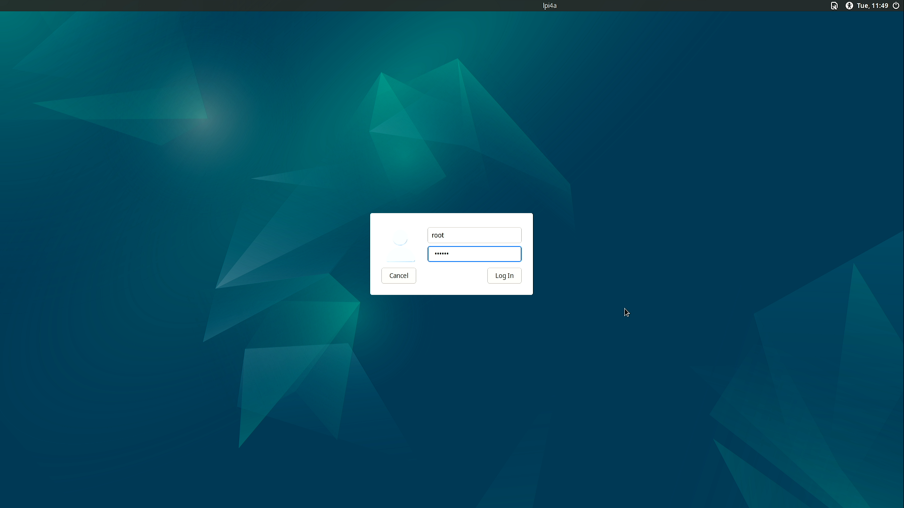
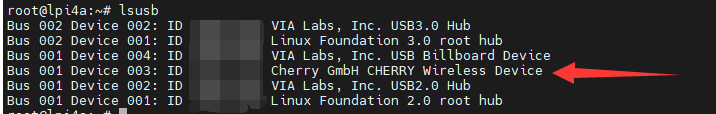

# LicheePi 4A 基础上手

## 需要的配件

为了更容易地使用 LicheePi 4A，需要准备以下的配件:

- HDMI 显示器，或者与 LicheePi 4A 拍套售卖的显示屏；图形化操作系统很方便操作。
- 键盘和鼠标；用来操作图形化系统。
- 电源适配器；最好购买与 LicheePi 4A 配套的电源适配器；这会给 LicheePi 4A 提供足够的供电。
- 一张 8G 以上内存容量的 TF 卡，或者直接使用搭载了 eMMC 的核心板；没有这个可启动不了 LicheePi 4A。

## 烧录系统

### 获取镜像

### 烧录系统

参考：https://gitee.com/thead-yocto/light_deploy_images

## 串口登录

20230423 记录:

> 当前图形化系统显示驱动有一些问题，先使用串口登录到系统后，删除 `/lib/libGLESv1_CM_PVR_MESA.so` 和`/lib/libGLESv2_PVR_MESA.so` 两个文件后，可以流畅的使用图形化系统了

使用串口连接上底板上 GPIO 的 `U0-RX` 和 `U0-TX`，然后打开串口软件，`Windows` 上可以使用 `mobaxterm`，`Linux` 系统可以使用 `minicom`。

设置波特率 `115200` 后打开选择并打开连接在电脑上的串口端口，然后在打开串口后的终端里可以敲击几次 **回车键** 来看看终端有没有反应.


如果没有反应：
1. 检查 Lichee Pi 4A 的供电情况；如果底板 TypeC 附近的 LED 亮起来，说明供电正常。
2. 检查串口引脚接线情况；可以更换 `TX` 和 `RX` 接线来尝试排除串口接线错误导致串口不能正常通信的情况
3. 检查系统烧录情况；在底板 TypeC 接口与天线接口之间有一个复位按键，尝试按下后可以从串口终端中开到启动信息日志；多次重启说明系统有缺失，需要重新烧录镜像。

登录系统后，使用 `rm /lib/libGLESv1_CM_PVR_MESA.so` 和`rm /lib/libGLESv2_PVR_MESA.so` 命令来删除两处文件，暂时解决图形化系统卡顿的情况。


## 登录系统

将 Lichee Pi 4A 连接上显示器后，可以看到图形化交互界面了。

在登录界面，输入用户名 `root`，密码 `sipeed` 就可以登录进系统了。



## 打开命令行

在 Lichee Pi 4A 的 Debian 图形化系统中，使用快捷键 `Ctrl` + `Alt` + `T` 三个组合键可以直接打开命令行终端，来快速方便地操作系统。


## 连接网络

### 连接有线网络

Lichee Pi 4A 由两个千兆网络接口；将已经接通网络的网线插入到 Lichee Pi 4A 的网络接口中节能实现连接有线网络了。

<table>
    <tr>
        <td>插上网线之前</td>
        <td>插上网线之后</td>
    </tr>
    <tr>
        <td></td>
        <td></td>
    </tr>
    <tr>
        <td colspan=2> 上面两张图对比可以看到：在接上网线前，系统中 <code>Ethernet Network</code> 下面显示着 <code>disconnected</code>, 接上网线后显示 <code>Wired connection </code></td>
    </tr>
</table>

### 连接无线网络

Lichee Pi 4A 板载无线模组，支持蓝牙和 wifi 。

从状态栏中的 `Avaliable networks` 中查看自己想要连接到的无线网络，输入密码之后就自动连接上了。

<table>
    <tr>
        <td colspan=2></td>
    </tr>
    <tr>
        <td></td>
        <td></td>
    </tr>
</table>

在输入密码的弹出窗口中，`Wi-Fi adapter` 中的两个选项都能用来链接无线网络，选择一个即可。

<!-- ## 连接蓝牙 -->

## 测试 USB 接口

使用桌面系统时，键盘鼠标正常使用就说明 USB 是正常的。

当然，只有命令行终端时，使用 `lsusb` 命令可以查看当前板卡上所连接的 USB 设备。

如下图，箭头所指的是已经接上 Lichee Pi 4A 的键盘。



## 挂载 U 盘

除了上面使用 `lsusb` 来查看 USB 接口的连接情况外，也可以使用 `dmesg` 命令来查看内核信息，进一步查看详细信息。

将一个 U 盘插入 Lichee Pi 4A 的 USB 口后，可以在命令终端窗口使用 `dmesg` 查看板卡硬件变动信息。

如下是连接 U 盘后，使用 `dmesg` 在命令行终端看到的最新信息（截取）。


上面的信息显示出了板卡的外设更改信息；从中可以看到有一个大容量 USB 存储设备连接到了 Lichee Pi 4A。

使用命令 `cat /proc/partitions | grep "sd*"` 命令可以查看到 U 内部的分区个数


以上面的结果为例，其中 `sda` 指代的是整个 U 盘，`sda1` 和 `sda2` 表示的是 U 盘里面的两个分区。

先在桌面系统创建一个文件夹，然后使用 `mount` 命令将 U 盘的某一分区挂载到该文件夹下。

```bash
mkdir ~/Desktop/udisk # 在桌面创建一个名为 udisk 的文件夹
mount /dev/sda2 ~/Desktop/udisk # 挂载 U 盘的 sda2 分区到 udisk 文件夹
```

<table>
    <tr>
        <td> 运行命令前 </td>
        <td> 运行命令后 </td>
    </tr>
    <tr>
        <td style="white-space:nowrap"></td>
        <td style="white-space:nowrap"></td>
    </tr>
    <tr>
        <td colspan=2> 运行命令后桌面新增了一个名为 udisk 的文件夹，使用鼠标双击打开 udisk 文件夹后可以看到文件夹里面的内容与 U 盘里面的实际内容一致 </td>
    </tr>
</table>

## 挂载 SD 卡

## 音频测试

### 测试耳机接口

### 测试扬声器接口

### 测试 HDMI 音频输出

## 设置中文显示

## 安装中文输入法

## 更换软件源

## 升级软件

## 安装程序

## 更改开机 LOGO

## 操作 GPIO

> 进阶使用

## 获取设备 IP

## VNC 远程桌面

## 通过 SSH 登录到系统

### 远程登录到系统

### 远程拷贝文件

## Samba 文件共享

Samba 基于SMB/CIFS网络协议，不同设备之间可以通过该协议共享访问文件、串行端口等，这里通过它将 Windows 10 系统设备上的共享文件夹挂载至 Lichee Pi 4A。

下面的命令会自动安装 Samba 作为服务器和客户端的全部必需组件：

```bash
sudo apt install samba samba-common-bin smbclient cifs-utils
```

## 搭建 FTP 服务

## 配置 NGINX

## 安装 Docker

## 测试 GPU

## 编程语言体验

### C

### Java

### Python

## 使用 Python 进行串口通信

## 编译体验 Opencv

## 编译体验 Wiringpi

## 配置开机脚本

### 开机自动挂载 U 盘