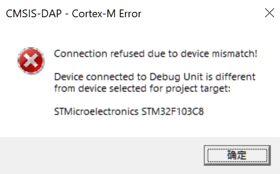

以下按照Q&A的形式列举了一些常见的问题，使用过程遇到任何问题时请在下文中尝试寻找解决方法，如果上述记录并没有解决你的问题，可以尝试在[社区](https://maixhub.com/discussion)中反馈该问题，合理的问题会有技术人员或其他开发者为您解答。

## 综合问题

**Q:**使用逻辑分析仪/DAPLink/CKLink/串口模块时有部分功能异常

**A:**请优先在Q&A中尝试找到并解决你的问题，如果仍有问题，则点击[这里](./update_firmware.md)更新固件后再尝试

**Q:**按下按键后，指示灯没有变化？

**A:**检查是否按下的频率太快，按下按键的间隔不要小于100ms，否则可能导致模块进入boot模式，现象会看到灯不再变化。如果遇到了该情况，尝试重新上电即可恢复

## 逻辑分析仪

**Q:**点击run后弹窗提示"device closed but should be open"

**A:**这可能是接触不稳定导致设备断连了，尝试重新插拔设备后再重新连接即可

**Q:**使用8通道采集时发现D7通道在悬空时也会出现波形

**A:**这是一个待解决的问题，但这个问题不会影响采集波形，给D7通道接入外部信号后仍然可以正常采集波形。如果不需要这个通道时也可以隐藏这个通道，很抱歉给您带来了困扰。

**Q:**波形采集时，波形显示窗口中的波形和实际的波形不一致

**A:**请确保将逻辑分析仪的GND线连接到了目标设备的GND，并且确保GND线离待测点的位置越近越好。要知道即使是1cm的距离，中间也可能有很多元器件会干扰信号，所以哪怕是更近1cm也有可能让信号质量更好。

**Q:**逻辑分析仪无法长时间采样

**A:**有多种情况影响无法长时间采样：

**情况1：**采样点数和采样率设置不正确导致采样时间很小，采样时间(单位:s)=采样点数/采样率，请确保采样点数和采样率设置正确。
**情况2：**PC性能的影响。由于PulseView需要使用大量的USB带宽，但是如果此时PC本身性能不足，也会导致采样时间变短。
**情况3：**PC内存的影响。如果一切都正常，那么检查一下是否是采样点数设置太大，导致内存不足以保存采样数据

## DAPLink

**Q:**MDK找不到DAPLink设备

**A:**有可能是MDK版本过低的原因，低版本的MDK可能无法识别DAPLink（本文测试使用的MDK版本是V5.38）。如果MDK版本低导致无法识别DAPLink，但是不想升级版本，可以参考[这里](https://developer.arm.com/documentation/ka003663/latest/)的方法来更新CMSIS-DAP的调试驱动

**Q:**DAPLink模式的串口功能无法正常使用，出现回显的情况

**A:**请在更新固件章节中将固件更新到最新版本后再尝试

**Q:**DAPLink在烧录固件时报错`Connection refused due to device mismatch!`

**A:**可能是实际芯片型号与芯片包不匹配导致。例如MDK使用`STM32F103`的配置，但实际芯片是`CS32F103`，由于`STM32F103`的IDCODE是**0x1B10417**，`CS32F103`的IDCODE是**0x2BA01477**，由此发生设备不匹配导致拒绝连接。解决方法是找到并安装实际芯片的软件包，软件包数量较多，下载方法请自行查找。

## CKLink

None

## 串口模块

**Q:**串口终端无法打开串口

**A:**尝试一下其他的串口助手，Windows上可以尝试使用XCOM，Linux上可以尝试使用Minicom

