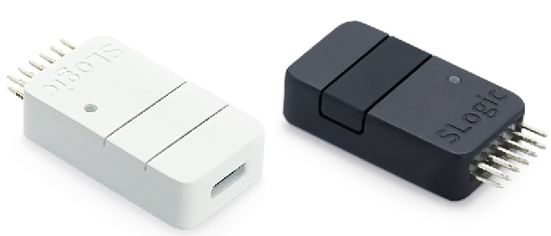

## 简介

SLogic Combo 8是一款兼有逻辑分析仪、CKLink Debugger、DAP-Link Debugger、USB2UART功能的开发工具，使用时可以通过按键任意切换功能。

## 功能参数

### SLogic功能参数

| 逻辑分析仪 | **SLogic Combo 8** |
| --------------------- | ----------------- |
| 最大通道数            | 8CH               |
| 最高采样率            | 80M               |
| 传输带宽              | 320Mb/s           |
| 采样模式              | Stream            |
| 典型配置              | 80M@4CH 40M@8CH   |
| 信号输入范围          | 0～3.6V           |
| 高低电平门限          | VIH>2V VIL<0.8V   |

注：Windows环境下SLogic Combo 8最大传输带宽160Mb/s，典型配置80M@2CH 40M@4CH

### CKLink功能参数

| CKLink       | SLogic Combo 8 |
| ------------ | ------------- |
| JTAG时钟速率 | 16M           |
| 典型dump速度 | 1200KB/s      |
| 调试串口     | 最高20Mbps    |

### DAPLink功能参数

| DAPLink      | SLogic Combo 8 |
| ------------ | ------------- |
| 调试串口     | 最高20Mbps    |
| 典型烧录速度 | 110KB/s       |

### UART功能参数

| 高速四串口 | **SLogic Combo 8** |
| ---------- | ----------------- |
| 最高波特率 | 2x20Mbps+2x1Mbps  |
| 总带宽     | 42Mbps            |

## 开始使用

点击下方链接进入对应章节：
[基础操作](./basic_operation.md)
[作为逻辑分析仪使用](./use_logic_function.md)
[作为CKLink使用](./use_cklink_function.md)
[作为DAPLink使用](./use_daplink_function.md)
[作为串口模块使用](./use_fouruart_function.md)
[更新固件](./update_firmware.md)

## 其他链接

[淘宝](https://item.taobao.com/item.htm?spm=a21n57.1.0.0.14dd523cuZ61oI&id=737788586308&ns=1&abbucket=5#detail)
[Sipeed 下载站](https://dl.sipeed.com/shareURL/SLogic/SLogic_combo_8/4_application/Firmware)
[交流论坛](maixhub.com/discussion)

联系邮箱：support@sipeed.com