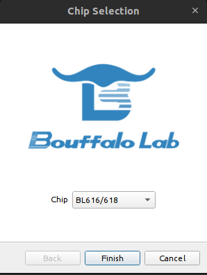
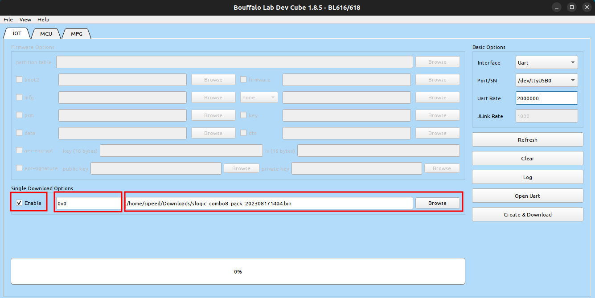

以下是SLogic Combo 8 更新固件的步骤

## 下载烧录工具和固件

烧录工具：[点击下载](https://dl.sipeed.com/shareURL/SLogic/SLogic_combo_8/4_application/Tools)

固件：[点击下载](https://dl.sipeed.com/shareURL/SLogic/SLogic_combo_8/4_application/Firmware)

烧录工具和固件选择最新版本即可，下载完成后自行解压

> 注：当固件名为`slogic_combo8_pack_202308171404.bin`时，日期为2023年08月17日。其他固件的日期命名规则类似。

## 配置烧录工具

1. 启动烧录工具

    解压后，烧录工具的根目录下提供了不同系统环境的执行文件。

    Windows用户：双击`BLDevCube.exe`启动

    Linux用户：双击`BLDevCube-ubuntu`启动。注意Linux环境需要添加可执行权限`sudo chmod +x BLDevCube-ubuntu`

2. 选择芯片

    启动后，选择BL616/618并点击Finish

    

3. 使能Single Download Options，并添加下载好的固件

    

## 配置设备

让SLogic Combo 8进入烧录模式

操作步骤：

1. 长按按键不松开
2. 重新上电
3. 观察LED灯不亮，则操作成功

## 烧录固件

配置串口号和波特率，并点击`Create & Download`即可下载

下载完成后，进度条显示绿框说明下载成功，更新固件完成