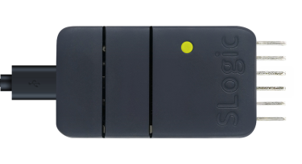

SLogic Combo8 具备高速CK-Link功能，且速率远超CK-Link Lite，接近CK-Link Pro，是调试RISC-V芯片的好工具。在此模式下还同时具备一路高速串口（20Mbps）功能。

>  注意：SLogic是直传数据到PC的USB口，所以要达到以上最大速率的话，需要尽量避免在接入多个设备的USB HUB上使用SLogic。

准备开始使用CK-LINK！

## 开启SLogic功能

按下切换按键，将指示灯切换为黄色

> 验证SLogic功能是否开启的方法:

> Linux使用lsusb命令/Windows使用设备管理器，可以找到CKLink HS设备

## 开始使用

 在Windows、Linux系统可以直接参考[使用 CDK + Sipeed RV-Debugger Plus 编译调试](https://bouffalolab.gitee.io/bl_mcu_sdk/get_started/cdk_rv_debugger_plus.html#cdk-sipeed-rv-debugger-plus)和[T-HEAD Debug Server 用户手册](https://occ.t-head.cn/document?temp=introduction-2&slug=t-head-debug-server-user-manual)，用法完全一样