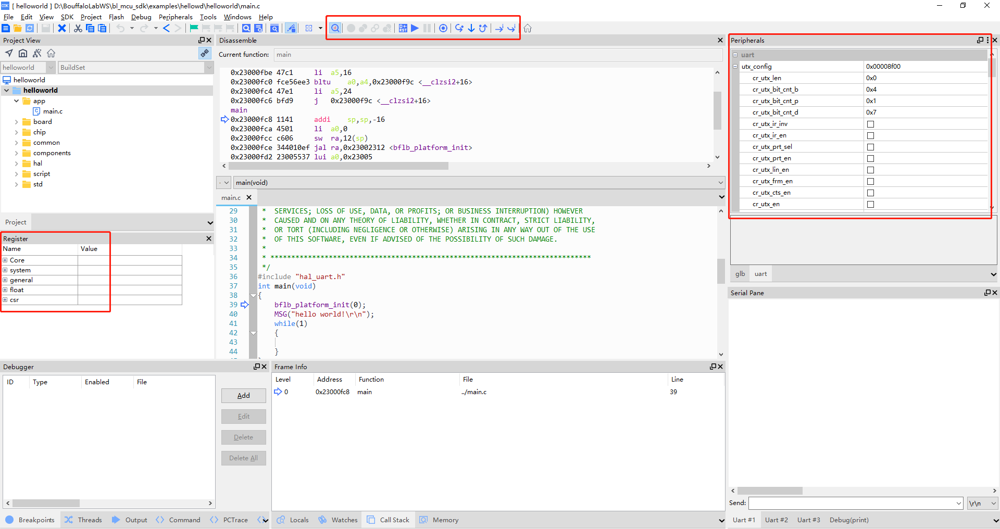

SLogic Combo8 具备高速CK-Link功能，且速率远超CK-Link Lite，接近CK-Link Pro，是调试RISC-V芯片的好工具。在此模式下还同时具备一路高速串口（20Mbps）功能。

准备开始使用CK-LINK！

## 开启CKLink功能

按下切换按键，将指示灯切换为黄色

> 验证CKLink功能是否开启的方法:
> Windows环境打开设备管理器，Linux环境使用lsusb命令，可以找到"CKLink HS"设备

## 开始使用

### 引脚连接

> CKLink和DAPLink线序相似，所以放到了一张图里，请忽略掉“DAP”

CKLink模式下可以同时支持一路CKLink和一路UART

- 上图左侧的引脚（TXD、RXD、DTR、RTS）可以作为串口使用
- 上图右侧的引脚（TCK、TDI、TDO、TMS）作为CKLink调试使用

### 使用方法

 在Windows、Linux系统可以直接参考[使用 CDK + Sipeed RV-Debugger Plus 编译调试](https://bouffalolab.gitee.io/bl_mcu_sdk/get_started/cdk_rv_debugger_plus.html#cdk-sipeed-rv-debugger-plus)和[T-HEAD Debug Server 用户手册](https://occ.t-head.cn/document?temp=introduction-2&slug=t-head-debug-server-user-manual)，用法完全一样
 
### 使用CDK进行调试

- 点击工具栏上方的`Start/Stop Debugger`按钮，进入debug界面，如下图所示

_Debug HellowWorld!_

- 在`debug`界面下，你可以在左侧的`Register`窗口中查看CPU的内部寄存器数据。同时，在右侧的`Peripherals`外设面板中，你可以浏览相应外设寄存器数据。你可以通过顶部菜单栏的`Peripherals->System Viewer`来选择所需的外设。此外，在界面上方的工具栏中，你会找到相关的调试按钮，它们可以用于设置断点、单步调试、逐条指令执行以及全速运行等操作。当然，所有这些操作都有相应的快捷键和快速设置方式。如需详细信息，请参考CDK帮助文档，这里就不再详细展开介绍。

- 点击单步运行按钮，运行代码，即可看到指示光标移动到下一句代码，同时可以看到串口面板中显示输出的 Hello World！

### 使用T-HEAD Debug Server进行调试

> 请[参考](../../maix/m1s/other/start.md)M1s DOCK 上手**第十节 使用JTAG调试**的内容。
