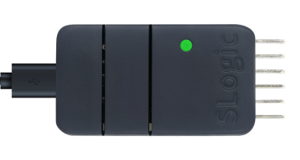
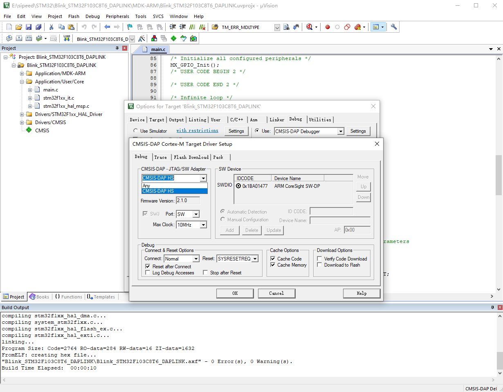
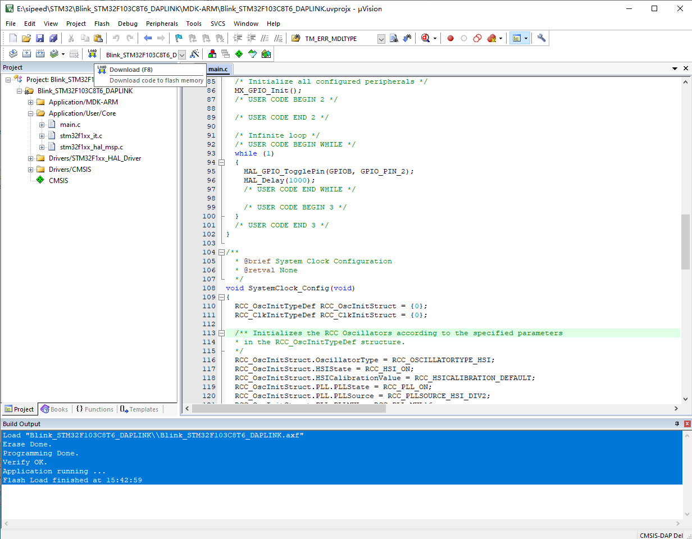
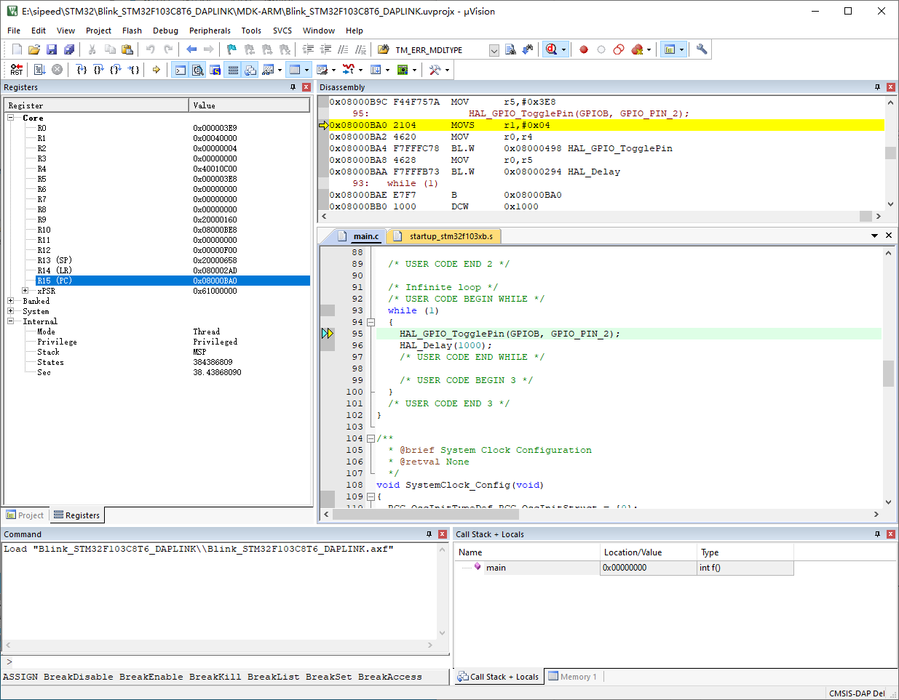

SLogic Combo8 具备高速DAP-Link功能，适用于各种常规芯片，尤其是在Windows下使用IDE调试的STM32等芯片

## 开启DAPLink功能

按下切换按键，将指示灯切换为绿色

> 验证DAPLink功能是否开启的方法:
> Windows环境打开设备管理器，Linux环境使用lsusb命令，可以找到"CMSIS-DAP HS"设备

## 开始使用

以STM32F103C8T6芯片在Windows MDK IDE为例介绍具体使用步骤：连接，下载、调试固件，演示使用的MDK版本为当前最新版（V5.38）

### 引脚连接

> CKLink和DAPLink线序相似，所以放到了一张图里，请忽略掉“CK”

DAPLink模式下可以同时支持一路DAPLink和一路UART

- 上图左侧的引脚（TXD、RXD、DTR、RTS）可以作为串口使用

- 上图右侧的引脚（TCK、TDI、TDO、TMS）作为DAPLink调试使用

### 使用MDK连接DAPLink

1. 设置Reset Options为SYSRESETREQ
2. 在CMSIS-DAP中找到并寻找CMSIS-DAP HS设备

### 使用MDK下载固件

### 使用MDK调试固件

## 问题

1. MDK找不到DAPLink设备
- 检查MDK版本是否过低，低版本的MDK可能无法识别DAPLink。本文测试使用的MDK版本是V5.38
- 如果MDK版本低导致无法识别DAPLink，但是不想升级版本，可以参考[这里](https://developer.arm.com/documentation/ka003663/latest/)的方法来更新CMSIS-DAP的调试驱动

感谢群友`dragonforward`的文档贡献