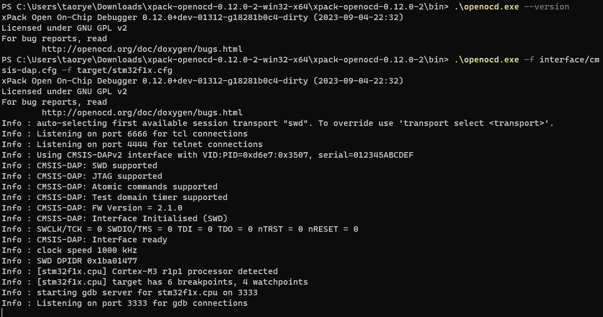

SLogic Combo 8 具备高速DAP-Link功能，适用于各种常规芯片，尤其是在Windows下使用IDE调试的STM32等芯片

## 开启DAPLink功能

按下切换按键，将指示灯切换为绿色

> 验证DAPLink功能是否开启的方法:
> Windows环境打开设备管理器，Linux环境使用lsusb命令，可以找到"RV CMSIS-DAP"设备

## 开始使用

以STM32F103C8T6芯片在Windows MDK IDE为例介绍具体使用步骤：连接，下载、调试固件，演示使用的MDK版本为当前最新版（V5.38）

### 引脚连接

> CKLink和DAPLink线序相似，所以放到了一张图里，请忽略掉“CK”

DAPLink模式下可以同时支持一路DAPLink和一路UART

- 上图左侧的引脚（TXD、RXD、DTR、RTS）可以作为串口使用

- 上图右侧的引脚（TCK(SWCLK)、TDI、TDO、TMS(SWDIO)）作为DAPLink调试使用

### 使用MDK连接DAPLink

1. 设置Reset Options为SYSRESETREQ
2. 在CMSIS-DAP中找到并寻找RV CMSIS-DAP设备（图中 Port 默认为 SW 两线调试，可选 JTAG 4 线调试）
SW 两线调试只需要连接 TCK(SWCLK)及 TMS(SWDIO) 即可。

### 使用MDK下载固件

### 使用MDK调试固件

### MDK使用视频

  <video src="./assets/use_daplink_function/slogic_daplink_keil_usage.mp4"
    width="100%" controls="controls" autoplay="autoplay"
    x5-playsinline=""
 		playsinline
 		webkit-playsinline="true"
 		poster="./assets/use_daplink_function/start_debugger_in_mdk.png"
 		preload="auto"
  >
  </video>

### 使用openocd连接

先前有用户[反映](https://maixhub.com/discussion/100020)clion无法使用Slogic进行调试，深入确认后发现是openocd的版本问题。

xpack 版本 openocd 下载链接为https://xpack.github.io/dev-tools/openocd/releases

下载的是 v0.12.0-2 版本运行截图

来自https://gnutoolchains.com/arm-eabi/openocd 下载的`20231002`版本会出现无法发现Slogic的问题，报错截图如下

感谢群友`dragonforward`的文档贡献